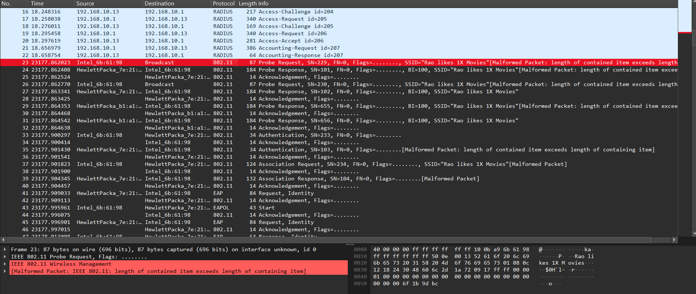
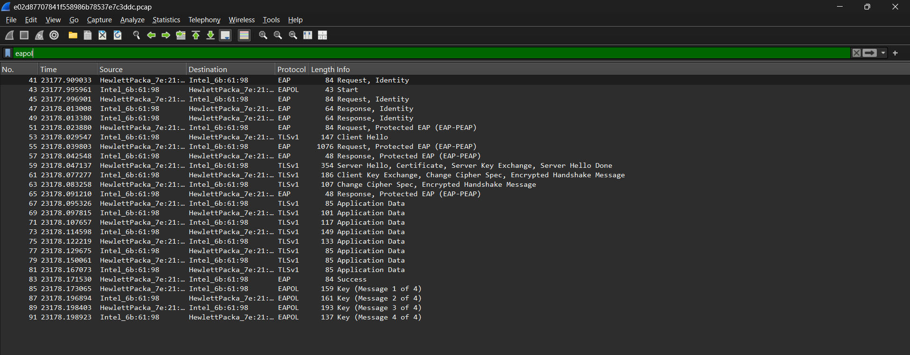
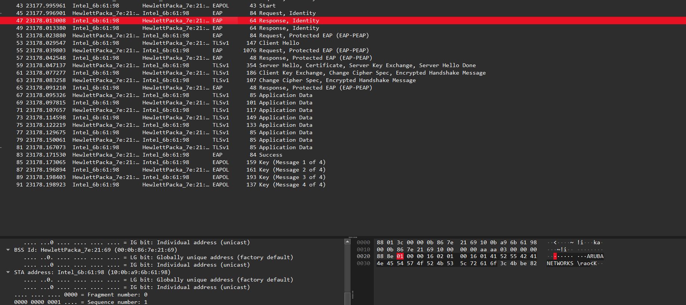
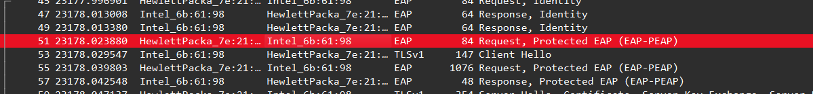

# 802.1X Part 1

## Challenge Details

- Category: Forensics
- Points: 4
- Validation: 95
- Author: NSEC 2015
- Status: Done
# Handout
`802.1X Part 1; Find the shared secret`
https://ringzer0ctf.com/files/ae5b20f66d8d7d96e2269c2731dad045.zip
## Walkthrough
802.1X is used for authentication before joining a wifi network, we must have to crack the 802.1X shared secret and that would be our flag!
Unzipping:
```bash
$ unzip ae5b20f66d8d7d96e2269c2731dad045.zip
Archive:  ae5b20f66d8d7d96e2269c2731dad045.zip
  inflating: e02d87707841f558986b78537e7c3ddc.pcap
```
Network capture, that's expected, let's inspect in wireshark. 
Interesting things noticed so far:
- Aruba ESSID here is `Rao likes 1X Movies`
- Protocol 802.11
- A RADIUS server was used, more later

There are a lot of 802.11 packets, but we already know what we have to do: crack the 802.1X secret, let's directly use aircrack-ng for this.

```bash
$ aircrack-ng e02d87707841f558986b78537e7c3ddc.pcap
Reading packets, please wait...
Opening e02d87707841f558986b78537e7c3ddc.pcap
Unsupported file format (not a pcap or IVs file).
Read 0 packets.

No networks found, exiting.


Quitting aircrack-ng...

```
Interesting, let's quickly double check if the capture has a valid WPA-PSK handshake for aircrack to crack and EAPoL packets
```bash
$ tshark -r e02d87707841f558986b78537e7c3ddc.pcap -Y eapol
   41 23177.909033 HewlettPacka_7e:21:69 → Intel_6b:61:98 EAP 84 Request, Identity
   43 23177.995961 Intel_6b:61:98 → HewlettPacka_7e:21:69 EAPOL 43 Start
   45 23177.996901 HewlettPacka_7e:21:69 → Intel_6b:61:98 EAP 84 Request, Identity
   47 23178.013008 Intel_6b:61:98 → HewlettPacka_7e:21:69 EAP 64 Response, Identity
   49 23178.013380 Intel_6b:61:98 → HewlettPacka_7e:21:69 EAP 64 Response, Identity
   51 23178.023880 HewlettPacka_7e:21:69 → Intel_6b:61:98 EAP 84 Request, Protected EAP (EAP-PEAP)
   53 23178.029547 Intel_6b:61:98 → HewlettPacka_7e:21:69 TLSv1 147 Client Hello
   55 23178.039803 HewlettPacka_7e:21:69 → Intel_6b:61:98 EAP 1076 Request, Protected EAP (EAP-PEAP)
   57 23178.042548 Intel_6b:61:98 → HewlettPacka_7e:21:69 EAP 48 Response, Protected EAP (EAP-PEAP)
   59 23178.047137 HewlettPacka_7e:21:69 → Intel_6b:61:98 TLSv1 354 Server Hello, Certificate, Server Key Exchange, Server Hello Done
   61 23178.077277 Intel_6b:61:98 → HewlettPacka_7e:21:69 TLSv1 186 Client Key Exchange, Change Cipher Spec, Encrypted Handshake Message
   63 23178.083258 HewlettPacka_7e:21:69 → Intel_6b:61:98 TLSv1 107 Change Cipher Spec, Encrypted Handshake Message
   65 23178.091210 Intel_6b:61:98 → HewlettPacka_7e:21:69 EAP 48 Response, Protected EAP (EAP-PEAP)
   67 23178.095326 HewlettPacka_7e:21:69 → Intel_6b:61:98 TLSv1 85 Application Data
   69 23178.097815 Intel_6b:61:98 → HewlettPacka_7e:21:69 TLSv1 101 Application Data
   71 23178.107657 HewlettPacka_7e:21:69 → Intel_6b:61:98 TLSv1 117 Application Data
   73 23178.114598 Intel_6b:61:98 → HewlettPacka_7e:21:69 TLSv1 149 Application Data
   75 23178.122219 HewlettPacka_7e:21:69 → Intel_6b:61:98 TLSv1 133 Application Data
   77 23178.129675 Intel_6b:61:98 → HewlettPacka_7e:21:69 TLSv1 85 Application Data
   79 23178.150061 HewlettPacka_7e:21:69 → Intel_6b:61:98 TLSv1 85 Application Data
   81 23178.167073 Intel_6b:61:98 → HewlettPacka_7e:21:69 TLSv1 85 Application Data
   83 23178.171530 HewlettPacka_7e:21:69 → Intel_6b:61:98 EAP 84 Success
   85 23178.173065 HewlettPacka_7e:21:69 → Intel_6b:61:98 EAPOL 159 Key (Message 1 of 4)
   87 23178.196894 Intel_6b:61:98 → HewlettPacka_7e:21:69 EAPOL 161 Key (Message 2 of 4)
   89 23178.198403 HewlettPacka_7e:21:69 → Intel_6b:61:98 EAPOL 193 Key (Message 3 of 4)
   91 23178.198923 Intel_6b:61:98 → HewlettPacka_7e:21:69 EAPOL 137 Key (Message 4 of 4)
```

This is the actual handshake.. and it's not WPA-PSK which aircrack-ng expects, Looking online, I found https://networklessons.com/wireless/eapol-extensible-authentication-protocol-over-lan
Interesting thing:
- Our mac: `10:0b:a9:6b:61:98` (transmitter address from EAPoL start packet)
- Destination mac: `00:0b:86:7e:21:69`
- Version of 802.1X: 802.1X-2001 (1)

We can see the identity from the response: identity that it is`ARUBANETWORKS\rao`, fits the ESSID story we found.
We also see that it is using EAP-PEAP

https://arubanetworking.hpe.com/techdocs/ClearPass/6.12/PolicyManager/Content/CPPM_UserGuide/Auth/AuthMethod_eap-peap.htm
`EAP-Protected Extensible Authentication Protocol (EAP-PEAP) is a protocol that creates an encrypted (and more secure) channel before the password-based authentication occurs. PEAP is an 802.1X authentication method that uses server-side public key certificate to establish a secure tunnel in which the client authenticates with server. The PEAP authentication creates an encrypted SSL/TLS tunnel between client and authentication server. The exchange of information is encrypted and stored in the tunnel ensuring that the user credentials are kept secure.`
However there is a RADIUS server involved. This is not a standard Wi-Fi login, which would be using WPA-PSK
A standard trace would look like:
```text
802.11 Probe Request
802.11 Authentication
802.11 Association Request
802.11 Association Response
EAPOL Key Message 1 of 4
EAPOL Key Message 2 of 4
EAPOL Key Message 3 of 4
EAPOL Key Message 4 of 4
```
Where the wifi password used + ssid (PBKDF2-HMAC-SHA1, 4096 rounds), would form the pmk, or the pairwise master key. This is what is attacked by aircrack-ng by default; It mimics creation of a PMK, and then a PTK by:
PMK + AP address + Our MAC + ANonce + SNonce  > PTK
And calculates the MIC over the EAPoL MESSAGE, then compares the captured MIC to the one calculated using the words in our wordlist dictionary.


But we have a very different trace:
```text
EAP Request, Identity
EAPOL Start
EAP Request, Identity
EAP Response, Identity
EAP Response, Identity

EAP Request, Protected EAP (PEAP)
TLS Client Hello
EAP Request, Protected EAP (PEAP)
EAP Response, Protected EAP (PEAP)

TLS Server Hello
TLS Certificate
TLS Server Key Exchange
TLS Server Hello Done

TLS Client Key Exchange
TLS Change Cipher Spec
TLS Encrypted Handshake Message

TLS Change Cipher Spec
TLS Encrypted Handshake Message

EAP Response, Protected EAP (PEAP)

TLS Application Data
TLS Application Data
TLS Application Data
TLS Application Data
TLS Application Data
TLS Application Data
TLS Application Data
TLS Application Data

EAP Success

EAPOL Key Message 1 of 4
EAPOL Key Message 2 of 4
EAPOL Key Message 3 of 4
EAPOL Key Message 4 of 4
```
At this point I realize that the challenge had always wanted us to crack the RADIUS shared secret!
Notice how the PSK standard doesn't have a TLS Login, or the PEAP auth. For the most obvious difference, there was no username exchange like we see here.
Looking online, this trace matches that of WPA Enterprise. That's why aircrack-ng couldn't find it!
In WPA Enterprise, the PMK is not derived from a shared Wi-Fi password and SSID using PBKDF2 like we just saw.  
Instead, the client authenticates using 802.1X/EAP,  through an authentication server such as RADIUS (which we see here!). 
In a PEAP network, a TLS tunnel is first created, and the actual user authentication happens inside that encrypted tunnel (hence the *protected*-eap). 

After this the MSK is derived, or Master Session Key. The PMK is then derived from this EAP-generated key. The RADIUS server sends the `MS-MPPE-Send-Key` and `MS-MPPE-Recv-Key` to the AP, in the RADIUS `Access-Accept` packet. These MPPE attributes are protected using the RADIUS shared secret (which we are cracking here!)

Then the normal WPA 4-way handshake still happens like normal:

PMK + AP address + client MAC + ANonce + SNonce > PTK

So the PTK derivation step is still similar to WPA-PSK, but the PMK source is completely different! In WPA-PSK, aircrack-ng can guess the password and recreate the PMK directly, but here, we need to get the radius secret, then then the mppe key to get to the PMK.

We got the identity from the packets before, but let's extract properly:
```bash
$ tshark -r e02d87707841f558986b78537e7c3ddc.pcap   -Y "eap.identity"   -T fields   -e frame.number   -e eap.identity
3       ARUBANETWORKS\\rao
47      ARUBANETWORKS\\rao
49      ARUBANETWORKS\\rao
```
Let's also look at the TLS certificate used for the EAP authentication:
```bash
$ tshark -r e02d87707841f558986b78537e7c3ddc.pcap \
  -Y "tls.handshake.certificate" \
  -V
Frame 8: Packet, 440 bytes on wire (3520 bits), 440 bytes captured (3520 bits) on interface unknown, id 1
    Section number: 1
    Interface id: 1 (unknown)
        Interface name: unknown
    Encapsulation type: Linux cooked-mode capture v1 (25)
    Arrival Time: May 23, 2015 04:23:56.775815000 IST
    UTC Arrival Time: May 22, 2015 22:53:56.775815000 UTC
    Epoch Arrival Time: 1432335236.775815000
    [Time shift for this packet: 0.000000000 seconds]
    [Time delta from previous captured frame: 2.076000 milliseconds]
    [Time since reference or first frame: 18.172901000 seconds]
    Frame Number: 8
    Frame Length: 440 bytes (3520 bits)
    Capture Length: 440 bytes (3520 bits)
    [Frame is marked: False]
    [Frame is ignored: False]
    [Protocols in frame: sll:ethertype:ip:udp:radius:eap:tls:x509sat:x509sat:x509sat:x509sat:x509sat:x509sat:x509sat:x509sat:x509sat:x509sat:x509ce:x509ce]
    Character encoding: ASCII (0)
Linux cooked capture v1
    Packet type: Sent by us (4)
    Link-layer address type: Ethernet (1)
    Link-layer address length: 6
    Source: VMware_cf:19:96 (00:0c:29:cf:19:96)
    Unused: 0000
    Protocol: IPv4 (0x0800)
Internet Protocol Version 4, Src: 192.168.10.13, Dst: 192.168.10.1
    0100 .... = Version: 4
    .... 0101 = Header Length: 20 bytes (5)
    Differentiated Services Field: 0x00 (DSCP: CS0, ECN: Not-ECT)
        0000 00.. = Differentiated Services Codepoint: Default (0)
        .... ..00 = Explicit Congestion Notification: Not ECN-Capable Transport (0)
    Total Length: 424
    Identification: 0x0000 (0)
    10. .... = Flags: 0x2, Don't fragment
        0... .... = Reserved bit: Not set
        .1.. .... = Don't fragment: Set
        ..0. .... = More fragments: Not set
    ...0 0000 0000 0000 = Fragment Offset: 0
    Time to Live: 64
    Protocol: UDP (17)
    Header Checksum: 0xa3e6 [validation disabled]
    [Header checksum status: Unverified]
    Source Address: 192.168.10.13
    Destination Address: 192.168.10.1
    [Stream index: 0]
User Datagram Protocol, Src Port: 1812, Dst Port: 37057
    Source Port: 1812
    Destination Port: 37057
    Length: 404
    Checksum: 0x9704 [unverified]
    [Checksum Status: Unverified]
    [Stream index: 1]
    [Stream Packet Number: 6]
    [Timestamps]
        [Time since first frame: 31.463000 milliseconds]
        [Time since previous frame: 2.076000 milliseconds]
    UDP payload (396 bytes)
RADIUS Protocol
    Code: Access-Challenge (11)
    Packet identifier: 0xc8 (200)
    Length: 396
    Authenticator: 08a363a064892ef67eeb9dac77fc1904
    [This is a response to a request in frame 7]
    [Time from request: 2.076000 milliseconds]
    Attribute Value Pairs
        AVP: t=EAP-Message(79) l=255 Segment[1]
            Type: 79
            Length: 255
            EAP fragment […]: 0104013819004353ae4d1e84b45e60061a5bee805b230f44681bb4cca41cecf8776ed392bf9c1463a82f8afbe501003039bf50fc5f2b7315f48d37e1f55baff6e9dc00984a6f832fdf97cf6428d3de290f461963272af6c3ba50667a74049211045db92bad813b8e3a912c74c70
        AVP: t=EAP-Message(79) l=61 Last Segment[2]
            Type: 79
            Length: 61
            EAP fragment: c70df8521cf6aca856ed38051101c448a64fc6e4f144b0166e0f04a027e4661e63b2b98082b67dbac6d9793be97b9ad682b016030100040e000000
            Extensible Authentication Protocol
                Code: Request (1)
                Id: 4
                Length: 312
                Type: Protected EAP (EAP-PEAP) (25)
                EAP-TLS Flags: 0x00
                    0... .... = Length Included: False
                    .0.. .... = More Fragments: False
                    ..0. .... = Start: False
                    .... .000 = Version: 0
                [2 EAP-TLS Fragments (1330 bytes): #6(1024), #8(306)]
                    [Frame: 6, payload: 0-1023 (1024 bytes)]
                    [Frame: 8, payload: 1024-1329 (306 bytes)]
                    [Fragment Count: 2]
                    [Reassembled EAP-TLS Length: 1330]
                Transport Layer Security
                    [Stream index: 0]
                    TLSv1 Record Layer: Handshake Protocol: Server Hello
                        Content Type: Handshake (22)
                        Version: TLS 1.0 (0x0301)
                        Length: 84
                        Handshake Protocol: Server Hello
                            Handshake Type: Server Hello (2)
                            Length: 80
                            Version: TLS 1.0 (0x0301)
                            Random: ce137523b7cf03bc972cffffddbbb43c89c9910456e362dfdef29717cc1338d3
                                GMT Unix Time: Jul 24, 2079 05:17:47.000000000 IST
                                Random Bytes: b7cf03bc972cffffddbbb43c89c9910456e362dfdef29717cc1338d3
                            Session ID Length: 32
                            Session ID: cf2f90ea660043aeb8504a86438e4739a647dd36d0eb168448cb987675baec9f
                            Cipher Suite: TLS_ECDHE_RSA_WITH_AES_256_CBC_SHA (0xc014)
                            Compression Method: null (0)
                            Extensions Length: 8
                            Extension: ec_point_formats (len=4)
                                Type: ec_point_formats (11)
                                Length: 4
                                EC point formats Length: 3
                                Elliptic curves point formats (3)
                                    EC point format: uncompressed (0)
                                    EC point format: ansiX962_compressed_prime (1)
                                    EC point format: ansiX962_compressed_char2 (2)
                            [JA3S Fullstring: 769,49172,11]
                            [JA3S: 6aa98948bfa9626adc8d77e0f16d39c6]
                    TLSv1 Record Layer: Handshake Protocol: Certificate
                        Content Type: Handshake (22)
                        Version: TLS 1.0 (0x0301)
                        Length: 891
                        Handshake Protocol: Certificate
                            Handshake Type: Certificate (11)
                            Length: 887
                            Certificates Length: 884
                            Certificates (884 bytes)
                                Certificate Length: 881
                                Certificate […]: 3082036d30820255a0030201020209009a20ebd399e3f7f9300d06092a864886f70d01010d050030503119301706035504030c1072616f646975732e776966692e637466310c300a060355040a0c0352414f310b300906035504080c024e4b310b3009060355040613024e4b310b
                                    signedCertificate
                                        version: v3 (2)
                                        serialNumber: 0x009a20ebd399e3f7f9
                                        signature (sha512WithRSAEncryption)
                                            Algorithm Id: 1.2.840.113549.1.1.13 (sha512WithRSAEncryption)
                                        issuer: rdnSequence (0)
                                            rdnSequence: 5 items (id-at-localityName=NK,id-at-countryName=NK,id-at-stateOrProvinceName=NK,id-at-organizationName=RAO,id-at-commonName=raodius.wifi.ctf)
                                                RDNSequence item: 1 item (id-at-commonName=raodius.wifi.ctf)
                                                    RelativeDistinguishedName item (id-at-commonName=raodius.wifi.ctf)
                                                        Object Id: 2.5.4.3 (id-at-commonName)
                                                        DirectoryString: uTF8String (4)
                                                            uTF8String: raodius.wifi.ctf
                                                RDNSequence item: 1 item (id-at-organizationName=RAO)
                                                    RelativeDistinguishedName item (id-at-organizationName=RAO)
                                                        Object Id: 2.5.4.10 (id-at-organizationName)
                                                        DirectoryString: uTF8String (4)
                                                            uTF8String: RAO
                                                RDNSequence item: 1 item (id-at-stateOrProvinceName=NK)
                                                    RelativeDistinguishedName item (id-at-stateOrProvinceName=NK)
                                                        Object Id: 2.5.4.8 (id-at-stateOrProvinceName)
                                                        DirectoryString: uTF8String (4)
                                                            uTF8String: NK
                                                RDNSequence item: 1 item (id-at-countryName=NK)
                                                    RelativeDistinguishedName item (id-at-countryName=NK)
                                                        Object Id: 2.5.4.6 (id-at-countryName)
                                                        CountryName: NK
                                                RDNSequence item: 1 item (id-at-localityName=NK)
                                                    RelativeDistinguishedName item (id-at-localityName=NK)
                                                        Object Id: 2.5.4.7 (id-at-localityName)
                                                        DirectoryString: uTF8String (4)
                                                            uTF8String: NK
                                        validity
                                            notBefore: utcTime (0)
                                                utcTime: 2015-04-11 14:12:33 (UTC)
                                            notAfter: utcTime (0)
                                                utcTime: 2015-10-08 14:12:33 (UTC)
                                        subject: rdnSequence (0)
                                            rdnSequence: 5 items (id-at-localityName=NK,id-at-countryName=NK,id-at-stateOrProvinceName=NK,id-at-organizationName=RAO,id-at-commonName=raodius.wifi.ctf)
                                                RDNSequence item: 1 item (id-at-commonName=raodius.wifi.ctf)
                                                    RelativeDistinguishedName item (id-at-commonName=raodius.wifi.ctf)
                                                        Object Id: 2.5.4.3 (id-at-commonName)
                                                        DirectoryString: uTF8String (4)
                                                            uTF8String: raodius.wifi.ctf
                                                RDNSequence item: 1 item (id-at-organizationName=RAO)
                                                    RelativeDistinguishedName item (id-at-organizationName=RAO)
                                                        Object Id: 2.5.4.10 (id-at-organizationName)
                                                        DirectoryString: uTF8String (4)
                                                            uTF8String: RAO
                                                RDNSequence item: 1 item (id-at-stateOrProvinceName=NK)
                                                    RelativeDistinguishedName item (id-at-stateOrProvinceName=NK)
                                                        Object Id: 2.5.4.8 (id-at-stateOrProvinceName)
                                                        DirectoryString: uTF8String (4)
                                                            uTF8String: NK
                                                RDNSequence item: 1 item (id-at-countryName=NK)
                                                    RelativeDistinguishedName item (id-at-countryName=NK)
                                                        Object Id: 2.5.4.6 (id-at-countryName)
                                                        CountryName: NK
                                                RDNSequence item: 1 item (id-at-localityName=NK)
                                                    RelativeDistinguishedName item (id-at-localityName=NK)
                                                        Object Id: 2.5.4.7 (id-at-localityName)
                                                        DirectoryString: uTF8String (4)
                                                            uTF8String: NK
                                        subjectPublicKeyInfo
                                            algorithm (rsaEncryption)
                                                Algorithm Id: 1.2.840.113549.1.1.1 (rsaEncryption)
                                            Padding: 0
                                            subjectPublicKey […]: 3082010a02820101009b1f7cf1135fb8abac06e599a31a563830c44eef56e8098150d0fd9cb82665ac1286c02cb6cfb0cd2dad71090bc61892419b4224c8ebba2d63aa8b7031823fefd8ea68a25a27df0ae24571972d97ce547bb8bb0bc349dbd9ca2fb458dc8c6099814a7
                                                RSA Public Key
                                                    modulus: 0x009b1f7cf1135fb8abac06e599a31a563830c44eef56e8098150d0fd9cb82665ac1286c0…
                                                    publicExponent: 65537
                                        extensions: 2 items
                                            Extension (id-ce-extKeyUsage)
                                                Extension Id: 2.5.29.37 (id-ce-extKeyUsage)
                                                KeyPurposeIDs: 3 items
                                                    KeyPurposeId: 1.3.6.1.5.5.7.3.1 (id-kp-serverAuth)
                                                    KeyPurposeId: 1.3.6.1.5.5.7.3.3 (id-kp-codeSigning)
                                                    KeyPurposeId: 1.3.6.1.5.5.7.3.14 (id-kp-eapOverLAN)
                                            Extension (id-ce-subjectKeyIdentifier)
                                                Extension Id: 2.5.29.14 (id-ce-subjectKeyIdentifier)
                                                SubjectKeyIdentifier: 406001b2de29864118ed2522e3bdd6bc804e0143
                                    algorithmIdentifier (sha512WithRSAEncryption)
                                        Algorithm Id: 1.2.840.113549.1.1.13 (sha512WithRSAEncryption)
                                    Padding: 0
                                    encrypted […]: 0888871dc405b017f911cf9cfba81319e2d14caa9b66767f02d29679ba428cb1cb1866aa9039758e583f43859bbbfd03ec90d92bc7dc41a6ab4c41dc1a0a0f72886ffd3a1a6829050354f30c3898c899da72619007dada462f6c7ee48dd098169a29b34b43acf7be24d57436ee92cf
                    TLSv1 Record Layer: Handshake Protocol: Server Key Exchange
                        Content Type: Handshake (22)
                        Version: TLS 1.0 (0x0301)
                        Length: 331
                        Handshake Protocol: Server Key Exchange
                            Handshake Type: Server Key Exchange (12)
                            Length: 327
                            EC Diffie-Hellman Server Params
                                Curve Type: named_curve (0x03)
                                Named Curve: secp256r1 (0x0017)
                                Pubkey Length: 65
                                Pubkey: 0465d34d1dd1bedeea9a657bb09ccd2f745baddb8dc6a31892624353ae4d1e84b45e60061a5bee805b230f44681bb4cca41cecf8776ed392bf9c1463a82f8afbe5
                                Signature Length: 256
                                Signature […]: 3039bf50fc5f2b7315f48d37e1f55baff6e9dc00984a6f832fdf97cf6428d3de290f461963272af6c3ba50667a74049211045db92bad813b8e3a912c74c709f2a7729632192fa9e6bd4a89f315a57192fab383b8397e72b000670e5bfb51dc4a72e8b996d252a6c35de20f4d607137
                    TLSv1 Record Layer: Handshake Protocol: Server Hello Done
                        Content Type: Handshake (22)
                        Version: TLS 1.0 (0x0301)
                        Length: 4
                        Handshake Protocol: Server Hello Done
                            Handshake Type: Server Hello Done (14)
                            Length: 0
        AVP: t=Message-Authenticator(80) l=18 val=28b6ae81a84c96b7e2c7f31eed7bae2b
            Type: 80
            Length: 18
            Message-Authenticator: 28b6ae81a84c96b7e2c7f31eed7bae2b
        AVP: t=State(24) l=42 val=41506f414c414439414a43534141414134704930774c7266654a34742f55677a74486f44…
            Type: 24
            Length: 42
            State: 41506f414c414439414a43534141414134704930774c7266654a34742f55677a74486f4442673d3d

Frame 59: Packet, 354 bytes on wire (2832 bits), 354 bytes captured (2832 bits) on interface unknown, id 0
    Section number: 1
    Interface id: 0 (unknown)
        Interface name: unknown
    Encapsulation type: IEEE 802.11 Wireless LAN (20)
    Arrival Time: May 23, 2015 10:49:56.650051000 IST
    UTC Arrival Time: May 23, 2015 05:19:56.650051000 UTC
    Epoch Arrival Time: 1432358396.650051000
    [Time shift for this packet: 0.000000000 seconds]
    [Time delta from previous captured frame: 4.507000 milliseconds]
    [Time delta from previous displayed frame: 6 hours, 25 minutes, 59.874236000 seconds]
    [Time since reference or first frame: 6 hours, 26 minutes, 18.047137000 seconds]
    Frame Number: 59
    Frame Length: 354 bytes (2832 bits)
    Capture Length: 354 bytes (2832 bits)
    [Frame is marked: False]
    [Frame is ignored: False]
    [Protocols in frame: wlan:llc:eapol:tls:x509sat:x509sat:x509sat:x509sat:x509sat:x509sat:x509sat:x509sat:x509sat:x509sat:x509ce:x509ce]
    Character encoding: ASCII (0)
IEEE 802.11 QoS Data, Flags: ......F.
    Type/Subtype: QoS Data (0x0028)
    Frame Control Field: 0x8802
        .... ..00 = Version: 0
        .... 10.. = Type: Data frame (2)
        1000 .... = Subtype: 8
        Flags: 0x02
            .... ..10 = DS status: Frame from DS to a STA via AP(To DS: 0 From DS: 1) (0x2)
            .... .0.. = More Fragments: This is the last fragment
            .... 0... = Retry: Frame is not being retransmitted
            ...0 .... = PWR MGT: STA will stay up
            ..0. .... = More Data: No data buffered
            .0.. .... = Protected flag: Data is not protected
            0... .... = +HTC/Order flag: Not strictly ordered
    .000 0000 0011 1100 = Duration: 60 microseconds
    Receiver address: Intel_6b:61:98 (10:0b:a9:6b:61:98)
        .... ..0. .... .... .... .... = LG bit: Globally unique address (factory default)
        .... ...0 .... .... .... .... = IG bit: Individual address (unicast)
    Transmitter address: HewlettPacka_7e:21:69 (00:0b:86:7e:21:69)
        .... ..0. .... .... .... .... = LG bit: Globally unique address (factory default)
        .... ...0 .... .... .... .... = IG bit: Individual address (unicast)
    Destination address: Intel_6b:61:98 (10:0b:a9:6b:61:98)
        .... ..0. .... .... .... .... = LG bit: Globally unique address (factory default)
        .... ...0 .... .... .... .... = IG bit: Individual address (unicast)
    Source address: HewlettPacka_7e:21:69 (00:0b:86:7e:21:69)
        .... ..0. .... .... .... .... = LG bit: Globally unique address (factory default)
        .... ...0 .... .... .... .... = IG bit: Individual address (unicast)
    BSS Id: HewlettPacka_7e:21:69 (00:0b:86:7e:21:69)
        .... ..0. .... .... .... .... = LG bit: Globally unique address (factory default)
        .... ...0 .... .... .... .... = IG bit: Individual address (unicast)
    STA address: Intel_6b:61:98 (10:0b:a9:6b:61:98)
        .... ..0. .... .... .... .... = LG bit: Globally unique address (factory default)
        .... ...0 .... .... .... .... = IG bit: Individual address (unicast)
    .... .... .... 0000 = Fragment number: 0
    0000 0000 0100 .... = Sequence number: 4
    [WLAN Flags: ......F.]
    Qos Control: 0x0000
        .... .... .... 0000 = TID: 0
        [.... .... .... .000 = Priority: Best Effort (Best Effort) (0)]
        .... .... ...0 .... = EOSP: Service period
        .... .... .00. .... = Ack Policy: Normal Ack (0x0)
        .... .... 0... .... = Payload Type: MSDU
        0000 0000 .... .... = QAP PS Buffer State: 0x00
            .... ..0. .... .... = Buffer State Indicated: No
Logical-Link Control
    DSAP: SNAP (0xaa)
        1010 101. = SAP: SNAP
        .... ...0 = IG Bit: Individual
    SSAP: SNAP (0xaa)
        1010 101. = SAP: SNAP
        .... ...0 = CR Bit: Command
    Control field: U, func=UI (0x03)
        0. 00.. = Command: Unnumbered Information (0x00)
        .... ..11 = Frame type: Unnumbered frame (0x3)
    Organization Code: 00:00:00 (Officially Xerox, but 0:0:0:0:0:0 is more common)
    Type: 802.1X Authentication (0x888e)
802.1X Authentication
    Version: 802.1X-2001 (1)
    Type: EAP Packet (0)
    Length: 312
Extensible Authentication Protocol
    Code: Request (1)
    Id: 4
    Length: 312
    Type: Protected EAP (EAP-PEAP) (25)
    EAP-TLS Flags: 0x00
        0... .... = Length Included: False
        .0.. .... = More Fragments: False
        ..0. .... = Start: False
        .... .000 = Version: 0
    [2 EAP-TLS Fragments (1330 bytes): #55(1024), #59(306)]
        [Frame: 55, payload: 0-1023 (1024 bytes)]
        [Frame: 59, payload: 1024-1329 (306 bytes)]
        [Fragment Count: 2]
        [Reassembled EAP-TLS Length: 1330]
    Transport Layer Security
        [Stream index: 1]
        TLSv1 Record Layer: Handshake Protocol: Server Hello
            Content Type: Handshake (22)
            Version: TLS 1.0 (0x0301)
            Length: 84
            Handshake Protocol: Server Hello
                Handshake Type: Server Hello (2)
                Length: 80
                Version: TLS 1.0 (0x0301)
                Random: ce137523b7cf03bc972cffffddbbb43c89c9910456e362dfdef29717cc1338d3
                    GMT Unix Time: Jul 24, 2079 05:17:47.000000000 IST
                    Random Bytes: b7cf03bc972cffffddbbb43c89c9910456e362dfdef29717cc1338d3
                Session ID Length: 32
                Session ID: cf2f90ea660043aeb8504a86438e4739a647dd36d0eb168448cb987675baec9f
                Cipher Suite: TLS_ECDHE_RSA_WITH_AES_256_CBC_SHA (0xc014)
                Compression Method: null (0)
                Extensions Length: 8
                Extension: ec_point_formats (len=4)
                    Type: ec_point_formats (11)
                    Length: 4
                    EC point formats Length: 3
                    Elliptic curves point formats (3)
                        EC point format: uncompressed (0)
                        EC point format: ansiX962_compressed_prime (1)
                        EC point format: ansiX962_compressed_char2 (2)
                [JA3S Fullstring: 769,49172,11]
                [JA3S: 6aa98948bfa9626adc8d77e0f16d39c6]
        TLSv1 Record Layer: Handshake Protocol: Certificate
            Content Type: Handshake (22)
            Version: TLS 1.0 (0x0301)
            Length: 891
            Handshake Protocol: Certificate
                Handshake Type: Certificate (11)
                Length: 887
                Certificates Length: 884
                Certificates (884 bytes)
                    Certificate Length: 881
                    Certificate […]: 3082036d30820255a0030201020209009a20ebd399e3f7f9300d06092a864886f70d01010d050030503119301706035504030c1072616f646975732e776966692e637466310c300a060355040a0c0352414f310b300906035504080c024e4b310b3009060355040613024e4b310b
                        signedCertificate
                            version: v3 (2)
                            serialNumber: 0x009a20ebd399e3f7f9
                            signature (sha512WithRSAEncryption)
                                Algorithm Id: 1.2.840.113549.1.1.13 (sha512WithRSAEncryption)
                            issuer: rdnSequence (0)
                                rdnSequence: 5 items (id-at-localityName=NK,id-at-countryName=NK,id-at-stateOrProvinceName=NK,id-at-organizationName=RAO,id-at-commonName=raodius.wifi.ctf)
                                    RDNSequence item: 1 item (id-at-commonName=raodius.wifi.ctf)
                                        RelativeDistinguishedName item (id-at-commonName=raodius.wifi.ctf)
                                            Object Id: 2.5.4.3 (id-at-commonName)
                                            DirectoryString: uTF8String (4)
                                                uTF8String: raodius.wifi.ctf
                                    RDNSequence item: 1 item (id-at-organizationName=RAO)
                                        RelativeDistinguishedName item (id-at-organizationName=RAO)
                                            Object Id: 2.5.4.10 (id-at-organizationName)
                                            DirectoryString: uTF8String (4)
                                                uTF8String: RAO
                                    RDNSequence item: 1 item (id-at-stateOrProvinceName=NK)
                                        RelativeDistinguishedName item (id-at-stateOrProvinceName=NK)
                                            Object Id: 2.5.4.8 (id-at-stateOrProvinceName)
                                            DirectoryString: uTF8String (4)
                                                uTF8String: NK
                                    RDNSequence item: 1 item (id-at-countryName=NK)
                                        RelativeDistinguishedName item (id-at-countryName=NK)
                                            Object Id: 2.5.4.6 (id-at-countryName)
                                            CountryName: NK
                                    RDNSequence item: 1 item (id-at-localityName=NK)
                                        RelativeDistinguishedName item (id-at-localityName=NK)
                                            Object Id: 2.5.4.7 (id-at-localityName)
                                            DirectoryString: uTF8String (4)
                                                uTF8String: NK
                            validity
                                notBefore: utcTime (0)
                                    utcTime: 2015-04-11 14:12:33 (UTC)
                                notAfter: utcTime (0)
                                    utcTime: 2015-10-08 14:12:33 (UTC)
                            subject: rdnSequence (0)
                                rdnSequence: 5 items (id-at-localityName=NK,id-at-countryName=NK,id-at-stateOrProvinceName=NK,id-at-organizationName=RAO,id-at-commonName=raodius.wifi.ctf)
                                    RDNSequence item: 1 item (id-at-commonName=raodius.wifi.ctf)
                                        RelativeDistinguishedName item (id-at-commonName=raodius.wifi.ctf)
                                            Object Id: 2.5.4.3 (id-at-commonName)
                                            DirectoryString: uTF8String (4)
                                                uTF8String: raodius.wifi.ctf
                                    RDNSequence item: 1 item (id-at-organizationName=RAO)
                                        RelativeDistinguishedName item (id-at-organizationName=RAO)
                                            Object Id: 2.5.4.10 (id-at-organizationName)
                                            DirectoryString: uTF8String (4)
                                                uTF8String: RAO
                                    RDNSequence item: 1 item (id-at-stateOrProvinceName=NK)
                                        RelativeDistinguishedName item (id-at-stateOrProvinceName=NK)
                                            Object Id: 2.5.4.8 (id-at-stateOrProvinceName)
                                            DirectoryString: uTF8String (4)
                                                uTF8String: NK
                                    RDNSequence item: 1 item (id-at-countryName=NK)
                                        RelativeDistinguishedName item (id-at-countryName=NK)
                                            Object Id: 2.5.4.6 (id-at-countryName)
                                            CountryName: NK
                                    RDNSequence item: 1 item (id-at-localityName=NK)
                                        RelativeDistinguishedName item (id-at-localityName=NK)
                                            Object Id: 2.5.4.7 (id-at-localityName)
                                            DirectoryString: uTF8String (4)
                                                uTF8String: NK
                            subjectPublicKeyInfo
                                algorithm (rsaEncryption)
                                    Algorithm Id: 1.2.840.113549.1.1.1 (rsaEncryption)
                                Padding: 0
                                subjectPublicKey […]: 3082010a02820101009b1f7cf1135fb8abac06e599a31a563830c44eef56e8098150d0fd9cb82665ac1286c02cb6cfb0cd2dad71090bc61892419b4224c8ebba2d63aa8b7031823fefd8ea68a25a27df0ae24571972d97ce547bb8bb0bc349dbd9ca2fb458dc8c6099814a7
                                    RSA Public Key
                                        modulus: 0x009b1f7cf1135fb8abac06e599a31a563830c44eef56e8098150d0fd9cb82665ac1286c0…
                                        publicExponent: 65537
                            extensions: 2 items
                                Extension (id-ce-extKeyUsage)
                                    Extension Id: 2.5.29.37 (id-ce-extKeyUsage)
                                    KeyPurposeIDs: 3 items
                                        KeyPurposeId: 1.3.6.1.5.5.7.3.1 (id-kp-serverAuth)
                                        KeyPurposeId: 1.3.6.1.5.5.7.3.3 (id-kp-codeSigning)
                                        KeyPurposeId: 1.3.6.1.5.5.7.3.14 (id-kp-eapOverLAN)
                                Extension (id-ce-subjectKeyIdentifier)
                                    Extension Id: 2.5.29.14 (id-ce-subjectKeyIdentifier)
                                    SubjectKeyIdentifier: 406001b2de29864118ed2522e3bdd6bc804e0143
                        algorithmIdentifier (sha512WithRSAEncryption)
                            Algorithm Id: 1.2.840.113549.1.1.13 (sha512WithRSAEncryption)
                        Padding: 0
                        encrypted […]: 0888871dc405b017f911cf9cfba81319e2d14caa9b66767f02d29679ba428cb1cb1866aa9039758e583f43859bbbfd03ec90d92bc7dc41a6ab4c41dc1a0a0f72886ffd3a1a6829050354f30c3898c899da72619007dada462f6c7ee48dd098169a29b34b43acf7be24d57436ee92cf
        TLSv1 Record Layer: Handshake Protocol: Server Key Exchange
            Content Type: Handshake (22)
            Version: TLS 1.0 (0x0301)
            Length: 331
            Handshake Protocol: Server Key Exchange
                Handshake Type: Server Key Exchange (12)
                Length: 327
                EC Diffie-Hellman Server Params
                    Curve Type: named_curve (0x03)
                    Named Curve: secp256r1 (0x0017)
                    Pubkey Length: 65
                    Pubkey: 0465d34d1dd1bedeea9a657bb09ccd2f745baddb8dc6a31892624353ae4d1e84b45e60061a5bee805b230f44681bb4cca41cecf8776ed392bf9c1463a82f8afbe5
                    Signature Length: 256
                    Signature […]: 3039bf50fc5f2b7315f48d37e1f55baff6e9dc00984a6f832fdf97cf6428d3de290f461963272af6c3ba50667a74049211045db92bad813b8e3a912c74c709f2a7729632192fa9e6bd4a89f315a57192fab383b8397e72b000670e5bfb51dc4a72e8b996d252a6c35de20f4d607137
        TLSv1 Record Layer: Handshake Protocol: Server Hello Done
            Content Type: Handshake (22)
            Version: TLS 1.0 (0x0301)
            Length: 4
            Handshake Protocol: Server Hello Done
                Handshake Type: Server Hello Done (14)
                Length: 0

```
`commonName=raodius.wifi.ctf`, that's funny.
Main findings:
```text
commonName:           raodius.wifi.ctf
organization:         RAO
country:              NK
serial:               0x009a20ebd399e3f7f9
signature:            sha512WithRSAEncryption
cipher suite:         TLS_ECDHE_RSA_WITH_AES_256_CBC_SHA
curve:                secp256r1
subject key id:       406001b2de29864118ed2522e3bdd6bc804e0143
```
Location NK! Definitely made by someone with a sense of humour. epheremal diffie hellman  is a bummer though.
Let's also get the RADIUS server username:
```bash
$ tshark -r e02d87707841f558986b78537e7c3ddc.pcap \
  -Y "radius.User_Name" \
  -T fields \
  -e frame.number \
  -e radius.User_Name
1       ARUBANETWORKS\\rao
3       ARUBANETWORKS\\rao
```
Let's analyse the file itself using capinfos.
```bash
$ capinfos -M e02d87707841f558986b78537e7c3ddc.pcap
File name:           e02d87707841f558986b78537e7c3ddc.pcap
File type:           pcapng
File encapsulation:  per-packet
Encapsulation in use by packets (# of pkts):
                     IEEE 802.11 Wireless LAN (132)
                     Linux cooked-mode capture v1 (22)
File timestamp precision:  microseconds (6)
Packet size limit:   file hdr: (not set)
Number of packets:   154
File size:           31700 bytes
Data size:           26287 bytes
Capture duration:    23183.266505 seconds
Earliest packet time: 2015-05-23 04:23:38.602914
Latest packet time:   2015-05-23 10:50:01.869419
Data byte rate:      1.13 bytes/sec
Data bit rate:       9.07 bits/sec
Average packet size: 170.69 bytes
Average packet rate: 0.01 packets/sec
SHA256:              95d234d4bd1c24c26bc067aaf9d515173a807af63f99d0e335db43ea79f49f14
SHA1:                6d3115e2ec87f1b28055e5cf9fe0520d42fec747
Strict time order:   True
Capture application: Wireshark
Capture comment:     (null)  File created by merging:  File1: /Users/ggermain/Desktop/final-no-radius.pcap  File2: /Users/ggermain/Desktop/chal1-radius.pcap
Number of interfaces in file: 2
Interface #0 info:
                     Encapsulation = IEEE 802.11 Wireless LAN (20 - ieee-802-11)
                     Capture length = 65535
                     Time precision = microseconds (6)
                     Time ticks per second = 1000000
                     Time resolution = 0x06
                     Number of stat entries = 0
                     Number of packets = 132
Interface #1 info:
                     Encapsulation = Linux cooked-mode capture v1 (25 - linux-sll)
                     Capture length = 65535
                     Time precision = microseconds (6)
                     Time ticks per second = 1000000
                     Time resolution = 0x06
                     Number of stat entries = 0
                     Number of packets = 22
```
Okay, so it's a merged pcap file from 2 different files /Users/ggermain/Desktop/chal1-radius.pcap and /Users/ggermain/Desktop/final-no-radius.pcap, presumably one contains the radius data we saw and the other the eap capture.
The only real thing we have got so far is:
`ARUBANETWORKS\rao:Rao likes 1X Movies`
The wireless side shows the 802.1X/PEAP exchange, but the Linux cooked-mode side contains the backend RADIUS traffic. That is what we need.

For RADIUS packets, the shared secret can be tested (or cracked) using fields already present in the capture:
`message authenticator = HMAC-MD5(packet_with_MessageAuthenticator_zeroed, shared_secret)`
`response authenticator = MD5(Code + ID + Length + RequestAuthenticator + Attributes + shared_secret)`
Source: https://stackoverflow.com/questions/10995568/radius-and-eap-calculating-the-message-authenticator

Let's extract the radius packets to their own separate capture file, and create its hash using radius2john.
```bash
$ tshark -r e02d87707841f558986b78537e7c3ddc.pcap -Y "radius" -w radius_only.pcap && radius2john radius_only.pcap > radius.hash && cat radius.hash
192.168.10.13(/mnt/d/CTF/ringzer0ctf/forensics/802/radius_only.pcap):$dynamic_1017$c25afab211e4ba93cb7769be4c742e9d$HEX$05c50014d936fe3ccbe8e7a79f58a19a6adf26f3
```
And let's crack it!
```bash
$ john radius.hash --wordlist=~/wordlists/rockyou.txt  --format=dynamic_1017
Using default input encoding: UTF-8
Loaded 1 password hash (dynamic_1017 [md5($s.$p) (long salt) 256/256 AVX2 8x3])
Warning: no OpenMP support for this hash type, consider --fork=20
Press 'q' or Ctrl-C to abort, almost any other key for status
karaoke          (192.168.10.13(/mnt/d/CTF/ringzer0ctf/forensics/802/radius_only.pcap))
1g 0:00:00:00 DONE (2026-05-30 11:18) 100.0g/s 1008Kp/s 1008Kc/s 1008KC/s 123456r..chulita
Use the "--show --format=dynamic_1017" options to display all of the cracked passwords reliably
Session completed.
```
AND IT'S DONE! `karaoke`


# FLAG
karaoke