# 802.1X Part 2

## Challenge Details

- Category: Forensics
- Points: 8
- Validation: 62
- Author: NSEC 2015
- Status: Done
# Handout
`802.1X Part 2; Decrypt the traffic`
https://ringzer0ctf.com/files/ae5b20f66d8d7d96e2269c2731dad045.zip
## Walkthrough
First part was an exercise in understanding WPA enterprise and EAPoL. Now we have to decrypt the traffic. We initially got the RADIUS shared secret: karaoke.
Before telling wireshark this, the Accept-Accept packet shows:
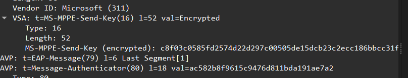

An encrypted MPPE Send Key: `c8f03c0585fd2574d22d297c00505de15dcb23c2ecc186bbcc31fae1a9c8f2ba2a22d01f988393488bdf827b3dcc724f91b5`
Let's now decrypt the 802.1X packets, setting karaoke key in wireshark:
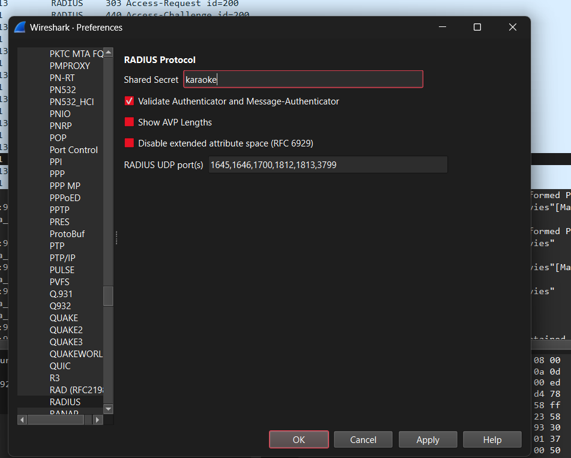
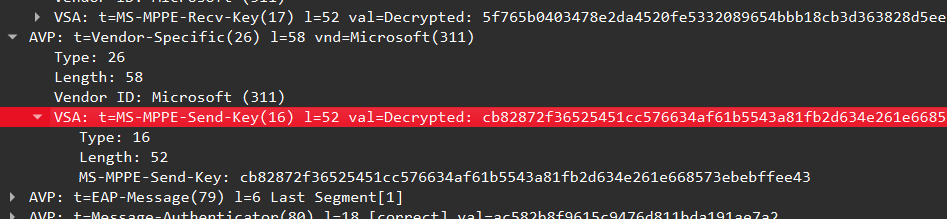
And the MPPE Send key decodes nicely.
MPPE Send Key used: `VSA: t=MS-MPPE-Send-Key(16) l=52 val=Decrypted: cb82872f36525451cc576634af61b5543a81fb2d634e261e668573ebebffee43`
But I couldn't find a way to supply this directly to wireshark to get it to decode the traffic, looking online I found that wireshark needs the PMK itself. 
From before:
WPA-PSK uses:
"Where the wifi password used + ssid (PBKDF2-HMAC-SHA1, 4096 rounds), would form the pmk, or the pairwise master key. This is what is attacked by aircrack-ng by default; It mimics creation of a PMK, and then a PTK"
For WPA-E:
The PMK here, I found online is the MPPE Recv Key: `5f765b0403478e2da4520fe5332089654bbb18cb3d363828d5ee3b16438d7cc1`
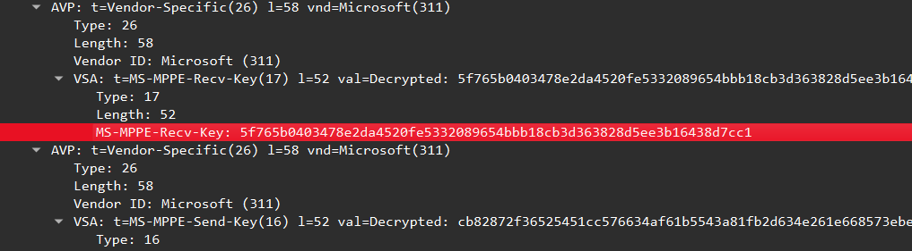
`5f765b0403478e2da4520fe5332089654bbb18cb3d363828d5ee3b16438d7cc1`
Let's set this as a decoding preference.
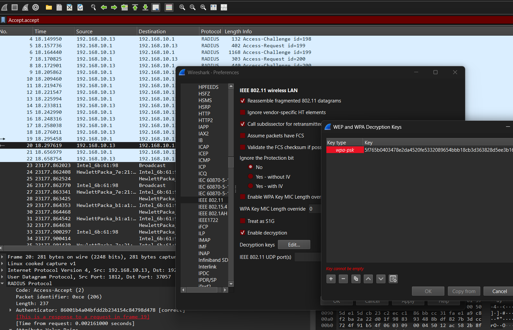
One thing to note: This wpa-psk key type works in wpa enterprise because the 802.1x packet decryption from here on is essentially the same, the part that differs is the PMK derivation.
So, now it can treat the key we got as a wpa-psk pmk.
This is the protected data we are trying to decrypt:
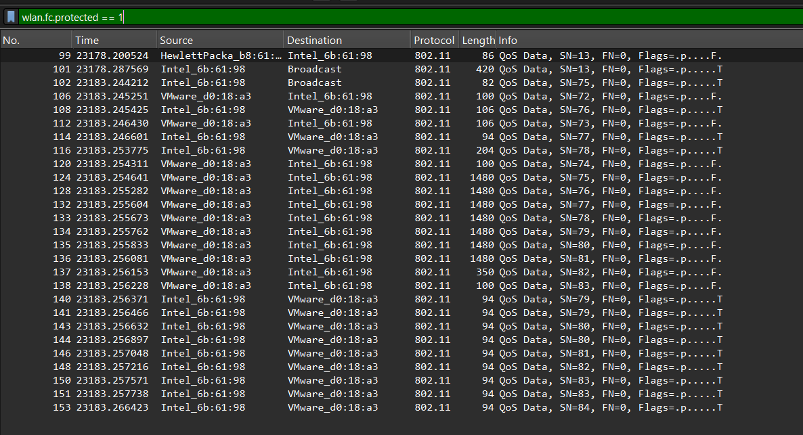
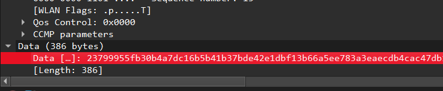
Setting the key:
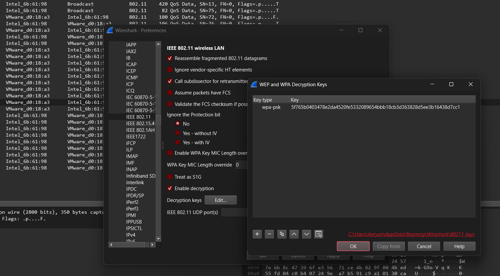
And.. it still says encrypted data..?
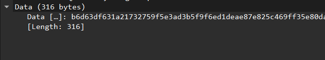
That's weird.. maybe wireshark's failing because of the psk and enterprise difference? Let's just derive the MSK ourselves and supply that as the keytype.
The MSK would be:
MSK = `"MS-MPPE-Recv-Key"` + `"MS-MPPE-Send-Key"`
`MS-MPPE-Recv-Key:
5f765b0403478e2da4520fe5332089654bbb18cb3d363828d5ee3b16438d7cc1`
`MS-MPPE-Send-Key:
cb82872f36525451cc576634af61b5543a81fb2d634e261e668573ebebffee43
`
Therefore, our MSK is:
`MSK: 5f765b0403478e2da4520fe5332089654bbb18cb3d363828d5ee3b16438d7cc1cb82872f36525451cc576634af61b5543a81fb2d634e261e668573ebebffee43`

Let's try this.
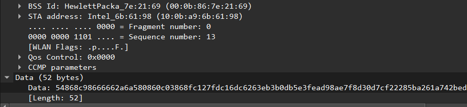
Hmm, still no luck. Let's confirm I'm not being an idiot by checking the EAPoL MIC. The MIC is the Message Integrity Code inside the 4-way handshake, calculated for each of the EAPoL Key packets.

Recalculating the MIC should reproduce the captured MIC as the one captured from the EAPoL Key packet: `e763edf509c6c77cf137312b0412b54f`
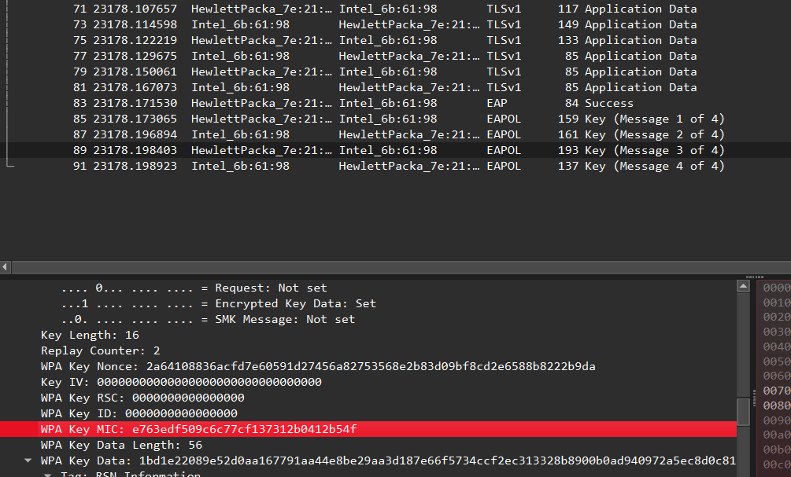
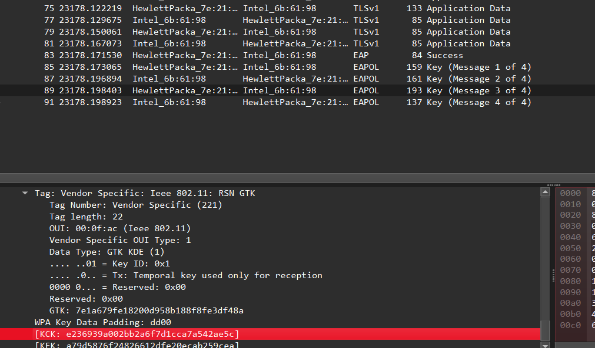
Let's do this for this specific packet, frame 89, if we get `e763edf509c6c77cf137312b0412b54f` as the MIC and `e236939a002bb2a6f7d1cca7a542ae5c` as the KCK, everything we've done so far is correct, and it's wireshark that's causing problems.
https://security.stackexchange.com/questions/244316/how-is-the-mic-message-integrity-code-generated-in-wpa2
```
MIC = HMAC_SHA1(KCK, payload)
```
where KCK is the first 16 bytes of the PTK. From before, PTK calculation is same as WPA-PSK. We need:
`PMK + AP MAC + client MAC + ANonce + SNonce`
As in part 1, these were in the EAPoL start packet:
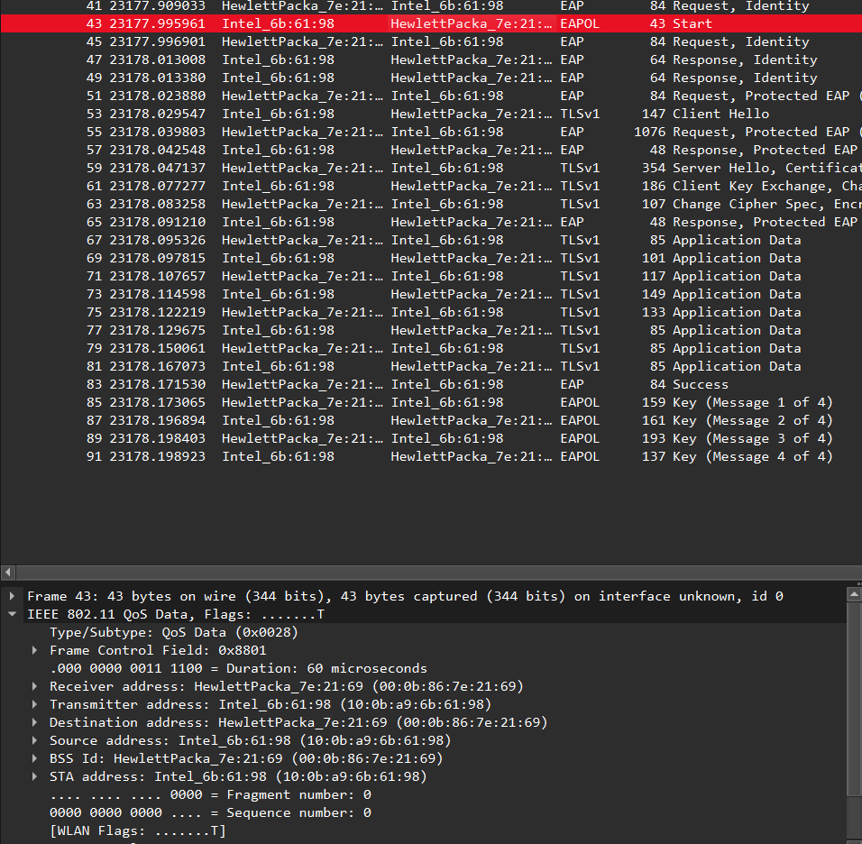

```text
AP MAC: 000b867e2169
client MAC: 100ba96b6198
```

And the nonces from the EAPoL key packets after EAP success. 
Anonce (nonce from the authenticator, made by the AP, thereforce present in the handshake packets from source address `000b867e2169`, or the 1st one in general)
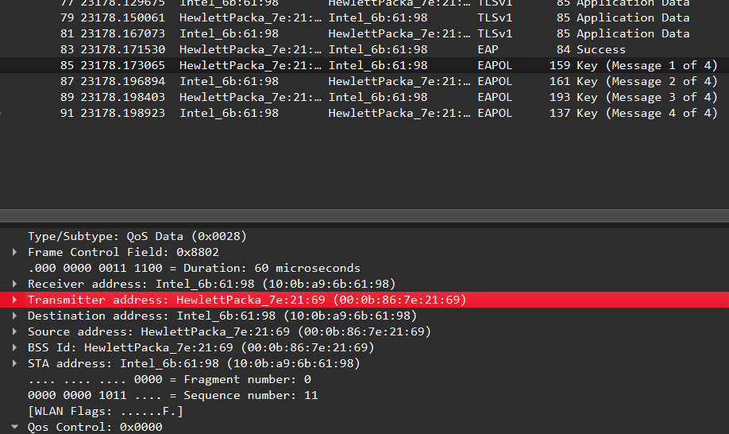
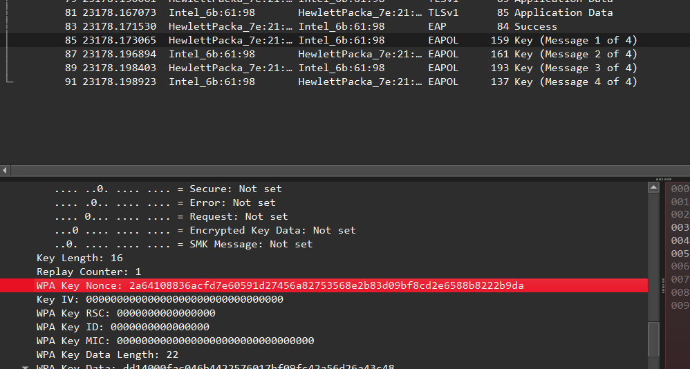
And the Snonce (or the Supplicant nonce, made by the supplicant, therefore wpa nonce in packets sent by `100ba96b6198`, or the 2nd packet in general)
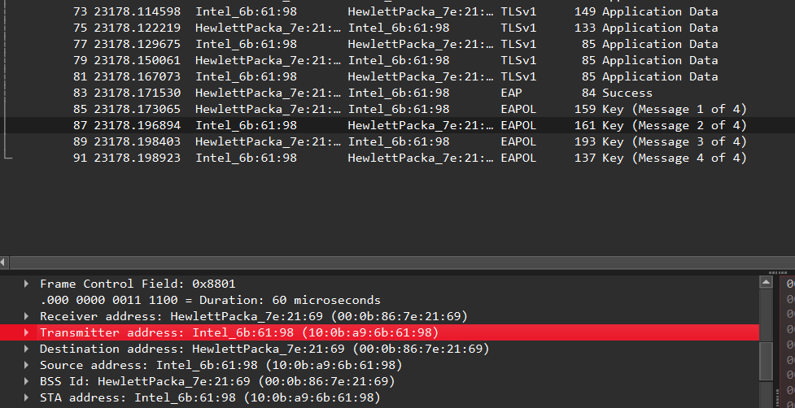
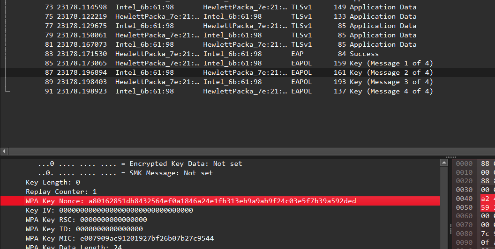

Therefore:
`Anonce = 2a64108836acfd7e60591d27456a82753568e2b83d09bf8cd2e6588b8222b9da`
`Snonce = a80162851db8432564ef0a1846a24e1fb313eb9a9ab9f24c03e5f7b39a592ded`
We have everything needed for generating the PTK. Let's use our PMK from above: the MPPE Recv Key: `5f765b0403478e2da4520fe5332089654bbb18cb3d363828d5ee3b16438d7cc1`

```python
import hmac
import hashlib

pmk = bytes.fromhex("5f765b0403478e2da4520fe5332089654bbb18cb3d363828d5ee3b16438d7cc1")

ap = bytes.fromhex("000b867e2169")
s = bytes.fromhex("100ba96b6198")

anonce = bytes.fromhex("2a64108836acfd7e60591d27456a82753568e2b83d09bf8cd2e6588b8222b9da")
snonce = bytes.fromhex("a80162851db8432564ef0a1846a24e1fb313eb9a9ab9f24c03e5f7b39a592ded")

data = min(ap, s) + max(ap, s) + min(anonce, snonce) + max(anonce, snonce)

ptk = b""
i = 0

while len(ptk) < 64:
    ptk += hmac.new(
        pmk,
        b"Pairwise key expansion" + b"\x00" + data + bytes([i]),
        hashlib.sha1
    ).digest()
    i += 1

ptk = ptk[:64]
kck = ptk[:16]

print("PTK:", ptk.hex())
print("KCK:", kck.hex())
```

```
PTK: e236939a002bb2a6f7d1cca7a542ae5ca79d5876f24826612dfe20ecab259ceac7177c62041baf57f7918096d4721eebb29e239fa467d8c6e7daded9d7330d7c
KCK: e236939a002bb2a6f7d1cca7a542ae5c
```
The KCK Matches the target KCK!
Let's just confirm the MIC as well. For the `payload` we need to zero out the mic field and calculate.
```python
from scapy.all import rdpcap, EAPOL, raw
import hmac
import hashlib

PCAP = "e02d87707841f558986b78537e7c3ddc.pcap"
FRAME = 89

KCK = bytes.fromhex("e236939a002bb2a6f7d1cca7a542ae5c")

packets = rdpcap(PCAP)

e = raw(packets[FRAME - 1][EAPOL])

e = e[:4 + int.from_bytes(e[2:4], "big")]

target_mic = e[81:97] # or e763edf509c6c77cf137312b0412b54f from before

# we need to zero the mic field before recalculating
zeroed = e[:81] + b"\x00" * 16 + e[97:]

full_hmac = hmac.new(KCK, zeroed, hashlib.sha1).digest()
calculated = full_hmac[:16]

print("target MIC :", target_mic.hex())
print("calc MIC   :", calculated.hex())
print("not idiot?      :", calculated == target_mic)
```
Output:
```bash
$ python3 solve.py
target MIC : e763edf509c6c77cf137312b0412b54f
calc MIC   : e763edf509c6c77cf137312b0412b54f
not idiot?      : True
```
Okay, so we calculated it just fine, just wireshark being wireshark. 
I searched online and found that `airdecap-ng` can decrypt these packets just fine as well.
Using that, we need the BSSID, ESSID and PMK we just calculated.
ESSID (from before): `Rao likes 1X Movies`
BSSID (ap mac): `00:0b:86:7e:21:69`  
PMK: `5f765b0403478e2da4520fe5332089654bbb18cb3d363828d5ee3b16438d7cc1`

```bash
$ airdecap-ng -b "00:0b:86:7e:21:69" -e "Rao likes 1X Movies" -k "5f765b0403478e2da4520fe5332089654bbb18cb3d363828d5ee3b16438d7cc1" e02d87707841f558986b78537e7c3ddc.pcap
"e02d87707841f558986b78537e7c3ddc.pcap" isn't a pcap file (expected TCPDUMP_MAGIC).
```
Man I hate these tools. It's probably a pcapng. 
```bash
$ file e02d87707841f558986b78537e7c3ddc.pcap
e02d87707841f558986b78537e7c3ddc.pcap: pcapng capture file - version 1.0
```
Yeah, lets convert this to a pcap using editcap:
```bash
$ editcap -F libpcap -T ieee-802-11 -r \
  e02d87707841f558986b78537e7c3ddc.pcap \
  wifi_only_as.pcap \
  23-154

$ file wifi_only_as.pcap
wifi_only_as.pcap: pcap capture file, microsecond ts (little-endian) - version 2.4 (802.11, capture length 262144)

$ airdecap-ng -b "00:0b:86:7e:21:69" -e "Rao likes 1X Movies" -k "5f765b0403478e2da4520fe5332089654bbb18cb3d363828d5ee3b16438d7cc1" wifi_only_as.pcap
Total number of stations seen            1
Total number of packets read           132
Total number of WEP data packets         0
Total number of WPA data packets        24
Number of plaintext data packets         0
Number of decrypted WEP  packets         0
Number of corrupted WEP  packets         0
Number of decrypted WPA  packets        24
Number of bad TKIP (WPA) packets         0
Number of bad CCMP (WPA) packets         0
```
This seems to have worked! It wrote the decrypted packets to `wifi_only_as-dec.pcap`
```bash
$ file wifi_only_as-dec.pcap
wifi_only_as-dec.pcap: pcap capture file, microsecond ts (little-endian) - version 2.4 (Ethernet, capture length 65535)
```
Let's open this in wireshark
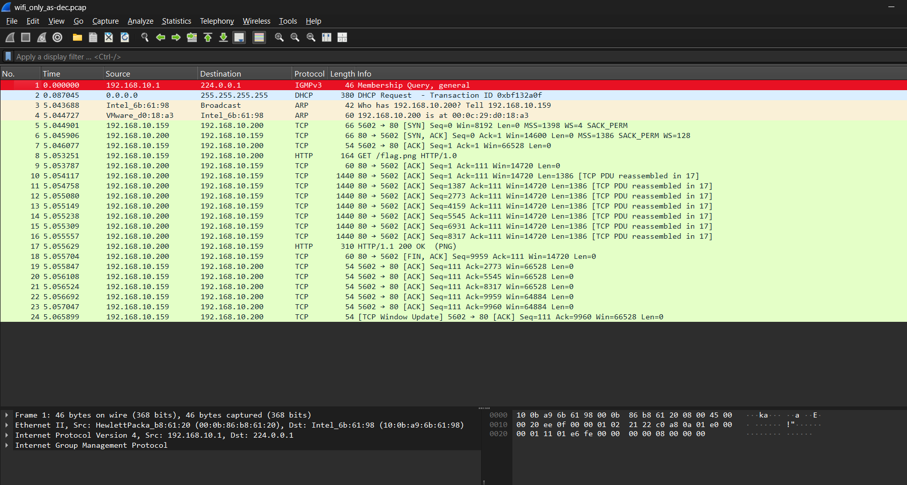
Yay it worked!
Let's extract the HTTP objects, I see a flag.png:
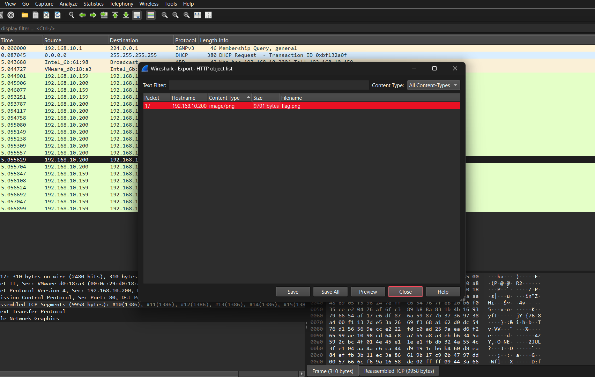
And there it is :)


# Flag
H4v3FunW1thTh341r!
