# Are you Twisted Insane?

## Challenge Details

- Category: Forensics
- Points: 3
- Validation: 35
- Author: Cedrick Feat Mr.Un1k0d3r
- Status: Todo
# Handout
`Are you Twisted Insane? Maybe the music is too loud?`
https://ringzer0ctf.com/files/5f848a2b5b8d1c9fa130866c8bd15307.zip
## Walkthrough
Why yes of course I'm twisted insane. Judging by the challenge details, we probably have to find an audio file. 
Unzipping:
```bash
$ unzip 5f848a2b5b8d1c9fa130866c8bd15307.zip
Archive:  5f848a2b5b8d1c9fa130866c8bd15307.zip
  inflating: B51BAB1F23694A95D6E5665737688F08.pcap
```
Network Capture! Opening in wireshark:

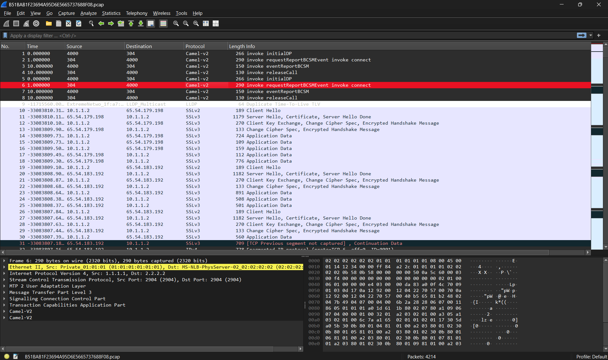

There's a lot of noise (get it?!?!?)
Let's just look for  any audio related protocols, could be SBC, or anything.

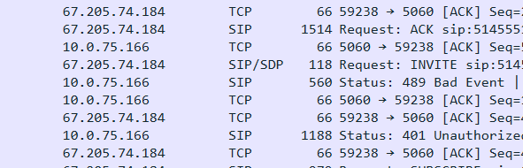

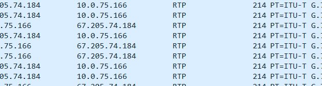

And there we go! RTP, Real time Transport Protocol, our flag is almost certainly in the data transmitted over RTP. Lets extract it: https://wiki.wireshark.org/RTP_statistics#:~:text=Supported%20codecs%20with%208000%20Hz,'Sun%20Audio'%20file%20format
If this fails we can look at the SIP data to try and understand.
By going to telephony > rtp > rtp streams
There are 3 streams:

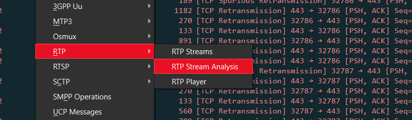

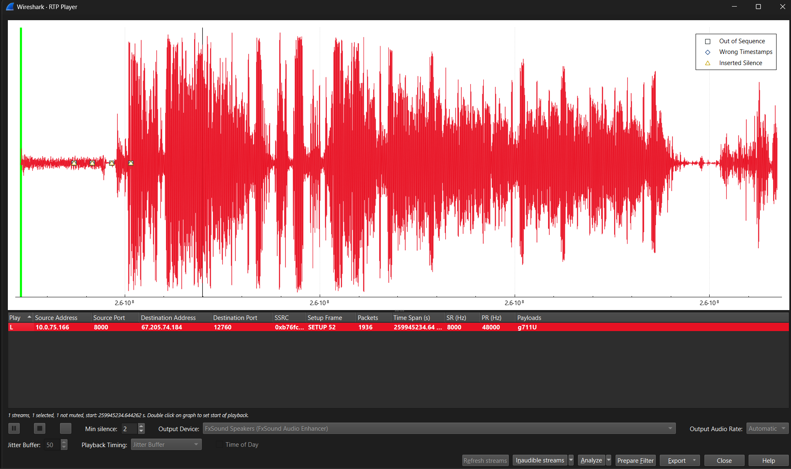
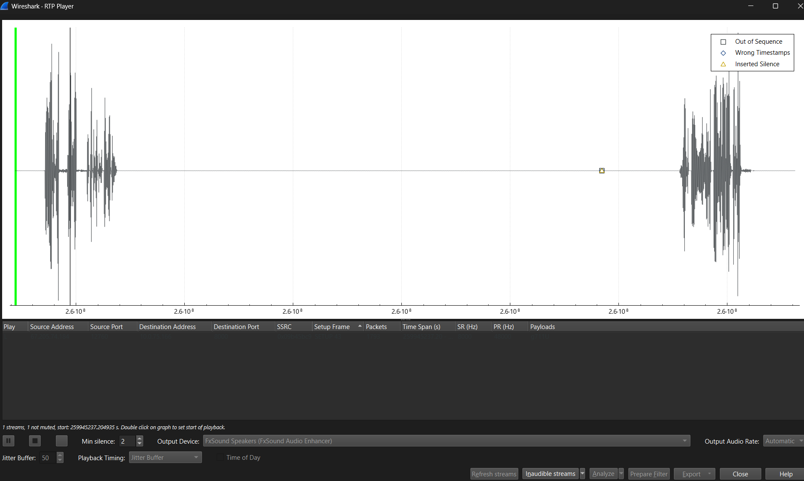

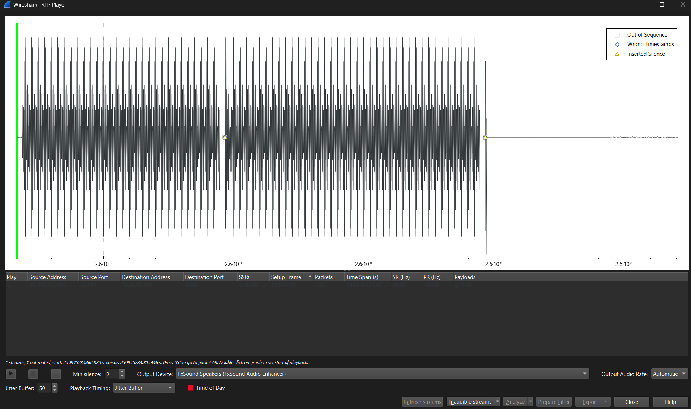

1st one probably contains the flag, visible through its spectrogram. 2nd is a person saying something about a password. 3rd is a telephone dial tone.
Let's export all of them as Stream Synchronized Audio.
Telephony > RTP > RTP Streams > Export > Stream Synchronized Audio

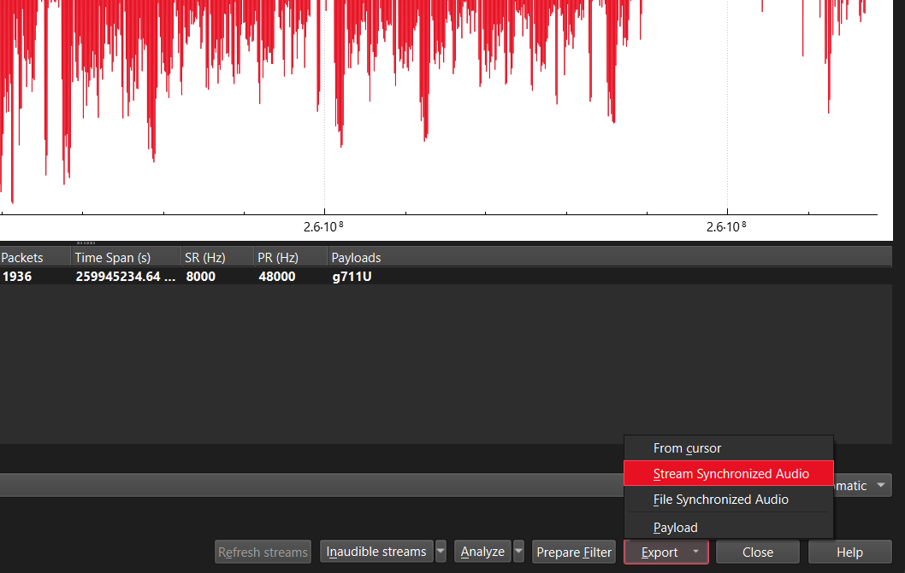

Hmm, a normal spectrogram doesn't contain anything suspicious or resembling a flag.

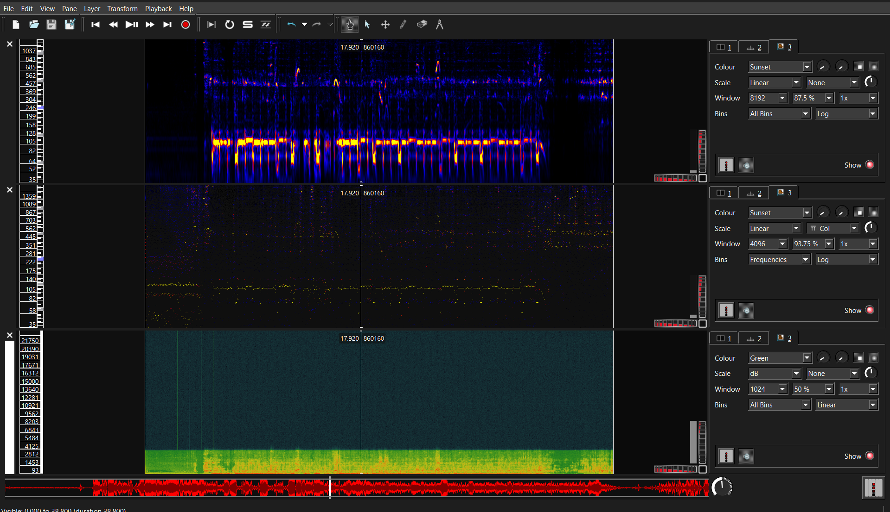

Nothing here.. Could the audio route have been a dead end? We just got "password" Let's step back and look at the SIP data, following the SIP call we see a few interesting things. 

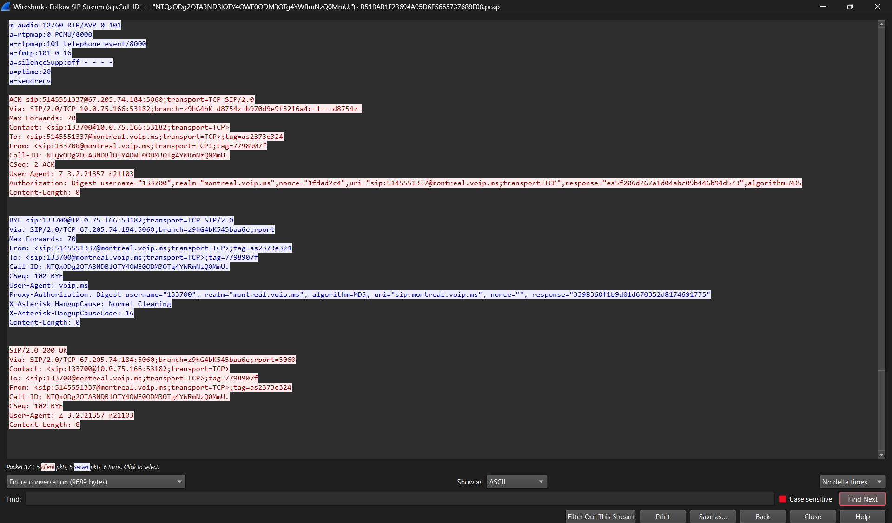

1. Call IDs are base64 strings: NTQxODg2OTA3NDBlOTY4OWE0ODM3OTg4YWRmNzQ0MmU (54188690740e9689a4837988adf7442e), OWU0YTA0M2I4MzViNmVkMGYzNjhmYWI3NzNkMDNjOGM (9e4a043b835b6ed0f368fab773d03c8c)
2. Call from sip:133700@montreal.voip.ms to sip:5145551337@montreal.voip.ms;transport=TCP
3. SIP FROM TAG: 7798907f, 37b7803a
4. Digest username="133700", realm="montreal.voip.ms", algorithm=MD5, uri="sip:montreal.voip.ms", nonce="", response="3398368f1b9d01d670352d8174691775"
Wait there are multiple authentication attempts, and why does this have an empty nonce? That's not natural? The empty nonce makes this digest suspicious, but the call’s accepted INVITE digest is cleaner because it came directly after a 401 Unauthorized: the one with a 200 resp code. What if we crack the successful one for the password used.. could the audio from before be referring to this password?
Successfully authenticated INVITE Packet:
```text
Authorization: Digest username="133700",
realm="montreal.voip.ms",
nonce="1fdad2c4",
uri="sip:5145551337@montreal.voip.ms;transport=TCP",
response="ea5f206d267a1d04abc09b446b94d573",
algorithm=MD5
```
Hmm, how does SIP encode the hash? https://hacktricks.wiki/en/network-services-pentesting/pentesting-voip/basic-voip-protocols/sip-session-initiation-protocol.html
Here's the formula:

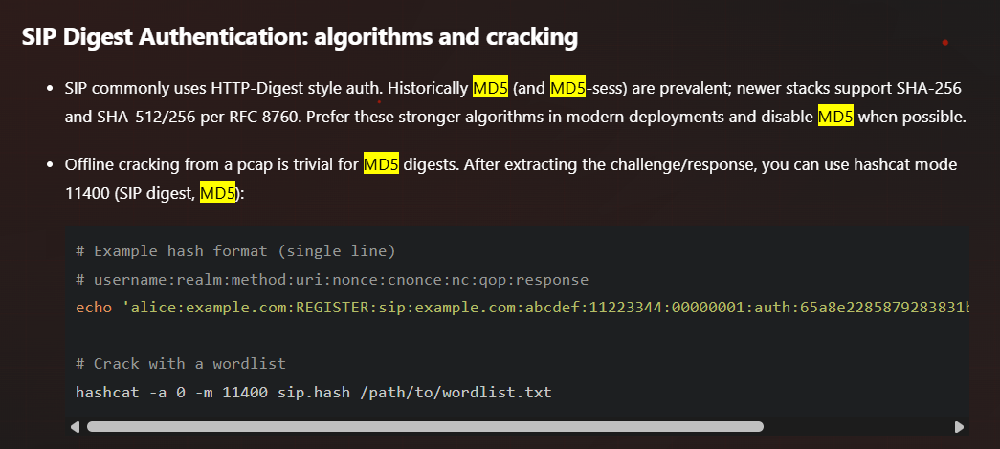

username:realm:method:uri:nonce:cnonce:nc:qop:response
But we don't have a qop or a cnone, let's research more:
https://datatracker.ietf.org/doc/html/draft-smith-sip-auth-examples-00#section-2.2
Here it is, Absent qop.
So there are different forms of sip auth, hacktricks had a different version, we have An RFC 2069-compatible Absent QOP digest.

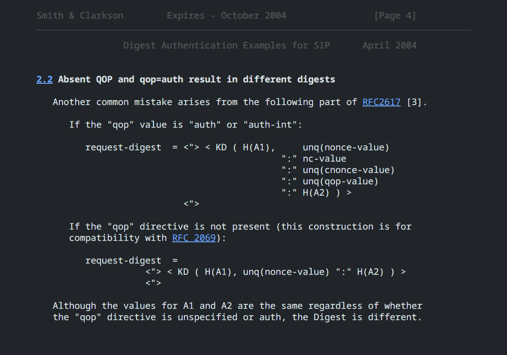

So in essence, SIP uses HTTP Digest auth, and RFC 3261 says that SIP Digest follows the HTTP Digest rules while preserving RFC 2069 compatibility. RFC 2617 defines two different request-digest constructions: one when qop is present, using `nonce:nc:cnonce:qop:H(A2)`, and one when qop is absent, using only `nonce:H(A2)`. Therefore, an absent qop digest must have been generated using the legacy no-qop formula:

`response=MD5(HA1:nonce:HA2)`

where
HA1 = MD5(username:realm:password)
HA2 = MD5(method:digestURI)

So for us, 
HA1 = MD5(133700:montreal.voip.ms:PASSWORD)
HA2 = MD5(INVITE:sip:5145551337@montreal.voip.ms;transport=TCP)
response = ea5f206d267a1d04abc09b446b94d573

So knowing this, we can crack the password! Solution in `solve.py`
```python
import hashlib

bingo    = "ea5f206d267a1d04abc09b446b94d573"
username = "133700"
realm    = "montreal.voip.ms"
nonce    = "1fdad2c4"
method   = "INVITE"
uri      = "sip:5145551337@montreal.voip.ms;transport=TCP"
wordlist = "/home/hyp3rnov4/wordlists/rockyou.txt"
def md5(s):
    return hashlib.md5(s.encode()).hexdigest()


with open(wordlist, errors="ignore") as wl:
    for passwd in wl:
        passwd = passwd.strip()

        ha1 = md5(f"{username}:{realm}:{passwd}")
        ha2 = md5(f"{method}:{uri}")
        response = md5(f"{ha1}:{nonce}:{ha2}")

        if response == bingo:
            print("FIN.", passwd)
            break

    else:
        print("not found????")
```
AND THE FLAG IS
```
$ python3 solve.py
not found????
```
Oh you have to be kidding me. Trying my bigger billion password wordlist.
Python's gonna take way too long with this, switching to hashcat:
```bash
cat > sip2.hash <<'EOF'
$sip$***133700*montreal.voip.ms*INVITE**sip:5145551337@montreal.voip.ms;transport=TCP**1fdad2c4****MD5*ea5f206d267a1d04abc09b446b94d573
EOF

hashcat -m 11400 -a 0 sip2.hash /mnt/d/ctf/Hashes.org -w 4
Approaching final keyspace - workload adjusted.

Session..........: hashcat
Status...........: Exhausted
Hash.Mode........: 11400 (SIP digest authentication (MD5))
Hash.Target......: $sip$***133700*montreal.voip.ms*INVITE*sip*51455513...94d573
Time.Started.....: Mon June 30 01:10:09 2025 (3 mins, 57 secs)
Time.Estimated...: Mon June 30 01:14:06 2025 (0 secs)
Kernel.Feature...: Pure Kernel
Guess.Base.......: File (/mnt/d/ctf/Hashes.org)
Guess.Queue......: 1/1 (100.00%)
Speed.#1.........:  4897.4 kH/s (14.94ms) @ Accel:1024 Loops:1 Thr:64 Vec:1
Speed.#2.........:  1104.3 kH/s (0.77ms) @ Accel:512 Loops:1 Thr:1 Vec:8
Speed.#*.........:  6001.7 kH/s
Recovered........: 0/1 (0.00%) Digests (total), 0/1 (0.00%) Digests (new)
Progress.........: 1397237950/1397237950 (100.00%)
Rejected.........: 0/1397237950 (0.00%)
Restore.Point....: 1395896320/1397237950 (99.90%)
Restore.Sub.#1...: Salt:0 Amplifier:0-1 Iteration:0-1
Restore.Sub.#2...: Salt:0 Amplifier:0-1 Iteration:0-1
Candidate.Engine.: Device Generator
Candidates.#1....: zy(*N -> 龙艳
Candidates.#2....: zymulude -> !zyN
Hardware.Mon.#1..: Temp: 53c Util:  2% Core:1065MHz Mem:7000MHz Bus:8
Hardware.Mon.#2..: N/A
```
Okay.. let's try rockyou again with a ruleset: OneRuleToRuleThemAll

```bash
$ hashcat -m 11400 -a 0 sip.hash /home/hyp3rnov4/wordlists/rockyou.txt -w 4 -r /home/hyp3rnov4/wordlists/OneRuleToRuleThemAll.rule
Session..........: hashcat
Status...........: Exhausted
Hash.Mode........: 11400 (SIP digest authentication (MD5))
Hash.Target......: $sip$***133700*montreal.voip.ms*INVITE*sip*51455513...94d573
Time.Started.....: Mon June 30 01:15:20 2025 (7 mins, 28 secs)
Time.Estimated...: Mon June 30 01:22:48 2025 (0 secs)
Kernel.Feature...: Pure Kernel
Guess.Base.......: File (/home/hyp3rnov4/wordlists/rockyou.txt)
Guess.Mod........: Rules (/home/hyp3rnov4/wordlists/OneRuleToRuleThemAll.rule)
Guess.Queue......: 1/1 (100.00%)
Speed.#1.........:  1633.0 MH/s (113.13ms) @ Accel:512 Loops:256 Thr:64 Vec:1
Speed.#2.........: 30144.3 kH/s (78.51ms) @ Accel:512 Loops:256 Thr:1 Vec:8
Speed.#*.........:  1663.2 MH/s
Recovered........: 0/1 (0.00%) Digests (total), 0/1 (0.00%) Digests (new)
Progress.........: 745836246080/745836246080 (100.00%)
Rejected.........: 0/745836246080 (0.00%)
Restore.Point....: 13633852/14344384 (95.05%)
Restore.Sub.#1...: Salt:0 Amplifier:51968-51995 Iteration:0-256
Restore.Sub.#2...: Salt:0 Amplifier:51968-51995 Iteration:0-256
Candidate.Engine.: Device Generator
Candidates.#1....: 0877114295 -> $HEX[042a0337c2a156616c6c732103]
Candidates.#2....: 0879514793 -> 0877114377
Hardware.Mon.#1..: Temp: 82c Util: 99% Core:2295MHz Mem:8150MHz Bus:8
Hardware.Mon.#2..: N/A
```
Okay what now. Maybe the password is `FLAG-{smth}` or `Flag-{smth}`?
Let's try that with rockyou..
```bash
 hashcat -a 0 ~/wordlists/rockyou.txt   -r ~/wordlists/OneRuleToRuleThemAll.rule   --stdout | awk '{print "FLAG-" $0; print "Flag-" $0}' | hashcat -m 11400 -a 0 sip.hash -w 4
Session..........: hashcat
Status...........: Running
Hash.Mode........: 11400 (SIP digest authentication (MD5))
Hash.Target......: $sip$***133700*montreal.voip.ms*INVITE*sip*51455513...94d573
Time.Started.....: Mon June 30 01:57:07 2025 (7 hours, 27 mins)
Time.Estimated...: Mon June 30 09:24:07 2025 (0 secs)
Kernel.Feature...: Pure Kernel
Guess.Base.......: Pipe
Speed.#1.........:  5021.7 kH/s (22.31ms) @ Accel:1024 Loops:1 Thr:64 Vec:1
Speed.#2.........:   693.4 kH/s (0.83ms) @ Accel:512 Loops:1 Thr:1 Vec:8
Speed.#*.........:  5715.1 kH/s
Recovered........: 0/1 (0.00%) Digests (total), 0/1 (0.00%) Digests (new)
Progress.........: 158844964864
Rejected.........: 0
Restore.Point....: 0
Restore.Sub.#1...: Salt:0 Amplifier:0-1 Iteration:0-1
Restore.Sub.#2...: Salt:0 Amplifier:0-1 Iteration:0-1
Candidate.Engine.: Device Generator
Candidates.#1....: FLAG-geomarcoimaw12 -> Flag-theomamagg
Candidates.#2....: FLAG-geomalioboro -> Flag-theomalina14
Hardware.Mon.#1..: Temp: 48c Util: 20% Core: 960MHz Mem: 810MHz Bus:8
Hardware.Mon.#2..: N/A
```
Therefore, our md5 response is generated by the hash of:

# FLAG
