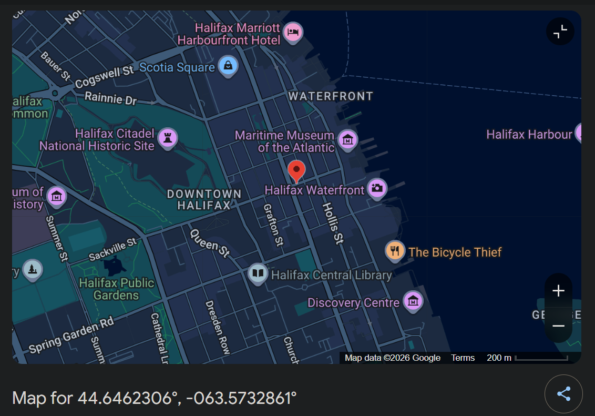

# Dr. Pouce

## Challenge Details

- Category: Forensics
- Points: 2
- Validation: 2721
- Author: Cedrick Chaput
- Status: Done

# Handout
`Dr. Pouce; Find in which city DR Pouce is keeped ! Then find who is the evil man? answer format : cityfirstnamelastname`
https://ringzer0ctf.com/files/6a613824f82f8be411884a09e4689e84.zip

## Walkthrough
Right off the bat we probably we have to see the exif data for some file. Let's look at what we are given
```bash
unzip 6a613824f82f8be411884a09e4689e84.zip
Archive:  6a613824f82f8be411884a09e4689e84.zip
  inflating: DR_Pouce.pdf
  inflating: DR_Pouce.jpg
```

I don't think we even need to look at the files for this one, lets look at the exifdata directly.

```bash
$ exiftool DR_Pouce.*
======== DR_Pouce.jpg
ExifTool Version Number         : 13.50
File Name                       : DR_Pouce.jpg
Directory                       : .
File Size                       : 3.0 MB
File Modification Date/Time     : 2014:03:20 06:47:19+05:30
File Access Date/Time           : 2026:05:29 20:33:25+05:30
File Inode Change Date/Time     : 2026:05:29 20:33:25+05:30
File Permissions                : -rwxrwxrwx
File Type                       : JPEG
File Type Extension             : jpg
MIME Type                       : image/jpeg
JFIF Version                    : 1.01
Exif Byte Order                 : Big-endian (Motorola, MM)
Make                            : LGE
Camera Model Name               : Nexus 5
X Resolution                    : 72
Y Resolution                    : 72
Resolution Unit                 : inches
Y Cb Cr Positioning             : Centered
Exposure Time                   : 1/30
F Number                        : 2.4
ISO                             : 1034
Exif Version                    : 0220
Date/Time Original              : 2014:03:19 20:33:17
Create Date                     : 2014:03:19 20:33:17
Components Configuration        : Y, Cb, Cr, -
Shutter Speed Value             : 1/30
Aperture Value                  : 2.4
Exposure Compensation           : 0
Flash                           : No Flash
Focal Length                    : 4.0 mm
Flashpix Version                : 0100
Color Space                     : sRGB
Exif Image Width                : 2448
Exif Image Height               : 3264
Interoperability Index          : R98 - DCF basic file (sRGB)
Interoperability Version        : 0100
GPS Latitude Ref                : North
GPS Longitude Ref               : West
GPS Img Direction Ref           : Magnetic North
GPS Img Direction               : 237
Compression                     : JPEG (old-style)
Thumbnail Offset                : 720
Thumbnail Length                : 5310
Image Width                     : 2448
Image Height                    : 3264
Encoding Process                : Baseline DCT, Huffman coding
Bits Per Sample                 : 8
Color Components                : 3
Y Cb Cr Sub Sampling            : YCbCr4:2:0 (2 2)
Aperture                        : 2.4
Image Size                      : 2448x3264
Megapixels                      : 8.0
Shutter Speed                   : 1/30
Thumbnail Image                 : (Binary data 5310 bytes, use -b option to extract)
GPS Latitude                    : 44 deg 38' 46.43" N
GPS Longitude                   : 63 deg 34' 23.83" W
Focal Length 35mm Equiv         : 4.0 mm
GPS Position                    : 44 deg 38' 46.43" N, 63 deg 34' 23.83" W
Light Value                     : 4.1
======== DR_Pouce.pdf
ExifTool Version Number         : 13.50
File Name                       : DR_Pouce.pdf
Directory                       : .
File Size                       : 16 kB
File Modification Date/Time     : 2014:03:20 07:00:22+05:30
File Access Date/Time           : 2026:05:29 20:33:25+05:30
File Inode Change Date/Time     : 2026:05:29 20:33:24+05:30
File Permissions                : -rwxrwxrwx
File Type                       : PDF
File Type Extension             : pdf
MIME Type                       : application/pdf
PDF Version                     : 1.4
Linearized                      : No
Media Box                       : 0, 0, 612, 792
Page Count                      : 1
Language                        : fr-CA
Author                          : Steve Finger
Creator                         : Writer
Producer                        : LibreOffice 3.5
Create Date                     : 2014:03:19 21:30:22-04:00
    2 image files read
```
Key things of interest:
`GPS Position                    : 44 deg 38' 46.43" N, 63 deg 34' 23.83" W`
`Author                          : Steve Finger`
Looking online, the coordinates are for... drumroll....

HALIFAX

We already have the name of the author: steve finger, so now we can assemble the flag
# FLAG
halifaxstevefinger