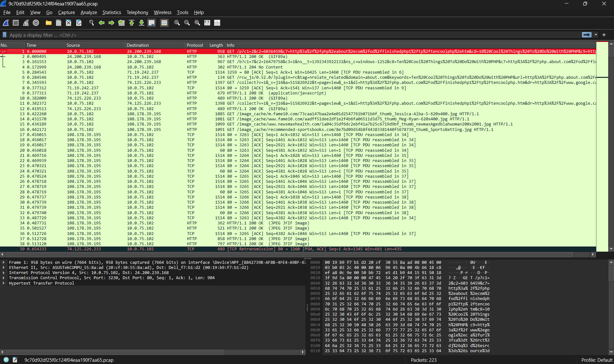
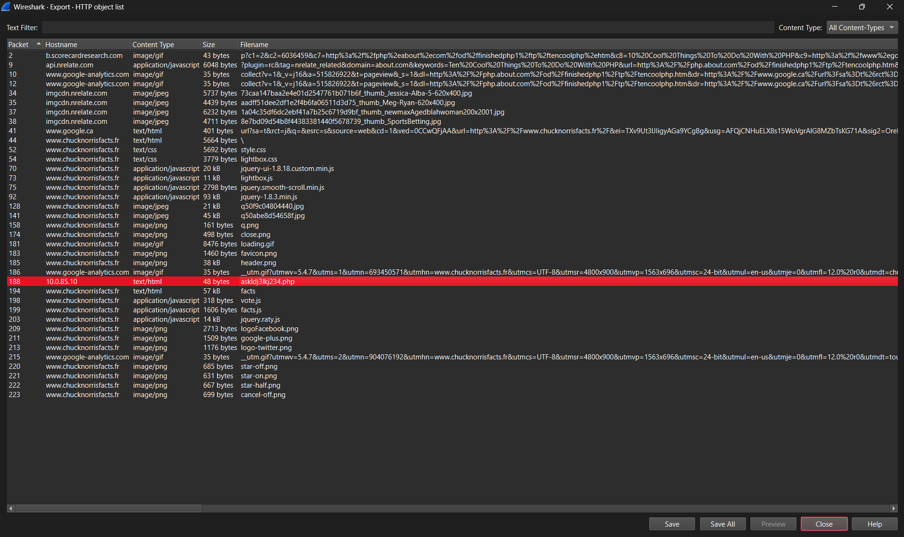

# Hey Chuck where is the flag?

## Challenge Details

- Category: Forensics
- Points: 2
- Validation: 1846
- Author: Mr.Un1k0d3r
- Status: Done
# Handout
`Hey Chuck where is the flag`
https://ringzer0ctf.com/files/a26a10853f9d170feba6ab9b627ad156.zip

## Walkthrough
Let's unzip the archive:
```bash
$ unzip a26a10853f9d170feba6ab9b627ad156.zip
Archive:  a26a10853f9d170feba6ab9b627ad156.zip
  inflating: 9c70d92df25f0c124f04eaa190f7aa65.pcap
```
Network capture file for wireshark, nice.
Opening it up.



A lot of HTTP and TCP packets. Let's first dump http objects and then we will look at tcp/http streams.



One object stands out, it's a php script, let's save it.
```bash
$ cat askldj3lkj234.php
Hey this is a flag FLAG-GehFMsqCeNvof5szVpB2Dmjx
```
I guess we won't have to look at the individual streams after all.

OHH THE CHALLENGE NAME IS A NOD TO NETWORKCHUCK. CLEVER.
# FLAG
FLAG-GehFMsqCeNvof5szVpB2Dmjx
