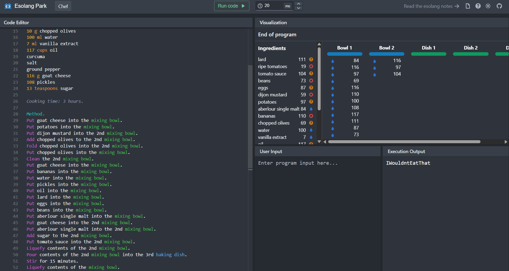

# Meat Loaf

## Challenge Details

- Category: Forensics
- Points: 2
- Validation: 538
- Author: Ekse
- Status: Done

# Handout
  
```
RingZer0 Team delicious meat loaf.  
  
This is the official RingZer0 Team meat loaf recipe.  
  
Ingredients.  
111 tablespoons lard  
19 g ripe tomatoes  
104 teaspoons tomato sauce  
73 g beans  
87 eggs  
59 g dijon mustard  
97 potatoes  
84 ml aberlour single malt  
110 g bananas  
10 g chopped olives  
100 ml water  
7 ml vanilla extract  
117 cups oil  
curcuma  
salt  
ground pepper  
116 g goat cheese  
108 pickles  
13 teaspoons sugar  
  
Cooking time: 3 hours.  
  
Method.  
Put goat cheese into the mixing bowl.  
Put potatoes into the mixing bowl.  
Put dijon mustard into the 2nd mixing bowl.  
Add chopped olives to the 2nd mixing bowl.  
Fold chopped olives into the 2nd mixing bowl.  
Put chopped olives into the mixing bowl.  
Clean the 2nd mixing bowl.  
Put goat cheese into the mixing bowl.  
Put bananas into the mixing bowl.  
Put water into the mixing bowl.  
Put pickles into the mixing bowl.  
Put oil into the mixing bowl.  
Put lard into the mixing bowl.  
Put eggs into the mixing bowl.  
Put beans into the mixing bowl.  
Put aberlour single malt into the mixing bowl.  
Put goat cheese into the 2nd mixing bowl.  
Put aberlour single malt into the 2nd mixing bowl.  
Add sugar to the 2nd mixing bowl.  
Put tomato sauce into the 2nd mixing bowl.  
Liquefy contents of the 2nd mixing bowl.  
Pour contents of the 2nd mixing bowl into the 3rd baking dish.  
Stir for 15 minutes.  
Liquefy contents of the mixing bowl.  
Pour contents of the mixing bowl into the baking dish.  
Refrigerate for 3 hours.
```

## Walkthrough
First thought at seeing the wall of text was zero width unicode steganography, but then I saw the numbers being in ASCII range for alphabets, so it might be ASCII for the flag. Then I saw numbers like 19, 7, so it can't be directly ascii so it must be assembled in the later part of the challenge.
It's worded quite weirdly, looking online I realized it's an Esoteric language called `Chef`, so found an online compiler: https://esolangpark.vercel.app/ide/chef, and it directly prints out the flag.



# FLAG
`IWouldntEatThat`