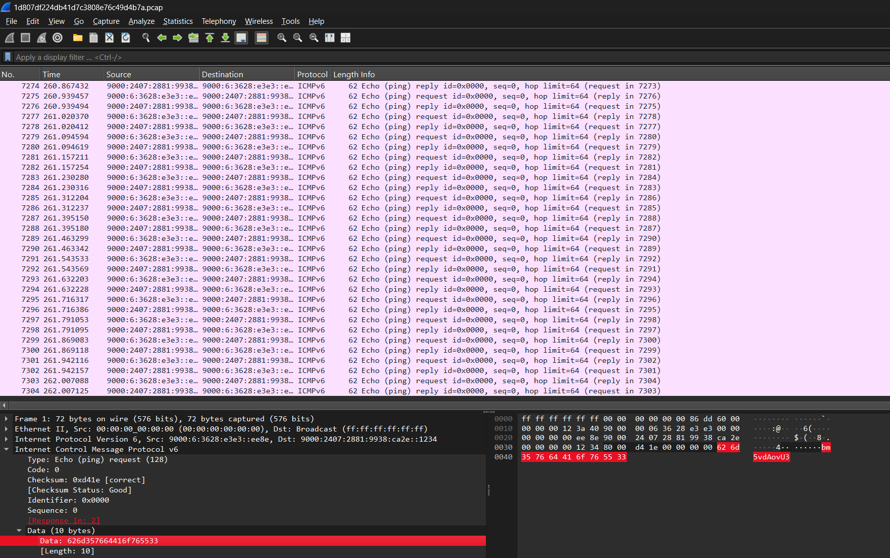
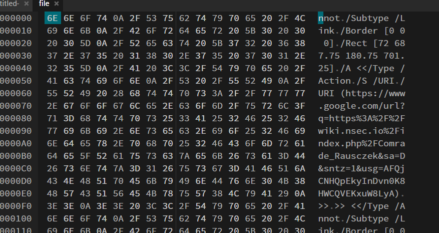
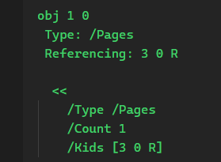
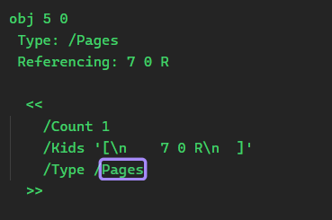
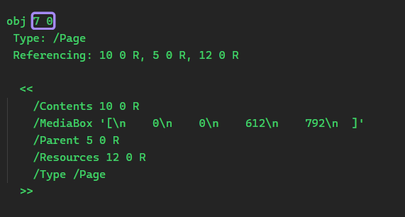
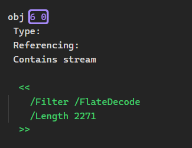

# Ping pong

## Challenge Details

- Category: Forensics
- Points: 5
- Validation: 116
- Author: SynneR
- Status: Done
# Handout
`Ping pong`
https://ringzer0ctf.com/files/cd8f272efad5f615141ee4e33793ae92.zip
## Walkthrough
Unzipping:
```bash
$ unzip cd8f272efad5f615141ee4e33793ae92.zip
Archive:  cd8f272efad5f615141ee4e33793ae92.zip
  inflating: 1d807df224db41d7c3808e76c49d4b7a.pcap
```
A network capture, let's open it in wireshark.



Immediately we can see there are 7304 ICMPv6 ping packets (the challenge name checks out ig), in each ping packet, there's a data field, which contains text which seems to be base64 encoded, let's extract all data fields.
```bash
$ tshark -r 1d807df224db41d7c3808e76c49d4b7a.pcap -Y "icmpv6" -T fields -e data | head -5
626d357664416f765533
626d357664416f765533
566964486c775a534176
566964486c775a534176
54476c7561776f76516d
```
We are getting duplicates from the ping replies, let's only use the unique ones, then pipe it through xxd and b64
```bash
$ tshark -r 1d807df224db41d7c3808e76c49d4b7a.pcap -Y "icmpv6.type==128" -T fields -e data | uniq | xxd -r -p | tr -d '\n' | base64 -d > file

$ file file
file: data

$ cat file | head -n 10
$ cat file | head -n 10
nnot
/Subtype /Link
/Border [0 0 0]
/Rect [72 687.75 180.75 701.25]
/A <</Type /Action
/S /URI
/URI (https://www.google.com/url?q=https%3A%2F%2Fwiki.nsec.io%2Findex.php%2FComrade_Rausczek&sa=D&sntz=1&usg=AFQjCNHQpEkyInDvn0K8HWCQVEKxuW8LyA)
>>
>> <</Type /Annot
/Subtype /Link
```
The file command doesn't recognize the file, but it is most definitely a pdf, judging by the other headers, the head output matches a pdf internal structure for a link annotation, but the file command failed to identify it as  the file signature has  been intentionally modified from the pdf standard to `nnot`, which is why the file won't open right now either.
We can easily fix this by changing the initial bytes to the PDF signature (`25 50 44 46 2D`) in a hex editor:



Hmm, that's weird, it's not just a simple header corruption, the version isn't there at all, no catalog object, or pages, like someone intentionally removed the first chunk of the pdf.. and only the objects have survived.. This is going to prove challenging to fix manually.. what if we just extract the surviving pdf objects? Using pdf-parser.py, we can dump the surviving objects:
```bash
$ pdf-parser file
This program has not been tested with this version of Python (3.13.5)
Should you encounter problems, please use Python version 3.12.2
PDF Comment '%3A%2F%2Fwiki.nsec.io%2Findex.php%2FComrade_Rausczek&sa=D&sntz=1&usg=AFQjCNHQpEkyInDvn0K8HWCQVEKxuW8LyA)\n'

PDF Comment '%3A%2F%2Fwiki.nsec.io%2Findex.php%2FDemokratik_Republik_of_Auskev&sa=D&sntz=1&usg=AFQjCNHJ3P3fF0ZXaHOHSsKWONo8B4k0_g)\n'

PDF Comment '%3A%2F%2Fwiki.nsec.io%2Findex.php%2FDemokratik_Republik_of_Auskev&sa=D&sntz=1&usg=AFQjCNHJ3P3fF0ZXaHOHSsKWONo8B4k0_g)\n'

obj 6 0
 Type:
 Referencing:
 Contains stream

  <<
    /Filter /FlateDecode
    /Length 2271
  >>


obj 4 0
 Type: /ExtGState
 Referencing:

  <<
    /Type /ExtGState
    /CA 1
    /ca 1
    /LC 0
    /LJ 0
    /LW 0
    /ML 4
    /SA true
    /BM /Normal
  >>


obj 5 0
 Type: /Font
 Referencing: 7 0 R, 8 0 R

  <<
    /Type /Font
    /Subtype /Type0
    /BaseFont /SpecialElite-Regular
    /Encoding /Identity-H
    /DescendantFonts [7 0 R]
    /ToUnicode 8 0 R
  >>


obj 7 0
 Type: /Font
 Referencing: 9 0 R

  <<
    /Type /Font
    /FontDescriptor 9 0 R
    /BaseFont /SpecialElite-Regular
    /Subtype /CIDFontType2
    /CIDToGIDMap /Identity
    /CIDSystemInfo
      <<
        /Registry (Adobe)
        /Ordering (Identity)
        /Supplement 0
      >>
    /W [0 3 292.9688 5 [557.1289 612.3047 537.5977]
    12 [549.8047 0 579.1016 622.5586 638.6719 605.4688 0 0 495.1172 0 0 602.5391 0 627.9297 616.6992 0 0 636.7188 0 594.2383]
    38 39 565.4297 40 [547.3633 603.0273 543.9453 473.1445 583.0078 616.6992 568.3594 415.5273 620.6055 540.5273 663.5742 632.3242 583.4961 587.4023 0 579.1016 519.5313 510.2539 638.6719 604.9805 678.7109 0 592.7734 528.8086] 86 [343.2617 0 0 636.7188] 367 [336.4258 349.6094]]
  >>


obj 9 0
 Type: /FontDescriptor
 Referencing: 10 0 R

  <<
    /Type /FontDescriptor
    /FontFile2 10 0 R
    /FontName /SpecialElite-Regular
    /Flags 4
    /Ascent 703.125
    /Descent -296.875
    /StemV 133.3008
    /CapHeight 348.1445
    /ItalicAngle 0
    /FontBBox [-32.2266 -321.7773 1051.7578 958.0078]
  >>


obj 10 0
 Type:
 Referencing:
 Contains stream

  <<
    /Length1 34952
    /Filter /FlateDecode
    /Length 20550
  >>


obj 8 0
 Type:
 Referencing:
 Contains stream

  <<
    /Filter /FlateDecode
    /Length 328
  >>


obj 1 0
 Type: /Pages
 Referencing: 3 0 R

  <<
    /Type /Pages
    /Count 1
    /Kids [3 0 R]
  >>


xref

trailer
  <<
    /Size 11
    /Root 2 0 R
  >>

startxref 25620

PDF Comment '%%EOF'

```
Initially are those urls we saw in the head dump, looking at the objects:
There is one page, the /Pages object references object 3 0 R, meaning that governs what is displayed on our pdf page.



However, this 3 0 object was not inside the file we got from the pcap file, that's another part of the corruption, if this 3 0 R was present, we would have been able to render the pdf directly after a few minor adjustments to the header. This 3 0 object would be close to the starting portion of the file.
Let's look at how the page object is structured by creating a sample pdf.
```bash
$ echo "sample pdf for ping pong" | pandoc -o sample.pdf
$ pdf-parser sample.pdf
This program has not been tested with this version of Python (3.13.5)
Should you encounter problems, please use Python version 3.12.2
PDF Comment '%PDF-1.7\n'

PDF Comment '%\xbf\xf7\xa2\xfe\n'

PDF Comment '%QDF-1.0\n\n'

PDF Comment '%% Original object ID: 17 0\n'

obj 1 0
 Type: /Catalog
 Referencing: 3 0 R, 4 0 R, 5 0 R

  <<
    /Names 3 0 R
    /OpenAction 4 0 R
    /PageMode /UseOutlines
    /Pages 5 0 R
    /Type /Catalog
  >>


PDF Comment '%% Original object ID: 18 0\n'

obj 2 0
 Type:
 Referencing:

  <<
    /Author ()
    /CreationDate "(D:20260603164018+05'30')"
    /Creator <feff004c00610054006500580020007600690061002000700061006e0064006f0063>
    /Keywords ()
    /ModDate "(D:20260603164018+05'30')"
    /PTEX.Fullbanner '(This is pdfTeX, Version 3.141592653-2.6-1.40.29 \\(TeX Live 2026/Debian\\) kpathsea version 6.4.2)'
    /Producer (pdfTeX-1.40.29)
    /Subject ()
    /Title ()
    /Trapped /False
  >>


PDF Comment '%% Original object ID: 16 0\n'

obj 3 0
 Type:
 Referencing: 6 0 R

  <<
    /Dests 6 0 R
  >>


PDF Comment '%% Original object ID: 1 0\n'

obj 4 0
 Type:
 Referencing: 7 0 R

  <<
    /D '[\n    7 0 R\n    /Fit\n  ]'
    /S /GoTo
  >>


PDF Comment '%% Original object ID: 9 0\n'

obj 5 0
 Type: /Pages
 Referencing: 7 0 R

  <<
    /Count 1
    /Kids '[\n    7 0 R\n  ]'
    /Type /Pages
  >>


PDF Comment '%% Original object ID: 15 0\n'

obj 6 0
 Type:
 Referencing: 8 0 R, 9 0 R

  <<
    /Limits '[\n    (Doc-Start)\n    (page.1)\n  ]'
    /Names '[\n    (Doc-Start)\n    8 0 R\n    (page.1)\n    9 0 R\n  ]'
  >>


PDF Comment '%% Page 1\n'

PDF Comment '%% Original object ID: 3 0\n'

obj 7 0
 Type: /Page
 Referencing: 10 0 R, 5 0 R, 12 0 R

  <<
    /Contents 10 0 R
    /MediaBox '[\n    0\n    0\n    612\n    792\n  ]'
    /Parent 5 0 R
    /Resources 12 0 R
    /Type /Page
  >>


PDF Comment '%% Original object ID: 7 0\n'

obj 8 0
 Type:
 Referencing: 7 0 R

  <<
    /D '[\n    7 0 R\n    /XYZ\n    133.768\n    667.198\n    null\n  ]'
  >>


PDF Comment '%% Original object ID: 6 0\n'

obj 9 0
 Type:
 Referencing: 7 0 R

  <<
    /D '[\n    7 0 R\n    /XYZ\n    132.768\n    705.06\n    null\n  ]'
  >>


PDF Comment '%% Contents for page 1\n'

PDF Comment '%% Original object ID: 5 0\n'

obj 10 0
 Type:
 Referencing: 11 0 R
 Contains stream

  <<
    /Length 11 0 R
  >>


obj 11 0
 Type:
 Referencing:


PDF Comment '%% Original object ID: 4 0\n'

obj 12 0
 Type:
 Referencing: 13 0 R

  <<
    /Font
      <<
        /F42 13 0 R
      >>
    /ProcSet '[\n    /PDF\n    /Text\n  ]'
  >>


PDF Comment '%% Original object ID: 8 0\n'

obj 13 0
 Type: /Font
 Referencing: 14 0 R, 15 0 R, 16 0 R, 18 0 R

  <<
    /BaseFont /RWLQMW+LMRoman10-Regular
    /Encoding 14 0 R
    /FirstChar 49
    /FontDescriptor 15 0 R
    /LastChar 115
    /Subtype /Type1
    /ToUnicode 16 0 R
    /Type /Font
    /Widths 18 0 R
  >>


PDF Comment '%% Original object ID: 10 0\n'

obj 14 0
 Type: /Encoding
 Referencing:

  <<
    /Differences '[\n    49\n    /one\n    97\n    /a\n    100\n    /d\n    /e\n    /f\n    /g\n    105\n    /i\n    108\n    /l\n    /m\n    /n\n    /o\n    /p\n    114\n    /r\n    /s\n  ]'
    /Type /Encoding
  >>


PDF Comment '%% Original object ID: 13 0\n'

obj 15 0
 Type: /FontDescriptor
 Referencing: 19 0 R

  <<
    /Ascent 689
    /CapHeight 689
    /CharSet (/a/d/e/f/g/i/l/m/n/o/one/p/r/s)
    /Descent -194
    /Flags 4
    /FontBBox '[\n    -430\n    -290\n    1417\n    1127\n  ]'
    /FontFile 19 0 R
    /FontName /RWLQMW+LMRoman10-Regular
    /ItalicAngle 0
    /StemV 69
    /Type /FontDescriptor
    /XHeight 431
  >>


PDF Comment '%% Original object ID: 14 0\n'

obj 16 0
 Type:
 Referencing: 17 0 R
 Contains stream

  <<
    /Length 17 0 R
  >>


obj 17 0
 Type:
 Referencing:


PDF Comment '%% Original object ID: 11 0\n'

obj 18 0
 Type:
 Referencing:


PDF Comment '%% Original object ID: 12 0\n'

obj 19 0
 Type:
 Referencing: 20 0 R
 Contains stream

  <<
    /Length1 1837
    /Length2 22700
    /Length3 0
    /Length 20 0 R
  >>


PDF Comment '%QDF: ignore_newline\n'

obj 20 0
 Type:
 Referencing:


xref

trailer
  <<
    /Info 2 0 R
    /Root 1 0 R
    /Size 21
    /ID [<5ab9e8bf5d5a649ca5f1a8f0b3b19824><ee2c60e0ad9ddbf1759999bc56a233ed>]
  >>

startxref 29984

PDF Comment '%%EOF\n'
```
Here, the pages object is 7 0 



And the 7 0 object:



So it has the tag /Page, contains tags like /Contents, /MediaBox, let's look for these in our challenge file.
```bash
$ strings file | grep page -i
<</Type /Pages
```
The page object initiation itself is gone, hence no /Page
```bash
$ strings file | grep content -i
/Contents 6 0 R
```
There we go! The page object that SHOULD've been there, had a contents tag which references object 6 0, that contains the pdf data necessary to get our flag!



The /Filter /FlateDecode tells us that obj 6 data has been compressed using zlib/deflate. Usually we shouldve been able to decompress this using qpdf, but that won't work because the page references and catalog aren't there:
```bash
$ qpdf file inspection
WARNING: file: can't find PDF header
WARNING: file: file is damaged
WARNING: file (offset 25620): xref not found
WARNING: file: Attempting to reconstruct cross-reference table
WARNING: file (trailer, offset 25605): recovered trailer has no /Root entry
qpdf: file: unable to find trailer dictionary while recovering damaged file
```
Let's dump this object directly using pdf-parser, we should get zlib data:
```bash
$ pdf-parser file -o 6 -d content
This program has not been tested with this version of Python (3.13.5)
Should you encounter problems, please use Python version 3.12.2
obj 6 0
 Type:
 Referencing:
 Contains stream

  <<
    /Filter /FlateDecode
    /Length 2271
  >>
```
```bash 
$ file content
content: zlib compressed data
```
Great! Let's decompress this.

```bash
$ zlib-flate -uncompress < content > decompress_content && cat decompress_content | head -n 50
1 0 0 -1 0 792 cm
q
0 0 612 792 re
W n
q
0.75 0 0 0.75 0 0 cm
1 1 1 RG 1 1 1 rg
/G0 gs
0 0 816 1056 re
f
0 0 816 1056 re
f
0 0 816 1056 re
f
0 96 816 960 re
f
96 96 198 19 re
f
96 118 614 19 re
f
96 146 603 19 re
f
96 174 539 19 re
f
96 202 43 19 re
f
96 230 414 19 re
f
96 258 198 19 re
f
0 0 0 RG 0 0 0 rg
BT
/F0 16 Tf
1 0 0 -1 96 112 Tm
<0059> Tj
1 0 0 -1 106.1875 112 Tm
<0059> Tj
1 0 0 -1 116.375 112 Tm
<0059> Tj
1 0 0 -1 126.5625 112 Tm
<0059> Tj
1 0 0 -1 136.75 112 Tm
<0003> Tj
1 0 0 -1 141.4375 112 Tm
<000E> Tj
1 0 0 -1 150.7031 112 Tm
<001A> Tj
1 0 0 -1 160.5703 112 Tm
<0019> Tj
1 0 0 -1 170.6172 112 Tm
```
Seemingly garbage, but this is actually embedding our flag, it references this F0 object, which is our textual mapping, the <xxxx> cidcodes are the only useful parts, let's extract all of them.

```bash
$ grep -oP '<[0-9A-F]{4}>' decompress_content > cidcodes && cat cidcodes | head -n 5
<0059>
<0059>
<0059>
<0059>
<0003>
```

A font was defined in the original pdf's object 5:
```
obj 5 0
 Type: /Font
 Referencing: 7 0 R, 8 0 R

  <<
    /Type /Font
    /Subtype /Type0
    /BaseFont /SpecialElite-Regular
    /Encoding /Identity-H
    /DescendantFonts [7 0 R]
    /ToUnicode 8 0 R
  >>

```
It tells us that the pdf doesn't store ascii directly, but uses the ToUnicode mapping. This is the key to decoding the <xxxx> tags to ascii. It defines a descendant font, object 7 0 as well, but the mapping itself is the `/ToUnicode 8 0 R` object. Let's dump it in the same way:
```bash
$  pdf-parser file -o 8 -d tounicode && zlib-flate -uncompress < tounicode > mapping.txt && cat mapping.txt
This program has not been tested with this version of Python (3.13.5)
Should you encounter problems, please use Python version 3.12.2
obj 8 0
 Type:
 Referencing:
 Contains stream

  <<
    /Filter /FlateDecode
    /Length 328
  >>


/CIDInit /ProcSet findresource begin
12 dict begin
begincmap
/CIDSystemInfo
<<  /Registry (Adobe)
/Ordering (UCS)
/Supplement 0
>> def
/CMapName /Adobe-Identity-UCS def
/CMapType 2 def
1 begincodespacerange
<0000> <FFFF>
endcodespacerange
10 beginbfchar
<0003> <0020>
<000C> <0041>
<0014> <0049>
<0017> <004C>
<001D> <0052>
<001F> <0054>
<0056> <003A>
<0059> <003D>
<016F> <002C>
<0170> <002E>
endbfchar
6 beginbfrange
<0005> <0007> <0033>
<000E> <0011> <0043>
<0019> <001A> <004E>
<0026> <0035> <0061>
<0037> <003C> <0072>
<003E> <003F> <0079>
endbfrange
endcmap
CMapName currentdict /CMap defineresource pop
end
end
```

This gives us the direct mappings!
<0003> <0020> (20 = hex for space)
<000C> <0041> (41 = hex for A)

Let's extract the maps and solve the challenge now.
```python
import re

m = {}

text = open("mapping.txt").read()

for block in re.findall(r"beginbfchar(.*?)endbfchar", text, re.S):
    for a, b in re.findall(r"<(.*?)>\s*<(.*?)>", block):
        m[int(a, 16)] = chr(int(b, 16))

for block in re.findall(r"beginbfrange(.*?)endbfrange", text, re.S):
    for a, b, c in re.findall(r"<(.*?)>\s*<(.*?)>\s*<(.*?)>", block):
        a, b, c = int(a, 16), int(b, 16), int(c, 16)
        for x in range(a, b + 1):
            m[x] = chr(c + x - a)

codes = re.findall(r"<(.*?)>", open("cidcodes").read())

print("".join(m[int(x, 16)] for x in codes))
```
```bash
$ python3 solve.py
==== CONFIDENTIAL====Comrade Rausczek, our honorary allies have found the source of the leaks. This person is currently under protection of the Demokratik Republik of Auskev, but we are working diplomatically to resolve the matter.Flag: sasdhbdsahbdsadsabbjbdsavdsae333445rddssaazssd==== CONFIDENTIAL====
```
And it's done!

# FLAG
sasdhbdsahbdsadsabbjbdsavdsae333445rddssaazssd
