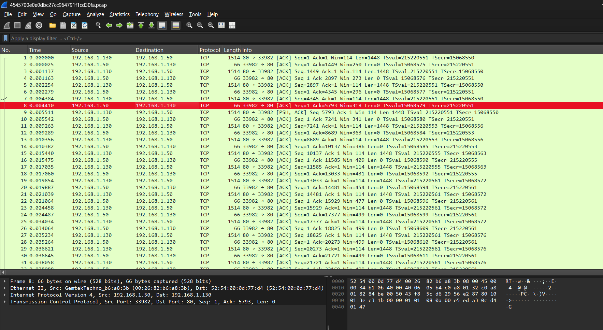
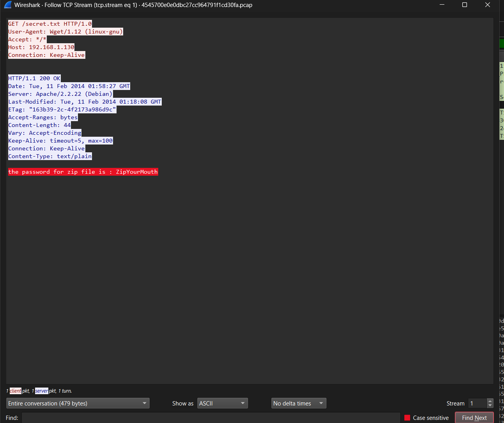
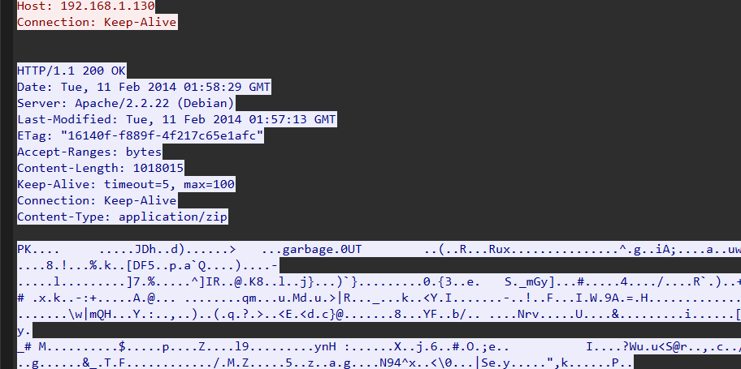

# Poor internet connection

## Challenge Details

- Category: Forensics
- Points: 4
- Validation: 446
- Author: Cedrick Chaput
- Status: Done
# Handout
`Poor Internet Connection`
https://ringzer0ctf.com/files/8d4ccebced1c7e68912ec01acc3ccf93.zip
## Walkthrough
Unzipping: 
```bash
$ unzip 8d4ccebced1c7e68912ec01acc3ccf93.zip
Archive:  8d4ccebced1c7e68912ec01acc3ccf93.zip
  inflating: 4545700e0e0dbc27cc964791f1cd30fa.pcap
```
Network capture, let's open it in wireshark:





I spot a lot of TCP packets, let's follow the tcp steams
Stream 1: 



`the password for zip file is : ZipYourMouth`
Hilarious. So now we have to look for the zip file itself which was transmitted.
That's in stream 2, let's just export it using http objects:


Woah, so the zip was broken into a lot of chunks, and judging by the challenge name, because of the 'poor connection', some chunks couldn't be downloaded! Let's simply concatenate all of these objects first and try to unzip it.. or better yet, I see a zipfile header `PK` in stream 2:




Foremost should be able to carve this out just fine.
```bash
$ foremost 4545700e0e0dbc27cc964791f1cd30fa.pcap
Processing: 4545700e0e0dbc27cc964791f1cd30fa.pcap
|foundat=flag.txtUT
foundat=garbage.0UT
*|
```
So the zipfile contains flag.txt and garbage.0UT. Let's try to extract directly:
```bash
$ unzip output/zip/00002159.zip
Archive:  output/zip/00002159.zip
error [output/zip/00002159.zip]:  missing 1017724 bytes in zipfile
  (attempting to process anyway)
error: invalid zip file with overlapped components (possible zip bomb)
```
That's expected, the garbage.0UT is probably messing with the extraction and has chunks missing, what if we just extract flag.txt?
```bash
$ unzip output/zip/00002159.zip flag.txt
Archive:  output/zip/00002159.zip
error [output/zip/00002159.zip]:  missing 1017724 bytes in zipfile
  (attempting to process anyway)
error: invalid zip file with overlapped components (possible zip bomb)
```
Still fails.. what if we extract it using the zipfile python package?
```python
import zipfile

brokenzip = zipfile.ZipFile("output/zip/00002159.zip")

#print(brokenzip.namelist())

flag = brokenzip.read("flag.txt", pwd=b"ZipYourMouth") # from tcp stream 1 flag.txt
print(flag.decode())
```

```bash
$ python3 solve.py
Flag-qscet5234diQ
```
And there it is!
# FLAG
Flag-qscet5234diQ
