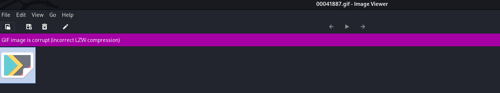
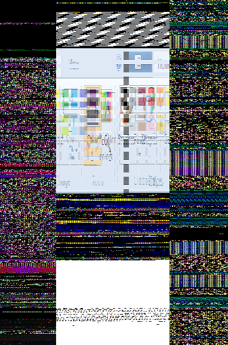
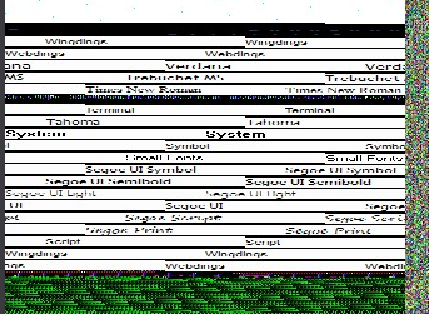
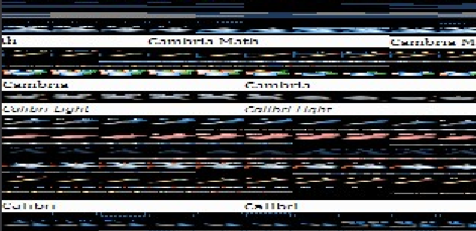
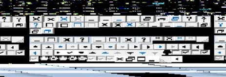
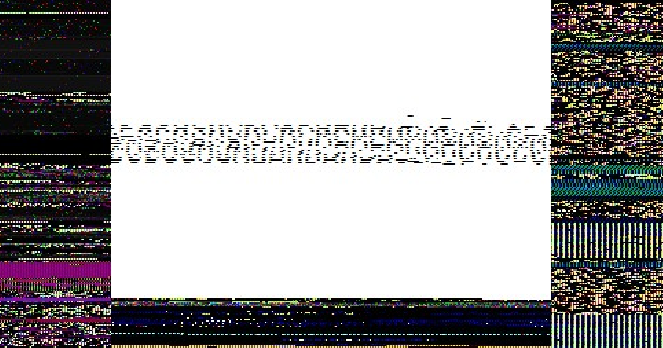
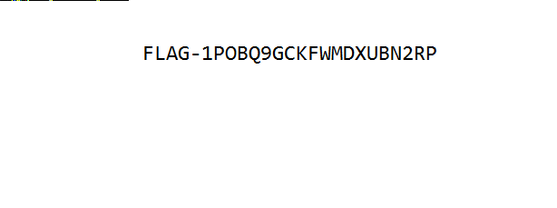

# R.I.P MsPaint

## Challenge Details

- Category: Forensics
- Points: 4
- Validation: 131
- Author: Misker
- Status: Done
# Handout
`R.I.P MsPaint`
https://ringzer0ctf.com/files/1fbf46d3f36c82b95ab2dadbf9e29a6c.zip
## Walkthrough
Let's unzip
```bash
$ unzip -l 1fbf46d3f36c82b95ab2dadbf9e29a6c.zip
Archive:  1fbf46d3f36c82b95ab2dadbf9e29a6c.zip
  Length      Date    Time    Name
---------  ---------- -----   ----
1073741824  2017-07-30 01:46   flagdump.r0
---------                     -------
1073741824                     1 file
```

Judging by that file size and the challenge name, we're probably dealing with a windows dumpfile and have to recover some ms paint document. Let's volatility it.

```bash
$ vol -f flagdump.r0 windows.info
Volatility 3 Framework 2.28.0
Progress:  100.00               PDB scanning finished
Variable        Value

Kernel Base     0xf80002801000
DTB     0x187000
Symbols file:///home/hyp3rnov4/.local/lib/python3.13/site-packages/volatility3/symbols/windows/ntkrnlmp.pdb/9E22A5947A15489895CE716436B45BE0-2.json.xz
Is64Bit True
IsPAE   False
layer_name      0 WindowsIntel32e
memory_layer    1 FileLayer
KdDebuggerDataBlock     0xf800029f20b0
NTBuildLab      7601.18798.amd64fre.win7sp1_gdr.
CSDVersion      1
KdVersionBlock  0xf800029f2068
Major/Minor     15.7601
MachineType     34404
KeNumberProcessors      1
SystemTime      2017-07-29 20:15:06+00:00
NtSystemRoot    C:\Windows
NtProductType   NtProductWinNt
NtMajorVersion  6
NtMinorVersion  1
PE MajorOperatingSystemVersion  6
PE MinorOperatingSystemVersion  1
PE Machine      34404
PE TimeDateStamp        Tue Mar 17 04:02:04 2015
```

Yup! It's a windows 7 memory dump. Let's start with the low hanging fruit: filescan, pstree, psscan, cmdline, consoles and cmdscan
```bash
$ vol -f flagdump.r0 windows.filescan > artifacts/files.txt && vol -f flagdump.r0 windows.pstree > artifacts/pstree.txt && vol -f flagdump.r0 windows.psscan > artifacts/psscan.txt && vol -f flagdump.r0 windows.cmdline > artifacts/cmdline.txt && vol -f flagdump.r0 windows.consoles && vol -f flagdump.r0 windows.cmdscan
```
I couldn't find any interesting files or commands executed, and vol couldn't find a conhost.exe process, but mspaint IS running with PID 2332:
```bash
* 2332	1380	mspaint.exe	0xfa8002b19060	6	137	1	False	2017-07-29 20:03:34.000000 UTC	N/A	\Device\HarddiskVolume2\Windows\System32\mspaint.exe	"C:\Windows\system32\mspaint.exe" 	C:\Windows\system32\mspaint.exe

```
Let's dump the process memory using memmap and look for more clues.
```bash
$ vol -f flagdump.r0 -o paint/ windows.memmap --pid 2332 --dump && ls paint/
pid.2332.dmp
```
Let's run foremost on this, if an image was there it might still be in memory, but the pixel data itself for the canvas would be raw, maybe we can get the paint canvas dimensions from here.
```bash
$ foremost -i paint/pid.2332.dmp -o carved/ && ls carved/
Processing: paint/pid.2332.dmp
|***|
audit.txt  gif  htm

$ cat carved/audit.txt
Foremost version 1.5.7 by Jesse Kornblum, Kris Kendall, and Nick Mikus
Audit File

Invocation: foremost -i paint/pid.2332.dmp -o carved/
Output directory: /mnt/d/CTF/ringzer0ctf/forensics/rip/carved
Configuration file: /etc/foremost.conf
------------------------------------------------------------------
File: paint/pid.2332.dmp
Length: 250 MB (262729728 bytes)

Num      Name (bs=512)         Size      File Offset     Comment

0:      00041887.gif          28 KB        21446424       (18759 x 14406)
1:      00113127.htm          257 B        57921403
2:      00113128.htm          253 B        57921755
3:      00113129.htm          277 B        57922107
4:      00113129_1.htm        233 B        57922491
5:      00113130.htm          258 B        57922827
6:      00113131.htm          255 B        57923179
7:      00113131_1.htm        269 B        57923531
8:      00113132.htm          256 B        57923899
9:      00113133.htm          233 B        57924251
10:     00113133_1.htm        250 B        57924587
11:     00113134.htm          247 B        57924939
12:     00113135.htm          269 B        57925291
13:     00113136.htm          236 B        57925659
14:     00113136_1.htm        253 B        57925995
15:     00113137.htm          238 B        57926347
16:     00113138.htm          251 B        57926683
17:     00113138_1.htm        222 B        57927035
18:     00113139.htm          219 B        57927355
19:     00113139_1.htm        248 B        57927675
20:     00113140.htm          253 B        57928027
21:     00113141.htm          249 B        57928379
22:     00113142.htm          281 B        57928731
23:     00113142_1.htm        241 B        57929115
24:     00113143.htm          246 B        57929451
25:     00113144.htm          231 B        57929803
26:     00113144_1.htm        233 B        57930139
27:     00113145.htm          218 B        57930475
28:     00113146.htm          163 B        57930827
29:     00394416.htm          206 B       201941439

30 FILES EXTRACTED

gif:= 1
htm:= 29
------------------------------------------------------------------

```
Great! It got a gif file! Let's verify
```bash
$ file carved/gif/*
carved/gif/00041887.gif: GIF image data, version 89a, 18759 x 14406
```


Hmm. That's interesting. The file doesn't open at all, and those dimensions are ludicrous. Let's try to view it in a hexeditor
```bash
$ xxd carved/gif/00041887.gif | head -n 10
00000000: 4749 4638 3961 4749 4638 3761 ffff ffff  GIF89aGIF87a....
00000010: ffff ffff ffff ffff ffff ffff 0000 7f43  ...............C
00000020: 02f4 7c55 041a d311 9a73 0000 f81e f32e  ..|U.....s......
00000030: 0000 0000 0000 0000 0000 0000 0000 0000  ................
00000040: 0000 0000 0000 0000 0000 0000 0000 0000  ................
00000050: 0000 0000 0000 0000 2045 4d46 0ad7 833f  ........ EMF...?
00000060: 0000 0000 0000 0000 0000 0000 0000 0000  ................
00000070: 0000 0000 0000 0000 0000 0000 0000 0000  ................
00000080: 0000 0000 0000 0000 ffff ffff abaa 2a3e  ..............*>
00000090: 03f4 7c55 041a d311 9a73 0000 f81e f32e  ..|U.....s......
```
This seems very wrong. Not only are there 2 different gif version file signatures present, there are also  `FF` bytes where they shouldn't be.
Let's verify the gif is fine:
```bash
$ giftext carved/gif/00041887.gif

carved/gif/00041887.gif:

        Screen Size - Width = 18759, Height = 14406.
        ColorResolution = 4, BitsPerPixel = 0, BackGround = 97, Aspect = 255.
        No Global Color Map.

GIF-LIB error: Wrong record type detected.

$ gifsicle --info carved/gif/00041887.gif
gifsicle:carved/gif/00041887.gif: read error: unknown block type 255 at file offset 13
gifsicle:carved/gif/00041887.gif: file not in GIF format
```
Well that's sad, this is a false carve. 
Let's try binwalk: output in `artifacts/binwalk.txt`

All the GIF and other bogus hits are to be expected. But there's a very promising hit:
```bash
0x5FFC054  PC bitmap, Windows 3.x format, 16 x 64 x 32
0x5FFD08A  PC bitmap, Windows 3.x format, 16 x 64 x 1
0x600508A  PC bitmap, Windows 3.x format, 16 x 192 x 1
0x6006054  PC bitmap, Windows 3.x format, 16 x 192 x 32
0x600908A  PC bitmap, Windows 3.x format, 16 x 192 x 1
0x600A054  PC bitmap, Windows 3.x format, 16 x 192 x 32
0x600D08A  PC bitmap, Windows 3.x format, 16 x 192 x 1
0x600E054  PC bitmap, Windows 3.x format, 16 x 576 x 32
0x601708A  PC bitmap, Windows 3.x format, 16 x 576 x 1
```
These bitmap images could be it! Why did foremost fail? Probably because these aren't complete files but colour headers.
I extracted all of them, but they're useless, seems to be they are random ui strips, no luck here. 
Let's just look for the the flag `flag` in mft resident data and normal strings.
```bash
vol.py -f flagdump.r0 windows.mftscan.ADS > artifacts/mftads.txt && vol.py -f flagdump.r0 windows.mftscan.MFTScan > artifacts/mftscan.txt && vol.py -f flagdump.r0 windows.mftscan.ResidentData > artifacts/mftresidential.txt && strings -a -el -td paint/pid.2332.dmp | grep -i "flag" -B 100 -A 100
100520236 C:\Program Files\Microsoft Games\Purble Place\PurblePlace.exe
100520364 {6D809377-6AF0-444B-8957-A3773F02200E}\Microsoft Games\Purble Place\PurblePlace.exe
100520562 {6D809377-6AF0-444B-8957-A3773F02200E}\Microsoft Games\Purble Place\PurblePlace.exe
100520791 C:\Program Files\Microsoft Games\SpiderSolitaire\spidersolitaire.exe
100520933 {6D809377-6AF0-444B-8957-A3773F02200E}\Microsoft Games\SpiderSolitaire\spidersolitaire.exe
100521145 {6D809377-6AF0-444B-8957-A3773F02200E}\Microsoft Games\SpiderSolitaire\spidersolitaire.exe
100521388 C:\Program Files\Microsoft Games\Mahjong\Mahjong.exe
100521498 {6D809377-6AF0-444B-8957-A3773F02200E}\Microsoft Games\Mahjong\Mahjong.exe
100521678 {6D809377-6AF0-444B-8957-A3773F02200E}\Microsoft Games\Mahjong\Mahjong.exe
100521889 C:\Program Files\Microsoft Games\More Games\MoreGames.dll
100522009 {6D809377-6AF0-444B-8957-A3773F02200E}\Microsoft Games\More Games\MoreGames.dll
100522199 {6D809377-6AF0-444B-8957-A3773F02200E}\Microsoft Games\More Games\MoreGames.dll
100522420 C:\Program Files\Microsoft Games\FreeCell\FreeCell.exe
100522534 {6D809377-6AF0-444B-8957-A3773F02200E}\Microsoft Games\FreeCell\FreeCell.exe
100522718 {6D809377-6AF0-444B-8957-A3773F02200E}\Microsoft Games\FreeCell\FreeCell.exe
100522933 C:\Program Files\Microsoft Games\Minesweeper\minesweeper.exe
100523059 {6D809377-6AF0-444B-8957-A3773F02200E}\Microsoft Games\Minesweeper\minesweeper.exe
100523255 {6D809377-6AF0-444B-8957-A3773F02200E}\Microsoft Games\Minesweeper\minesweeper.exe
100523482 C:\Program Files\Microsoft Games\Multiplayer\Spades\shvlzm.exe
100523612 {6D809377-6AF0-444B-8957-A3773F02200E}\Microsoft Games\Multiplayer\Spades\shvlzm.exe
100523812 {6D809377-6AF0-444B-8957-A3773F02200E}\Microsoft Games\Multiplayer\Spades\shvlzm.exe
100524043 C:\Program Files\Microsoft Games\Hearts\hearts.exe
100524149 {6D809377-6AF0-444B-8957-A3773F02200E}\Microsoft Games\Hearts\hearts.exe
100524325 {6D809377-6AF0-444B-8957-A3773F02200E}\Microsoft Games\Hearts\hearts.exe
100524532 C:\Program Files\Microsoft Games\Chess\chess.exe
100524634 {6D809377-6AF0-444B-8957-A3773F02200E}\Microsoft Games\Chess\chess.exe
100524806 {6D809377-6AF0-444B-8957-A3773F02200E}\Microsoft Games\Chess\chess.exe
100525009 C:\Program Files\Microsoft Games\Multiplayer\Backgammon\bckgzm.exe
100525147 {6D809377-6AF0-444B-8957-A3773F02200E}\Microsoft Games\Multiplayer\Backgammon\bckgzm.exe
100525355 {6D809377-6AF0-444B-8957-A3773F02200E}\Microsoft Games\Multiplayer\Backgammon\bckgzm.exe
100525627 TaskBar
100525722 Internet Explorer.lnk
100525766 @C:\Windows\System32\ie4uinit.exe,-731
100525862 C:\Program Files\Internet Explorer\iexplore.exe
100525962 Microsoft.InternetExplorer.Default
100526062 {6D809377-6AF0-444B-8957-A3773F02200E}\Internet Explorer\iexplore.exe
100526285 Windows Explorer.lnk
100526327 @shell32.dll,-22067
100526385 %windir%\explorer.exe
100526433 {F38BF404-1D43-42F2-9305-67DE0B28FC23}\explorer.exe
100526567 {F38BF404-1D43-42F2-9305-67DE0B28FC23}\explorer.exe
100526754 Windows Media Player.lnk
100526804 @C:\Windows\system32\unregmp2.exe,-4
100526896 %ProgramFiles(x86)%\Windows Media Player\wmplayer.exe
100527008 Microsoft.Windows.MediaPlayer32
100527072 /prefetch:1
100527124 {7C5A40EF-A0FB-4BFC-874A-C0F2E0B9FA8E}\Windows Media Player\wmplayer.exe
100533836 {0.0.0.00000000}.{0383d04e-bbed-428a-8d6e-7296b66118a2}|#%b{A9EF3FD9-4240-455E-A4D5-F2B3301887B2}
100535092 mo1seir
100535972 defaultroot://{S-1-5-21-3250965633-1025459530-2511060372-1000}/
100536380 file:///C:\
100536508 .bmp
100536518 .contact
100536536 .jnt
100536546 .library-ms
100536570 .lnk
100536580 .rtf
100536590 .txt
100536600 .zip
100536610 Briefcase
100536630 Folder
100537492 C:\Users\UMDCSEC\AppData\Local\Microsoft\Windows\Burn\Burn
100539044 Fax sent
100541860 @fxsresm.dll,-9109
100542028 Fax line rings
100542108 @fxsresm.dll,-9111
100542268 Fax error
100542332 @fxsresm.dll,-9110
100542492 %SystemRoot%\media\tada.wav
100542668 %SystemRoot%\media\Windows Ringin.wav
100542860 %SystemRoot%\media\ding.wav
100543236 Shell
100543340 Shell
100543468 Shell
100543500 NOTEPAD.EXE
100543916 flag.txt.txt
100544012 flag.txt.lnk
100544052 flag.txt.txt
100544148 flag.txt.lnk
100544188 :2017012320170130:
100544452 iecompat:
100546228 %APPDATA%\Microsoft\Windows\IECompatCache
100546612 iecompatua:
100546684 %APPDATA%\Microsoft\Windows\iecompatuaCache
100547988 DNTException:
100548060 %APPDATA%\Microsoft\Windows\DNTException
100548828 6.1.7601.17610
100548956 file:///C:\Users\UMDCSEC\Favorites\
100549164 iehistory://{S-1-5-21-3250965633-1025459530-2511060372-1000}/
100549660 en-US
100549732 iedownload:
100549804 %APPDATA%\Microsoft\Windows\IEDownloadHistory
100550660 Visited:
100550804 Cookie:
100552452 iecompat:
100552516 %APPDATA%\Microsoft\Windows\IECompatCache\Low
100552964 iecompatua:
100553036 %APPDATA%\Microsoft\Windows\iecompatuaCache\Low
100554868 Network
100555764 http://www.msn.com/en-ca/?ocid=iehp
100556932 {0633EE93-D776-472f-A0FF-E1416B8B2E3A}
100557836 Bing
100557908 http://www.bing.com/favicon.ico
100558036 http://www.bing.com/favicon.ico
100558156 http://www.bing.com/search?q={searchTerms}&src=IE-TopResult&FORM=IETR02
100558372 http://www.bing.com/search?q={searchTerms}&src=IE-TopResult&FORM=IETR02
100558556 http://www.bing.com/search?q={searchTerms}&src=IE-SearchBox&FORM=IESR02
100558788 http://api.bing.com/qsml.aspx?query={searchTerms}&maxwidth={ie:maxWidth}&rowheight={ie:rowHeight}&sectionHeight={ie:sectionHeight}&FORM=IESS02&market={language}
100559156 http://api.bing.com/qsml.aspx?query={searchTerms}&maxwidth={ie:maxWidth}&rowheight={ie:rowHeight}&sectionHeight={ie:sectionHeight}&FORM=IESS02&market={language}
100560096 AppData\
100560252 http://www.bing.com/search?q={searchTerms}&src=IE-SearchBox&FORM=IENTSR
100560444 http://www.bing.com/search?q={searchTerms}&src=IE-SearchBox&FORM=IENTTR
100560684 C:\Users\UMDCSEC\AppData\LocalLow\Microsoft\Internet Explorer\Services\
100560932 http://api.bing.com/qsml.aspx?query={searchTerms}&market={language}&maxwidth={ie:maxWidth}&rowheight={ie:rowHeight}&sectionHeight={ie:sectionHeight}&FORM=IENTSS
100561260 http://go.microsoft.com/fwlink/?LinkID=403856&language={language}&scale={scalelevel}&contrast={contrast}
100561604 DOMStore
100561668 %USERPROFILE%\AppData\LocalLow\Microsoft\Internet Explorer\DOMStore
100562156 REG_SZ
100562364 EmieSiteList:
100562436 %USERPROFILE%\AppData\Local\EmieSiteList
100562876 EmieUserList:
100562948 %USERPROFILE%\AppData\Local\EmieUserList
100563324 EmieBrowserModeList:
100563412 %USERPROFILE%\AppData\Local\EmieBrowserModeList
100563868 EmieSiteList:
100564268 %USERPROFILE%\AppData\LocalLow\EmieSiteList
100564364 REG_SZ
100564684 EmieUserList:
100564756 %USERPROFILE%\AppData\LocalLow\EmieUserList
100565172 EmieBrowserModeList:
100565260 %USERPROFILE%\AppData\LocalLow\EmieBrowserModeList
100565556 C:\Users\UMDCSEC\Favorites\Links\Suggested Sites.url
100567900 #ACBlob
100567944 {E8433B72-5842-4d43-8645-BC2C35960837}.notification.103.6-181781
100568252 #ACBlob
100568296 {E8433B72-5842-4d43-8645-BC2C35960837}.notification.100.1-181781
100568932 #ACBlob
100569252 #ACBlob
100569460 #ACBlob
100569972 #ACBlob
100570016 {01979c6a-42fa-414c-b8aa-eee2c8202018}.notification.0
100571708 {B622A022-1B0A-45ED-A3F9-97B7DC264EF6}
100572172 #ACBlob
100572804 Shell
100572916 Shell
100573308 DumpIt.zip
100573398 DumpIt.lnk
100573460 DumpIt.zip
100573550 DumpIt.lnk
100575329 NavPane_ShowLibraryPane
100575394 NavPane_FirstRun
100576492 en-US.1
100576572 README.txt
100576662 README.lnk
100576724 README.txt
100576814 README.lnk
100602916 http://technet.microsoft.com/en-us/sysinternals/bb897443
100603084 http://go.microsoft.com/fwlink/p/?LinkId=255141
100603612 SDelete.zip
100603704 SDelete.lnk
100603772 SDelete.zip
100603864 SDelete.lnk
100603988 Shell
100605644 VBOXADDITIONS_5.
100606100 Shell
100606444 Shell
100606604 Shell
100608516 {00000000-0000-0000-0000-000000000000}
100608940 DumpIt.exe
100609040 README.txt
100609138 flag.png
100609188 <BookmarkList>
100609220   <Bookmark Channel='Microsoft-Windows-WindowsBackup/ActionCenter' RecordId='5' IsCurrent='true'/>
100609420 </BookmarkList>
100609588 <BookmarkList>
100609620   <Bookmark Channel='Microsoft-Windows-WindowsUpdateClient/Operational' RecordId='81' IsCurrent='true'/>
100609832 </BookmarkList>
100610084 <BookmarkList>
100610116   <Bookmark Channel='Microsoft-Windows-Windows Defender/WHC' RecordId='24' IsCurrent='true'/>
```
AND THERE IT IS! A flag.png as well as a README.txt and flag.txt. The MFT ADS stream data confirms README.txt and DumpIT.exe have an origin zone 3 identifier, meaning they were downloaded from the interent, dumpit is the program used to create the memdump, judging by origin of README.txt, it's probably also not useful. Sadly MFT Resident Data only contains shortlinks and short file name artifacts for the flag files. But we know a few more paths:
```
 flag.txt.txt
 flag.lnk
 flag.txt.lnk
 FLAGTX~1.LNK
 C:\Users\UMDCSEC\Desktop\flag.png  
..\..\..\..\..\Desktop\flag.png  
\USERS\UMDCSEC\DESKTOP\FLAG.PNG
```
..\..\..\..\..\Desktop\flag.png   is interesting, could this be the contents of flag.txt.txt? We have no way to confirm because none of these were in the filescan.
Why didn't they get caught by filescan? Probably not a cached kernel file object. Why it didn't get caught by binwalk/foremost? Who knows (spoiler alert: we will soon)
At this point, I presume that paint had this flag.png open, it got removed somehow and is now no longer in the dump itself, but might exist in the paint canvas, but we need the image width, if we can even find the metadata for this flag.png, the challenge is as good as solved. Let's confirm this theory by looking at handles for the Paint process at 2332:
```bash
vol.py -f flagdump.r0 windows.handles --pid 2332 > artifacts/handles.txt && grep -Ei flag artifacts/handles.txt 
(no output)
```
The file is no longer there. 
Now that we know the file names, let's look for them again using strings.
```bash
$ strings -a -el -td paint/pid.2332.dmp | grep -Ei "flag\.txt|flag\.png|README\.txt"
1776716 C:\Users\UMDCSEC\Pictures\flag.png
100543916 flag.txt.txt
100544012 flag.txt.lnk
100544052 flag.txt.txt
100544148 flag.txt.lnk
100576572 README.txt
100576724 README.txt
100609040 README.txt
100609138 flag.png
100611556 C:\Users\UMDCSEC\Pictures\flag.png
100620710 flag.png
100620752 flag.png
100620846 C:\Users\UMDCSEC\Pictures\flag.png
100621742 flag.png
100621784 flag.png
100621878 C:\Users\UMDCSEC\Pictures\flag.png
100623404 flag.png
100623548 flag.png
100636472 README.txt
189115394 gmreadme.txt
189473200 flag.png
189473304 ..\..\..\..\..\Desktop\flag.png
189496914 gmreadme.txtZ
201934066 README.txt
202121570 README.txt
202121898 README.txt
204157482 flag.png
204163722 flag.txt.txt
204163946 README.txt
204177346 flag.txt.lnk
```
```bash
$ strings -a -td flagdump.r0 | grep -i "flag.png"
strings -a -el -td flagdump.r0 | grep -i "flag.png"
108454268 flag.png
108454387 C:\Users\UMDCSEC\Desktop\flag.png
289642866 flag.png
289643898 flag.png
290683966 flag.png
108454320 flag.png
108454424 ..\..\..\..\..\Desktop\flag.png
157227440 \USERS\UMDCSEC\DESKTOP\FLAG.PNG
164397610 flag.png
285979692 flag.png
285979836 flag.png
287016420 C:\Users\UMDCSEC\Pictures\flag.png
289642918 flag.png
289642960 flag.png
289643054 C:\Users\UMDCSEC\Pictures\flag.png
289643950 flag.png
289643992 flag.png
289644086 C:\Users\UMDCSEC\Pictures\flag.png
290684018 flag.png
807957366 \USERS\UMDCSEC\DESKTOP\FLAG.PNG
807957940  \USERS\UMDCSEC\PICTURES\FLAG.PNG
947821644 C:\Users\UMDCSEC\Pictures\flag.png
991786433 flag.png
```
`C:\Users\UMDCSEC\Pictures\flag.png` is probably it! At this point let's just foremost the main dump for png files.
```bash
foremost -t png -i flagdump.r0 -o png_foremost
Processing: flagdump.r0
|***********|
------------------------------------------------------------------
File: flagdump.r0
Length: 1024 MB (1073741824 bytes)

Num      Name (bs=512)         Size      File Offset     Comment

0:      00001121.png           2 KB          574384       (43 x 33)
1:      00015384.png           3 KB         7876672       (40 x 56)
2:      00078524.png          300 B        40204704       (16 x 16)
3:      00209536.png           3 KB       107282528       (20 x 41)
4:      00217104.png           2 KB       111157400       (238 x 33)
5:      00248464.png           2 KB       127213600       (3 x 21)
6:      00360432.png           2 KB       184541408       (73 x 91)
7:      00376336.png           2 KB       192684216       (111 x 35)
8:      00376341.png          136 B       192687088       (10 x 2)
9:      00376342.png          163 B       192687224       (20 x 20)
10:     00382516.png           1 KB       195848376       (24 x 24)
11:     00409605.png          288 B       209718160       (20 x 7)
12:     00409606.png          633 B       209718448       (5 x 115)
13:     00434177.png          379 B       222298840       (7 x 21)
14:     00434178.png          126 B       222299224       (3 x 1)
15:     00434178_1.png        621 B       222299352       (7 x 84)
16:     00434179.png          128 B       222299976       (1 x 6)
17:     00434179_1.png        178 B       222300104       (9 x 18)
18:     00434180.png          233 B       222300288       (11 x 20)
19:     00434180_1.png        270 B       222300528       (11 x 20)
20:     00434181.png          176 B       222300800       (11 x 20)
...


673:    00873466.png          134 B       447215020       (16 x 16)
674:    00900921.png          755 B       461271552       (32 x 32)
675:    00900922.png          828 B       461272312       (32 x 32)
676:    00900924.png          829 B       461273144       (32 x 32)
677:    00940306.png           6 KB       481436716       (47 x 48)
678:    01541768.png          621 B       789385304       (16 x 16)
679:    01541769.png          622 B       789385928       (16 x 16)
680:    01541770.png          587 B       789386552       (16 x 16)
681:    01571552.png           3 KB       804634816       (285 x 227)
682:    01639809.png           3 KB       839582600       (238 x 63)
683:    01682923.png           1 KB       861656688       (256 x 256)
684:    01691105.png           1 KB       865846080       (256 x 256)
685:    01728920.png           2 KB       885207208       (385 x 50)
686:    01807024.png           3 KB       925196480       (578 x 75)
687:    01870915.png          23 KB       957908792       (256 x 256)
688:    01905188.png          145 B       975456744       (2 x 2)

689 FILES EXTRACTED

png:= 689
------------------------------------------------------------------


```
Surprisingly enough, I went through each and every one of these manually, and none of them contained the flag. flag.png might have been deleted or just not in the memory when the dump was made. That's unfortunate. At this point I dumped using foremost all bmp, jpg png files from the main dump and analyzed them, and no flag either.
If we can't find the image width for flag.png it's going to be near impossible to proceed.
At this point I was rummaging for solutions. I tried:
```text
shimcache    
amcache
thumbcache
prefetch files
manually IEND header lookup extraction
timeliner
volatility gui based plugins to reconstruct an ss of the current screen: desktops, deskscan, workstation
vadinfo and vadregexscan for flag.png in the 2332 pid dump
```
The highest hopes I had were for thumbcache, if it contained a thumbnail for flag.png we would be done. So I extracted all of them, thankfully these were documented by filescan so I knew their offsets, I dumped them and ran foremost:
```bash
$ for x in  0x3de88910 0x3de88bb0 0x3de89290 0x3de89890 0x3de899e0 0x3de89f20; do  python3 volatility3/vol.py -f pain/flagdump.r0 -o thumbs/dumps/
windows.dumpfiles --physaddr "$x"; done
Volatility 3 Framework 2.28.1
Progress:  100.00               PDB scanning finished
Cache   FileObject      FileName        Result

Volatility 3 Framework 2.28.1
Progress:  100.00               PDB scanning finished
Cache   FileObject      FileName        Result

Volatility 3 Framework 2.28.1
Progress:  100.00               PDB scanning finished
Cache   FileObject      FileName        Result

DataSectionObject       0x3de89290      thumbcache_96.db        file.0x3de89290.0xfa8002c8b010.DataSectionObject.thumbcache_96.db.dat
Volatility 3 Framework 2.28.1
Progress:  100.00               PDB scanning finished
Cache   FileObject      FileName        Result

DataSectionObject       0x3de89890      thumbcache_32.db        file.0x3de89890.0xfa8002c89730.DataSectionObject.thumbcache_32.db.dat
Volatility 3 Framework 2.28.1
Progress:  100.00               PDB scanning finished
Cache   FileObject      FileName        Result

DataSectionObject       0x3de899e0      thumbcache_256.db       file.0x3de899e0.0xfa8002c874e0.DataSectionObject.thumbcache_256.db.dat
Volatility 3 Framework 2.28.1
Progress:  100.00               PDB scanning finished
Cache   FileObject      FileName        Result

$ i=0; for f in thumbs/dumps/*.dat; do foremost -i "$f" -o "thumbs/out_$i"; i=$((i+1)); done
```
These images were absolutely useless, some thumbnails seemed corrupted, and I tried fixing them using a hexeditor, imagemagick and pngcheck/relevant tool but I couldn't get anything other than standard windows thumbnails.
Let's just look at the raw image data once, colour mode could be brga or rgb, let's try bgra for now, and a random 600 width just to test the waters:


This is the raw memory data represented as a 32 bit image, obviously it doesn't make sense because we don't know the width, but playing around with the dimensions I found a few things:

A close recovery of the paint ui at width 272, and the text below seems like our flag in the paint canvas!
Also found other items such as:



this is the closest to the flag  I could get by eyeballing, but this won't work, I can't manually brute all possible widths from 50 to 1000. 
Interestingly at widths of `2**x`, like 512, a lot of data seemed symmetrical, this is probably unrelated system memory.

So now the challenge is getting the right width, we have already tried everything we could to get the metadata directly, but since in this image I can see the approximate offset of our flag in memory, we could extract the WHITE region data, and brute dimensions directly from there, and run OCR on all of them.
Probable flag offset location from the image: `off=0xb0f0000`
Let's extract this portion. Also, we'll use BRGA as in the playing around it got me the best looking outputs.
```bash
$ python3 finalflagformation.py
please be done
```
Flipping through the outputs manually once in ristretto (didn't want to brute ocr, as the images might have been flipped) I immediately spotted a very beautiful image, with width 614 :)

What a challenge. I created a video for the final step using video.py:

# FLAG




