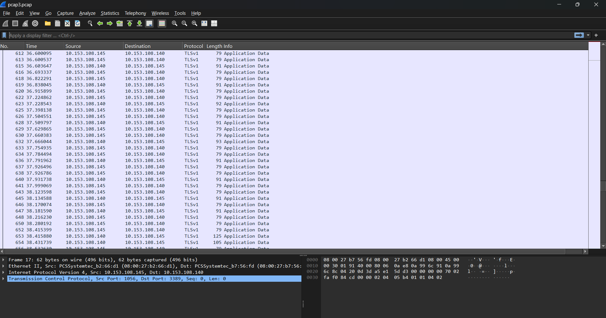
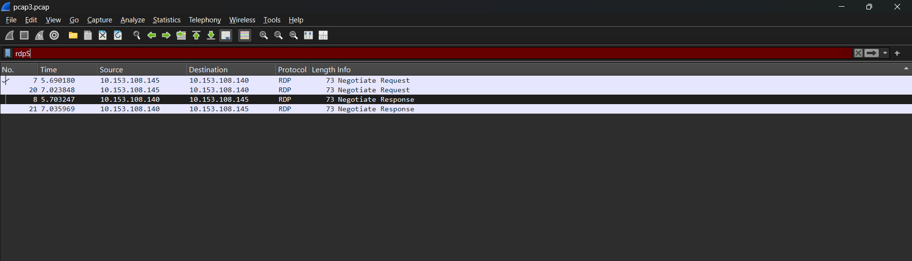
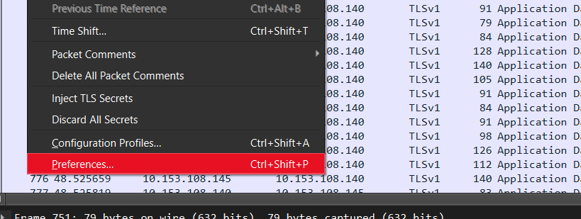
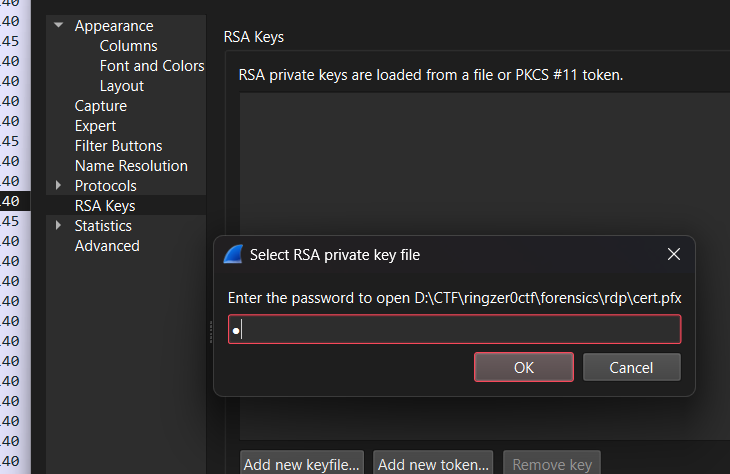
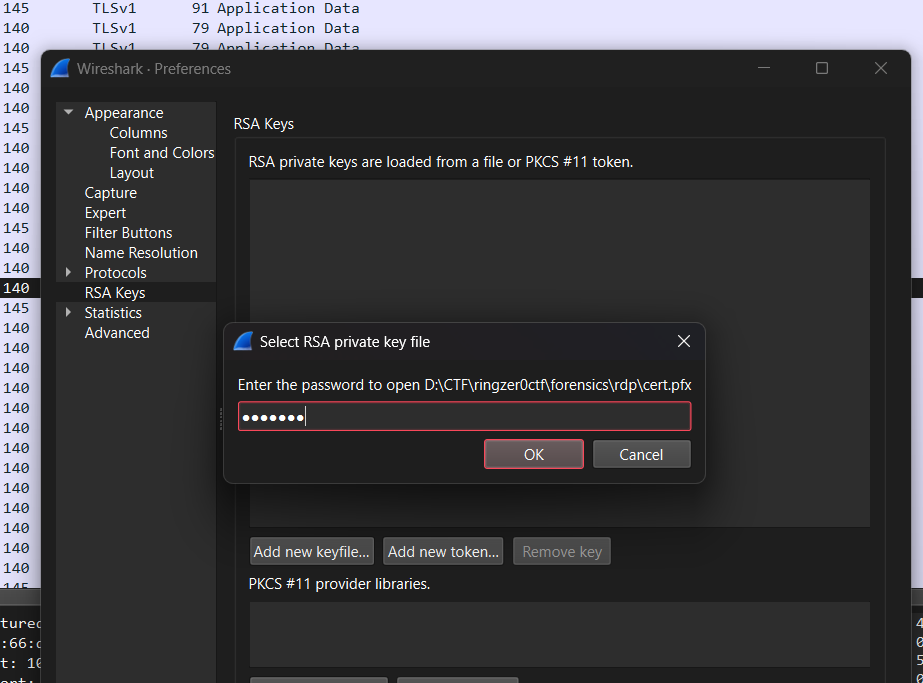
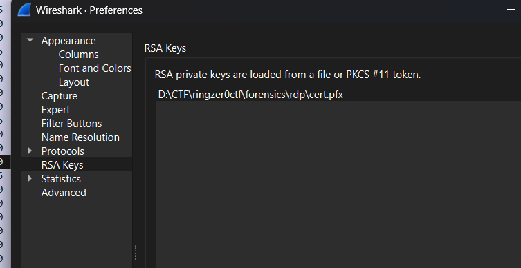
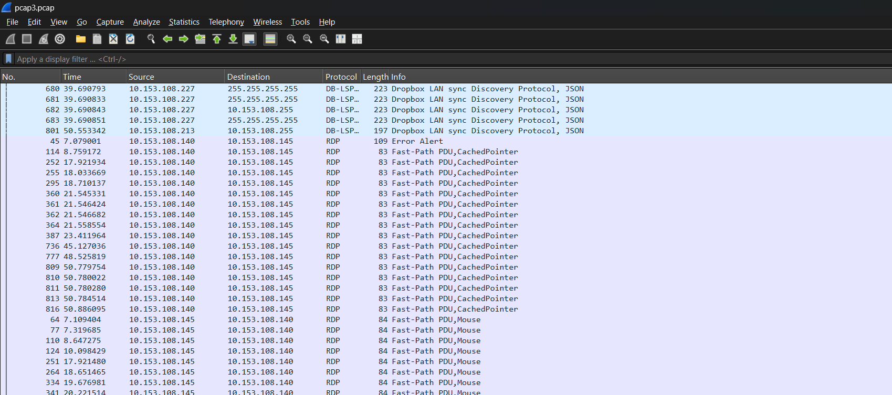
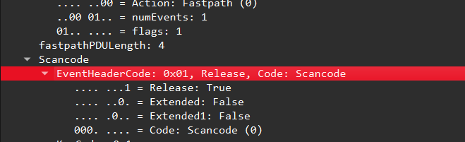

# Really Depressed Protocol

## Challenge Details

- Category: Forensics
- Points: 7
- Validation: 92
- Author: SynneR
- Status: Todo
# Handout
`Really Depressed Protocol`
https://ringzer0ctf.com/files/69b937a4cdcd4a5c4d9bb1d6b7ff800b.zip
## Walkthrough
Immediately we can see the moniker **R**eally **D**epressed **P**rotocol, that's supposed to spelll RDP, my initial guess is we are dealing with a dump file, which had some rdp session, and we have to reconstruct the flag from rdp cache bmp images, ofcourse it could be simple logs, but this being a 7 point forensics challenge it makes sense.
Let's unzip:
```bash
$ unzip 69b937a4cdcd4a5c4d9bb1d6b7ff800b.zip
Archive:  69b937a4cdcd4a5c4d9bb1d6b7ff800b.zip
  inflating: cert.pfx
  inflating: pcap3.pcap
```
Woah it's not a dump file, still rdp suggests we are looking at traffic over the rdp protocol, we are given a cert.pfx, and a network capture, opening it in wireshark I can see encrypted TLS packets.



Interestingly there are a few RDP packets as well:



We might see more later.
Given a pfx certificate file, it's probably the one used for the encrypted tls communication. We should try to decode the TLS packets. It doesn't work for decrypting ephermal diffie hellman exchange packets(tlsv1.2 and tlsv1.3 directly), but here we are in luck as it's using TLSv1. 
Let's setup this as a decong preference RSA key for TLS.

 



Why does it need a password?
Looking online, pfx is an encrypted pkcs container, the keys are encrypted and must be decrypted themselves for them to be able to decrypt tls packets. 
Let's use jtr on this.
```bash
$ pfx2john cert.pfx > pfx.hash && john pfx.hash --wordlist=~/wordlists/rockyou.txt
Using default input encoding: UTF-8
Loaded 1 password hash (pfx, (.pfx, .p12) [PKCS#12 PBE (SHA1/SHA2) 256/256 AVX2 8x])
Cost 1 (iteration count) is 2000 for all loaded hashes
Cost 2 (mac-type [1:SHA1 224:SHA224 256:SHA256 384:SHA384 512:SHA512]) is 1 for all loaded hashes
Will run 20 OpenMP threads
Press 'q' or Ctrl-C to abort, almost any other key for status
secret           (cert.pfx)
1g 0:00:00:00 DONE (2026-06-01 17:36) 20.00g/s 102400p/s 102400c/s 102400C/s 123456..allison1
Use the "--show" option to display all of the cracked passwords reliably
Session completed
```
Anticlimactic. Using this cracked top secret: `secret`; we can decrypt the tls packets in wireshark:







And now we have all the packets decrypted!
Let's try to analyse the packets themselves what we can find here. I've done challenges where you had to extract usbhiddata from a usb mouse and draw that for the flag, and one where usb hiddate encoded keystrokes from a usb keyboard, could we be looking at something similar? Maybe we can construct our own rdp-cache like artifact?
Let's see the rdp packets for initial recon.
Communication between `10.153.108.145` and `10.153.108.140`
`10.153.108.145` uses port 1056 
 `10.153.108.140` uses port 3389
 As 3389 is the default port for rdp, it's safe to assume this is our host machine, and `10.153.108.145` is the one with remote access.
 Knowing this, packets from `10.153.108.140` should contain mainly bitmap reconstructions of the desktop and `10.153.108.145` packets should contain mouse and keyboard input data, as `PDU`, `fastpath` or `slowpath` data. Scrolling through I immediately noticed the most obvious path here, keystrokes, RDP uses the `Scancode` header for this communication, where `KeyCode` contains the byte containing the keystroke itself. If this fails, we might have to draw mouse movements from `Mouse` headers or a make a bmp reconstruction from the packets from `10.153.108.140`

 

 We can extract these and assign them to a mapping online to decode what keys were pressed. 
 I found: https://sources.debian.org/src/xrdp/0.9.1-9%2Bdeb9u3/xrdp/rdp-scan-codes.txt
 I extracted all the packets as json, then wrote a parser to extract just the `KeyCode` values and assign them according to this mapping: 
 ```python
 import json

PATH = "packets.json"

KEYS = {
    0x01: "<ESC>", 0x0e: "<BACKSPACE>", 0x0f: "\t", 0x1c: "\n",
    0x1d: "<CTRL>", 0x38: "<ALT>", 0x39: " ",

    0x02: "1", 0x03: "2", 0x04: "3", 0x05: "4", 0x06: "5",
    0x07: "6", 0x08: "7", 0x09: "8", 0x0a: "9", 0x0b: "0",
    0x0c: "-", 0x0d: "=",

    0x10: "q", 0x11: "w", 0x12: "e", 0x13: "r", 0x14: "t",
    0x15: "y", 0x16: "u", 0x17: "i", 0x18: "o", 0x19: "p",
    0x1a: "[", 0x1b: "]",

    0x1e: "a", 0x1f: "s", 0x20: "d", 0x21: "f", 0x22: "g",
    0x23: "h", 0x24: "j", 0x25: "k", 0x26: "l",
    0x27: ";", 0x28: "'", 0x29: "`",

    0x2b: "\\", 0x2c: "z", 0x2d: "x", 0x2e: "c", 0x2f: "v",
    0x30: "b", 0x31: "n", 0x32: "m",
    0x33: ",", 0x34: ".", 0x35: "/",

    0x47: "<HOME>", 0x48: "<UP>", 0x49: "<PGUP>",
    0x4b: "<LEFT>", 0x4d: "<RIGHT>",
    0x4f: "<END>", 0x50: "<DOWN>", 0x51: "<PGDN>",
    0x52: "<INS>", 0x53: "<DEL>",
}

SHIFTED = {
    "1": "!", "2": "@", "3": "#", "4": "$", "5": "%",
    "6": "^", "7": "&", "8": "*", "9": "(", "0": ")",
    "-": "_", "=": "+", "[": "{", "]": "}", "\\": "|",
    ";": ":", "'": '"', "`": "~", ",": "<", ".": ">", "/": "?",
}

talkings = []
shift = False

def walk(x):
    global shift

    if type(x) == dict:
        if "rdp.fastpath.scancode.keycode" in x:
            code = int(x["rdp.fastpath.scancode.keycode"], 16)
            release = x["rdp.fastpath.eventheader_tree"]["rdp.fastpath.scancode.release"] == "1"

            if code in (0x2a, 0x36):
                shift = not release
            elif not release:
                ch = KEYS.get(code, f"<{code:02x}>")

                if shift:
                    ch = SHIFTED.get(ch, ch.upper() if len(ch) == 1 else ch)

                if ch == "<BACKSPACE>":
                    if talkings:
                        talkings.pop()
                else:
                    talkings.append(ch)

        for v in x.values():
            walk(v)

    elif type(x) == list:
        for v in x:
            walk(v)

walk(json.load(open(PATH)))
print("".join(talkings))
 ```
Let's run it:
```bash
$ python3 solve.py > keystrokes.txt && cat keystrokes.txt
administrator   setecastronomy<RIGHT><RIGHT><RIGHT><RIGHT><RIGHT><RIGHT><RIGHT><RIGHT><RIGHT><RIGHT><RIGHT><RIGHT><RIGHT><RIGHT><RIGHT><RIGHT><RIGHT>


the name of the flag is the inventor of this:

<UP><UP><DOWN><DOWN><LEFT><RIGHT><LEFT><RIGHT>abab<ALT>         <ALT>
```
Woah. So we have
a probable login username: administrator with password: setecastronomy
and that the "name of the flag" is the in inventor of the Konami Code!
A quick google search tells us that konami code was invented by (if you didn't know that already) Kazuhisa Hashimoto, for the game Gradius.
kazuhisahashimoto
Interestingly, setecastronomy is a reference to setec astronomy from ready player 1 (which in of itself is a reference to the movie sneakers: `too many secrets`)
# FLAG
