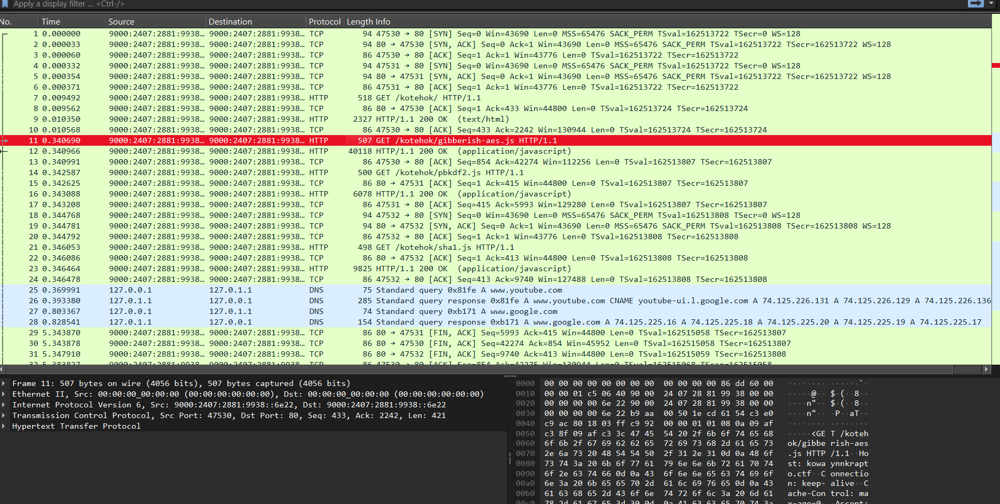
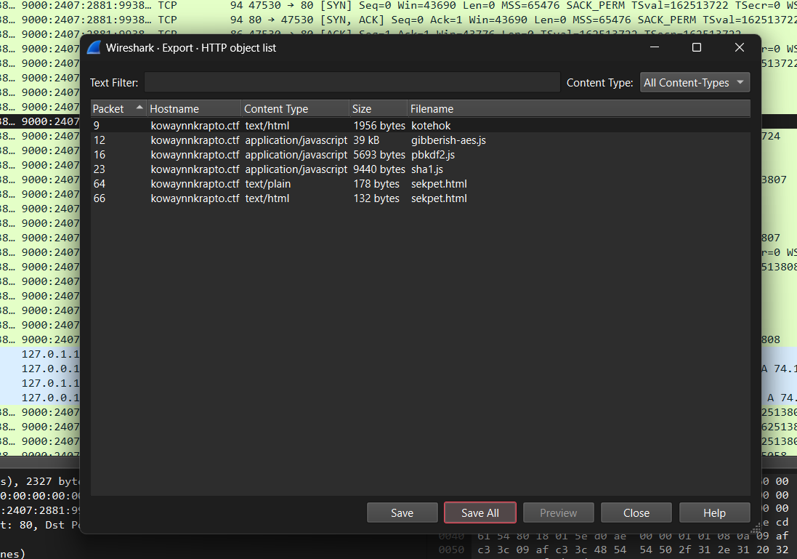
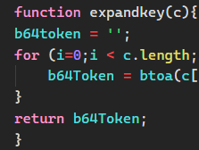
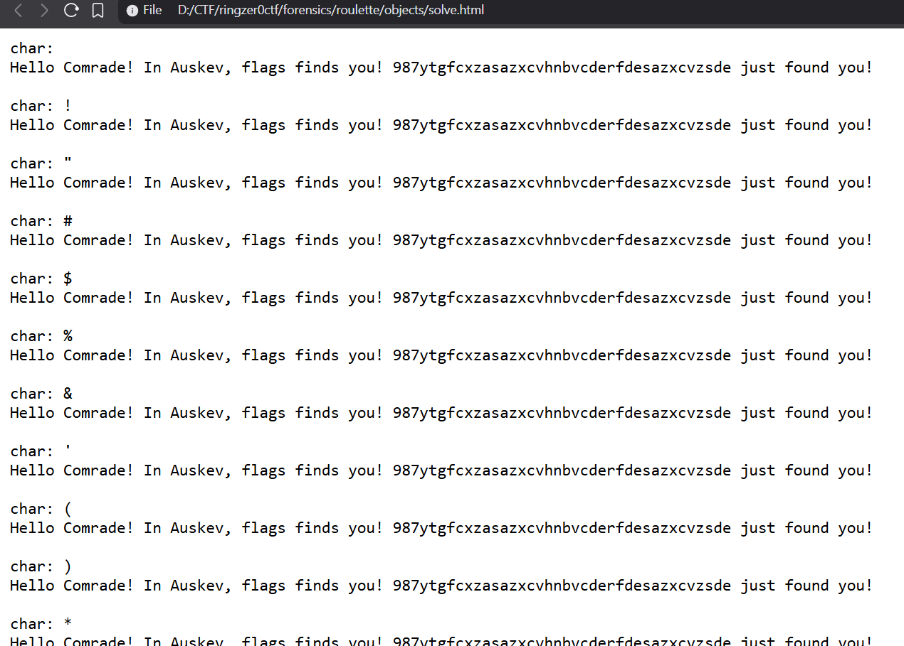

# Russian Crypto Roulette

## Challenge Details

- Category: Forensics
- Points: 6
- Validation: 92
- Author: SynneR
- Status: Done
# Handout
`Russian crypto roulette`
https://ringzer0ctf.com/files/1c124e52408b4d14e9a996b27a9a188f.zip
## Walkthrough
Unzipping:
```bash
$ unzip 1c124e52408b4d14e9a996b27a9a188f.zip
Archive:  1c124e52408b4d14e9a996b27a9a188f.zip
  inflating: c36a9389df435dfd7e4a0a86d3155424.pcap
```
Network capture, let's open it in wireshark:



I spot a few http and tcp packets, let's start by exporting http objects:



Opening `kotehok`, I found the main logic:
```html
<html>
<META http-equiv="content-type" content="text/html; charset=UTF-8">
<script src='./gibberish-aes.js'></script>
<script src='./pbkdf2.js'></script>
<script src='./sha1.js'></script>
<script>
function expandkey(c){
b64token = '';
for (i=0;i < c.length;i++){
	b64Token = btoa(c[i]) + b64token;
}
return b64Token;
}

function doIt() {
x = Crypto.key1.value;
if (x.length < 300) {
	alert("Ваш ключ слишком мал. Перейти больше или идти домой");
} else {
y = expandkey(x);
pbkdf2 = new PBKDF2(y, "NaCl", 1000, 16)
msg = Crypto.plaintext.value;
CT = GibberishAES.enc(msg,pbkdf2);
console.log(CT);
xmlhttp = new XMLHttpRequest();
var url = "http://kowaynnkrapto.ctf/kotehok/sekpet.html";
var params = "var="+CT;
xmlhttp.open("POST", url, true);
xmlhttp.send(params);
}
}

//doIt();
</script>
<body bgcolor='red'><font color='yellow'>
<h1>криптографски котка</h1>
<div>Кошка является тайным. секреты хороши. Кошка держит тайны. Секреты хороши. Пожалуйста, введите ключ и кошка будет шифровать. Очень секрет. Многое ничего себе. Очень кошачий криптография
</div>
<div>
<form name='Crypto'>
<label>пожалуйста, введите свой ключ здесь</label><input type='password' id='key1' name='key1' ></input><br />
<label>Введите ваш секрет здесь</label><textarea rows='20' cols='50' id='text' name='plaintext' ></textarea><br />
<input type='button' value='узнайте' onclick='doIt()' />
</form>
</div>
<div>Спокойная музыка, чтобы помочь вам сконцентрироваться  <iframe width="560" height="315" src="http://www.youtube.com/embed/ocW3fBqPQkU?autoplay=1" frameborder="0"></iframe></div>
</font></body>
</html>

```
Why is there russian :skull:
The page asks the user for a key and plaintext, encrypts the plaintext using AES, then sends the ciphertext to:
```
http://kowaynnkrapto.ctf/kotehok/sekpet.html
```
Interestingly, it rejects the key if it's less than 300 characters.. however



Why is it using b64token AND b64Token, what. That's hilarious. b64token is always empty! Each iteration overwrites b64Token with the current char in b64. The entire encryption is stupidly redundant: expandkey('helloworld') would return b64 of d! We can just brute the last letter for the encryption. We can get the ciphertext from sekpet.html:
```html
var=U2FsdGVkX18Mh114rFHq+vbhlQzYkcj41H6RQVW0BkKynMKl3pUrRvZosjANhTN9/ZtpPAa0DvEZNOelr7RJBTmgh9tm9GRFwQAhgNQBe2W+69Bl8KFD1DNQ442VDBmtEAWe8KyMgPf6Riycpz/oHQhNbGyHWu0bW6uVdJ7P5Fo=
```
We can just use the existing libraries and brute in the browser itself.
```html
<html>
<head>
<script src="./gibberish-aes.js"></script>
<script src="./pbkdf2.js"></script>
<script src="./sha1.js"></script>
</head>

<body>
<pre id="out"></pre>

<script>
CT = "U2FsdGVkX18Mh114rFHq+vbhlQzYkcj41H6RQVW0BkKynMKl3pUrRvZosjANhTN9/ZtpPAa0DvEZNOelr7RJBTmgh9tm9GRFwQAhgNQBe2W+69Bl8KFD1DNQ442VDBmtEAWe8KyMgPf6Riycpz/oHQhNbGyHWu0bW6uVdJ7P5Fo=";

function expandkey(c){
    b64token = '';
    for(i = 0; i < c.length; i++){
        b64Token = btoa(c[i]) + b64token;
    }
    return b64Token;
}

CT = decodeURIComponent(CT);

out = "";

for(code = 32; code < 127; code++){
    ch = String.fromCharCode(code);

    fakekey = "A".repeat(299) + ch;

    y = expandkey(fakekey);
    key = new PBKDF2(y, "NaCl", 1000, 16);

    try{
        pt = GibberishAES.dec(CT, key);

        if(pt){
            out += "char: " + ch + "\n";
            out += pt + "\n\n";
        }
    }catch(e){}
}

document.getElementById("out").textContent = out;
</script>
</body>
</html>
```



Wait we got the flag.. but for all last characters??? Were the other js scripts also catastrophically broken???? What an exercise in challenge building.
# FLAG
987ytgfcxzasazxcvhnbvcderfdesazxcvzsde
