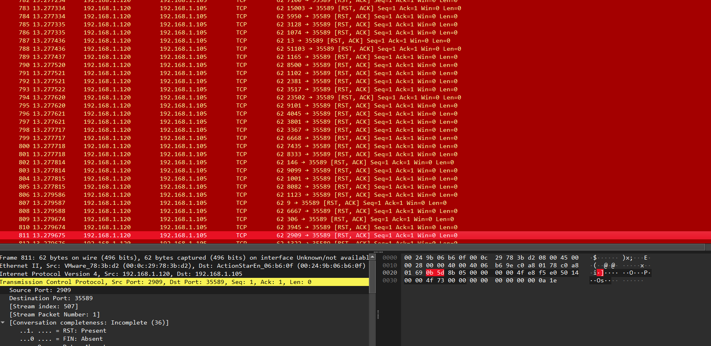
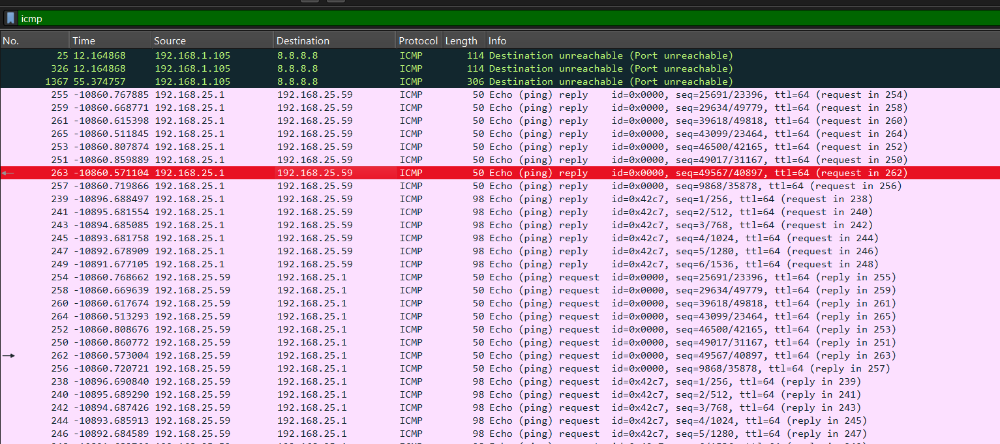
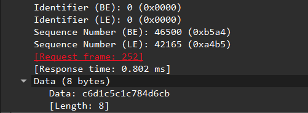

# Someone steal my flag again

## Challenge Details

- Category: Forensics
- Points: 5
- Validation: 206
- Author: GoSec CTF 2014
- Status: Todo
# Handout
`Someone steal my flag; Find the flag.`
https://ringzer0ctf.com/files/2a3a751a5785ac4f1daa4c27c1ff00aa.zip
## Walkthrough
Unzipping:
```bash
$ unzip 2a3a751a5785ac4f1daa4c27c1ff00aa.zip
Archive:  2a3a751a5785ac4f1daa4c27c1ff00aa.zip
  inflating: stealed_8670c3ef00baa6aba581cab446d456ab.pcap
```
A network capture, let's open it in wireshark.



1000+ tcp streams, all originating from randomish ports, mostly empty, so probably has something to do with the packet metadata, like the ports, or tcp checksum.
We will extract the tcp ports, but first let's look at capinfos:
```
$ capinfos stealed_8670c3ef00baa6aba581cab446d456ab.pcap
File name:           stealed_8670c3ef00baa6aba581cab446d456ab.pcap
File type:           Wireshark/... - pcapng
File encapsulation:  Ethernet
File timestamp precision:  microseconds (6)
Packet size limit:   file hdr: (not set)
Number of packets:   1,468
File size:           176 kB
Data size:           126 kB
Capture duration:    10982.390583 seconds
Earliest packet time: 2014-09-02 21:01:20.095020
Latest packet time:   2014-09-03 00:04:22.485603
Data byte rate:      11 bytes/s
Data bit rate:       92 bits/s
Average packet size: 86.40 bytes
Average packet rate: 0 packets/s
SHA256:              c5927261413ca7eaa77acfeaaecc821cb9404e5e5103b157bdf0fb0b62b3d3b2
SHA1:                cc0cc8075723f161168fed186cb5843337c96fd8
Strict time order:   False
Capture application: mergecap
Capture comment:     File created by merging:  File1: second.pcap.pcapng  File2: first.pcap.pcapng  File3: icmp.pcap  File4: last.pcap.pcapng
Number of interfaces in file: 1
Interface #0 info:
                     Name = Unknown/not available in original file format(libpcap)
                     Encapsulation = Ethernet (1 - ether)
                     Capture length = 65535
                     Time precision = microseconds (6)
                     Time ticks per second = 1000000
                     Time resolution = 0x06
                     Number of stat entries = 0
                     Number of packets = 1468

```

So it was made by merging 4 files, total 1,468 packets. 
Let's extract all source tcp ports:
```bash
$ tshark -r stealed_8670c3ef00baa6aba581cab446d456ab.pcap -Y "tcp" -T fields -e tcp.srcport > ports.txt
```
Stripping all the common (80, 443) ports, i thought we are dealing with something like a mod26 / mod37 type cipher, however i was unable to get anything meaningful here.
Let's look at the ping data then?



Each packet ping reply packet contains 8 bytes of ping data, let's extract this



What the hell is that sequence number. Why is there so many random info in this challenge
```bash
$ tshark -r stealed_8670c3ef00baa6aba581cab446d456ab.pcap   -Y "icmp.type == 0 && data.data"   -T fields  -e data.data | uniq
101112131415161718191a1b1c1d1e1f202122232425262728292a2b2c2d2e2f3031323334353637
eb11d60a9f10cc59
c6d1c5c1c784d6cb
0a3d0d3f01351032
47e007ac60c067cb
5ef640f14b8842f2
d8f2ab8bad80e0ad
f7d395ae93d0a9e6
986b986b9817ed03
```

The first response is the common ping request, we can ignore that, but the rest also do not decode nicely, maybe we have to sort based on the sequence number, but that again wouldn't magically decode into plaintext, and I don't see any file headers here either..

# FLAG
