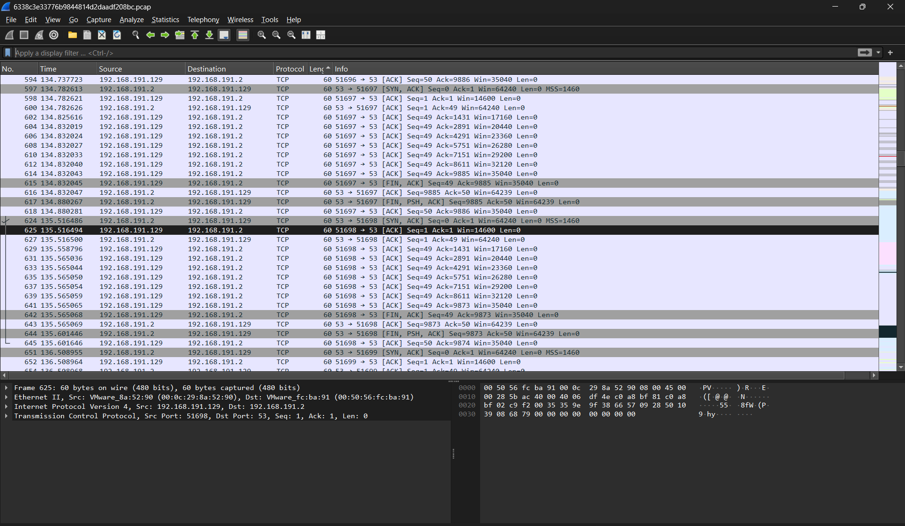
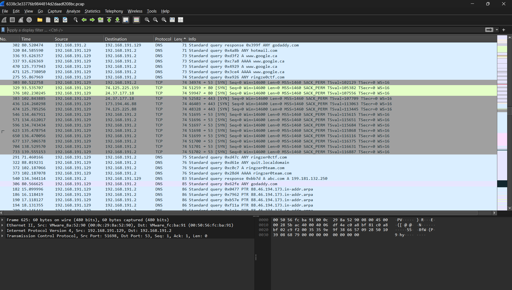
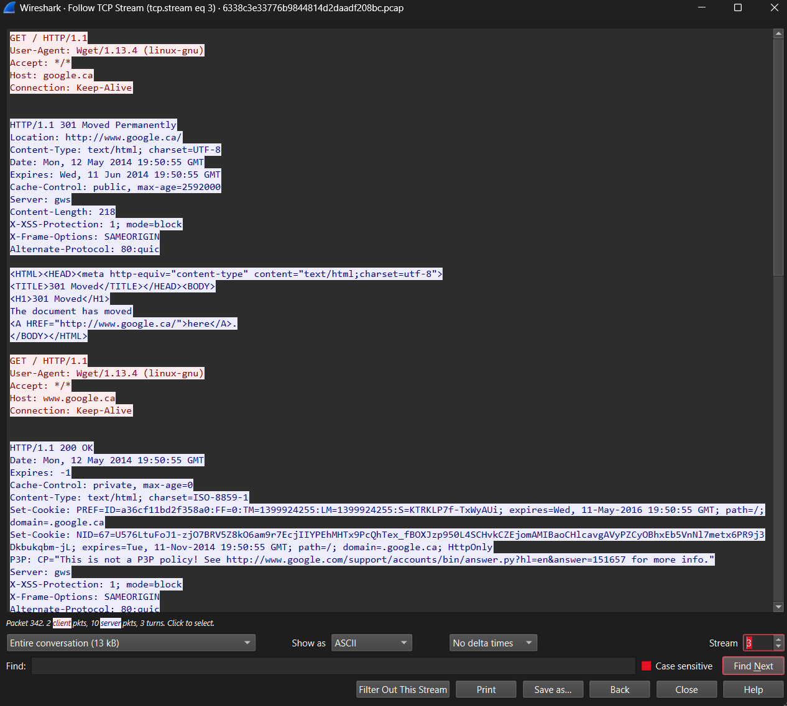
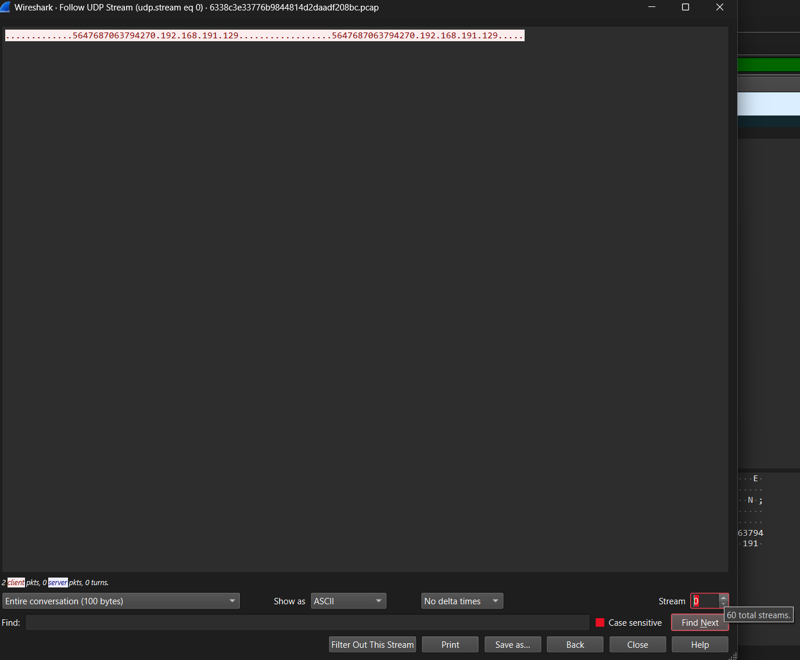
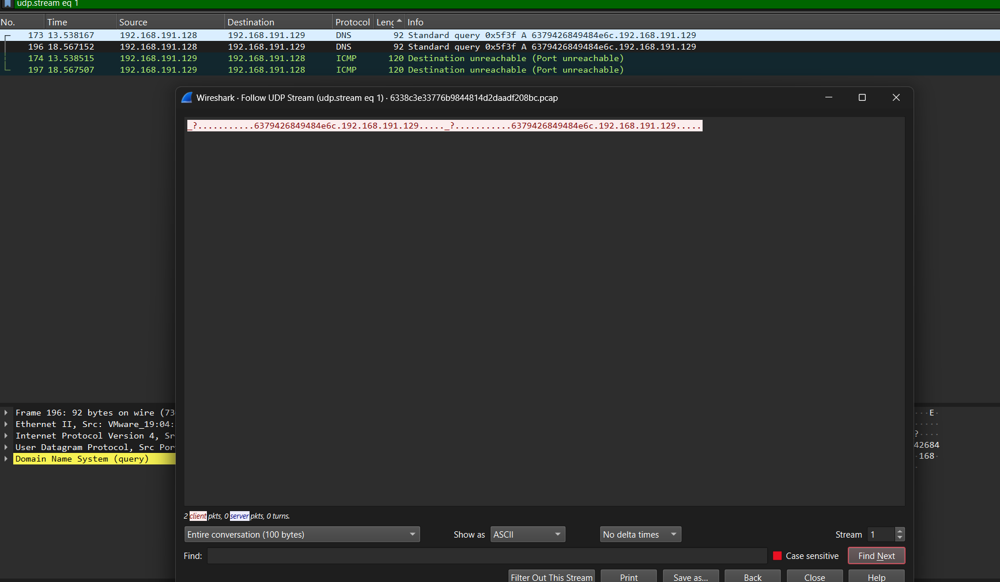

# Someone steal my flag!

## Challenge Details

- Category: Forensics
- Points: 3
- Validation: 526
- Author: Mr.Un1k0d3r
- Status: Done
# Handout
`Someone steal my flag!`
https://ringzer0ctf.com/files/bdc8c86f1c082715762b4d9cb755c4c7.zip
## Walkthrough
Unzipping:
```bash
$ unzip bdc8c86f1c082715762b4d9cb755c4c7.zip
Archive:  bdc8c86f1c082715762b4d9cb755c4c7.zip
  inflating: 6338c3e33776b9844814d2daadf208bc.pcap
```
Network capture! Let's open it in wireshark


There are a lot of TCP, DNS, SSH, ICMP packets. Let's first just look at the TCP and UDP streams to look for anything.

A total of 16 tcp streams, the end few contained a lot many random domains, maybe we have to use the domain names and perform an acrostic extraction or something similar? Let's also take a look at the udp streams and then come back to the domains.

There are 60 udp streams, and in the very first one: stream 0, we see a dns query to a suspicious location: 5647687063794270.192.168.191.129
5647687063794270 is almost certainly ascii encodings for text
```bash
$ echo 5647687063794270 | xxd -p -r
VGhpcyBp
```
decoding gives us `VGhpcyBp`, which seems like base64, let's decode that as well:
```bash
$ echo 5647687063794270 | xxd -p -r | base64 -di
This i
```
This is the right path! But the message is incomplete, maybe there are more such queries? 


And yup! There are multiple dns queries to <ciphertext>.192.168.191.129
Let's use tshark to extract all of these dns queries.

```bash
$ tshark -r 6338c3e33776b9844814d2daadf208bc.pcap   -Y "dns.flags.response == 0 && dns.qry.name"   -T fields -e dns.qr
y.name
5647687063794270.192.168.191.129
5647687063794270.192.168.191.129
5647687063794270.192.168.191.129
5647687063794270.192.168.191.129
6379426849484e6c.192.168.191.129
6379426849484e6c.192.168.191.129
google.ca
88.46.194.173.in-addr.arpa
88.46.194.173.in-addr.arpa
88.46.194.173.in-addr.arpa
88.46.194.173.in-addr.arpa
6379426849484e6c.192.168.191.129
6379426849484e6c.192.168.191.129
88.46.194.173.in-addr.arpa
59334a6c64434230.192.168.191.129
59334a6c64434230.192.168.191.129
128.191.168.192.in-addr.arpa
2.191.168.192.in-addr.arpa
59334a6c64434230.192.168.191.129
59334a6c64434230.192.168.191.129
yourmom.com
166.233.113.208.in-addr.arpa
166.233.113.208.in-addr.arpa
166.233.113.208.in-addr.arpa
636d467563323170.192.168.191.129
636d467563323170.192.168.191.129
166.233.113.208.in-addr.arpa
166.233.113.208.in-addr.arpa
166.233.113.208.in-addr.arpa
166.233.113.208.in-addr.arpa
166.233.113.208.in-addr.arpa
636d467563323170.192.168.191.129
636d467563323170.192.168.191.129
166.233.113.208.in-addr.arpa
6448526c5a434230.192.168.191.129
6448526c5a434230.192.168.191.129
google.ca
6448526c5a434230.192.168.191.129
6448526c5a434230.192.168.191.129
61484a766457646f.192.168.191.129
61484a766457646f.192.168.191.129
ringze0ctf.com
ringze0ctf.com.localdomain
61484a766457646f.192.168.191.129
61484a766457646f.192.168.191.129
ringze0ctf.com.localdomain
4947527563794278.192.168.191.129
4947527563794278.192.168.191.129
4947527563794278.192.168.191.129
4947527563794278.192.168.191.129
ringzer0ctf.com
6457567965534136.192.168.191.129
6457567965534136.192.168.191.129
6457567965534136.192.168.191.129
6457567965534136.192.168.191.129
godaddy.com
godaddy.com
4b53424754454648.192.168.191.129
4b53424754454648.192.168.191.129
hotmail.com
quit.localdomain
4b53424754454648.192.168.191.129
4b53424754454648.192.168.191.129
google.ca
google.ca
www.google.ca
www.google.ca
4c555a554e44646a.192.168.191.129
4c555a554e44646a.192.168.191.129
4c555a554e44646a.192.168.191.129
4c555a554e44646a.192.168.191.129
ringzer0team.com
ringzer0team.com
545667794e6e4258.192.168.191.129
545667794e6e4258.192.168.191.129
545667794e6e4258.192.168.191.129
545667794e6e4258.192.168.191.129
65555a5453545a53.192.168.191.129
65555a5453545a53.192.168.191.129
65555a5453545a53.192.168.191.129
65555a5453545a53.192.168.191.129
5546646855334931.192.168.191.129
5546646855334931.192.168.191.129
google.ca
google.ca
www.google.ca
www.google.ca
5546646855334931.192.168.191.129
5546646855334931.192.168.191.129
57564a330a.192.168.191.129
57564a330a.192.168.191.129
abc.com
250.132.181.199.in-addr.arpa
250.132.181.199.in-addr.arpa
250.132.181.199.in-addr.arpa
250.132.181.199.in-addr.arpa
250.132.181.199.in-addr.arpa
250.132.181.199.in-addr.arpa
250.132.181.199.in-addr.arpa
250.132.181.199.in-addr.arpa
250.132.181.199.in-addr.arpa
250.132.181.199.in-addr.arpa
250.132.181.199.in-addr.arpa
250.132.181.199.in-addr.arpa
250.132.181.199.in-addr.arpa
250.132.181.199.in-addr.arpa
57564a330a.192.168.191.129
57564a330a.192.168.191.129
250.132.181.199.in-addr.arpa
250.132.181.199.in-addr.arpa
cnn.com
25.226.166.157.in-addr.arpa
25.226.166.157.in-addr.arpa
25.226.166.157.in-addr.arpa
```
Let's only get the queries ending in our 192.168.191.129:
```bash
$ tshark -r 6338c3e33776b9844814d2daadf208bc.pcap \
  -Y 'dns.flags.response == 0 && dns.qry.name matches "^[0-9A-Fa-f]+[.]192[.]168[.]191[.]129$"' \
  -T fields -e dns.qry.name
5647687063794270.192.168.191.129
5647687063794270.192.168.191.129
5647687063794270.192.168.191.129
5647687063794270.192.168.191.129
6379426849484e6c.192.168.191.129
6379426849484e6c.192.168.191.129
6379426849484e6c.192.168.191.129
6379426849484e6c.192.168.191.129
59334a6c64434230.192.168.191.129
59334a6c64434230.192.168.191.129
59334a6c64434230.192.168.191.129
59334a6c64434230.192.168.191.129
636d467563323170.192.168.191.129
636d467563323170.192.168.191.129
636d467563323170.192.168.191.129
636d467563323170.192.168.191.129
6448526c5a434230.192.168.191.129
6448526c5a434230.192.168.191.129
6448526c5a434230.192.168.191.129
6448526c5a434230.192.168.191.129
61484a766457646f.192.168.191.129
61484a766457646f.192.168.191.129
61484a766457646f.192.168.191.129
61484a766457646f.192.168.191.129
4947527563794278.192.168.191.129
4947527563794278.192.168.191.129
4947527563794278.192.168.191.129
4947527563794278.192.168.191.129
6457567965534136.192.168.191.129
6457567965534136.192.168.191.129
6457567965534136.192.168.191.129
6457567965534136.192.168.191.129
4b53424754454648.192.168.191.129
4b53424754454648.192.168.191.129
4b53424754454648.192.168.191.129
4b53424754454648.192.168.191.129
4c555a554e44646a.192.168.191.129
4c555a554e44646a.192.168.191.129
4c555a554e44646a.192.168.191.129
4c555a554e44646a.192.168.191.129
545667794e6e4258.192.168.191.129
545667794e6e4258.192.168.191.129
545667794e6e4258.192.168.191.129
545667794e6e4258.192.168.191.129
65555a5453545a53.192.168.191.129
65555a5453545a53.192.168.191.129
65555a5453545a53.192.168.191.129
65555a5453545a53.192.168.191.129
5546646855334931.192.168.191.129
5546646855334931.192.168.191.129
5546646855334931.192.168.191.129
5546646855334931.192.168.191.129
57564a330a.192.168.191.129
57564a330a.192.168.191.129
57564a330a.192.168.191.129
57564a330a.192.168.191.12
```
Let's cut at first `.`, and join if not already seen, and decode using xxd and base64:

```bash
$ tshark -r 6338c3e33776b9844814d2daadf208bc.pcap   -Y 'dns.flags.response == 0 && dns.qry.name matches "^[0-9A-Fa-f]+[.]192[.]168[.]191[.]129$"'   -T fields -e dns.qry.name | awk '!seen[$0]++ {split($0,a,"."); print a[1]}'| xxd -r -p | base64 -di
This is a secret transmitted through dns query :) FLAG-FT47cMX26pWyFSI6RPWaSr5YRw
```
And there's Our flag!

# FLAG
FLAG-FT47cMX26pWyFSI6RPWaSr5YRw