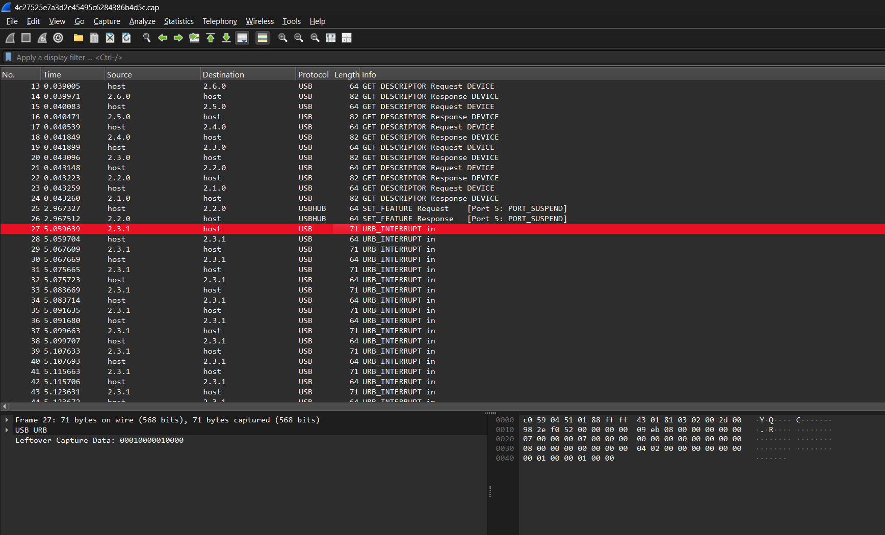
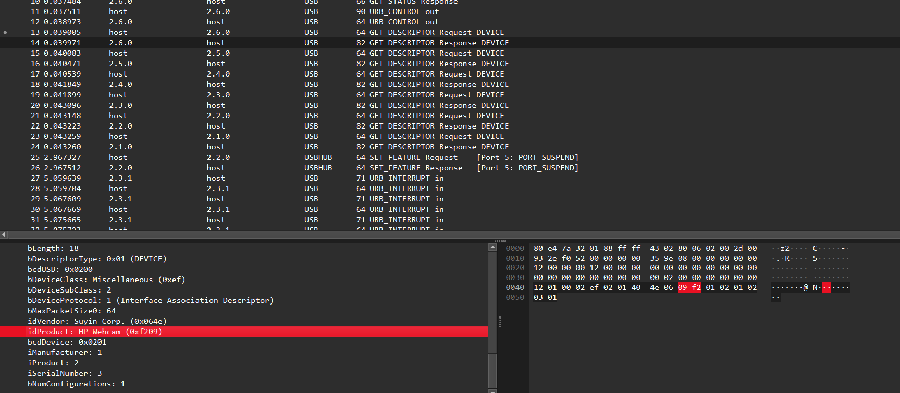
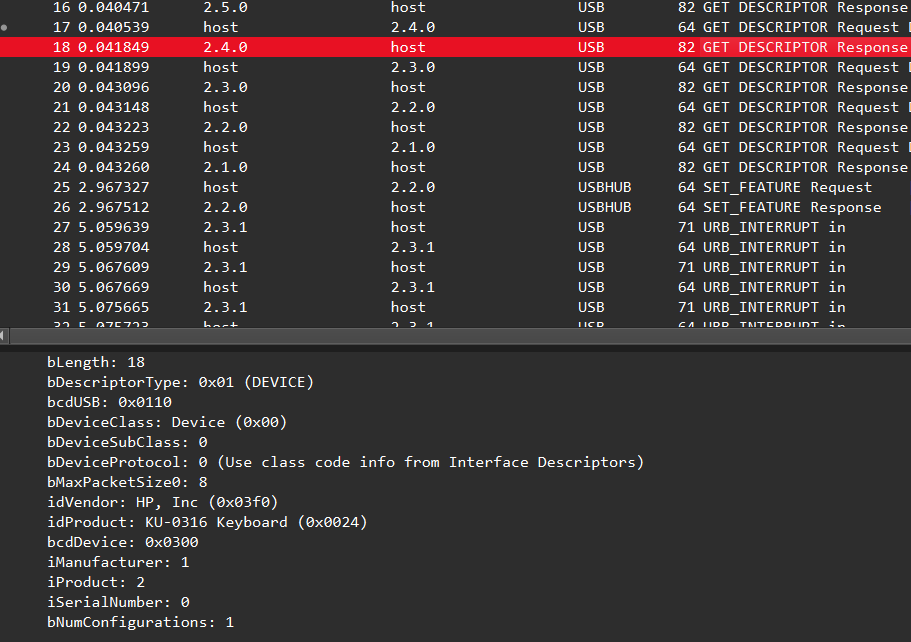
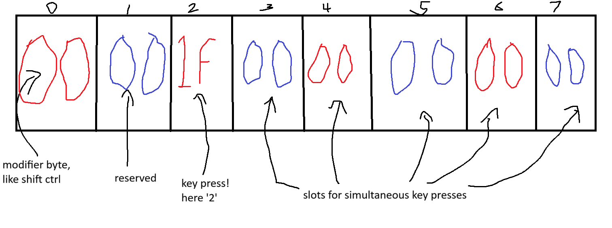
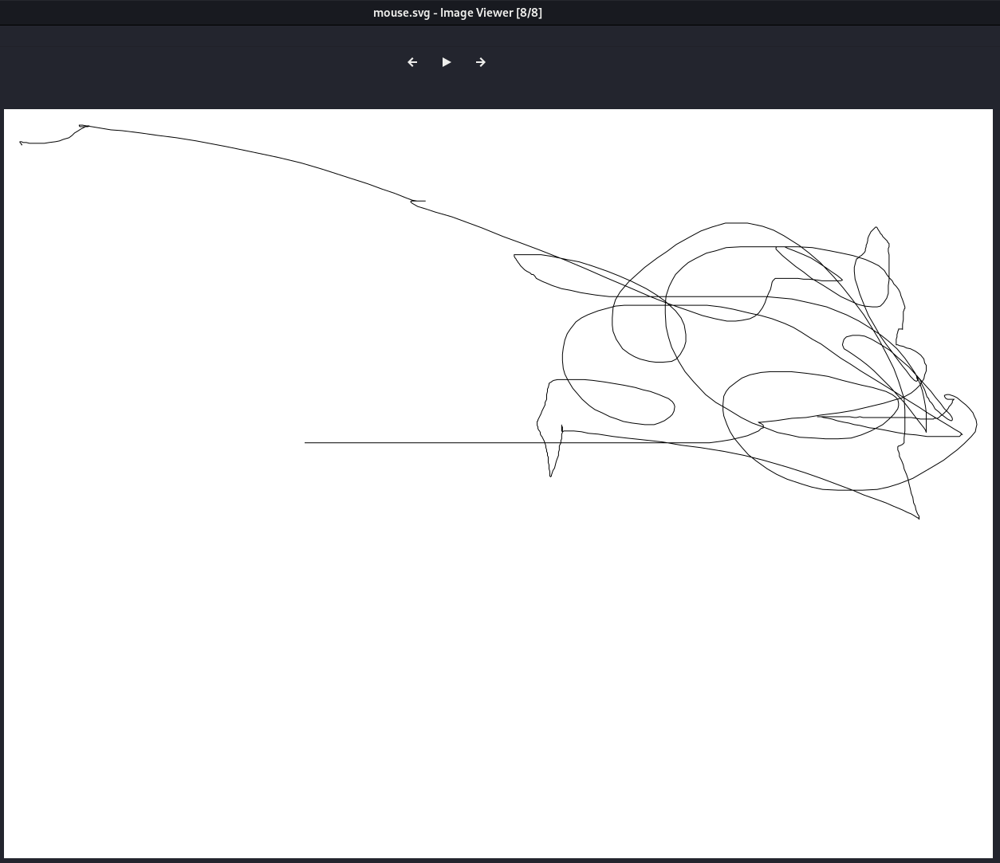

# Spy my girl

## Challenge Details

- Category: Forensics
- Points: 5
- Validation: 254
- Author: Cedrick Chaput
- Status: Done
# Handout
https://ringzer0ctf.com/files/55687ffa8730190e88655ca22bb9effa.zip

## Walkthrough
Unzipping:
```bash
$ unzip 55687ffa8730190e88655ca22bb9effa.zip
Archive:  55687ffa8730190e88655ca22bb9effa.zip
  inflating: 4c27525e7a3d2e45495c6284386b4d5c.cap
```
Network capture, let's open it in wireshark:



USB Packets! We are probably dealing with a USB MOUSE (plot mouse movement) or a USB KEYBOARD (keystrokes)
These challenges are so common I have a script in my path for solving these!
Let's first identify that it is indeed a mouse/keyboard, by looking at the device descriptor packets.



Oh I guess it's.. both? There are multiple different devices configured.. let's get all of them using tshark:
```bash
$ tshark -r 4c27525e7a3d2e45495c6284386b4d5c.cap -V | grep idProduct
    idProduct: HP Webcam (0xf209)
    idProduct: VFS301 Fingerprint Reader (0x0005)
    idProduct: KU-0316 Keyboard (0x0024)
    idProduct: MX510 Optical Mouse (0xc01d)
    idProduct: Integrated Rate Matching Hub (0x0020)
    idProduct: 2.0 root hub (0x0002)
```
Wow this could be a really fun challenge, let's go in increasing order of difficulty, starting with the easiest: keyboard, if it fails we could try plotting mouse movements, then camera feed, maybe the points activated on the fingerprint reader.

Part 1: Keyboard
Here, the device address is 2.4.0



The usb hiddata usually contains the keycodes, which can be looked up and substituted for their ascii counterparts: https://gist.github.com/MightyPork/6da26e382a7ad91b5496ee55fdc73db2
In general, the capdata structure for keyboards is:




(yes i drew that in paint)
Let's extract the hiddata here:
```bash
$ tshark -r 4c27525e7a3d2e45495c6284386b4d5c.cap  -Y usb.capdata -T fields -e usb.capdata > hiddata.txt && cat hiddata.txt | head -n 10
00010000010000
00040000040000
00060000060000
000e00000e0000
000d00000d0000
00100000100000
00190000190000
00140000140000
00160000160000
001e00001e0000
```
But this doesn't match the structure at all! That's because we are dealing with multiple devices, we must specify that the usb.src=="2.4.1"
```bash
$ tshark -r 4c27525e7a3d2e45495c6284386b4d5c.cap  -Y 'usb.capdata && usb.src == "2.4.1"' -T fields -e usb.capdata > hiddata.txt && cat hiddata.txt | head -n 10
00002a0000000000
0000000000000000
00002a0000000000
0000000000000000
00002a0000000000
0000000000000000
00001a0000000000
0000000000000000
00001a0000000000
0000000000000000
```
And now it matches!
Let's now map these to ascii and see what it gives us.
```python
normal = {
    0x04:'a',0x05:'b',0x06:'c',0x07:'d',0x08:'e',0x09:'f',
    0x0a:'g',0x0b:'h',0x0c:'i',0x0d:'j',0x0e:'k',0x0f:'l',
    0x10:'m',0x11:'n',0x12:'o',0x13:'p',0x14:'q',0x15:'r',
    0x16:'s',0x17:'t',0x18:'u',0x19:'v',0x1a:'w',0x1b:'x',
    0x1c:'y',0x1d:'z',

    0x1e:'1',0x1f:'2',0x20:'3',0x21:'4',0x22:'5',
    0x23:'6',0x24:'7',0x25:'8',0x26:'9',0x27:'0',

    0x28:'\n',
    0x29:'<ESC>',
    0x2a:'<BACKSPACE>',
    0x2b:'\t',
    0x2c:' ',

    0x2d:'-',0x2e:'=',0x2f:'[',0x30:']',0x31:'\\',
    0x33:';',0x34:"'",0x35:'`',0x36:',',0x37:'.',0x38:'/',

    0x4f:'<RIGHT>',0x50:'<LEFT>',0x51:'<DOWN>',0x52:'<UP>',
}

shifted = {
    0x04:'A',0x05:'B',0x06:'C',0x07:'D',0x08:'E',0x09:'F',
    0x0a:'G',0x0b:'H',0x0c:'I',0x0d:'J',0x0e:'K',0x0f:'L',
    0x10:'M',0x11:'N',0x12:'O',0x13:'P',0x14:'Q',0x15:'R',
    0x16:'S',0x17:'T',0x18:'U',0x19:'V',0x1a:'W',0x1b:'X',
    0x1c:'Y',0x1d:'Z',

    0x1e:'!',0x1f:'@',0x20:'#',0x21:'$',0x22:'%',
    0x23:'^',0x24:'&',0x25:'*',0x26:'(',0x27:')',

    0x28:'\n',
    0x29:'<ESC>',
    0x2a:'<BACKSPACE>',
    0x2b:'\t',
    0x2c:' ',

    0x2d:'_',0x2e:'+',0x2f:'{',0x30:'}',0x31:'|',
    0x33:':',0x34:'"',0x35:'~',0x36:'<',0x37:'>',0x38:'?',

    0x4f:'<RIGHT>',0x50:'<LEFT>',0x51:'<DOWN>',0x52:'<UP>',
}

modnames = {
    0x01:'LCTRL',
    0x02:'LSHIFT',
    0x04:'LALT',
    0x08:'LGUI',
    0x10:'RCTRL',
    0x20:'RSHIFT',
    0x40:'RALT',
    0x80:'RGUI',
}

hopefullynotflag = ""
old = set()

for line in open("hiddata.txt"):
    b = bytes.fromhex(line.strip())

    mod = b[0]
    keys = set(x for x in b[2:8] if x)

    shift = mod & 0x22
    othermods = [name for bit, name in modnames.items() if mod & bit and bit not in (0x02, 0x20)]

    for k in keys - old:
        c = shifted.get(k, normal.get(k, f"<{k:02x}>")) if shift else normal.get(k, f"<{k:02x}>")

        if othermods:
            hopefullynotflag += "<" + "+".join(othermods) + "+" + c + ">"
        else:
            hopefullynotflag += c

    old = keys

print(hopefullynotflag)
```

```bash
$ python3 solve.py
<BACKSPACE><BACKSPACE><BACKSPACE>www.google.ca
litlle <BACKSPACE><BACKSPACE><BACKSPACE>ca<BACKSPACE><BACKSPACE><BACKSPACE><BACKSPACE><BACKSPACE><BACKSPACE>litle cat in the world
gmail/<BACKSPACE>.com
challenge<RALT+2>gmail.com
Flag-1234ETEH
hi mom,
i love you <BACKSPACE>.
bye
```

Well that's almost disappointing, we won't be able to play with the camera data.. or the fingerprint reader. I checked the pcap file and there was no image data for the camera, and I plotted the mouse movement for fun and no easter eggs there either. Saddening.





But hey! We got the flag!
# FLAG
Flag-1234ETEH
