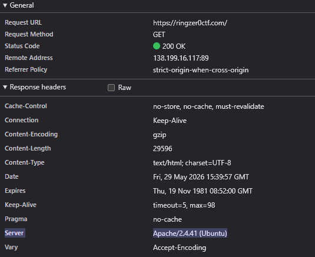
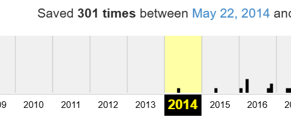
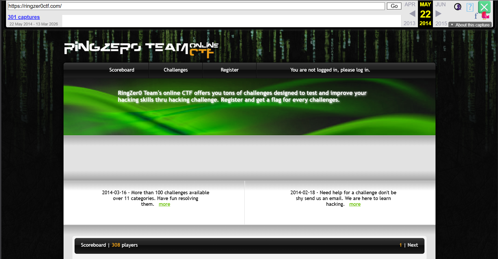
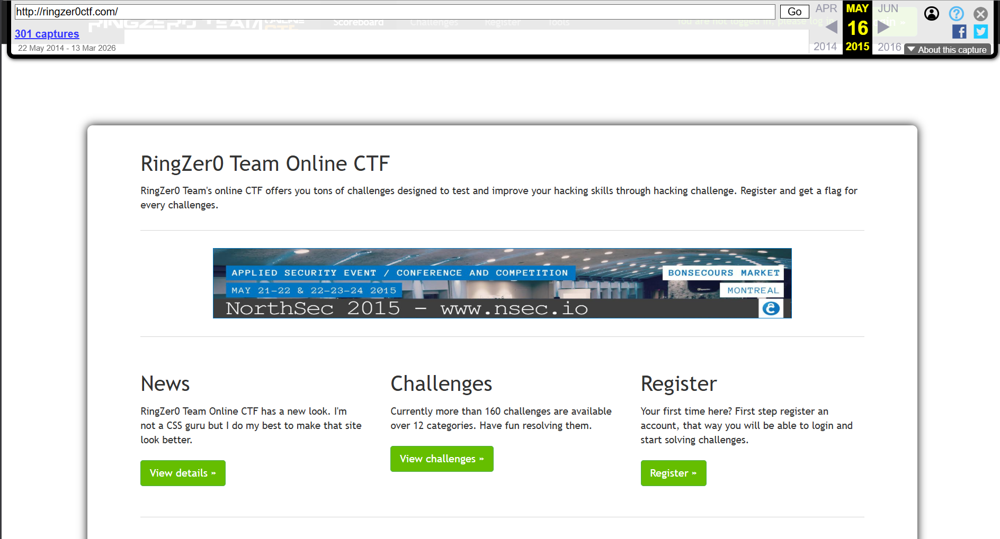
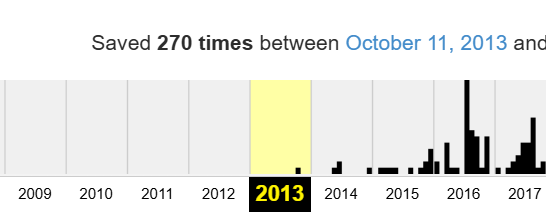
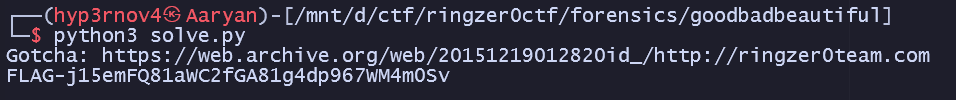

# The good, the bad and the ugly

## Challenge Details

- Category: Forensics
- Points: 2
- Validation: 257
- Author: Mr.Un1k0d3r
- Status: Done
# Handout
`The good, the bad and the ugly; EvilCorp claiming that they hacked the RingZer0 Team website can you prove it?`

## Walkthrough
Another website related challenge.. the response headers for the site confirm it's an Apache server, maybe we can find some doctored logs? 

But for that we would have to find LFI, and that turns this into a Web challenge, not Forensics.. and LFI for the entire main site? yeah right.

What else?

The good, the bad and the ugly.. they defaced the site?
We could try to find archived pages.. but that would take way too long.. the site's been archived more than a hundred times!

Let's see all archived pages on the wayback machine, using their cdx api and grep for FLAG- or EvilCorp.
Or maybe before going nuclear lets look at the oldest archives first:
Once in 2014 and once in 2015., if these aren't possible we'll have to parse all snapshots.

2014 capture seems normal

Let's try 2015

Again.. seems normal
Oh well, using the wayback cdx api it is I guess.

Running `solve.py`, we get a grand total of...... 0 good results. Damn.

Oh it's the ringzer0 TEAM WEBSITE NOT THE CTF SITE.
WE HAVE BEEN LOOKING AT THE WRONG SITE
https://ringzer0team.com/ IS THE SITE TO LOOK AT.
Searching this on the wayback machine, and running our script:

Finally. 

# FLAG
FLAG-j15emFQ81aWC2fGA81g4dp967WM4m0Sv
