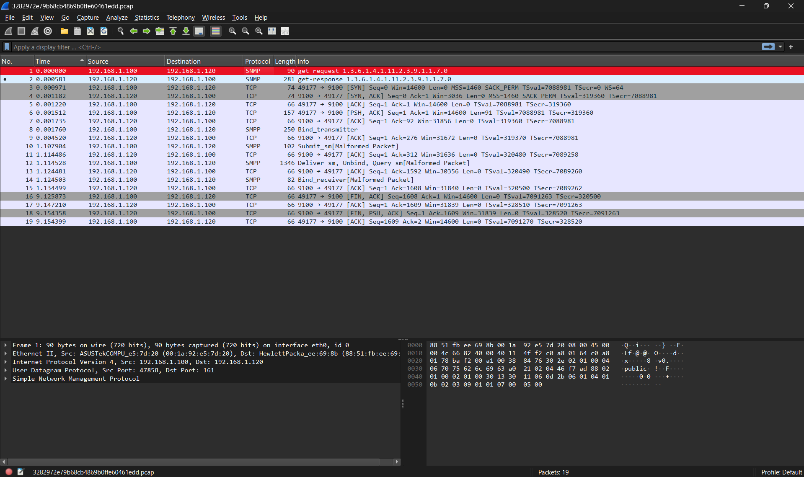
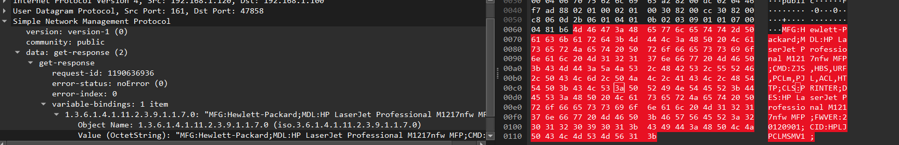
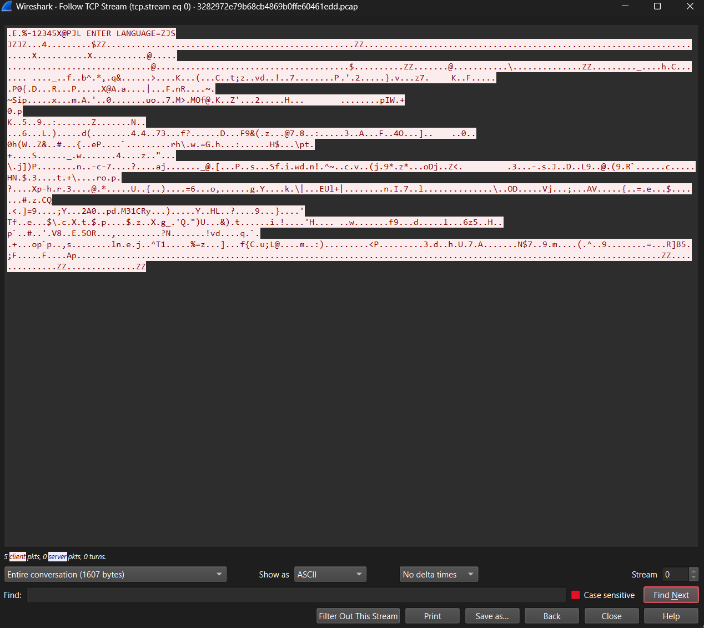
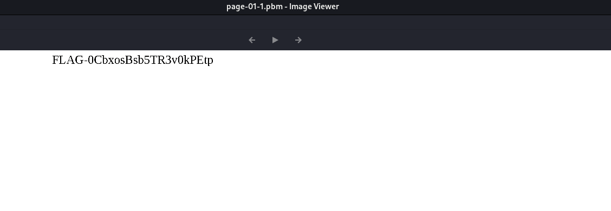

# The words flew but writing remains

## Challenge Details

- Category: Forensics
- Points: 3
- Validation: 204
- Author: Martin Dube
- Status: Done
# Handout
`The words flew but writing remains`
https://ringzer0ctf.com/files/26a3b2ea84c24aea1fcb575e3f189741.zip

## Walkthrough
Unzipping
```bash
unzip 26a3b2ea84c24aea1fcb575e3f189741.zip
Archive:  26a3b2ea84c24aea1fcb575e3f189741.zip
  inflating: 3282972e79b68cb4869b0ffe60461edd.pcap
```
Network capture. Yay!
Opening it in wireshark:



Okay, so we, 192.168.1.100, are asking 192.168.1.120, for something, `1.3.6.1.4.1.11.2.3.9.1.1.7.0` using the SNMP protocol. A quick google search reveals this is an OID, and 192.168.1.120 is a network printer!
So judging by the challenge name, we probably have to recover what was sent to be printed!
My suspicion is confirmed in the very next packet, where the OID response tells us that it's an HP LaserJet.



Next is a TCP stream, this is presumably what is being printed, and therefore our flag, there's only one stream, lets follow it:



ZJS, or ZjStream is a  Page Description Language file, and our suspicions have officially been confirmed. The first line is just to essentially confirm to the printer that the file given is in the ZJS format and has its own file header / signature instead of ZJS's JZJZ, that's why it's recognized by `file` as HP PCL Printer Data
```bash
$ file flag.zjs
flag.zjs: HP PCL printer data
```
We can strip the first line and it's now correctly recognized as a ZJS stream.
```bash
$ sed '1d' flag.zjs > flag_now_actually.zjs && file flag_now_actually.zjs
flag_now_actually.zjs: Zenographics ZjStream printer data (big-endian)
```
After looking online for how to "decode" zjs: I found zjsdecode.
```bash
apt install printer-driver-foo2zjs
```
Let's extract the page to be printed!
```bash
zjsdecode -d page < flag_now_actually.zjs
$ zjsdecode -d page < flag_now_actually.zjs
ZJS_MAGIC, 0x5a4a5a4a (JZJZ)
ZJT_START_DOC, 3 items (reserved=0x24)
        ZJI_DMCOLLATE, 0 (0x0)
        ZJI_PAGECOUNT, 0 (0x0)
        ZJI_DMDUPLEX, 1 (0x1)
ZJT_START_PAGE, 14 items (reserved=0xa8) [Page 1]
        ZJI_DMCOPIES, 1 (0x1)
        ZJI_DMMEDIATYPE, 0 (0x0) [unk]
        ZJI_DMPAPER, 2 (0x2) [unk]
        ZJI_DMDEFAULTSOURCE, 7 (0x7) [auto]
        ZJI_NBIE, 1 (0x1)
        ZJI_RESOLUTION_X, 600 (0x258)
        ZJI_RESOLUTION_Y, 600 (0x258)
        ZJI_RASTER_X, 4928 (0x1340)
        ZJI_RASTER_Y, 6400 (0x1900)
        ZJI_VIDEO_BPP, 1 (0x1)
        ZJI_VIDEO_X, 4928 (0x1340)
        ZJI_VIDEO_Y, 6400 (0x1900)
        ZJI_RET, 1 (0x1)
        ZJI_ECONOMODE, 0 (0x0)
ZJT_JBIG_BIH, 0 items
        Data: 20 bytes
                DL = 0, D = 0, P = 1, - = 0, XY = 4928 x 6400
                L0 = 128, MX = 0, MY = 0
                Order   = 3  ILEAVE SMID
                Options = 92  LRLTWO TPDON TPBON DPON
                50 stripes, 0 layers, 1 planes
ZJT_JBIG_BID, 0 items
        Data: 1232 bytes
         ff 02 ff 02 ff 02 ff 02 a1 5f 87 9a 13 e7 68 af
        ... ff 02 ff 02 ff 02 00 00 00 00 00 00 00 00 00 00 00 00 00 00
ZJT_END_JBIG, 0 items
ZJT_END_PAGE, 0 items
ZJT_END_DOC, 0 items
Total size: 1252 bytes
```
So it recongised the file format, and we got the corresponding page-01-1.pbm file.



And it directly contains the flag!
This was a fun one.

# FLAG
FLAG-0CbxosBsb5TR3v0kPEtp
