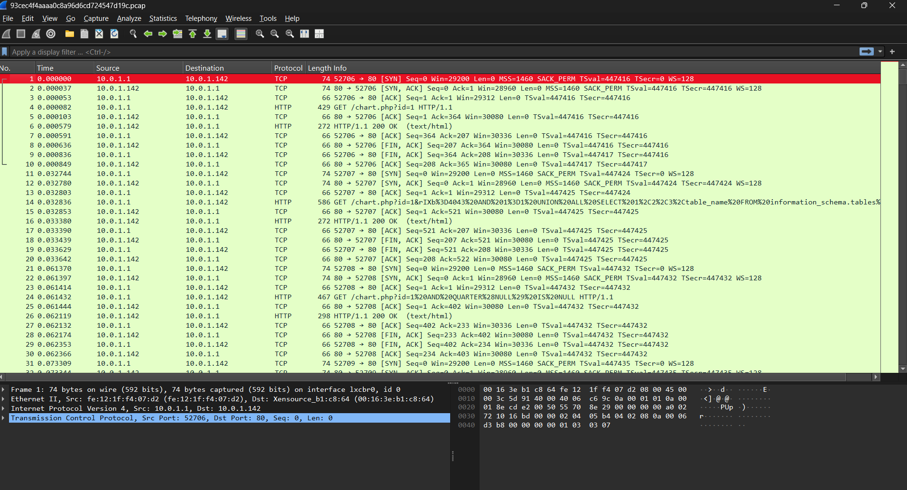
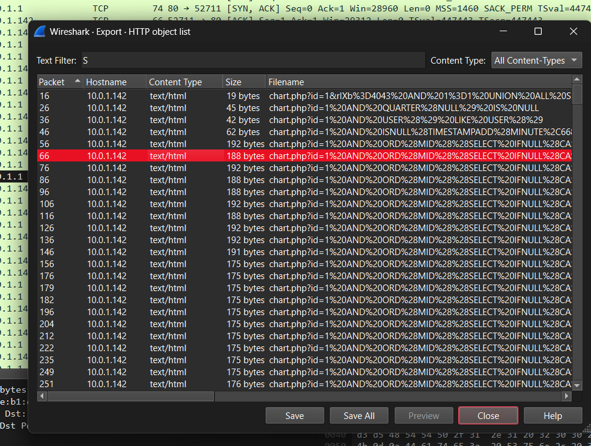
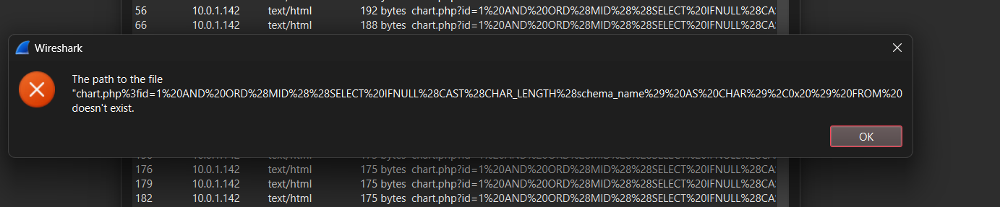
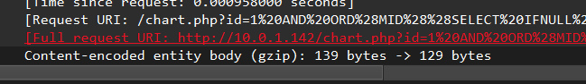

# We got breached

## Challenge Details

- Category: Forensics
- Points: 5
- Validation: 277
- Author: Mr.Un1k0d3r
- Status: Done
# Handout
`We got breached; We think that they steal one of our flag!`
https://ringzer0ctf.com/files/38f156aa89f902a7d5c5a21333c1d84f.zip

## Walkthrough
Unzipping:
```bash
$ unzip 38f156aa89f902a7d5c5a21333c1d84f.zip
Archive:  38f156aa89f902a7d5c5a21333c1d84f.zip
  inflating: 93cec4f4aaaa0c8a96d6cd724547d19c.pcap
```
Network capture, let's open it in wireshark:



I see a lot of http packets, let's start by dumping http objects.



Judging by the file names, someone was probably trying sql injections, let's export all of them and see the object where they succeeded, going through the streams I found
```
User id:1 AND ORD(MID((SELECT IFNULL(CAST(flag AS CHAR),0x20) FROM chart_db.flag ORDER BY flag LIMIT 0,1),33,1))>48 was found
User id:1 AND ORD(MID((SELECT IFNULL(CAST(flag AS CHAR),0x20) FROM chart_db.flag ORDER BY flag LIMIT 0,1),30,1))>74 was not found
```
This is basically a blind sql, we can reconstruct he flag by just grepping "was not found" 
The nature of the blind sqli queries, it says:
if >48 was found, and >49 was not found, the character at that position must by 49
However it was using a gzip encoding so we can't just run strings, and http object dump failed due to wireshark being wireshark:





Let's extract them using tshark:

```bash
$ mkdir -p objects && tshark -r 93cec4f4aaaa0c8a96d6cd724547d19c.pcap --export-objects http,objects | head -n 5
    1   0.000000     10.0.1.1 → 10.0.1.142   TCP 74 52706 → 80 [SYN] Seq=0 Win=29200 Len=0 MSS=1460 SACK_PERM TSval=447416 TSecr=0 WS=128
    2   0.000037   10.0.1.142 → 10.0.1.1     TCP 74 80 → 52706 [SYN, ACK] Seq=0 Ack=1 Win=28960 Len=0 MSS=1460 SACK_PERM TSval=447416 TSecr=447416 WS=128
    3   0.000053     10.0.1.1 → 10.0.1.142   TCP 66 52706 → 80 [ACK] Seq=1 Ack=1 Win=29312 Len=0 TSval=447416 TSecr=447416
    4   0.000082     10.0.1.1 → 10.0.1.142   HTTP 429 GET /chart.php?id=1 HTTP/1.1
    5   0.000103   10.0.1.142 → 10.0.1.1     TCP 66 80 → 52706 [ACK] Seq=1 Ack=364 Win=30080 Len=0 TSval=447416 TSecr=447416
```

Let's now grep for the "was not found":

```bash
grep -ahoP 'User id:1.*?was not found' objects/chart* > hits.txt
```

Now from these let's get the ones containing the CAST(FLAG AS CHAR) sql syntax:
```bash
grep 'CAST(flag AS CHAR)' hits.txt > flag_hits.txt
```

Now let's get the flag

```python
import re

flaghits = open("flag_hits.txt", "r").read()

vals = {}

for pos, n in re.findall(r',\s*(\d+),1\)\)>\s*(\d+)\s*was\s+not\s+found', flaghits):
    pos = int(pos)
    n = int(n)

    if pos not in vals or n < vals[pos]:
        vals[pos] = n


flag = "".join(chr(vals[i]) for i in range(1, max(vals) + 1))
print(flag)
```

```bash
$ python3 solve.py
FLAG-NJf3JS719aKHwa1zk50GQa6kJ8m1K2kR
```
And there it is!
# FLAG
FLAG-NJf3JS719aKHwa1zk50GQa6kJ8m1K2kR
