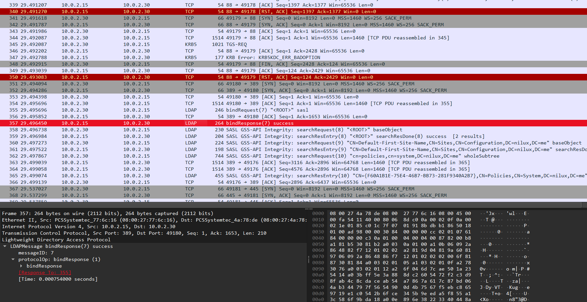
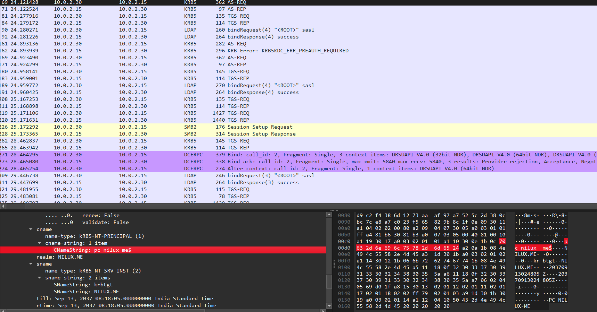
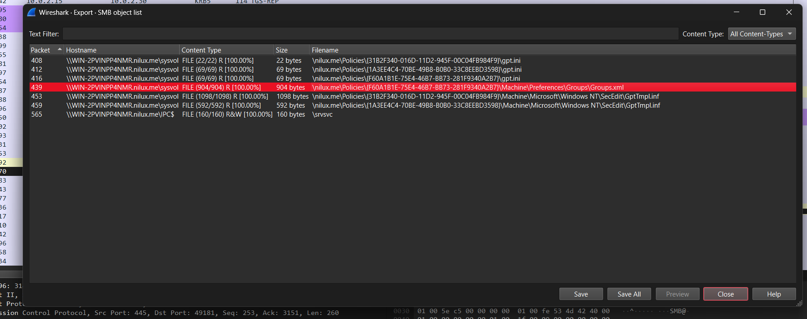
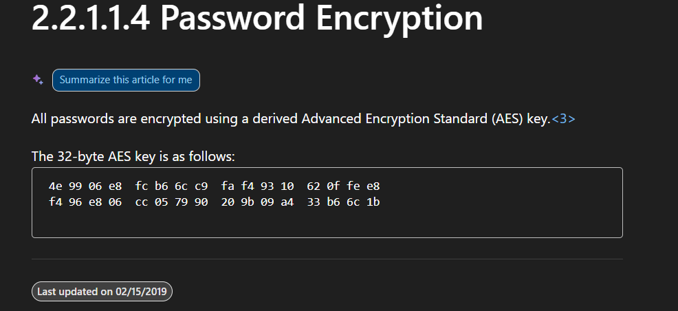

# Active Directory - GPO

## Challenge Details

- Category: Forensics
- Points: 30
- Validation: 7948
- Author: N1lux
- Status: Done
# Handout
`Active Directory - GPO: Group Policy Preferences
`During a security audit, the network traffic during the boot sequence of a workstation enrolled in an Active Directory was recorded. Analyze this capture and find the administrator’s password.`
https://static.root-me.org/forensic/ch12/ch12.pcap

## Walkthrough
Let's start by running capinfos:
```bash
$ capinfos ch12.pcap
File name:           ch12.pcap
File type:           Wireshark/tcpdump/... - pcap
File encapsulation:  Ethernet
File timestamp precision:  microseconds (6)
Packet size limit:   file hdr: 65535 bytes
Packet size limit:   inferred: 4 bytes
Number of packets:   653
File size:           171 kB
Data size:           161 kB
Capture duration:    46.754549 seconds
Earliest packet time: 1970-01-01 05:30:00.000013
Latest packet time:   1970-01-01 05:30:46.754562
Data byte rate:      3,454 bytes/s
Data bit rate:       27 kbps
Average packet size: 247.32 bytes
Average packet rate: 13 packets/s
SHA256:              a09de7ce3c3bc482fe946f3926540604b4e075d30a06b2a0f2e0d2d3b79ad57c
SHA1:                90558f72d7c494ddbf1ce2032a69e6c50dbf2cba
Strict time order:   True
Number of interfaces in file: 1
Interface #0 info:
                     Encapsulation = Ethernet (1 - ether)
                     Capture length = 65535
                     Time precision = microseconds (6)
                     Time ticks per second = 1000000
                     Number of stat entries = 0
                     Number of packets = 653
```

Nothing fancy going on, let's open it in wireshark and look for the ldap packets, seems like a standard active directory challenge.



I see kerberos packets, so the password probably won't be in plaintext, or using a simple bind, let's filter for kerberos packets and find AS-REQ:



I found an authentication packet with an enc timestamp, however this is for `NILUX.ME\pc-nilux-me$` and the challenge asked us to look for adminstrator.

Let's see what all accounts were logged into by extracting all `cname` fields:

```bash
$ tshark -r ch12.pcap -Y "kerberos.msg_type == 10 && kerberos.CNameString"   -T fields -e kerberos.CNameString | uniq
pc-nilux-me$
PC-NILUX-ME$
```

Yeah that's not it, we didn't log in as administrator, so we are not looking for kerberos auth.
I spotted a few smb share packets, let's export smb objects:



And I immediately spotted the Group policy preferences, contains usernames admin passwords and the jazz. Let's export it.

```bash
$ cat smb/%5cnilux.me%5cPolicies%5c\{F60A1B1E-75E4-46B7-BB73-281F9340A2B7\}%5cMachine%5cPreferences%5cGroups%5cGroups.xml
<?xml version="1.0" encoding="utf-8"?>
<Groups clsid="{3125E937-EB16-4b4c-9934-544FC6D24D26}"><User clsid="{DF5F1855-51E5-4d24-8B1A-D9BDE98BA1D1}" name="Helpdesk" image="2" changed="2015-05-06 05:50:08" uid="{43F9FF29-C120-48B6-8333-9402C927BE09}"><Properties action="U" newName="" fullName="" description="" cpassword="PsmtscOuXqUMW6KQzJR8RWxCuVNmBvRaDElCKH+FU+w" changeLogon="1" noChange="0" neverExpires="0" acctDisabled="0" userName="Helpdesk"/></User><User clsid="{DF5F1855-51E5-4d24-8B1A-D9BDE98BA1D1}" name="Administrateur" image="2" changed="2015-05-05 14:19:53" uid="{5E34317F-8726-4F7C-BF8B-91B2E52FB3F7}" userContext="0" removePolicy="0"><Properties action="U" newName="" fullName="Admin Local" description="" cpassword="LjFWQMzS3GWDeav7+0Q0oSoOM43VwD30YZDVaItj8e0" changeLogon="0" noChange="0" neverExpires="1" acctDisabled="0" subAuthority="" userName="Administrateur"/></User>
</Groups>
```

And there's our Administrator cpassword! 
```text
cpassword Administrateur: LjFWQMzS3GWDeav7+0Q0oSoOM43VwD30YZDVaItj8e0
cpassword Helpdesk: PsmtscOuXqUMW6KQzJR8RWxCuVNmBvRaDElCKH+FU+w
```

Let's look at how microsoft encrypts ad pref passwords.

```bash
https://learn.microsoft.com/en-us/openspecs/windows_protocols/ms-gppref/2c15cbf0-f086-4c74-8b70-1f2fa45dd4be
```



AES Key:
```text
4e 99 06 e8  fc b6 6c c9  fa f4 93 10  62 0f fe e8
f4 96 e8 06  cc 05 79 90  20 9b 09 a4  33 b6 6c 1b
```

Amazing, it's a common aes key, I wonder why they don't use dpapi for this.
We could use the powershellmafia script: https://github.com/PowerShellMafia/PowerSploit/blob/master/Exfiltration/Get-GPPPassword.ps1

But at this point it's just aes decryption.

```bash
$ echo -n "LjFWQMzS3GWDeav7+0Q0oSoOM43VwD30YZDVaItj8e0" |  openssl enc -d -aes-256-cbc -base64 -A -nosalt -K 4e9906e8fcb66cc9faf49310620ffee8f496e806cc057990209b09a433b66c1b -iv 00000000000000000000000000000000
bad decrypt
4027113B33770000:error:1C80006B:Provider routines:ossl_cipher_generic_block_final:wrong final block length:../providers/implementations/ciphers/ciphercommon.c:465:
```

base64 padding :/ our cname string is 43 characters, not a multiple of 4. easily fixable by adding an `=` though:

```bash
$ echo -n "LjFWQMzS3GWDeav7+0Q0oSoOM43VwD30YZDVaItj8e0=" |  openssl enc -d -aes-256-cbc -base64 -A -nosalt -K 4e9906e8fcb66cc9faf49310620ffee8f496e806cc057990209b09a433b66c1b -iv 00000000000000000000000000000000
TuM@sTrouv3
```

And there it is! Je s'ai trouve indeed. For completion's sake we can also decrypt the Helpdesk password:

```bash
$ echo -n "PsmtscOuXqUMW6KQzJR8RWxCuVNmBvRaDElCKH+FU+w=" |  openssl enc -d -aes-256-cbc -base64 -A -nosalt -K 4e9906e8fcb66cc9faf
49310620ffee8f496e806cc057990209b09a433b66c1b -iv 00000000000000000000000000000000
R00tm333
```

Figures.
# FLAG
TuM@sTrouv3
