# C2 Mythic

## Challenge Details

- Category: Forensics
- Points: 35
- Validation: 723
- Author: blackjack
- Status: Done
# Handout
`C2 Mythic: Don’t look her in the eye...`
`One of our machines seems to have been infected by a **command and control** agent. Fortunately for us, our NIDS was able to capture the exchange between the server and our machine. We were also able to recover the agent in question. Your mission is to retrieve the information that has been extracted.`
https://static.root-me.org/forensic/ch43/ch43.zip
## Walkthrough
NIDS is a network intrusion detection system, so we are probably dealing with a network capture of the malware and c2 in action? Unzipping:

```bash
$ unzip ch43.zip
Archive:  ch43.zip
   creating: C2_Mythic/
  inflating: C2_Mythic/Mythic_C2.pcap
  inflating: C2_Mythic/medusa.py
```

Yup! `medusa` is an interesting name, let's open the capture in wireshark:

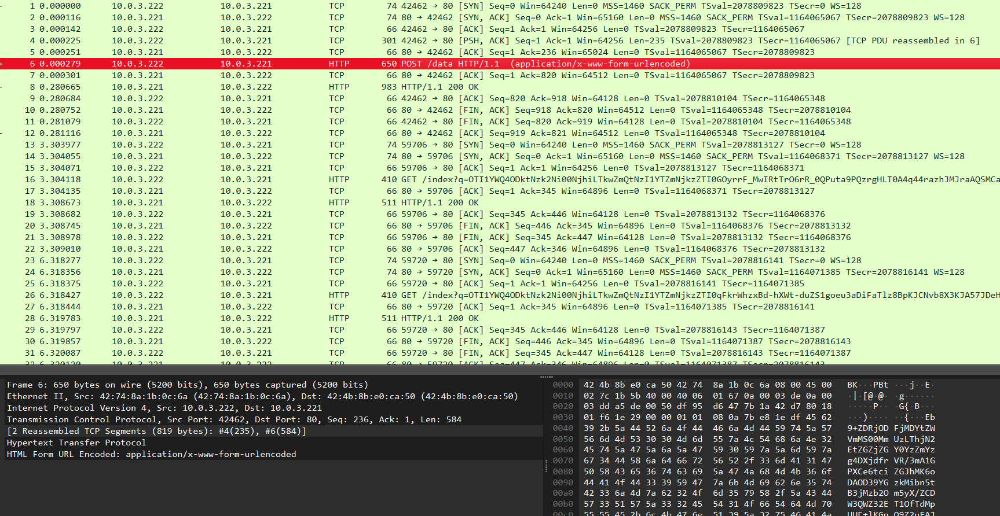

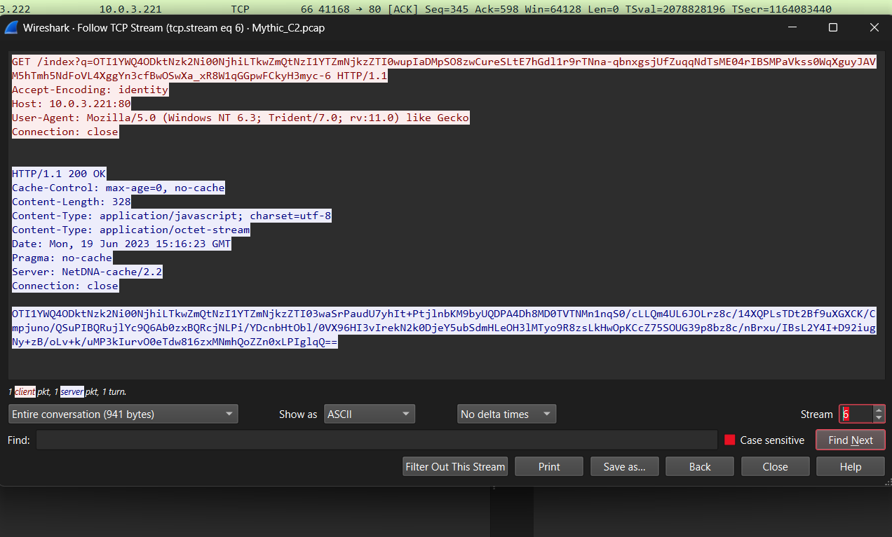

Yeah, it contains tcp streams which are sending encoded data to their c2: `10.0.3.221:80`. Let's see how the data is encoded in `medusa.py`

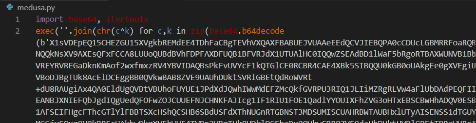

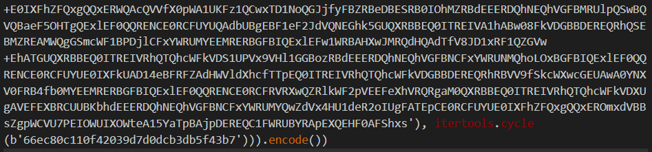

Mild levels of "obfuscation". Basically, it takes a massive base64 string, the main *hacking* snippet, decodes it, and XORs the base64 decoded payload with the repeated hex key `66ec80c110f42039d7d0dcb3db5f43b7`. Let's peel off the first layer of obfuscation.

```python
import base64
import itertools

key = b'66ec80c110f42039d7d0dcb3db5f43b7'
hacking = b'X1sVDEpEQ15CHEZGU15XVgkbREMdEE4TDhD1lWaF5bRgoRTBAXWUNVB1BbXlQVREYRVREGaDknKmAof2wxfmxzRV4YBVIDAQBsPkFvUVYcF1kQTGlCE0RCBR4CAE4XBk5...'
dcryption1 = ''.join(chr(c^k) for c,k in zip(base64.b64decode(hacking), itertools.cycle(key)))

print(dcryption1)
```

```bash
$ python3 deobfuscate.py
import os, random, sys, json, socket, base64, time, platform, ssl, getpass
import urllib.request
from datetime import datetime
import threading, queue

CHUNK_SIZE = 51200

s_box = (
    0x63, 0x7C, 0x77, 0x7B, 0xF2, 0x6B, 0x6F, 0xC5, 0x30, 0x01, 0x67, 0x2B, 0xFE, 0xD7, 0xAB, 0x76,
    0xCA, 0x82, 0xC9, 0x7D, 0xFA, 0x59, 0x47, 0xF0, 0xAD, 0xD4, 0xA2, 0xAF, 0x9C, 0xA4, 0x72, 0xC0,
    0xB7, 0xFD, 0x93, 0x26, 0x36, 0x3F, 0xF7, 0xCC, 0x34, 0xA5, 0xE5, 0xF1, 0x71, 0xD8, 0x31, 0x15
    
    
...
```

Let's save it and see what's going on.
The first part of the script implements standard aes directly, has the default aes s_box and inv_s_box, this is probably because their target won't have the libraries installed, standard behaviour.

It encrypts all the data it's sending as with aes cbc, and appends hmac for integrity.

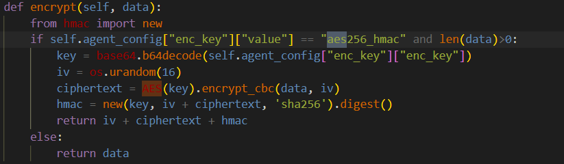

Then connects to our c2 at `10.0.3.221:80` and either:
1. POSTs to `/data` endpoint
2. GETs `/index?q={query_with_enc_data}`
Naturally, this is what we see in the network capture as well

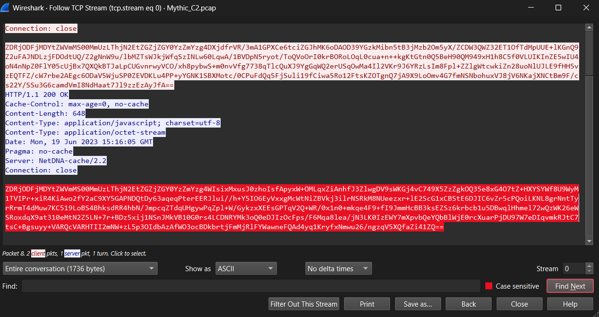

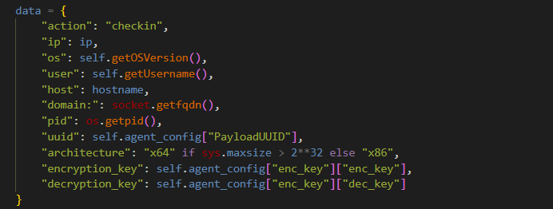

Sends identification info like the victim ip, os, etc including the keys which are defined later.

Then defines various capabilities which can be triggered by our c2:

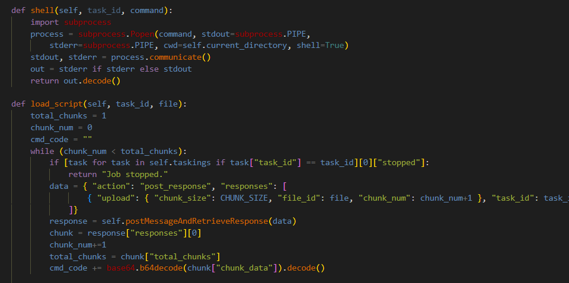

Namely:
```text
shell: shell commands
eval_code: python rce 
load_script: download code from c2 and exec it  
load:  add new commands  
load_module: load zip modules   
download:  send system files to c2  
upload: write files from c2 onto victim  
cat  
rm  
cp/mv
ls 
ps 
env  
watch_dir: watch for dir changes  
socks: socks proxy 
sleep 
exit
```

So they probably uploaded/downloaded our flag from the victim/c2.

It also defined a kill date for `2024-06-18`, so ig it's officially dead code, although i don't see why this couldn't also be set dynamically by the c2.

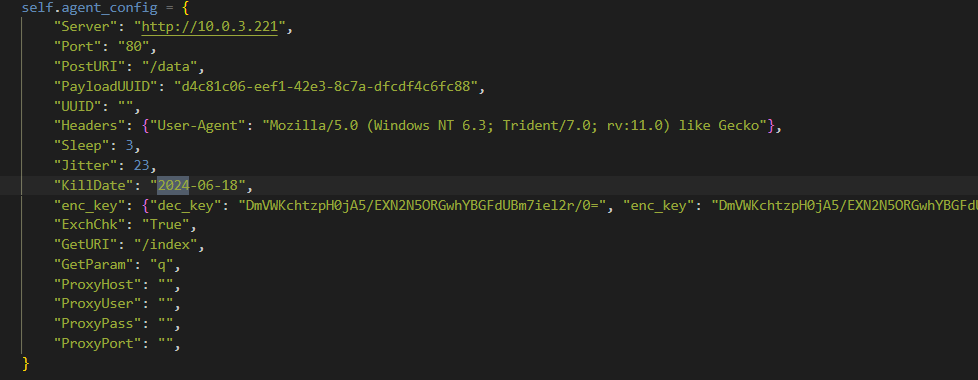

It encrypts everything with aes cbc + adds hmac, standard, the key being:
`DmVWKchtzpH0jA5/EXN2N5ORGwhYBGFdUBm7iel2r/0=`

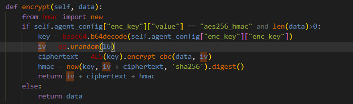

The iv is randomly generated but it is sent along with the message and the uuid

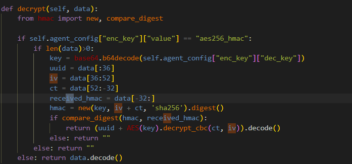

So the message structure becomes:

`[36byte uuid][16byte iv][aes_ct][32byte hmac]`

So a basic self contained decryption function would be:

```python
import base64
from Crypto.Cipher import AES
from Crypto.Util.Padding import unpad

key = base64.b64decode("DmVWKchtzpH0jA5/EXN2N5ORGwhYBGFdUBm7iel2r/0=")

def decrypt(message):
    message = base64.urlsafe_b64decode(message + b"=" * (-len(blob) % 4))

    iv = message[36:52]
    ct = message[52:-32]

    return unpad(AES.new(key, AES.MODE_CBC, iv).decrypt(ct), 16)
```

Let's extract all the messages from tshark:

GET (`/index?q=`)

```bash
$ tshark -r Mythic_C2.pcap -Y 'http.request.method == "GET"' -T fields -e http.request.uri | cut -d= -f2 > get_messages.b64
```

POST (`/data`)

```bash
tshark -r Mythic_C2.pcap -Y 'http.request.method == "POST"' -T fields -e http.file_data |
while read h; do echo "$h" | tr -d ':' | xxd -r -p; echo; done > post_messages.b64
```

Responses

```bash
tshark -r Mythic_C2.pcap -Y 'http.response && http.file_data' -T fields -e http.file_data |
while read h; do echo "$h" | tr -d ':' | xxd -r -p; echo; done > resp_messages.b64
```

And now we can decrypt them with our decryption function.

```python
import base64
from Crypto.Cipher import AES
from Crypto.Util.Padding import unpad

key = base64.b64decode("DmVWKchtzpH0jA5/EXN2N5ORGwhYBGFdUBm7iel2r/0=")

def decrypt(message):
    message = base64.urlsafe_b64decode(message + b"=" * (-len(message) % 4))

    iv = message[36:52]
    ct = message[52:-32]

    return unpad(AES.new(key, AES.MODE_CBC, iv).decrypt(ct), 16)
    
print("--- get ---")
for line in open("get_messages.b64", "rb"):
    print(decrypt(line).decode())

print("\n--- post ---\n")   
for line in open("post_messages.b64", "rb"):
    print(decrypt(line).decode())

print("\n--- resp ---\n")
for line in open("resp_messages.b64", "rb"):
    print(decrypt(line).decode())
```

```json
$ python3 solve.py
--- get ---
{"action": "get_tasking", "tasking_size": -1}
{"action": "get_tasking", "tasking_size": -1}
{"action": "get_tasking", "tasking_size": -1}
{"action": "get_tasking", "tasking_size": -1}
{"action": "get_tasking", "tasking_size": -1}
{"action": "get_tasking", "tasking_size": -1}
{"action": "get_tasking", "tasking_size": -1}
{"action": "get_tasking", "tasking_size": -1}
{"action": "get_tasking", "tasking_size": -1}
{"action": "get_tasking", "tasking_size": -1}
{"action": "get_tasking", "tasking_size": -1}
{"action": "get_tasking", "tasking_size": -1}
{"action": "get_tasking", "tasking_size": -1}
{"action": "get_tasking", "tasking_size": -1}
{"action": "get_tasking", "tasking_size": -1}
{"action": "get_tasking", "tasking_size": -1}

--- post ---

{"action": "checkin", "ip": "10.0.3.222", "os": "Linux 5.15.102-1-pve", "user": "root", "host": "CT131", "domain:": "CT131.clubnix.fr", "pid": 759, "uuid": "d4c81c06-eef1-42e3-8c7a-dfcdf4c6fc88", "architecture": "x64", "encryption_key": "DmVWKchtzpH0jA5/EXN2N5ORGwhYBGFdUBm7iel2r/0=", "decryption_key": "DmVWKchtzpH0jA5/EXN2N5ORGwhYBGFdUBm7iel2r/0="}
{"action": "post_response", "responses": [{"task_id": "adb812ca-a7aa-4c82-80f6-04f6ee447f39", "user_output": "file.pcap\nflag.txt\nmedusa.py\n", "completed": true}]}
{"action": "post_response", "responses": [{"task_id": "aae8337c-fc3a-4a96-a5d5-aae3c4691158", "user_output": "HACKDAY{Myth1c_C2_15_FuN}\n", "completed": true}]}

--- resp ---

{"action":"checkin","architecture":"x64","decryption_key":"DmVWKchtzpH0jA5/EXN2N5ORGwhYBGFdUBm7iel2r/0=","domain:":"CT131.clubnix.fr","encryption_key":"DmVWKchtzpH0jA5/EXN2N5ORGwhYBGFdUBm7iel2r/0=","host":"CT131","id":"925ad889-7966-468b-90fd-725a6f693e24","ip":"10.0.3.222","os":"Linux 5.15.102-1-pve","pid":759,"status":"success","user":"root","uuid":"d4c81c06-eef1-42e3-8c7a-dfcdf4c6fc88"}
{"action":"get_tasking","tasks":[]}
{"action":"get_tasking","tasks":[]}
{"action":"get_tasking","tasks":[]}
{"action":"get_tasking","tasks":[]}
{"action":"get_tasking","tasks":[]}
{"action":"get_tasking","tasks":[{"timestamp":1687187782,"command":"shell","parameters":"{\"command\": \"ls\"}","id":"adb812ca-a7aa-4c82-80f6-04f6ee447f39"}]}
{"action":"get_tasking","tasks":[]}
{"action":"post_response","responses":[{"status":"success","task_id":"adb812ca-a7aa-4c82-80f6-04f6ee447f39"}]}
{"action":"get_tasking","tasks":[]}
{"action":"get_tasking","tasks":[]}
{"action":"get_tasking","tasks":[]}
{"action":"get_tasking","tasks":[]}
{"action":"get_tasking","tasks":[{"timestamp":1687187801,"command":"shell","parameters":"{\"command\": \"cat flag.txt\"}","id":"aae8337c-fc3a-4a96-a5d5-aae3c4691158"}]}
{"action":"get_tasking","tasks":[]}
{"action":"post_response","responses":[{"status":"success","task_id":"aae8337c-fc3a-4a96-a5d5-aae3c4691158"}]}
{"action":"get_tasking","tasks":[]}
{"action":"get_tasking","tasks":[]}
{"action":"get_tasking","tasks":[]}
```

And there we go! First it's posts our systemdata to the c2, then polls the c2 for something to do, then the c2 runs `ls` which outputs `file.pcap flag.txt medusa.py` and finally it runs`cat flag.txt` which gives us our flag!
# FLAG
HACKDAY{Myth1c_C2_15_FuN}
