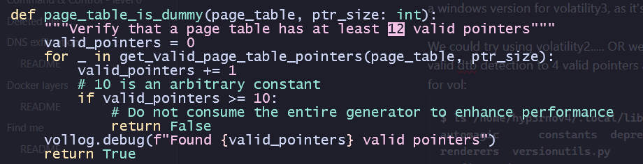
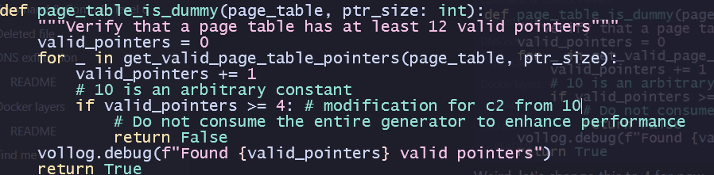

# Command & Control - level 2

## Challenge Details

- Category: Forensics
- Points: 15
- Validation: 27305
- Author: Thanat0s
- Status: TODO
# Handout
`Command & Control - level 2: Memory analysis; Congratulations Berthier, thanks to your help the computer has been identified. You have requested a memory dump but before starting your analysis you wanted to take a look at the antivirus’ logs. Unfortunately, you forgot to write down the workstation’s hostname. But since you have its memory dump you should be able to get it back! The validation flag is the workstation’s hostname.`
https://static.root-me.org/forensic/ch2/ch2.tbz2
## Walkthrough
Seems easy enough, we can just dump windows env vars from the memorydump using volatility and look for the hostname directly.
Extracting:

```bash
$ tar -xvjf ch2.tbz2
ch2.dmp
```

Let's run volatility on this.

```bash
$ vol -f ch2.dmp windows.info
Volatility 3 Framework 2.28.0
Progress:  100.00               PDB scanning finished
Unsatisfied requirement plugins.Info.kernel.layer_name:
Unsatisfied requirement plugins.Info.kernel.symbol_table_name:

A translation layer requirement was not fulfilled.  Please verify that:
        A file was provided to create this layer (by -f, --single-location or by config)
        The file exists and is readable
        The file is a valid memory image and was acquired cleanly

A symbol table requirement was not fulfilled.  Please verify that:
        The associated translation layer requirement was fulfilled
        You have the correct symbol file for the requirement
        The symbol file is under the correct directory or zip file
        The symbol file is named appropriately or contains the correct banner

Unable to validate the plugin requirements: ['plugins.Info.kernel.layer_name', 'plugins.Info.kernel.symbol_table_name']
```

Sorry what? Is it not a dump file? Let's try again with -vvv

```bash
INFO     volatility3.framework.automagic: Detected a windows category plugin
INFO     volatility3.framework.automagic: Running automagic: ConstructionMagic
DETAIL 1 volatility3.framework.configuration.requirements: IndexError - No configuration provided: plugins.Info.kernel.layer_name
DETAIL 1 volatility3.framework.configuration.requirements: Symbol table requirement not yet fulfilled: plugins.Info.kernel.symbol_table_name
DETAIL 1 volatility3.framework.configuration.requirements: IndexError - No configuration provided: plugins.Info.kernel.layer_name
DETAIL 1 volatility3.framework.configuration.requirements: Symbol table requirement not yet fulfilled: plugins.Info.kernel.symbol_table_name
DETAIL 1 volatility3.framework.automagic.construct_layers: Failed on requirement: plugins.Info.kernel
DETAIL 1 volatility3.framework.configuration.requirements: IndexError - No configuration provided: plugins.Info.kernel.layer_name
DETAIL 1 volatility3.framework.automagic.construct_layers: Failed on requirement: plugins.Info.kernel.layer_name
DETAIL 1 volatility3.framework.configuration.requirements: IndexError - No configuration provided: plugins.Info.kernel.layer_name
DETAIL 1 volatility3.framework.automagic.construct_layers: Failed on requirement: plugins.Info.kernel
DETAIL 1 volatility3.framework.configuration.requirements: Symbol table requirement not yet fulfilled: plugins.Info.kernel.symbol_table_name
DETAIL 1 volatility3.framework.automagic.construct_layers: Failed on requirement: plugins.Info.kernel.symbol_table_name
DETAIL 1 volatility3.framework.configuration.requirements: Symbol table requirement not yet fulfilled: plugins.Info.kernel.symbol_table_name
DETAIL 1 volatility3.framework.automagic.construct_layers: Failed on requirement: plugins.Info.kernel
DETAIL 1 volatility3.framework.configuration.requirements: IndexError - No configuration provided: plugins.Info.kernel.layer_name
DETAIL 1 volatility3.framework.configuration.requirements: Symbol table requirement not yet fulfilled: plugins.Info.kernel.symbol_table_name
DETAIL 1 volatility3.framework.automagic.construct_layers: Failed on requirement: plugins.Info
INFO     volatility3.framework.automagic: Running automagic: SymbolCacheMagic
INFO     volatility3.framework.automagic: Running automagic: LayerStacker
DETAIL 1 volatility3.framework.configuration.requirements: IndexError - No configuration provided: plugins.Info.kernel.layer_name
DETAIL 1 volatility3.framework.configuration.requirements: Symbol table requirement not yet fulfilled: plugins.Info.kernel.symbol_table_name
DEBUG    volatility3.framework.automagic.windows: Detecting Self-referential pointer for recent windows
DEBUG    volatility3.framework.automagic.windows: WindowsIntelStacker hits: []
DEBUG    volatility3.framework.automagic.windows: Older windows fixed location self-referential pointers
DEBUG    volatility3.framework.automagic.windows: WindowsIntelStacker hits: [(<volatility3.framework.automagic.windows.DtbSelfRefPae object at 0x76b2e84eec10>, 1593344)]
DEBUG    volatility3.framework.automagic.windows: Found 4 valid pointers
DEBUG    volatility3.framework.automagic.windows: DTB 185000 contains less than 12 valid pointers, ignoring
DETAIL 1 volatility3.framework.configuration.requirements: IndexError - No configuration provided: plugins.Info.kernel.layer_name
DETAIL 1 volatility3.framework.configuration.requirements: TypeError - Layer is not the required Architecture: FileLayer
DEBUG    volatility3.framework.automagic.stacker: physical_layer maximum_address: 536870911
DEBUG    volatility3.framework.automagic.stacker: Stacked layers: ['FileLayer']
INFO     volatility3.framework.automagic: Running automagic: WinSwapLayers
INFO     volatility3.framework.automagic: Running automagic: KernelPDBScanner
DETAIL 1 volatility3.framework.configuration.requirements: IndexError - No configuration provided: plugins.Info.kernel.layer_name
DETAIL 1 volatility3.framework.configuration.requirements: Symbol table requirement not yet fulfilled: plugins.Info.kernel.symbol_table_name
DETAIL 1 volatility3.framework.configuration.requirements: Symbol table requirement not yet fulfilled: plugins.Info.kernel.symbol_table_name
DETAIL 1 volatility3.framework.configuration.requirements: Symbol table requirement not yet fulfilled: plugins.Info.kernel.symbol_table_name
INFO     volatility3.framework.automagic.pdbscan: No suitable kernels found during pdbscan
INFO     volatility3.framework.automagic: Running automagic: SymbolFinder
INFO     volatility3.framework.automagic: Running automagic: KernelModule
DETAIL 1 volatility3.framework.configuration.requirements: IndexError - No configuration provided: plugins.Info.kernel.layer_name
DETAIL 1 volatility3.framework.configuration.requirements: Symbol table requirement not yet fulfilled: plugins.Info.kernel.symbol_table_name
DETAIL 1 volatility3.framework.configuration.requirements: IndexError - No configuration provided: plugins.Info.kernel.layer_name
DETAIL 1 volatility3.framework.configuration.requirements: IndexError - No configuration provided: plugins.Info.kernel.layer_name
DETAIL 1 volatility3.framework.configuration.requirements: Symbol table requirement not yet fulfilled: plugins.Info.kernel.symbol_table_name

Unsatisfied requirement plugins.Info.kernel.layer_name:
Unsatisfied requirement plugins.Info.kernel.symbol_table_name:

A translation layer requirement was not fulfilled.  Please verify that:
        A file was provided to create this layer (by -f, --single-location or by config)
        The file exists and is readable
        The file is a valid memory image and was acquired cleanly

A symbol table requirement was not fulfilled.  Please verify that:
        The associated translation layer requirement was fulfilled
        You have the correct symbol file for the requirement
        The symbol file is under the correct directory or zip file
        The symbol file is named appropriately or contains the correct banner
```

Old windows being old windows. Key lines being:

`DEBUG    volatility3.framework.automagic.windows: Found 4 valid pointers`

`DEBUG    volatility3.framework.automagic.windows: DTB 185000 contains less than 12 valid pointers, ignoring`

So volatility  found a valid directory table base for a dump.. but rejected it? Because it found only 4 valid pointers when it has a threshold of 12.

We can confirm i am not being stupid by looking for banners:
```bash
$ vol -f ch2.dmp banners.Banners
Volatility 3 Framework 2.28.0
Progress:  100.00               PDB scanning finished
Offset  Banner

0x291d8dc       ntkrpamp.pdb|5B308B4ED6464159B87117C711E7340C|2
0x1dc86a24      ntkrpamp.pdb|5B308B4ED6464159B87117C711E7340C|2
```

It does find the kernel pdb banner,  This challenge is from 2013 so the dump might just be too old a windows version for volatility3 (doesn't find 12 pointers), as it's rejecting the dtb found 💀

We could try using volatility2 (python2 btw and extremely slow and kinda cringe)

.....OR we could modify volatility itself to change the threshold for a valid dtb detection to 4 valid pointers as well. This would be in  automagic in the vol python package (yes my vol wasnt built from source sorry):

```bash
$ ls /home/hyp3rnov4/.local/lib/python3.13/site-packages/volatility3/framework
automagic      constants  deprecation.py  __init__.py  layers   plugins      renderers  versionutils.py
configuration  contexts   exceptions.py   interfaces   objects  __pycache__  symbols

$ cat windows.py | grep 12
                """Verify that a page table has at least 12 valid pointers"""
                        f"DTB {page_map_offset:x} contains less than 12 valid pointers, ignoring"
```

Let's modify this.
So it says its looking for 12 but actually checks for 10..?



Weird quirk of the volatility codebase. Let's change this to 4 for now




```bash
$ vol -f ch2.dmp  windows.info
Volatility 3 Framework 2.28.0
Progress:  100.00               PDB scanning finished
Variable        Value

Kernel Base     0x82801000
DTB     0x185000
Symbols file:///home/hyp3rnov4/.local/lib/python3.13/site-packages/volatility3/symbols/windows/ntkrpamp.pdb/5B308B4ED6464159B87117C711E7340C-2.json.xz
Is64Bit False
IsPAE   True
layer_name      0 WindowsIntelPAE
memory_layer    1 FileLayer
KdDebuggerDataBlock     0x82929be8
NTBuildLab      7600.16385.x86fre.win7_rtm.09071
CSDVersion      0
KdVersionBlock  0x82929bc0
Major/Minor     15.7600
MachineType     332
KeNumberProcessors      1
SystemTime      2013-01-12 16:59:18+00:00
NtSystemRoot    C:\Windows
NtProductType   NtProductWinNt
NtMajorVersion  6
NtMinorVersion  1
PE MajorOperatingSystemVersion  6
PE MinorOperatingSystemVersion  1
PE Machine      332
PE TimeDateStamp        Mon Jul 13 23:15:19 2009
```

And it works now yay! What an ancient build of windows 7. Let's get the hostname using envars.

```bash
$ vol -f ch2.dmp  windows.env > env.txt && grep computername -i env.txt
560gressservices.exe    0x120ea8PDB scanCOMPUTERNAME    WIN-ETSA91RKCFP
576     lsass.exe       0x250ea8        COMPUTERNAME    WIN-ETSA91RKCFP
584     lsm.exe         0x190ea8        COMPUTERNAME    WIN-ETSA91RKCFP
692     svchost.exe     0x2c0ff0        COMPUTERNAME    WIN-ETSA91RKCFP
764     svchost.exe     0x2b1070        COMPUTERNAME    WIN-ETSA91RKCFP
832     svchost.exe     0x301068        COMPUTERNAME    WIN-ETSA91RKCFP
904     svchost.exe     0x140ff0        COMPUTERNAME    WIN-ETSA91RKCFP
928     svchost.exe     0x5c0ff0        COMPUTERNAME    WIN-ETSA91RKCFP
1084    svchost.exe     0x131068        COMPUTERNAME    WIN-ETSA91RKCFP
1172    svchost.exe     0xb1070         COMPUTERNAME    WIN-ETSA91RKCFP
1220    AvastSvc.exe    0x520ff0        COMPUTERNAME    WIN-ETSA91RKCFP
1712    spoolsv.exe     0x670ff0        COMPUTERNAME    WIN-ETSA91RKCFP
1748    svchost.exe     0x171068        COMPUTERNAME    WIN-ETSA91RKCFP
1968    vmtoolsd.exe    0x220ff0        COMPUTERNAME    WIN-ETSA91RKCFP
1612    TPAutoConnSvc.  0x2f0ff0        COMPUTERNAME    WIN-ETSA91RKCFP
2352    taskhost.exe    0x341038        COMPUTERNAME    WIN-ETSA91RKCFP
2496    dwm.exe         0x171038        COMPUTERNAME    WIN-ETSA91RKCFP
2548    explorer.exe    0x2e1060        COMPUTERNAME    WIN-ETSA91RKCFP
2568    TPAutoConnect.  0x670ff0        COMPUTERNAME    WIN-ETSA91RKCFP
2660    VMwareTray.exe  0x2610b0        COMPUTERNAME    WIN-ETSA91RKCFP
2676    VMwareUser.exe  0x2f10c0        COMPUTERNAME    WIN-ETSA91RKCFP
2720    AvastUI.exe     0x2710c0        COMPUTERNAME    WIN-ETSA91RKCFP
2744    StikyNot.exe    0x331070        COMPUTERNAME    WIN-ETSA91RKCFP
2772    iexplore.exe    0x2c10b8        COMPUTERNAME    WIN-ETSA91RKCFP
2900    SearchIndexer.  0x280ff0        COMPUTERNAME    WIN-ETSA91RKCFP
3352    svchost.exe     0x5f1068        COMPUTERNAME    WIN-ETSA91RKCFP
3564    soffice.bin     0xc91108        COMPUTERNAME    WIN-ETSA91RKCFP
3624    svchost.exe     0x5b0ff0        COMPUTERNAME    WIN-ETSA91RKCFP
1232    taskmgr.exe     0x1c1070        COMPUTERNAME    WIN-ETSA91RKCFP
3152    cmd.exe         0x441038        COMPUTERNAME    WIN-ETSA91RKCFP
1616    cmd.exe         0x3110b8        COMPUTERNAME    WIN-ETSA91RKCFP
1136    iexplore.exe    0x3c10b8        COMPUTERNAME    WIN-ETSA91RKCFP
3044    iexplore.exe    0x4510b8        COMPUTERNAME    WIN-ETSA91RKCFP
3144    winpmem-1.3.1.  0x3c10b8        COMPUTERNAME    WIN-ETSA91RKCFP
```
And there's our flag!
# FLAG
WIN-ETSA91RKCFP
