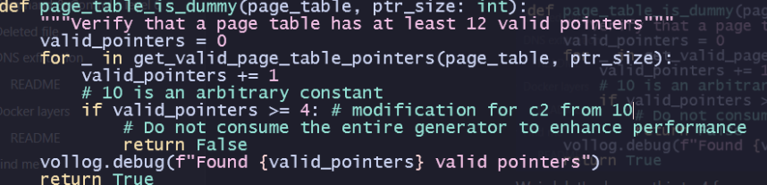
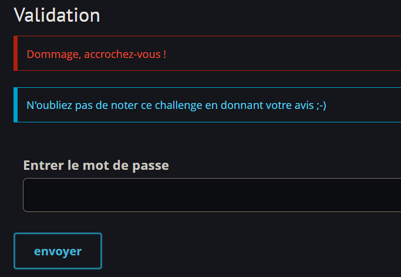
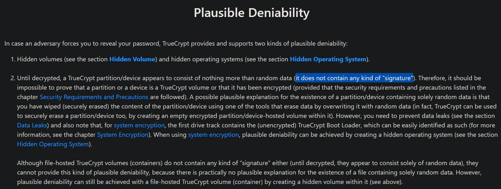
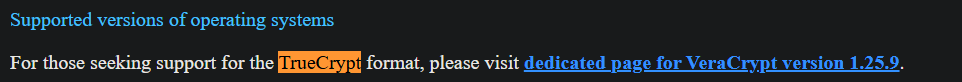
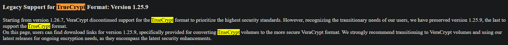
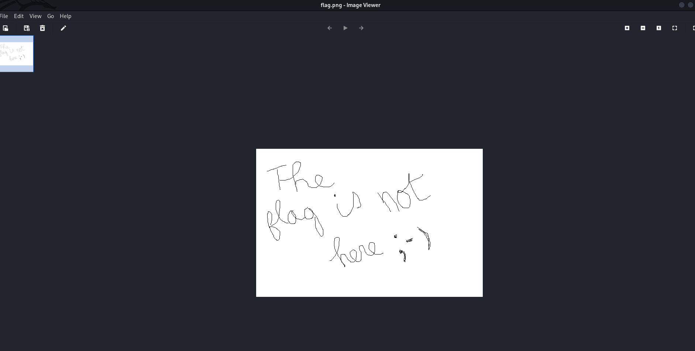
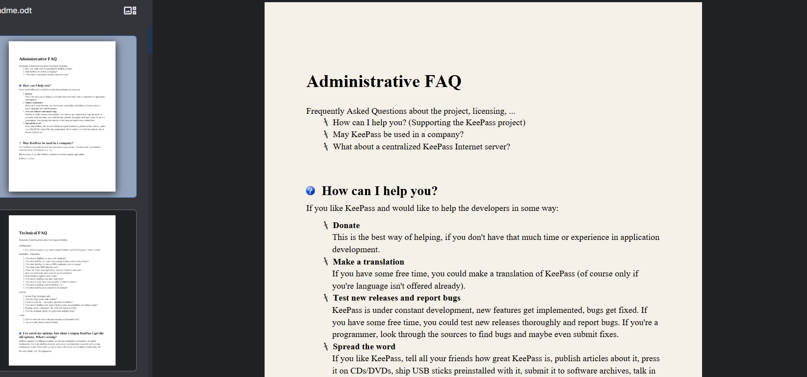
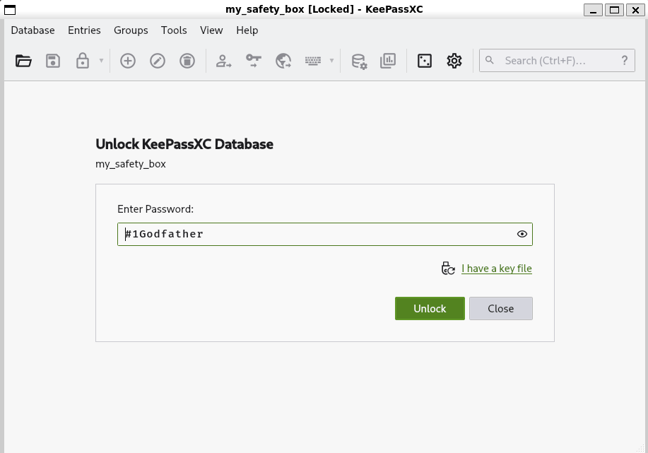
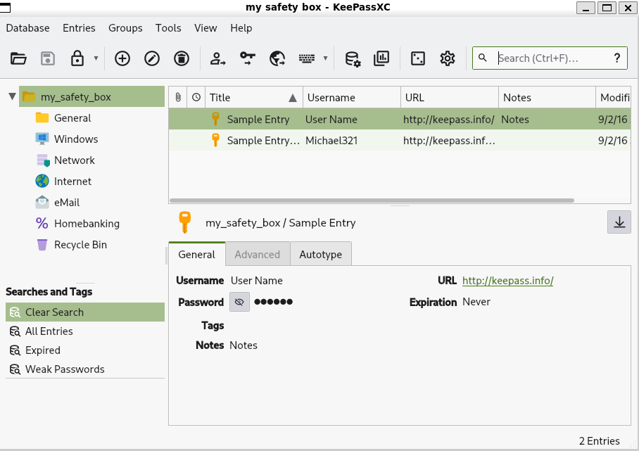
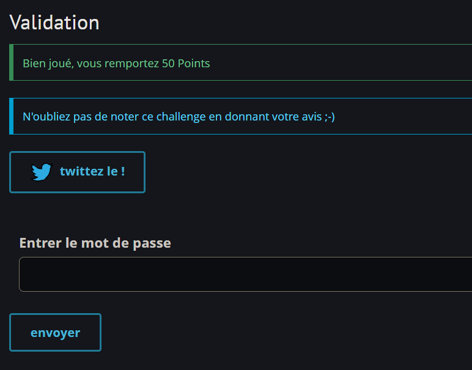

# Find me

## Challenge Details

- Category: Forensics
- Points: 50
- Validation: 2078
- Author: makhno
- Status: Done
# Handout
`Find me: Forensic`
`Your son is a geek and he wants to prove that he’s got the skills to hide information from you. You carelessly left your computer’s session open and he took the opportunity to prank you. It seems that he managed to find your login password! Find the validation password in the dump.`
https://static.root-me.org/forensic/ch18/ch18.zip
## Walkthrough
This seems trivial, we probably just have to crack the ntlm hash from the hashdump output in volatility, assuming it's a windows memory dump.
Unzipping:

```bash
$ unzip ch18.zip
Archive:  ch18.zip
  inflating: dump
```

Let's confirm it's a windows dump and find the windows version using volatility:

```bash
$ vol -f dump windows.info
Volatility 3 Framework 2.28.0
Progress:  100.00               PDB scanning finished
Variable        Value

Kernel Base     0x8282b000
DTB     0x185000
Symbols file:///home/hyp3rnov4/.local/lib/python3.13/site-packages/volatility3/symbols/windows/ntkrnlmp.pdb/998A3472EEA6405CB8C089DE868F2622-2.json.xz
Is64Bit False
IsPAE   False
layer_name      0 WindowsIntel
memory_layer    1 FileLayer
KdDebuggerDataBlock     0x8294bbe8
NTBuildLab      7600.16385.x86fre.win7_rtm.09071
CSDVersion      0
KdVersionBlock  0x8294bbc0
Major/Minor     15.7600
MachineType     332
KeNumberProcessors      1
SystemTime      2016-09-15 10:12:31+00:00
NtSystemRoot    C:\Windows
NtProductType   NtProductWinNt
NtMajorVersion  6
NtMinorVersion  1
PE MajorOperatingSystemVersion  6
PE MinorOperatingSystemVersion  1
PE Machine      332
PE TimeDateStamp        Mon Jul 13 23:15:08 2009
```
Yup! A windows 7 image, although since it's from the july 13 build, we need to re-apply the patch from `Command & Control - Level 2`, as it wouldn't have found 12 dtb symbols, giving us this error instead:
```bash
INFO     volatility3.framework.automagic: Detected a windows category plugin
...

DEBUG    volatility3.framework.automagic.windows: Found 4 valid pointers
DEBUG    volatility3.framework.automagic.windows: DTB 185000 contains less than 12 valid pointers, ignoring
DETAIL 1 volatility3.framework.configuration.requirements: IndexError - No configuration provided: plugins.Info.kernel.layer_name
DETAIL 1 volatility3.framework.configuration.requirements: TypeError - Layer is not the required Architecture: FileLayer
DEBUG    volatility3.framework.automagic.stacker: physical_layer maximum_address: 536870911
...

Unsatisfied requirement plugins.Info.kernel.layer_name:
Unsatisfied requirement plugins.Info.kernel.symbol_table_name:

A translation layer requirement was not fulfilled.  Please verify that:
        A file was provided to create this layer (by -f, --single-location or by config)
        The file exists and is readable
        The file is a valid memory image and was acquired cleanly

A symbol table requirement was not fulfilled.  Please verify that:
        The associated translation layer requirement was fulfilled
        You have the correct symbol file for the requirement
        The symbol file is under the correct directory or zip file
        The symbol file is named appropriately or contains the correct banner
```

 Key lines being:

`DEBUG    volatility3.framework.automagic.windows: Found 4 valid pointers`

`DEBUG    volatility3.framework.automagic.windows: DTB 185000 contains less than 12 valid pointers, ignoring`

Volatility  found a valid directory table base for a dump.. Because it found only 4 valid pointers when it has a threshold of 12.

We could try using volatility2 (python2 btw and extremely slow and kinda cringe)

.....OR we could modify volatility itself to change the threshold for a valid dtb detection to 4 valid pointers as well. This would be in  automagic in the vol python package:

```bash
$ ls /home/hyp3rnov4/.local/lib/python3.13/site-packages/volatility3/framework
automagic      constants  deprecation.py  __init__.py  layers   plugins      renderers  versionutils.py
configuration  contexts   exceptions.py   interfaces   objects  __pycache__  symbols

$ cat windows.py | grep 12
                """Verify that a page table has at least 12 valid pointers"""
                        f"DTB {page_map_offset:x} contains less than 12 valid pointers, ignoring"
```

Let's modify this.




And it runs fine now!
Let's hashdump the password hash:
```bash
$ vol -f dump windows.hashdump
Volatility 3 Framework 2.28.0

Administrator   500     aad3b435b51404eeaad3b435b51404ee        31d6cfe0d16ae931b73c59d7e0c089c0
Guest   501     aad3b435b51404eeaad3b435b51404ee        31d6cfe0d16ae931b73c59d7e0c089c0
HomeGroupUser$  1001    aad3b435b51404eeaad3b435b51404ee        57e82f46aff390080f143c09ab2c5b68
info    1002    aad3b435b51404eeaad3b435b51404ee        dc3817f29d2199446639538113064277

```

Let's save these hashes and crack them using hashcat with mode 1000 for ntlm:

```bash
$ cat hashes.txt
31d6cfe0d16ae931b73c59d7e0c089c0
57e82f46aff390080f143c09ab2c5b68
dc3817f29d2199446639538113064277

$ hashcat hashes.txt -m 1000 -a 0 ~/wordlists/rockyou.txt -w 4
$ hashcat -m 1000 hashes.txt --show
31d6cfe0d16ae931b73c59d7e0c089c0:
dc3817f29d2199446639538113064277:#1Godfather
```

And there's the login password.. and it's.. not our flag..? 



Maybe this password has been reused somewhere? `Validation password` and `login password` weren't referring to the same thing i guess. Let's look at pslist.

```bash
$ vol -f dump windows.pslist > pslist.txt
$ cat pslist.txt
Volatility 3 Framework 2.28.0

PID     PPID    ImageFileName   Offset(V)       Threads Handles SessionId       Wow64   CreateTime      ExitTime        File output

4       0       System  0x83f2f9e8      87      494     N/A     False   2016-09-15 10:10:39.000000 UTC  N/A     Disabled
268     4       smss.exe        0x84e5d020      2       29      N/A     False   2016-09-15 10:10:39.000000 UTC  N/A     Disabled
344     336     csrss.exe       0x84d9cd40      8       404     0       False   2016-09-15 10:10:40.000000 UTC  N/A     Disabled
...

2864    584     WmiPrvSE.exe    0x85a89030      6       112     0       False   2016-09-15 10:11:16.000000 UTC  N/A     Disabled
3224    1956    TrueCrypt.exe   0x84e27030      14      326     1       False   2016-09-15 10:11:20.000000 UTC  N/A     Disabled
3716    3684    notepad.exe     0x8579a030      2       59      1       False   2016-09-15 10:11:59.000000 UTC  N/A     Disabled
```

I see truecrypt running! Maybe this was the password to a truecrypt encrypted volume. Let's use the truecrypt passphrase to confirm it's the same password there as well:

```bash
$ vol -f dump windows.truecrypt.Passphrase
Volatility 3 Framework 2.28.0
Progress:  100.00               PDB scanning finished
Offset  Length  Password

0x87433e44      32      R3sqdl3Fuuz2ZdbdYsf56opFFLe9sAsx
```

It found a truecrypt passphrase in memory:
`Truecrypt passphrase: R3sqdl3Fuuz2ZdbdYsf56opFFLe9sAsx`
but it's different from the login password, maybe `#1Godfather` will be used later. Let's look at TrueCrypt History.xml and find our encrypted volume.

```bash
$ vol -f dump windows.filescan > files.txt && rg -i true files.txt
186:0x1e0c66b8.0\Users\info\AppData\Roaming\TrueCrypt\Configuration.xml
1209:0x1e71df80 \Program Files\TrueCrypt\TrueCrypt.exe
1218:0x1e728f80 \ProgramData\Microsoft\Windows\Start Menu\Programs\TrueCrypt
1266:0x1e757c08 \ProgramData\Microsoft\Windows\Start Menu\Programs\TrueCrypt
1291:0x1e7724c8 \Users\info\AppData\Roaming\TrueCrypt\History.xml
```

Let's dump the xml file at offset `0x1e7724c8` and the config file `0x1e0c66b8` at using volatility dumpfiles:

```bash
$ vol -f dump windows.dumpfiles --physaddr 0x1e7724c8
Volatility 3 Framework 2.28.0
Progress:  100.00               PDB scanning finished
Cache   FileObject      FileName        Result

DataSectionObject       0x1e7724c8      History.xml     Error dumping file

$ vol -f dump windows.dumpfiles --physaddr 0x1e0c66b8
Volatility 3 Framework 2.28.0
Progress:  100.00               PDB scanning finished
Cache   FileObject      FileName        Result

DataSectionObject       0x1e0c66b8      Configuration.xml       Error dumping file

```

The errors are just volatility complaining about an unclean extract, let's see what it dumped:

```xml

$ cat file.0x1e7724c8.0x84e02008.DataSectionObject.History.xml.dat
<?xml version="1.0" encoding="utf-8"?>
<TrueCrypt>
        <history>
        </history>
</TrueCrypt>


$ cat file.0x1e0c66b8.0x853fdb48.DataSectionObject.Configuration.xml.dat
<?xml version="1.0" encoding="utf-8"?>
<TrueCrypt>
        <configuration>
                <config key="OpenExplorerWindowAfterMount">0</config>
                <config key="CloseExplorerWindowsOnDismount">1</config>
                <config key="SaveVolumeHistory">1</config>
                <config key="CachePasswords">1</config>
                <config key="WipePasswordCacheOnExit">0</config>
                <config key="WipeCacheOnAutoDismount">0</config>
...

                <config key="DisplayMsgBoxOnHotkeyDismount">0</config>
                <config key="Language"></config>
                <config key="SecurityTokenLibrary"></config>
        </configuration>
</TrueCrypt>
```

 As the `CachePasswords` key was set to true we could get the password from memory. But no volume information here, that's sad. On volatility2 we could use the truecrypt summary plugin, but for vol3 we don't have that luxury, let's look at filescan output and find desktop/document files, if nothing stands out we might have to port the vol2 truecrypt plugins to python3.

```bash
$ rg 'Desktop|Documents' files.txt
63:0x1e050db0   \Users\Public\Desktop\desktop.ini
89:0x1e06d788   \Users\Public\Desktop\Mozilla Firefox.lnk
104:0x1e0948c0  \Users\info\Desktop\desktop.ini
154:0x1e0bcbe0  \Users\Public\Desktop
155:0x1e0bccd8  \Users\Public\Desktop
157:0x1e0bd038  \Users\info\Desktop
159:0x1e0bd398  \Users\info\Desktop
174:0x1e0c1608  \Users\info\AppData\Roaming\Microsoft\Windows\Libraries\Documents.library-ms
663:0x1e433900  \Users\info\Links\Desktop.lnk
1142:0x1e6d7f80 \Users\info\Desktop
1168:0x1e6ef9c0 \Users\Public\Documents\desktop.ini
1368:0x1e7bed98 \Users\info\Documents\desktop.ini
1537:0x1ee20110 \Users\info\Desktop\findme 
```

`\Users\info\Desktop\findme`! It might as well have been screaming at us! Let's dump it and see if it is the truecrypt volume.

```bash
$ vol -f dump windows.dumpfiles --physaddr 0x1ee20110
Volatility 3 Framework 2.28.0
Progress:  100.00               PDB scanning finished
Cache   FileObject      FileName        Result

DataSectionObject       0x1ee20110      findme  file.0x1ee20110.0x84e13338.DataSectionObject.findme.dat

$ mv file.0x1ee20110.0x84e13338.DataSectionObject.findme.dat findme

$ file findme
findme: data
```

`file` didn't identify it as anything, which is promising! As truecrypt volumes famously don't have any file signatures so they don't get flagged by carvers like binwalk and foremost, among other reasons.

https://www.truecrypt.org/docs/plausible-deniability



Let's try to open it using Veracrypt, since truecrypt itself is an ancient thing and was discontinued a decade ago (wow). Definitely safer to use veracrypt.

Veracrypt itself apparently dropped truecrypt support in version 1.26:





```bash
$ wget -O veracrypt/veracrypt.deb https://launchpad.net/veracrypt/trunk/1.25.9/+download/veracrypt-console-1.25.9-Debian-12-amd64.deb
$ sudo apt install ./veracrypt/veracrypt.deb
$ veracrypt --version
VeraCrypt 1.25.9
```

Let's mount our volume, using the password we found, `R3sqdl3Fuuz2ZdbdYsf56opFFLe9sAsx`: 
```bash
$ mkdir ~/professionalfinding && mkdir ~/professionalfinding/findingyou && cp findme ~/professionalfinding/findme
$ cd ~/professionalfinding
$ sudo veracrypt --text --truecrypt  --mount-options=ro  ./findme ./findingyou/
Enter password for /mnt/d/CTF/rootme/findme/findme:
Enter keyfile [none]:
Error: No such file or directory:
/dev/mapper/veracrypt1

VeraCrypt::FilesystemPath::GetType:48
```
Moved everything to home dir because of mounting issues in wsl.. and veracrypt still failed anyway. Playing around a bit I found that the decrypted volume device exists:
```bash
$ sudo dmsetup ls | grep -i veracrypt
ls -lah /dev/dm-*
ls -lah /dev/mapper
veracrypt1      (254:0)
brw------- 1 root root 254, 0 Jun 16 19:28 /dev/dm-0
total 0
drwxr-xr-x 2 root root      60 Jun 14 17:44 .
drwxr-xr-x 8 root root    3.2K Jun 16 19:28 ..
crw------- 1 root root 10, 236 Jun 14 17:44 control
```

But the mapping alias does not, so we weren't able to access the decrypted files in the ./dir. So we can just mount it directly to dm-0:

```bash
$ sudo mount -o ro /dev/dm-0 ./findingyou
```

And it works now!

```bash
─$ exa -la findingyou
.rwxr-xr-x  12k root  6 Sep  2016 flag.png
.rwxr-xr-x 1.8M root  5 Sep  2016 readme.odt
.rwxr-xr-x   72 root  7 Sep  2016 readme.txt
```

Let's copy these back and unmount this.

```bash
$ cp findingyou/* . 
$ sudo umount ./findingyou
$ sudo dmsetup remove -f veracrypt1
```

And check out our files:

flag.png



i noticed, however that there was additional data after the IEND chunk

```bash
$ pngcheck flag.png
zlib warning:  different version (expected 1.3.1, using 1.3.2)

flag.png  additional data after IEND chunk
ERROR: flag.png
```

```bash
$ tail -n 3 flag.png
���2��E� ���-�� �x��x=A�$�e�l
                             �@ ,3^O@!  `�!ۂ@�Gˌ�A�@HXfȶ
���2��E� ���-�� �x��x=A�$�e�l
                             �@ ,3^O@!  `�!ۂ@�Gˌ�A�@HXfȶ
���2��E� ���-�� �x��x=A�$�e�l
                             �@ ,3^O@!  `�!ۂ@�G����ZGR�IEND�B`�
```

That's probably an extraction artifact, we'll return to this if nothing else is found.

readme.txt

```bash
$ cat readme.txt
Father : Try to find the flag  !!!!!!!!!!!!!!

Not here, of course ;-)
```

I though maybe they are using non printable characters like carriage return to hide the data, but `-v` didn't print any flags either.

```bash
$ cat -v readme.txt
Father : Try to find the flag  !!!!!!!!!!!!!!^M
^M
Not here, of course ;-)
```

That just leaves the odt document, let's open it in libreoffice:



It's basically the entire faq section from https://keepass.info/help/base/faq.html, 27 pages worth.
But why keepass, did we miss a kdbx in the dump and password by comparing diffs between the official faq and this file content? Or do we finally use the login password again?

```bash
$ rg kdbx files.txt
```

There weren't any kdbx files in mftscan or normal filescan. We could try checking the odt archive. As all office documents are essentially glorified zip archives, let's try unzipping it to `readme.odt.unzipped/`, if not we can circle back to the trailing data after `IEND`:

```bash
$ unzip readme.odt -d readme.odt.unzipped/
Archive:  readme.odt
   creating: readme.odt.unzipped/Configurations2/
...
   creating: readme.odt.unzipped/Configurations2/toolpanel/
  inflating: readme.odt.unzipped/content.xml
   creating: readme.odt.unzipped/data/
 extracting: readme.odt.unzipped/data/my_safety_box
  inflating: readme.odt.unzipped/layout-cache
  inflating: readme.odt.unzipped/manifest.rdf
   creating: readme.odt.unzipped/META-INF/
  inflating: readme.odt.unzipped/META-INF/manifest.xml
  inflating: readme.odt.unzipped/meta.xml
 extracting: readme.odt.unzipped/mimetype
   creating: readme.odt.unzipped/Pictures/
 extracting: readme.odt.unzipped/Pictures/10000000000000500000000F44600C72EA4F7372.png
 extracting: readme.odt.unzipped/Pictures/10000000000000500000000F5EFCA982B54FF11C.png
...
```

The `data` folder caught my attention, `data/my_safety_box` definitely shouldn't be there. Let's see what it is:

```bash
$ file readme.odt.unzipped/data/my_safety_box
readme.odt.unzipped/data/my_safety_box: Keepass password database 2.x KDBX
```

Yay! That's the kdbx keepass database we were looking for! Could the password be the login password we found, `#1Godfather`?



And it worked!



Let's just export the entire database and it's summary.

```bash
$ keepassxc-cli export my_safety_box > notsosafe.xml
Enter password to unlock my_safety_box:

$ keepassxc-cli ls  -R my_safety_box  > summary.txt
Enter password to unlock my_safety_box:

$ head -n 20 summary.txt
Sample Entry
Sample Entry #2
General/
  [empty]
Windows/
  [empty]
Network/
  [empty]
Internet/
  Root-me
  Root-me
  Root-me
  Root-me
  Root-me
  Root-me
  Root-me
  Root-me
  Root-me
  Root-me

```

There's hundreds of these `Root-me` entries in the summary in `Internet`, I also spotted a lot many `Deleted` entries, it would've been fun it the UUID for these had been manually modified and something was hidden there, but first let's see all the passwords they have:

```python
$ cat solve.py
import xml.etree.ElementTree as ET

root = ET.parse("notsosafe.xml").getroot()

with open("passwords.txt", "w") as p:
    for entry in root.iter("Entry"):
        for string in entry.findall("String"):
            if string.findtext("Key") == "Password":
                password = string.findtext("Value", "")
                if password:
                    p.write(password + "\n")

print("all your passwords are belong to us") 
```

```bash 
$ python3 solve.py
all your password are belong to us

$ wc -l passwords.txt
4244 passwords.txt
```

4244 passwords is definitely not overkill. Let's see what we are dealing with.

```bash
$ head -n 10 passwords.txt
Password
12345
76feed115c71e817b432facf6d8de6c1
9b26980445c64a6cf6356bb6c16bc671
f81e28d908aa0b9a913b9c68d31d5427
5a99d9f965c223598ac38c1296316358
850fc070ca0dc11f55f33a1d889ab533
950683322f5a229fc7315adb8d745921
da1dedd89b2f9c42ba2b549069d8be54
9a34a8b2f8cba5eb17ebae895b9ce586

...
```

They look like md5 hashes? But are probably randomly generated noise, let's get all entries which are not 32 chars in length:

```bash
$ awk 'length($0) != 32' passwords.txt > not_32_passwords.txt && cat not_32_passwords.txt
Password
12345
Vm0wd2QyUXlVWGxWV0d4V1YwZDRWMVl3WkRSV01WbDNXa1JTVjAxV2JETlhhMUpUVmpBeFYySkVUbGhoTVVwVVZtcEJlRll5U2tWVWJHaG9UVlZ3VlZadGNFSmxSbGw1VTJ0V1ZXSkhhRzlVVmxaM1ZsWmFkR05GU214U2JHdzFWVEowVjFaWFNraGhSemxWVm14YU0xWnNXbUZqVmtaMFVteFNUbUpGY0VwV2JURXdZVEZrU0ZOclpHcFRSVXBZV1ZSR2QyRkdjRmRYYlVaclVsUkdWbFpYZUZOVWJVWTJVbFJHVjJFeVVYZFpla3BIWXpGT2RWVnRhRk5sYlhoWFZtMHdlR0l4U2tkWGJHUllZbFZhY1ZadGRHRk5SbFowWlVaT1ZXSlZXVEpWYkZKSFZqRmFSbUl6WkZkaGExcG9WakJhVDJOdFJraGhSazVzWWxob1dGWnRNWGRVTVZGM1RVaG9hbEpzY0ZsWmJGWmhZMnhXY1ZGVVJsTk5WbFkxVkZaU1UxWnJNWEpqUld4aFUwaENTRlpxUm1GU2JVbDZXa1prYUdFeGNHOVdha0poVkRKT2RGSnJhR2hTYXpWeldXeG9iMWRHV25STlNHaFBVbTE0VjFSVmFHOVhSMHB5VGxac1dtSkdXbWhaTW5oWFkxWkdWVkpzVGs1V2JGa3hWa1phVTFVeFduSk5XRXBxVWxkNGFGVXdhRU5UUmxweFVtMUdVMkpWYkRaWGExcHJZVWRGZUdOSE9WZGhhMHBvVmtSS1QyUkdTbkpoUjJoVFlYcFdlbGRYZUc5aU1XUkhWMjVTVGxkSFVsWlVWbHBIVFRGU1ZtRkhPV2hpUlhCNldUQmFjMWR0U2tkWGJXaGFUVzVvV0ZreFdrZFdWa3B6VkdzMVYySkdhM2hXYTFwaFZURlZlRmR1U2s1WFJYQnhWVzB4YjFZeFVsaE9WazVPVFZad2VGVXlkREJXTVZweVkwWndXR0V4Y0hKWlZXUkdaVWRPUjJKR2FHaE5WbkJ2Vm10U1MxUnRWa2RqUld4VllsZG9WRlJYTlc5V1ZscEhXVE5vYVUxWFVucFdNV2h2V1ZaS1IxTnVRbFZXTTFKNlZHeGFZV1JGTlZaUFZtUnBWbGhDU1ZacVNqUlZNV1IwVTJ0a1dHSlhhR0ZVVmxwM1lVWndSbHBHVGxSU2EzQjVWR3hhVDJGV1NuUlBWRTVYVFc1b1dGZFdXbEpsUm1SellVWlNhVkp1UW5oV1YzaHJWVEZzVjFWc1dsaGlWVnBQVkZaYWQyVkdWWGxrUkVKWFRWWndlVmt3V25kWFIwVjRZMGhLV2xaWFVrZGFWV1JQVWpKS1IyRkhhRTVXYmtKMlZtMTBVMU14VW5SV2EyUnFVbGQ0Vmxsc1pHOVdSbEpZVGxjNVYxWnNjRWhYVkU1dllWVXhXRlZ1Y0ZkTlYyaDJWMVphUzFJeFRuVlJiRlpYVFRGS05sWkhlR0ZaVjFKR1RsWmFVRlp0VW5CV2JHaERVMVphY1ZOcVVsWk5WMUl3VlRKMGExZEhTbGhoUjBaVlZucFdkbFl3V25KbFJtUnlXa1prVjJFelFqWldhMlI2VFZaa1IxTnNXbXBTVjNoWVdXeG9RMVJHVW5KWGJFcHNVbTFTZWxsVldsTmhSVEZ6VTI1b1YxWjZSVEJhUkVaclVqSktTVlJ0YUZOaGVsWlFWa1phWVdReVZrZFdXR3hyVWtWS1dGUldXbmRsVm10M1YyNWtXRkl3VmpSWk1GSlBWakpHY2xkcmVGZGhhM0JRVlRGa1MxSXhjRWRhUms1WFYwVktNbFp0TVRCVk1VMTRWVmhzVlZkSGVGWlpWRVozWWpGV2NWUnJUbGRTYlhoNVZtMDFhMVl4V25OalJFSmhWbGROTVZaWGMzaFhSbFoxWTBaa1RsWXlhREpXYWtKclV6RktjazVXWkZaaVJscFlXV3hhUm1ReFduRlNiVVpYVFd4S1NWWlhkRzloTVVwMFZXczVWMkZyV2t4Vk1uaHJWakZhZEZKdGNFNVdNVWwzVmxSS01HRXhaRWhUYkdob1VqQmFWbFp1Y0Zka2JGbDNWMjVLYkZKdFVubFhhMXByVmpKRmVsRnFXbGRoTWxJMlZGWmFXbVZXVG5KYVIyaE9UVzFvV1ZkV1VrZGtNa1pIVjJ4V1UySkdjSE5WYlRGVFRWWlZlV042UmxoU2EzQmFWVmMxYjFZeFdqWlJhbEphWVd0YVlWcFZXbGRqTWtaR1QxWmthR1ZzV2xGV2ExcGhXVmRSZVZaclpGZFhSM2h5Vld0V1MxZEdVbGRYYm1Sc1ZtMTBNMVl5Tld0WFJrbDNWbXBTV2sxSGFFeFdNbmhoVjBaV2NscEhSbGRXTVVwUlZsZHdTMU14U1hsU2EyaG9VbFJXV0ZsdGRFdE5iRnAwVFZSQ1ZrMVZNVFJXVm1oelZsWmtTR1ZHV2xwV1JWb3pXVlZhVjJOV1RuUlBWbVJUWWtWd1dsWkhlR3BPVjBWNVUydGthbEpYYUZoWmJGSkNUVlphV0dNemFGaFNiRnA2V1ZWYWExUnNXWGxoUkVwWFRWWndhRlY2UmtwbFJsSjFWbXhLYVZKc2NGbFdSbEpIVXpBMWMxZHJaRlpoTWxKWFZGWmFkMDFHVm5Sa1J6bFdVbXh3TUZsVldsTldWbHBZWVVWU1ZrMXVhR2haZWtaM1VsWldkR05GTlZkTlZXd3pWbXhTUzAxSFNYbFNhMlJVWW1zMVZWbHJaRzlXYkZwelYyNWtUazFXY0hsV01qRkhZV3hhY2s1WWJGaGhNWEJRV1ZaYVMyTnRUa1ZYYkdSb1RXczBNRmRZY0VkV2JWWlhWRzVXVkdKR1NuQldiRnAzVjFaYVIxbDZSbWxOVjFKSVdXdG9SMVpIUlhoalNFNVdZbFJHVkZZeWVHdGpiRnBWVW14a1RsWnVRalpYVkVKaFZqRmtSMWR1VGxSaE1taG9WV3RXWVZsV2NGWmFSWFJVVm1zMWVsbFZaRzlVYXpGV1kwWmFWMkpIVGpSVWEyUlNaVlphY2xwR1pGaFNNMmg1Vmxkd1ExbFhUa2RXYmxKc1UwZFNjMWxyV2xkT1ZuQldZVWQwV0ZJd2NFaFpNRnB2VjJzeFNHRkZlRmRoYTFwb1ZXMTRhMk50VmtkYVJUVlhZbXRLU2xZeFVrcGxSazE0VTFob2FsSlhVbWhWYkZKWFZERldjMkZGVGxSTlZuQXdWRlpTUTFack1WWk5WRkpYWWtkb2RsWXdXbXRUUjBaSFlrWndhVmRIYUc5V2JURTBZekpPYzJORmFGQldNMEpVV1d0b1EwNUdXbkpaTTJSUFZteHNORll5TlU5aGJFcFlZVVpzVjJFeFZYaGFSM2h6VmpGYVdXRkhjRTVXVkZWNFYxUkNZV0V4VW5SU2JrNVlZa1phV0ZsVVNsSk5SbXhWVW1zNVUwMVdjREZXUjNodllWWktjMk5HYkZkU2JFcElWWHBCTVdNeFpISmhSM2hUVFVad1dWWkdaRFJUTVU1WFYyeG9hMUo2Ykc5VVZsWjNUVVpzVmxkc1RsZFdiSEJaV1ZWV1UxWnJNWFZoUjJoYVpXdGFNMVZzV2xka1IwNUdUbFprVGxaWGQzcFdiWGhUVXpBeFNGTlliRk5oTWxKVldXMXpNVlpXYkhKYVJ6bFhZa1p3ZWxZeU5XdFVhekZYWTBoc1YwMXFSa2haVjNoaFkyMU9SVkZ0UmxOV01VWXpWbXhTUzFKdFZuTlNiR3hoVW0xb2NGVnRlSGRpTVdSWFZXdDBVMDFXYkRSV1J6VlhWbGRLV0dGRk9WVldla1oyVmpGYWExWXhWbkphUjNST1lURndTVlpxU2pSV01WVjVVMnRrYWxORk5WZFpiRkpIVmtaU1YxZHNXbXhXTURReVZXMTRiMVV5UlhwUmJVWlhWbTFOZUZscVJscGxSbVJ4VjJ4S2FHSkZjR2hYVm1Rd1dWWnNWMk5HV2xoaVIxSnhWRmQwWVZJeFVYaFhiWFJwVWpCd1dsbFZVbUZXTURGWVZWaGtXRlp0VWxOYVZscGhZMnh3UjFwSGJHbFNXRUpSVm0weE5HRXhWWGhYYms1V1lrZG9jbFV3WkZOV1JsSlhWMjVPVDFadVFsZFpWV1F3VjBaSmQyTkZhRnBOUm5CMlZqSnplRk5HVm5WWGJHUk9ZV3RhU0Zkc1dtRldNazV6WTBWb1UySkhVbGhVVmxaM1ZXeGFjMXBFVWxwV01GWTFWa1pvYjJGc1NsaGhTRUpXWWxSR2RsWnJXbUZqTWtaR1ZHeFNUbFp1UVhkV1JscFRVVEZhY2sxV1drNVdSa3BZV1d0a2IyUnNXWGRYYlhSVVVqQmFTVmxWV21GVWJFcDFVVzA1VjJKVVJUQlpla3BQWXpGd1NWTnRkRk5OTUVwVlYxZDBiMUV3TlVkWGJrcGFUVEpTVUZadGVITk9SbGw1VGxVNWFHSkZjRmxaVlZwelZqSkZlRlpZYUdGU00yaDZWbXBHWVZkWFJrZGhSazVwVW0wNU5GWXhVa05aVjBWNFZXNU9XRmRIZUc5VmExWjNWMFpTVjFkdVpHaFNiRmt5VlcxMGQySkdTbk5UYWtaWFlsaG9URmxXV2t0ak1rNUhZa1prVTJKRmNFbFdXSEJDVFZkTmVGcElTbWhTTTFKVVZGVmFkMWRzWkZobFIwWmFWbXMxV0ZadE5WTmhNVW8yWWtaa1ZtSllhSHBVYkZwelZtMUdSbFJzWkdsV1dFSktWMVpXVjFVeFdsaFRiR3hvVTBWd1dGbHJXbmRUUm5CR1YydDBhMUl3TlVkVWJGcHJWR3hhV0dRemNGZGlXR2h5Vkd0a1NtVldVbGxpUms1b1RXeEtWbGRYZEd0Vk1WcFhZa2hPVjJKVldtOVZiWGgzWlVaYVNHVkZPV2hTYTNCNldXdFNUMVl3TVhGV2JrcFhWa1Z3VEZWcVNrOVNNazVIWTBaa1YySnJTalZXYlhSclRrWnNXRlJ1VWxWaE1WcFlXV3RrVTFaR1VsVlRiVGxwVFZad2VWWlhkREJWTURGWVZXdG9WazF1YUhwWFZscEtaV3hHYzFWc1pHaGhlbFl5Vm1wR1lXRXhaRWhXYTJoUVZtdHdUMVp0ZEhkVFZscHpXWHBHVkUxWFVrbFZNblJoWVd4T1JrNVdaRnBpUmtwSVZtdGFkMWRIVmtsVWJHUnBVakZLTmxaclkzaGlNVlY0VjJ0YVdHRnNjRmhXYTFaeVpVWnNjVkpzY0d4U2JWSjRWako0VDFZeFNsWmpSemxYVmpOU1dGZFdaRTlqTVZwMVVteFNhRTB4U2xaV2JURTBVekF4UjJKR1dsaGhlbXh2VldwR1lXVnNXWGxsUldSWFRXdFdORmt3Wkc5WFJscDBWV3hPWVZac2NHaFpNbmgzVWpGd1IyRkdUazVOYldjeFZtMTRhMDFHV1hoVVdHaGhVbGRTVjFsclpGTlhWbXgwVFZaT2FrMVdjREJVVmxKRFZHc3hWMkpFVmxWaVIxRjNWakJhUzJOdFNrVlViR1JwVjBWS1ZWWnFTbnBsUmtsNFZHNU9VbUpIVW05WlZFNURVMVprVlZOcVVtaE5helV3Vm0xMGExbFdTbFZXYkdoYVlsaFNURlV5ZUZwbFJsWnlZMGQ0VTJGNlJUQldWRVp2WWpKR2MxTnNhRlppVjJoWFdXdGFTMWRHV2tWU2JHUnFUV3RhUjFaSGVGTlViRnAxVVZoa1YxSnNjRlJWVkVaaFkyc3hWMWRyTlZkU2EzQlpWMWQwYTJJeVVuTlhXR1JZWWxoU1ZWVnFRbUZUUm14V1YyNWthRlp0VWtsWlZXTTFWakpLVlZKVVFscGxhM0JQV2xWa1QxSnRSa2RSYkdScFZtdHdWbFl4WkRCV01sRjRXa2hPV0dFeVVsbFpiR2hEVlVaYWNWRnVaRlJXYkZZMVdrVmpOVll5U2xaalJXeGhWbGRTZGxacVNrdFRSbFp5VDFaV1YySklRalpXYlhCSFdWWmtXRkpyWkdoU2F6VndWVzB3TlU1R1dYaFZhMDVhVmpCV05GWlhOVTlYUm1SSVpVYzVWbUV4V2pOV01GcHpWMGRTUm1SSGNHbFNiR3Q1Vmxjd2VFMUdXWGROVm1ScVVrVmFWMVJYTlc5U1JscHhVMnQwVkZacldqRlhhMXByWVVkRmQyTkhPVmRYU0VKRFZGWmtUbVZHY0VsVGJVWlRZa2hDZGxaR1pEUlRNV1JIVjJ0a1lWTklRbk5WYkZKWFUwWlplR0ZJVGxWTlZuQjVWR3hqTlZaV1duTlhhazVWVmxad2FGWXdWVEZXYkZKeldrVTFhRTB3U2t0V01WcFhWakZWZUZkc2FGUmhNbEp4VlRCV2QxZEdiSEpYYm1SVVVtNUNSMVl5ZERCaE1VbDNUbFZrVldKR2NISldSM2hoVjBkUmVtTkdaR2xYUjJoVlZsaHdRbVZHVGtkVGJHeG9VakJhVkZacVNtOVdiR1JZWkVkMGFVMXJiRFJXYlRWSFZXMUtWbGRzYUZwaE1YQXpWRlphY21ReFpIUmtSMmhPWVROQ1NWZFhkRk5VTVZsM1RWaEdWMkpGU2xoVmExWjNWRVpXZEUxVk9WUldNRFZJV1ZWa2IxUnRTa1ppUkZwWFRWWndhRmRXV2xKbFJrNTFWR3hXYVdFelFuZFdWekI0VlRKT1IxWnVSbEpXUlVwUFZXMHhVMWRzYTNkV2JYUlhUV3R3V0ZWdGNFOVdWbHB6VjI1d1dsWnNjRXRhVm1SSFVqRldjMk5IYkZOTmJXZDVWbTF3UjFsWFJYaGFSV2hYWVRKb1VWWnRkSGRVTVZwMFpFaGtWRlp0VWxaVlZ6RkhZVlV4Y2xkcVFsZGlWRlpNVmpCa1MxTkhSa2RYYkdScFZrVmFWVlp0ZEdGa01XUklWbXRzVldKSFVuQlZha1pMVG14YWNsa3phR2xOVm13MVZXeG9kMVZzWkVoaFJtaFhZbFJHVTFSVlduZFNWa3B6WTBkNFYyRjZWalpYVjNSaFdWZEdWMU5ZYkdoU2VteFlWbXBPVTFkR1pGZGFSVGxxVFZad01WVnRlRk5oUlRCNFUyeGFWMkpVUlRCVmVrRjRVakpLUjFkc2FHaGxiWGhaVmtaYVlXUXhUa2RYV0d4T1ZsZFNXRlJYZEhkVFZscElZMFpPVjFZd1ZqVldWM2hQV1ZaYWMyTkhhRnBOYm1nelZXcEdkMU5IU2toaVJrNVlVbFZyZUZadE1UUlZNVVY1VWxob1YxZEhlRlpaVkVwVFYwWnNkR1JIUmxaTlYzZ3dWRlphVDFkR1NuTlRiR2hYVFdwV1VGWkVSbUZrVmtaeVdrWndWMVpzVlhoV2FrSmhVMjFSZVZScldtaFNia0pQVlcwMVEwMXNXbkZUYm5Cc1VtdHNORlpITlU5VmJVcElWV3M1V21KVVJuWlpha1poWTFaR2RGSnNaRTVoZWxZMlYxUkNWMkl4VlhsVGEyaFdZa2RvVmxadGVHRk5NVnBZWlVkR2FrMVlRa3BYYTFwVFZHeGFWVkpVUWxkV1JWcDJXV3BLUjJNeFRuTmhSbHBwVmpKb1dGZFhkR0ZUTVdSSFYydFdVMkpIVW5GVVYzUmhVakZhU0dWR1RsVmlSbkF4VlZkd1UxWXhXalpSYWxKV1lXdGFhRmt5YzNoV01XUjBZa1pPVTJKSVFsbFdNV1F3WVRKSmVWVnVUbGhYUjFKWldXeG9VMVpXVm5GU2JVWlVVbXhzTlZwVmFHdFdNREZXWTBab1dtRnJOVE5XTUZwaFl6RmtkR0ZHWkdoaE0wSlJWbTF3UjFVeVVsZFdiazVTWWtkU2NGWnRkSGRXYkZsNFdrUkNWMDFzUmpSWGEyaFBWMGRGZVdGSVRsWmhhelZFVmxWYVlXUkhWa2xVYXpsVFlrZDNNVlpIZUdGVU1WbDVVMnhhYWxKWGVHRldiRnAzWkd4YWNWTnJaR3BoZWxaWFZERmFWMVl5U2tsUmJUbFhZV3RLY2xaSE1WZGtSa3B5V2tkb1UyRjZWbmRXVnpCM1RsVTFSMWRZYUZaaE1EVmhWbXBDVjA1R1dsaE9WVGxZVW0xU1NWcFZZelZXYlVWNFYycE9WMDFHY0ZSV2FrWnJaRlp3U0dGR1RtbFNiWFExVm14amVFMUhVWGxUYTJSVVltczFWVmxYZEdGWFJsWjFZMFZrVkZKc2NGWlZNblF3VlRBeGNrNVZhRnBoTVhCMlZtcEJkMlZHVG5SUFZtaG9UVlZ3UkZaR1dtdFViVlpIWTBWc1ZHSlZXbFJaYTJoRFpHeGFSMXBFVWxSTlYxSklWakowYTFsV1RrbFJiazVXWWtaS1dGWXdXbUZrUlRWWFZHMW9UbFpYZDNwV2FrbzBZVEZhZEZOc2JHaFRTRUpXV1d0YWQyVnNXblJOVldSVFlrWktlbGRyWkhOV01XUkdVMnQwVjAxV2NGaFdha1pXWlVaa2MyRkdVbWxTTTJoMlZsUkNWMlF4WkVkaVNFcFlZbTFTVlZWdE5VTlNNVmw1WkVSQ2FFMVZiRE5VYkZaclZsZEtSMk5JU2xkU00yaG9WakJrVW1WdFRrZGFSMnhZVWpKb1ZsWnNhSGRSYlZaSFZHdGtWR0pIZUc5VmFrSmhWa1phY1ZOdE9WZGlSMUpaV2tWa01HRlZNWEppUkZKWFlsUldTRlpYTVV0V2JHUnpZVVp3YUUxWVFYcFdSbHBoWTIxUmVGcElVbXRTTW1oUFdWUk9RMU5XWkZoa1JrNVZUVlpzTTFSV2FFZFdNa1Y2WVVkR1dsWkZXak5XUlZwM1VteGtjMXBIZEZkTlNFSktWbGN4TkZReFdYZE5WbHBZVjBoQ1dGbHNhRzlXUmxZMlVtdDBhMUpzY0RGV1IzaFBZVmRGZUdOR2NGaFdNMUp5VmxSS1QxSXhXblZTYkU1b1RWaENlVlpHV21Ga01sWlhWMnhvYTFKRlNsZFVWVkpIVjBac2NsVnNUbGROVld3MldWVm9kMWRzV1hwaFJYaGhVbXh3U0ZreWN6VldNVnB6V2tkNGFFMVhPVFZXYlRGM1VqRnNXRkpZYUZoWFIyaFlXVzEwZDJGR1ZuRlViRTVWVFZkNFZsVnROV3RXUmxwelkwaG9WazF1UWxSV2FrRjRWakZhY1Zac1drNWliRXA1VjFaa05GUXhTbkpPVm1SaFVtNUNjRlZ0ZEhkVFZscDBaRWRHVmsxV2JEUlhhMmhQVjBkS1dXRkdhRlZXVmtwVFdsWmFZVmRGTVZWVmJXeE9WbXhaTVZaWGVHOWtNVlowVTJ4YVdHSkhhRmhaYkZKSFZURlNWbGR1VGs5aVJYQXdXa1ZhVDFSc1dYaFRXR2hYWWtkUk1GZFdXbHBsUms1elYyMXdVMlZ0ZUZsV2JYQlBWVEZrUjFwR1pGaGlhelZZVkZkek1WTkdXWGxsUnpsb1ZtMVNTRlV5TlhOV01rcFZVbGhrWVZKRmNGaFpla1pyWkZaV2NrNVdhRk5XUmxwYVZtdGFZVll5VFhkT1dFNXBVbXh3VjFsc1ZtRlhSbEpXVld0a1dGWnNjRmhaVldRd1YwWktjMk5FUWxkV00yaFFWMVphWVdNeVRraGhSbkJPWW0xbmVsWlhjRWRrTVU1SVUydG9hVkpyTlZsVmJGWjNWVEZhZEUxSVpHeFNWRlpKVld4b2IxWXhaRWhoUm14YVlsaE5lRlpxUm5OamJIQklUMWR3YVZKc1dYcFdNblJoVkRGWmVGTnVUbFJpUjJoWVZGZHdWMVZHV2tWU2JVWnJWbXRhZWxkclduZFdNVmw0VW1wT1YyRnJTbWhWTWpGU1pWWlNjbGR0YUZOaWEwcFFWbGN3TVZFd01YTlhia1pVWW01Q2MxVnRjekZUVmxaMFpFZEdhVkpyY0RCV1YzTTFWMjFLVlZKdVdscGhhMXBvV1RGYVIyUkdTbk5hUlRWb1pXeFpNbFl4VWtOV01rbDRWbGhzVkdFeWFGZFphMlJ2Vm14YWRHVkhSazVOVm5CWldsVmtSMkZyTVZkWGJteFhVak5vY2xsVlpGZGpNV1J6WWtaa2FHRXhjREpYVjNCTFVqSk5lRlJ1VG1oU01taFVXbGN4TkZkR1pGZGFSRUpyVFd4S2VsWXlkRmRWTWtwSFkwaEtWVlpzY0ROYVZscDNVbXhhVlZKdGFGZGhNMEY0VmxaYWIyRXhXWGhUYms1cVVteEtWMVpyVm1GaFJtdDVZek5vVjAxWFVubFViRnByVlRKRmVsRnNjRmRpVkVJeldsVmtTbVZXV25WVWJHaHBZa1Z3VUZadGVHRmtNazE0VjI1U2JGSXdXbk5aYTFwM1RVWndWbUZIZEdoU2JIQXdWbGQwYjFack1WaGhSRTVYVFVad1lWcFhlRWRqYlVaSFdrZG9hRTB3U2xKV2JURjNVakZaZVZWc1pGZGlhelZUV1d0a1UyTkdXblJrU0dSWFlrWnNORmRyVWxOaFZURnlZa1JPVldKR2NISldNR1JMWXpGT2NrOVdXbWhOVm5CdlYxZHdSMVV4V1hoYVNGWlZZWHBzVkZsclpETk5WbHBJWlVaYVQxWXdXa2xWTW5SaFlXeEtXRlZzWkZWV00wSklXa2Q0WVdSRk1WWmtSbEpUWWtad05sWnNaRFJaVmxKelUyNVdVbUpYYUZsWmExcDNZMnhhY1ZKcmNHeFdiRXA1V1ZWa01GVXhXa2RYYmxwWFVteEtSRlY2Ums5U01XUjFWVzE0VTAweFNsRldWM0JEVmpBMVIxZHNhRTlXVkd4WlZXMHhVMU5XY0ZaWmVsWlhZbFZXTkZZeWNFOVdNREZIWTBod1YwMUhVbFJWYlRGVFUwZE9TR0pHVG1sU00xRXhWbTE0YW1WRk1VWk5WV2hUWW14S1ZGbFhlSGRYUm14eVdrYzVXRlp0ZUZaVmJUVnJZVVpLZEdWR2FGZE5ibEYzV1ZkemVHTnJOVlpoUm5Cb1RWaENNbFp0Y0VKa01sWllVbXRvVUZadFVsaGFWM1JLVFVaYWMxa3phRmROVld3MFdUQldjMVl5U2tkalNFSlhUVVphVEZac1dtRmtSMDVHV2taU1RsWXhTa2xXYWtvd1lURmtTRk5zV2xoaWEzQldWbXhhUzFOR1ZYZFhiVVpyVWxSV1dGWkhNVzlVYkZwWVQwaHNXRll6VW1oWlZFWmhaRVpPYzJKSGFGUlRSVXBYVjFkMFlXUXlWbk5YYmxKT1ZsZFNWRmxyV2t0bGJHUnlXa2hPVjAxWFVrZFZNblF3VmpBeFYyTkdhRmRoYTFwWFdsVmFhMWRXY0VaT1ZtUnBWbXR3TkZac1VrTldNbEY0V2tWa2FWTkZjRmxaYlRGVFZsWldkRTVWVGxOTlZtdzFXa1ZTUTJGRk1WWmlSRTVWWWtaYWNsWnNaRXRTTWs1SlUyeGtVMDB5YUc5V2FrSnJWVzFXZEZSclpHRlNNbmhaVldwS2IxWnNXbk5oU0dSU1lsWmFTRlpIZEd0V1IwcElaVWM1Vm1GclNtaFdhMXBoWTFaT2RFOVdaR2xTTVVwYVYydFdhMDFIUmxaTldFcHBVa1pLV0Zsc1VsZFRSbHBZVFZWMFYySkhVbnBaVlZwM1lVVXhXVkZZY0ZkU2JGcG9Xa1JHWVdSR1NuSmhSM1JUWWtad2RsZHNaREJaVm1SWFdrWldVbUpVYkhGVVZscHpUVEZTVjJGRlpGWk5hMVkxV1ZWa1IxWXlSbkpPV0ZwYVZsWndlVnBXVlhoV2F6bFhWR3hrYUUxWE9UTldiR040VGtaUmVGZFlaRTVXYkhCWlZqQm9RMWRHYkhOVmEyUk9UVlpaTWxWdGN6RmlSbHB6VTJwR1YxSXphRmhaVm1SR1pXeEdkV0ZHWkZkbGEwa3dWMWR3UzFReFNYaFhibFpXWWxob1ZWVnFSa3RsYkZwMFRVaG9WazFYVW5wWlZFNXJWakpLV1ZWc2FGVldNMUl6VmpCYVYyUkhUa1pQVm1SWFlraENObGRVUW05VE1WbDNUVlZvVm1FemFGaFVWV1JUVjBaVmVGZHNUbXBOYXpWSVYydGFUMVl5U2xWaGVrcFhZbFJHTTFWcVJuTlhSa3BaWVVkR1UxWXlhRmxYVmxKTFlqRldWMWR1VW10VFIxSldWRlphZDAxR2NFWmhSM1JYVW14d2Vsa3dhSGRYUjBWNFUyeFNWMDF1YUdoWmVrcExVbFpXYzJGSGFFNVdia0Y1VmpGYVYxbFdUWGxVV0doVlltczFXVmxyWkZOalJscHlWbTFHVjFac2NEQmFSV1JIWVRBeFdGVnJiRmRpV0ZKNlZteGtTMU5HVm5WUmJGcG9ZVEZ3VFZaSE1UUlpWMDV6WVROd2FGSXllRTlXYlRFelRWWmFXR1ZIT1d0TlZscDZWMnRXYjJGR1NuUmhSbWhhWWtaS1NGWkVSbmRXYkdSMVZHMXdWMkV6UWpaWFZFSnJUa1pWZVZOc1pGUmlWVnBaVm10V1MyTnNiSEZTYlVaVFRWVTFlbGxyV2t0aFZsbDVZVVp3VjJKVVFqUldWekZTWlVad1IxcEhSbE5pVmtwNFZrWmFhMVV3TVZkV2JsSnNVbFJzYjFadGRITk9SbFY1VGxjNVYwMVZjSHBaTUdoTFZqRmFSbU5HYUZwbGEzQk1WV3BHYTJSR1NuTlViWGhwVjBkb1dWWnFSbUZpTWxGNFUxaG9XRmRIYUc5VVZFcFRWakZzVlZSc1RsaFNiRXBaV2tWb2ExWkdXbk5qUld4YVRVWndVRlpxUmxwa01WcHhWbXhrVjAweWFGRldNVnBoV1ZkTmVWUnJhR2hTYmtKUFdXMHhibVZzV2xoalJXUnJUVlZzTlZWdGRHdFdWMFkyVm1zNVdtSkhVbkZhVlZwaFpFVXhWVlZ0YUU1U1JWcEpWbXBHYjJJeFdsZGFSV2hvVWpKb1YxbHNVa2RXUmxsM1YyNU9hMUl4V2tkYVJXUjNWR3hhYzFkWWNGZGlXR2hVVldwR1lWWnJNVmRhUmxKcFVqSm9XVlpHWkhkV01WWkhWMnRXVTJKVlduSldiWFJoWlZaa2NsZHVaRmROVm13MFZXMXdUMVl5U2xsUmEwNWhWbFp3VEZacVJrOWtWazV6WVVkc1UySnJTak5XYlRFd1dWWnNWazFZVGxoaWJFcFBWVEJrYjFaV1VsZGFSazVZVW14d01GUnNXbXRYUmtsM1kwVnNWMVo2UVRGV01uaGhVbXhrY1ZSc2NHaGhNWEJ2Vm1wQ1ZtVkdXbGRXYmxKb1VsUldiMXBYZUZkTk1WcDBUVWhvVGxJd1ZqUlphMXByVmtaa1NHVkhPVlppYmtKNlZtMTRZV05zV25Ka1JsWlRZa2hDV2xkc1ZtdFNNa1p5VFZaa1dHSnRlRmxaVkVwVFpHeGFTR1ZIUmxkV2EzQldWVmQ0YTFZeFNsZGpSRXBZVjBoQ1NGWnRNVmRXTVU1ellrZHNVMkpJUW5kV2JYQkxZakZrUjFwR2FHeFNlbXhXV1d4YVlWTkdXWGhoUnpsWVVqQndTVlpYTlVkV1ZscHpZMFJPWVZZemFISlpNbmhoVmxaYWMxcEZOV2hOTUVwTVZteGFhMlF4VlhoWFdHaFlZVEZ3Y1ZWclZURlhSbHB5Vm0xR1dsWnVRa1pWVm1odlZqQXhjbGRyYkdGV1ZuQlFXVlphV21WWFJrZGpSbVJwVmtWSmVsZHNWbXRUYlZaWFZtNVdWV0pWV2xSWmJGcExWMnhrVjFWck9WWk5WMUpZVm0wMVUySkdTWGRYYms1YVlURndlbFJzV25kV2JVWklaRWRvVTJKSVFYZFdiR1F3WWpGYWNrMVdhR2hTUlRWWVZGVmFkMkZHYkRaU2JYUnJVakJhU0ZkclpHOWhSVEIzVTJ4YVYySkhUalJhVnpGWFVqRmtXV0pHVG1oTmJFcFVWMWQwYTFVeFVYaFZiRnBYWW0xU1dGbHJXbk5PUm1SeVZXdE9hRlpVUmxkV2JYQlBWbGRLUjFkdVNsZE5SMUpNV1RJeFQxTkdTbk5XYkdSVFYwVktWbFp0ZUZkWlZteFlWR3hrVTJKck5XaFZiRkp6VjBac2NsZHNjRTVXYlZKNVZtMHhNRlJzU1hkWGEyeFdUVzVTYUZsWGVFdGtSMVpJVW14a2FWSnVRWHBYYTJRMFdWZE5lRnBJVG1wU00yaHdWV3hhZDA1V1duSmFSRkpYVFZac05WVXlkSE5WYlVwVllrWm9XbFl6VWt4Wk1uaGhVMFV4VjFwSGRGTmhNMEkxVjFaV2EyUXhWWGROV0Zab1VtMTRXRmxYZEV0WFJsWTJVbXM1VTAxWFVqRldWekUwVlRBd2VGTnNSbGRXTTBKRVZtcEJNVkl4WkhOaFJUbFhZWHBXV0ZaR1pEQmtNbFpYVlc1T1dHSnJOVmxaYkZaWFRrWnJkMXBIT1ZkTlJFWklXVEJvZDFZeVNrZGpSa0phWld0YVVGa3ljekZXTVZKMFlrWmthRTB3U21oV2JUQjRaREZOZDAxVldrNVdWMmhVV1cxMGQxUXhXblJOVms1WFZtMTRXVnBGWkVkWFJrcHpWMnBHV2sxR1duSlpWRXBMVWpKT1IxZHNXazVpYkVZelZteFNRbVZIVG5KT1ZscG9VbTVDYjFSV2FFTk5iRnAwWTBWS2EwMXNXbGxWYlhSdlZVWmFkRlZzYUdGV00xSkxWRlZhWVdNeGEzcGhSbVJPVmxkM01GZFVRbGRqTVZsNVUydGFUMWRGU2xkWmEyUnZVa1p3UlZKdFJtdFNNVnBKVlcweE1GUnRSWGhqUld4WFlXdHJlRlpVUmxOak1YQkdZa1pLYUdWdGVGbFhWM2h2VkcxV1IxZFlaRmhpU0VKelZtcEdZVk5XVVhoYVJ6bFZZa1p3V1ZRd2FITlhSbGw2Vlc1R1ZXSkdjR2hXYWtaclpGWlNjMkZIYkdsaE1IQllWakZrTUZsWFVYbFdiazVZWW14S2MxVnFUbE5qYkZaelZXNU9XRkp0ZUZkWGEyaFBWbXN4UlZKc1pGcE5SbGt3Vm1wS1MxSXlUa2xUYkZab1RXeEtURmRzVm1GaE1sSlhWRzVLVDFadFVuQldiWFIzVGtaYWMxcElaRlJOYTJ3MFdXdGFhMVp0U2toVmJHeGFZbFJHVkZacVJsZGtSMVpKVkdzNVUySldTalZXYlRCNFRVWmFjazFWVmxOaVIyaFhWRmR3VjJWc1duTmFSWFJUVFdzMVNsVXllR3RWTURCM1RrUkNXR0V4V25KVmFrWlBVakZPZFZSdFJsTk5ibWhaVmxkNFlXTXdOWE5YYms1b1UwZFNWVlJXV21GTlJscDBaRWM1VjFJd1ZqVldWekZ2Vm0xS1ZWSnNVbGROVm5CWVdURmFUMlJGT1ZkaFIyeFRUVlZ3V2xadGVHdE5SMFY1VWxoa1RsWnRVbkZWYlRGdldWWnNWVk50T1ZWU2JWSllWakowTUZReVNsWmpSV2hhWVRGd2FGbFdXbUZTYkZwWldrWmthR0V4Y0c5WFZFbDRWakpTUjFWdVNsaGlWVnBVVkZjeGIxVkdaRmRWYXpsU1RWVTFlbGRyYUU5V01rcFdWMjA1VlZac2NIcFVWRVpUVmpKR1JscEdXazVoTVZreFYxWldhMUl4V1hsU2JrcFBWMFp3WVZac1duZGxWbkJYVmxob1YyRjZiRmhXVjNoclZHeEtSMWRyY0ZkTlZuQllXVlJLU21WR1ZuVlViVVpUVm01Q1ZsWnFRbXRPUm1SSFlraE9WbUV5VWs5VVZscGFUV3hXZEdONlJtbFNiSEI2VlRKd1IxWXhTWHBoUm1oYVZtMVNSMXBYZUVka1ZuQkhXa1prYkdFd2EzZFdiWGhUVWpKRmVGTlliRlJoTW5oV1dXdGtiMkl4VWxkaFJVNXNWbXh3U0ZZeU1VZGhhekZGVm10b1YwMVhhSHBXUjNoaFYwWldjMkpHV21oaE1HOTZWbXBDWVZkdFZsaFZhMmhRVm0xU1QxWnNZelJsVmxwMFRWUkNUMUpzYkROVVZsWnZWbTFGZW1GR1pGcGlSMmhQV2xWYVlXTldUbkphUms1T1ZqRkpkMWRYZEdGVU1rWllVbGhrYWxKdVFsaFpiR2hUWTJ4U2NsZHJkR3BoZW14WVYydGFTMkZXU2xsUmJFNVhZbGhTVkZWWGN6VlZiRUpWVFVRd1BRPT0=
```

THAT LOOKS PROMISING! On b64 decoding it... it gave us another b64 string.. and then another.
Let's recursively decode it in python until we get an error:

```python
cat based.py
import base64

basing = open("not_32_passwords.txt").read().splitlines()[-1].strip()

while True:
    try:
        basing = base64.b64decode(basing).decode().strip()
    except:
        print(basing)
        break
```

```bash
$ python3 based.py
K33p4ss_its_a_gR3at_T00l_4_P@sSw0rD!
```

And there's our flag! This was a nice cute fun challenge, lots of different things involved.




# FLAG
K33p4ss_its_a_gR3at_T00l_4_P@sSw0rD!
