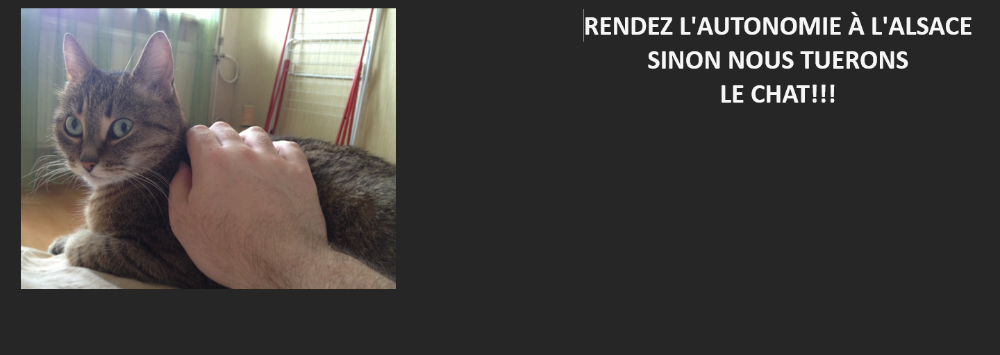
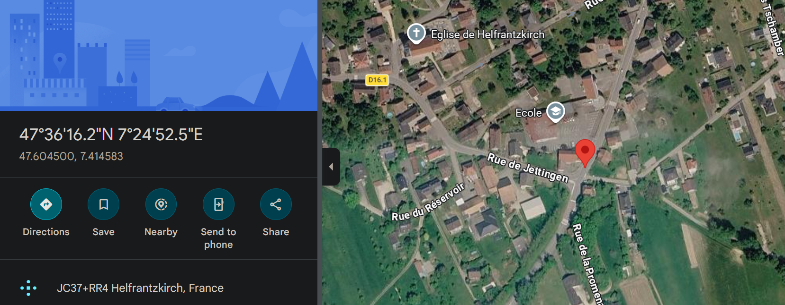

# Find the cat

## Challenge Details

- Category: Forensics
- Points: 25
- Validation: 14399
- Author: Thanat0s
- Status: Done
# Handout
`Find the cat: Rescue / Data mining; The president’s cat was kidnapped by separatists. A suspect carrying a USB key has been arrested. Berthier, once again you have to save the Republic! Analyze this key and find out in which city the cat is retained! The md5sum of the archive is edf2f1aaef605c308561888079e7f7f7. Input the city name in lowercase.`
https://static.root-me.org/forensic/ch9/ch9.gz
## Walkthrough
Judging by the description, we have a usb's disk image ad we need to find the exif data for a file.
Extracting:

```bash
$ gzip -d ch9.gz

$ ls
ch9

$ file ch9
ch9: DOS/MBR boot sector; partition 1 : ID=0xb, start-CHS (0x0,32,33), end-CHS (0x10,81,1), startsector 2048, 260096 sectors, extended partition table (last)
```

Indeed we are dealing with a disk image, a fat32 partition, with start sector 2048, we can have a detailed look at this using mmls (no autopsy, too overkill for a challenge with 14k solves)

```bash
$ mmls ch9
DOS Partition Table
Offset Sector: 0
Units are in 512-byte sectors

      Slot      Start        End          Length       Description
000:  Meta      0000000000   0000000000   0000000001   Primary Table (#0)
001:  -------   0000000000   0000002047   0000002048   Unallocated
002:  000:000   0000002048   0000262143   0000260096   Win95 FAT32 (0x0b)
```
Indeed, at offset 2048 we have the fat32 partition, let's use sleuthkit:

```bash
$ fls ch9
Cannot determine file system type
```
fls failed directly because the fs actually starts at offset 2048, as expected from above, supplying `-o 2048`

```bash
$ fls ch9 -o 2048
d/d 5:  Documentations
d/d 7:  Files
d/d 9:  WebSites
v/v 4096995:    $MBR
v/v 4096996:    $FAT1
v/v 4096997:    $FAT2
V/V 4096998:    $OrphanFiles
```

Great, let's go for the low hanging fruit first, since we are looking for a file for some metadata, let's see the files and documentations directories:

```bash
$ fls ch9 -o 2048 5
r/r 25: tartes_flambee_a_volonte_francais_2013.pdf
r/r 28: mangeur-de-cigogne (1).pdf
r/r * 32:       La résistance électronique.pdf
r/r 34: Menu AC.pdf
r/r 54726:      brasserie_jo_dinner_menu.pdf
r/r 54729:      Courba13-01.pdf
r/r 54731:      m-flamm.pdf
r/r 54734:      Barbey_Cigognes_BDC.pdf
r/r * 54738:    Anarchie, indolence & synarchie.pdf
r/r * 178246:   anarchistscookbookv2000.pdf
r/r 178250:     texte_migration_des_cigognes.pdf
r/r 178253:     mangeur-de-cigogne.pdf

$ fls ch9 -o 2048 7
r/r * 246775:   revendications.odt
r/r 246778:     421_20080208011.doc
r/r 246780:     Coker.doc
r/r 246784:     DataSanitizationTutorial.odt
r/r 363796:     Creer_votre_association.doc

```

So much lore wow, but immediately the deleted files (marked by the asterisk):
- `r/r * 246775:   revendications.odt` 
- `r/r * 32:       La résistance électronique.pdf`
- `r/r * 54738:    Anarchie, indolence & synarchie.pdf`
- `r/r * 178246:   anarchistscookbookv2000.pdf`
Caught my attention, let's get the ones in the Files dir, revendications.odt, first:
```bash
$ icat ch9 -o 2048 246775 > revindicationprocess.odt
$ file revindicationprocess.odt
revindicationprocess.odt: OpenDocument Text
```
It is an odt as per the extension, let's open it:



Cute. Interestingly the odt itself doesn't contain any exif data for location:
```bash
$ exiftool revindicationprocess.odt
ExifTool Version Number         : 13.50
File Name                       : revindicationprocess.odt
Directory                       : .
File Size                       : 2.3 MB
File Modification Date/Time     : 2026:06:13 03:42:45+05:30
File Access Date/Time           : 2026:06:13 03:43:29+05:30
File Inode Change Date/Time     : 2026:06:13 03:43:27+05:30
File Permissions                : -rwxrwxrwx
File Type                       : ODT
File Type Extension             : odt
MIME Type                       : application/vnd.oasis.opendocument.text
Initial-creator                 : thanatos
Creation-date                   : 2013:07:22 23:24:48
Date                            : 2013:07:22 23:25:23
Creator                         : thanatos
Editing-duration                : P0D
Editing-cycles                  : 1
Document-statistic Table-count  : 0
Document-statistic Image-count  : 1
Document-statistic Object-count : 0
Document-statistic Page-count   : 1
Document-statistic Paragraph-count: 3
Document-statistic Word-count   : 9
Document-statistic Character-count: 58
Document-statistic Non-whitespace-character-count: 51
Generator                       : LibreOffice/4.0.2.2$Linux_X86_64 LibreOffice_project/400m0$Build-2
Preview PNG                     : (Binary data 41974 bytes, use -b option to extract)
```

Maybe the image itself contains the metadata? Let's get the image itself, all these odt doc etc office files are glorified zip files, so we can extract them and look at their contents directly:
```bash
$ unzip revindicationprocess.odt
Archive:  revindicationprocess.odt
 extracting: mimetype
 extracting: Thumbnails/thumbnail.png
  inflating: Pictures/1000000000000CC000000990038D2A62.jpg
  inflating: content.xml
  inflating: styles.xml
  inflating: settings.xml
  inflating: meta.xml
  inflating: manifest.rdf
  inflating: Configurations2/accelerator/current.xml
   creating: Configurations2/toolpanel/
   creating: Configurations2/statusbar/
   creating: Configurations2/progressbar/
   creating: Configurations2/toolbar/
   creating: Configurations2/images/Bitmaps/
   creating: Configurations2/popupmenu/
   creating: Configurations2/floater/
   creating: Configurations2/menubar/
  inflating: META-INF/manifest.xml
```
And `Pictures/1000000000000CC000000990038D2A62.jpg` is our cat!, let's look at its exif data:

```bash
$ exiftool Pictures/1000000000000CC000000990038D2A62.jpg
ExifTool Version Number         : 13.50
File Name                       : 1000000000000CC000000990038D2A62.jpg
Directory                       : Pictures
File Size                       : 2.3 MB
File Modification Date/Time     : 2013:07:22 21:25:22+05:30
File Access Date/Time           : 2026:06:13 03:45:30+05:30
File Inode Change Date/Time     : 2026:06:13 03:45:29+05:30
File Permissions                : -rwxrwxrwx
File Type                       : JPEG
File Type Extension             : jpg
MIME Type                       : image/jpeg
Exif Byte Order                 : Big-endian (Motorola, MM)
Make                            : Apple
Camera Model Name               : iPhone 4S
Orientation                     : Horizontal (normal)
X Resolution                    : 72
Y Resolution                    : 72
Resolution Unit                 : inches
Software                        : 6.1.2
Modify Date                     : 2013:03:11 11:47:07
Y Cb Cr Positioning             : Centered
Exposure Time                   : 1/20
F Number                        : 2.4
Exposure Program                : Program AE
ISO                             : 160
Exif Version                    : 0221
Date/Time Original              : 2013:03:11 11:47:07
Create Date                     : 2013:03:11 11:47:07
Components Configuration        : Y, Cb, Cr, -
Shutter Speed Value             : 1/20
Aperture Value                  : 2.4
Brightness Value                : 1.477742947
Metering Mode                   : Multi-segment
Flash                           : Off, Did not fire
Focal Length                    : 4.3 mm
Subject Area                    : 1631 1223 881 881
Flashpix Version                : 0100
Color Space                     : sRGB
Exif Image Width                : 3264
Exif Image Height               : 2448
Sensing Method                  : One-chip color area
Exposure Mode                   : Auto
White Balance                   : Auto
Focal Length In 35mm Format     : 35 mm
Scene Capture Type              : Standard
GPS Latitude Ref                : North
GPS Longitude Ref               : East
GPS Altitude Ref                : Above Sea Level
GPS Time Stamp                  : 07:46:50.85
GPS Img Direction Ref           : True North
GPS Img Direction               : 247.3508772
Compression                     : JPEG (old-style)
Thumbnail Offset                : 902
Thumbnail Length                : 8207
Image Width                     : 3264
Image Height                    : 2448
Encoding Process                : Baseline DCT, Huffman coding
Bits Per Sample                 : 8
Color Components                : 3
Y Cb Cr Sub Sampling            : YCbCr4:2:0 (2 2)
Aperture                        : 2.4
Image Size                      : 3264x2448
Megapixels                      : 8.0
Scale Factor To 35 mm Equivalent: 8.2
Shutter Speed                   : 1/20
Thumbnail Image                 : (Binary data 8207 bytes, use -b option to extract)
GPS Altitude                    : 16.7 m Above Sea Level
GPS Latitude                    : 47 deg 36' 16.15" N
GPS Longitude                   : 7 deg 24' 52.48" E
Circle Of Confusion             : 0.004 mm
Field Of View                   : 54.4 deg
Focal Length 35mm Equiv         : 4.3 mm (35 mm equivalent: 35.0 mm)
GPS Position                    : 47 deg 36' 16.15" N, 7 deg 24' 52.48" E
Hyperfocal Distance             : 2.08 m
Light Value                     : 6.2
```

And indeed! it contains gps coordinates: `47 deg 36' 16.15" N, 7 deg 24' 52.48" E`, looking these up, this is in Helfrantzkirch, France (qui aurait pense with the aigue accent)



As per the instructions, helfrantzkirch is our flag!
# FLAG
helfrantzkirch
