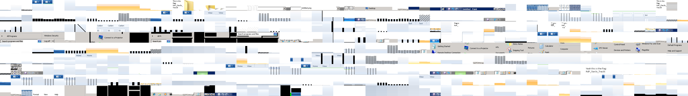
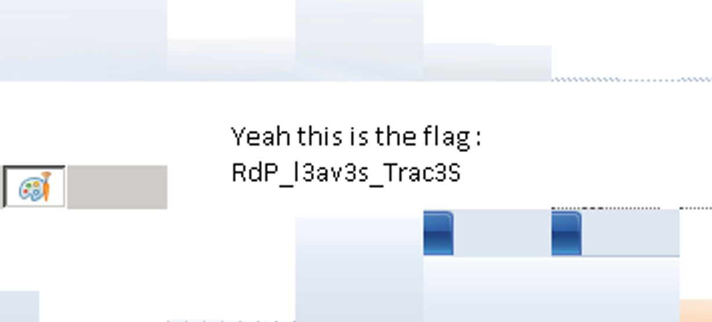

# Job interview

## Challenge Details

- Category: Forensics
- Points: 35
- Validation: 5746
- Author: makhno
- Status: TODO
# Handout
`Job interview: Hide-and-seek`
`You are invited to an interview for a forensics investigator position at the NSA. For your first technical evaluation they ask you to analyze this file. Prove to them that you’re a fitting candidate for this job.`
https://static.root-me.org/forensic/ch16/ch16.zip

## Walkthrough

Funny description. Unzipping:
```bash
$ unzip ch16.zip
Archive:  ch16.zip
  inflating: image_forensic.e01
```

It's an expert witness file, a live disk image! Let's use sleuthkit and see what's going on.

```bash
$ mmls -i ewf image_forensic.e01
```

Hmm, that's weird mmls didn't find any partitions? Let's try fsstat?

```bash
$ fsstat -i ewf -o 0 image_forensic.e01
Unsupported image type (Tar Archive)
```

WAT. 

```bash
$ file image_forensic.e01
image_forensic.e01: EWF/Expert Witness/EnCase image file format
```

It's definitely not a tar archive are you okay sleuthkit 😭
Let's try img_stat

```bash
$ img_stat -i ewf image_forensic.e01
IMAGE FILE INFORMATION
--------------------------------------------
Image Type:             ewf

Size of data in bytes:  9431040
Sector size:    512
MD5 hash of data:       ba74f9213ff89221eb9b68cd03ff0242
```

The file is definitely valid.. Let's try to ewfmount it 

```bash
$ ewfmount image_forensic.e01 ewf_mount_tar_lol/
ewfmount 20140816

fusermount3: mounting over filesystem type 0x01021997 is forbidden
Unable to fuse mount file system.

```

That's my bad for mounting it inside a windows dir. Moving to home dir.

```bash
$ mv  ewf_mount_tar_lol/ ~/ewf/ewf_mount_tar_lol
$ cp image_forensic.e01 ~/ewf
$ cd ~/ewf && ewfmount image_forensic.e01 ewf_mount_tar_lol/
$ file ewf_mount_tar_lol/ewf1
ewf_mount_tar_lol/ewf1: POSIX tar archive (GNU)
```

So it is a tar archive.. and not a full filesystem/disk image? Let's extract it.

```bash
$ tar -xvf ewf_mount_tar_lol/ewf1
bcache24.bmc
```

RDP CACHE! Basically if caching is enabled, the RDP protocol records hundreds of 64by64 bmp images, called tiles, of the screen, and saves them to bcache24.bmc or Cache0000.bin. `bmc-tools` is used to reconstruct these. Let's re-construct the RDP session. 

We can use `-b` with bmc-tools.py to tell it to make it's best reconstruction, as a collage.

```bash
$ python3 bmc-tools.py -s bcache24.bmc -d RDPCACHE  -b
[+++] Processing a single file: 'bcache24.bmc'.
[+++] Processing a file: 'bcache24.bmc'.
[===] 575 tiles successfully extracted in the end.
[===] Successfully exported 575 files.
[===] Successfully exported collage file.
```

Let's see the collage image:



And I immediately spotted the flag!



Alternatively, this was in tiles `bcache24.bmc_182.bmp`, `bcache24.bmc_183.bmp`, `bcache24.bmc_184.bmp`, `bcache24.bmc_426.bmp`,  `bcache24.bmc_435.bmp`,  `bcache24.bmc_436.bmp`,  `bcache24.bmc_528.bmp` and  `bcache24.bmc_573.bmp`.

And yes! rdp leaves traces like this, unless you tell it not to in the RDP config file, like `Default.rdp`, by setting:
`bitmapcachepersistenable:i:0`

# FLAG
RdP_l3av3s_Trac3S