# Remote Support

## Challenge Details

- Category: Forensics
- Points: 90
- Validation: 67
- Author: makhno
- Status: TODO
# Handout
`Remote Support: Hardening or not`
`Your system administrator asks you to help him harden his machine using the tools he has installed. You’ve taken a network capture and a memory dump, so show him that he’s still a long way off! The flag is of the form sha256(part1+part2+part3+part4+part5)`

## Walkthrough
5 parts.. that's definitely not tedious. Judging by the name we could have some anydesk/rdp type challenge? Extracting:

```bash
$ tar -xvf ch44.tar.xz
capture.pcap
memdump.raw
```

Let's first start with the network capture, opening in wireshark:
Immediately I spot SMB share packets, smb setup and tcp packets:

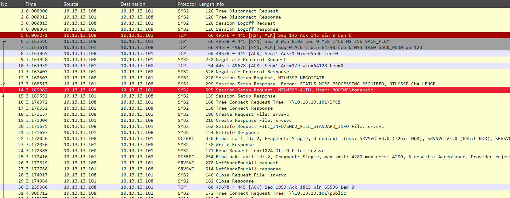

We could try to crack the password used for smb auth later if we get stuck, smb username is `forensic`

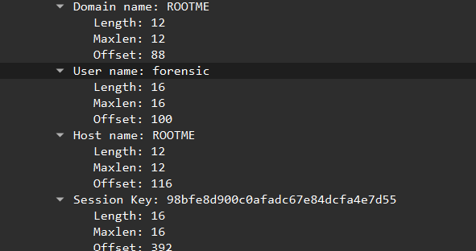

for now let's export all smb objects:

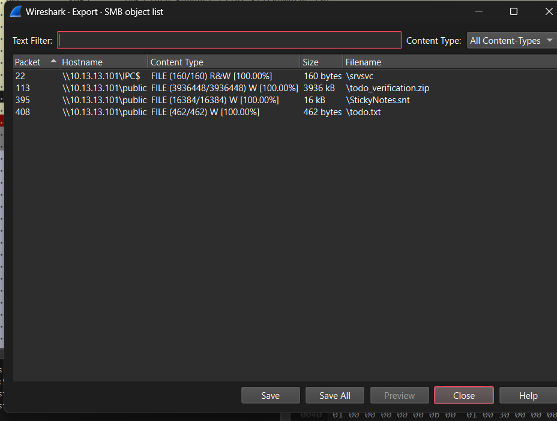

`srvsvc` is the windows server service which handles smb shares.. this is probably wireshark interpreting the smb pipe as an object..

```bash
$ cat smbshare/srvsvc
\pipe\srvsvc]�����+H`�O2Kp�xZG�n�,�l�@E
```

Yeah this is just the pipe, not relevant probably. 

Let's look at the other files:

```bash
$ cat smbshare/todo.txt
Todo :
- Upgrade old tools (Keepass, Teamviewer, ...)
- Find blogs about Teamviewer crypto
- Compare different remote administration tools to change them !
- Explanation on DPAPI crypto
- Sometimes wxHeditor (or an another tool) and file magic numbers can help you ;-)
- Read "The Holy Bible" : https://downloads.volatilityfoundation.org/releases/2.4/CheatSheet_v2.4.pdf
- Hardening again & again :-(
- The flag is sha256(part1+part2+part3+part4+part5)
```

```bash
$ unzip -l smbshare/todo_verification
Archive:  smbshare/todo_verification.zip
  Length      Date    Time    Name
---------  ---------- -----   ----
        0  2023-07-28 08:35   todo_verification/
 56062746  2023-07-28 08:35   todo_verification/hive_hklm.reg
     1051  2023-07-28 08:34   todo_verification/save_rdp.rdg
---------                     -------
 56063797                     3 files
```

```bash
$ file smbshare/StickyNotes.snt
smbshare/StickyNotes.snt: Composite Document File V2 Document, Cannot read section info
```

The todo.txt mentions upgrading the software; they might be old and have security vulns. We were right about a remote application, just not anydesk. Teamviewer / keepass related cve to be analysed from the dump later i guess. DPAPI Crypto mention is interesting (spoiler).   

todo_verification.zip contains the hklm registry hive, we could have dumped this from volatility as well but maybe it wasn't cleanly extractable, we can open this in eric zimmerman's registry explorer if necessary.
save_rdp.rdg and StickyNotes.snt are most interesting.

StickyNotes.snt is an old sticky note file (shocking), let's just strings it:

```bash
$ strings -a smbshare/StickyNotes.snt
{\rtf1\ansi\ansicpg1252\deff0\nouicompat\deflang1036{\fonttbl{\f0
0\fnil Segoe Print;}}
{\*\generator Riched20 10.0.10586}\viewkind4\uc1
\pard\tx360\tx720\tx1080\tx1440\tx1800\tx2160\tx2520\tx2880\tx3240\tx3600\tx3960\tx4320\tx4680\tx5040\tx5400\tx5760\tx6120\tx6480\tx6840\tx7200\tx7560\tx7920\tx8280\tx8640\tx9000\tx9360\tx9720\tx10080\tx10440\tx10800\tx11160\tx11520\f0\fs22\lang12 A free gift ;-)\par
UGFydDEg 4lw4ys_G1ve_a_Fr33_G1ft\par

$ echo UGFydDEg | base64 -di
Part1
```

And that's Part 1! Normally I'd complain how simple this was, but there's 5 parts, so who's to look a gift horse in the mouth.

`Part1: 4lw4ys_G1ve_a_Fr33_G1ft`

Let's look at the rdg file:

```xml
$ cat smbshare/todo_verification/save_rdp.rdg
<?xml version="1.0" encoding="utf-8"?>
<RDCMan programVersion="2.93" schemaVersion="3">
  <file>
    <credentialsProfiles />
    <properties>
      <expanded>True</expanded>
      <name>save_rdp</name>
    </properties>
    <server>
      <properties>
        <name>10.13.13.103</name>
        <comment>Just for Fun</comment>
      </properties>
      <logonCredentials inherit="None">
        <profileName scope="Local">Custom</profileName>
        <userName>forensic</userName>
        <password>AQAAANCMnd8BFdERjHoAwE/Cl+sBAAAA9fFW4YM7FkexTMDZVoSSRgAAAAACAAAAAAAQZgAAAAEAACAAAACGikb/Wn5Fs9X6Ia6sW9SbJtkAhl1QRXi/vKnrnQ90bAAAAAAOgAAAAAIAACAAAACMjvY1CihQ7oiw4Lbf0RjBlEdBD/ulPrlAGiEUGycjD0AAAAA70WN+m2kMOcdoZ2/aPHLS9D4VvbDC8U56BE2CtZWGnbbRc0VnYElm1zKQxJ4FYCRshGarVdOgLX3TDKKE1eV2QAAAAO02VD2Nx7El4EE1qKBklgFuLCESc9bhp6I6r7BVfvX8AwcOoMvy3Gzf6rdgpCSE1dcJmNSvFNGhiA3WoAmpcEI=</password>
        <domain>ROOTME</domain>
      </logonCredentials>
    </server>
  </file>
  <connected />
  <favorites />
  <recentlyUsed />
</RDCMan>
```

RDCMan is the remote desktop connection manager! Guess I was right about rdp..
It has one saved connection to `10.13.13.103`, and I'm guessing we need to get the plaintext password for part 2.


From the SMB packets, `10.13.13.108` was querying these files using smb from `10.13.13.103`, so what probably happened is they got smb access somehow, and with the rdcman file, they are going to connect via rdp to the victim by uncovering the password from the rdg file.

Let's get the password ourselves. Looking online, I found:
https://ogmini.github.io/2025/05/27/RDCMan-Verifying-DPAPI-Activity.html
https://superuser.com/questions/1103193/decrypt-rdp-password-stored-in-rdg-file
So that's why todo.txt was referencing DPAPI and CryptProtectData! rdg uses these for encrypting the password.

However, the superuser scripts didn't work, because it heavily uses the current logged in user's profile and DPAPI master keys, so it can't be decrypted by CryptUnprotectData directly on my computer. However, since we have the hklm hive, we can probably recover everything.

RDCMan encryption flow:
- RDCMan has plaintext password in memory.
- It calls `CryptProtectData`
- Windows unlocks DPAPI master key tied to the current Windows user.
- Windows encrypts the password.
- RDCMan Base64-encodes the blob and writes it into the `.rdg`.

I found https://www.exploit-db.com/docs/48589 to get an idea on how DPAPI works.

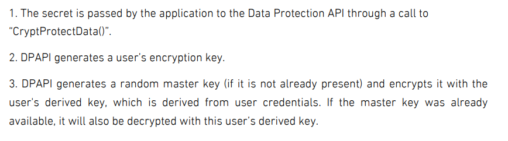

So we need to get the user's encryption key and the master key, user credentials are trivial to get from the registry. But getting the master key seems tricky, since that is not stored in the registry.
I couldn't think of anything, maybe we can find something in the dump then?

http://posts.specterops.io/operational-guidance-for-offensive-user-dpapi-abuse-1fb7fac8b107

"At a high level, for the user scenario, a user’s password is used to derive a user-specific “master key”. These keys are located at `C:\Users\<USER>\AppData\Roaming\Microsoft\Protect\<SID>\<GUID>`, where SID is the user’s security identifier and the GUID is the name of the master key. A user can have multiple master keys. This master key needs to be decrypted using the user’s password OR the domain backup key and is then used to decrypt any DPAPI data blobs.

So a simple filescan should do the trick?

```bash
$vol -f memdump.raw  windows.info

Kernel Base     0xf80398880000
DTB     0x1aa000
Symbols file:///home/hyp3rnov4/.local/lib/python3.13/site-packages/volatility3/symbols/windows/ntkrnlmp.pdb/0DE6DC238E194BB78608D54B1E6FA379-1.json.xz
Is64Bit True
IsPAE   False
layer_name      0 WindowsIntel32e
memory_layer    1 FileLayer
KdVersionBlock  0xf80398b44dc0
Major/Minor     15.10586
MachineType     34404
KeNumberProcessors      1
SystemTime      2023-07-28 07:20:40+00:00
NtSystemRoot    C:\Windows
NtProductType   NtProductWinNt
NtMajorVersion  10
NtMinorVersion  0
PE MajorOperatingSystemVersion  10
PE MinorOperatingSystemVersion  0
PE Machine      34404
PE TimeDateStamp        Fri Oct 30 02:15:45 2015
```

It's a windows 10 dump, let's run filescan:

```bash
$ vol -f memdump.raw windows.filescan > files.txt && rg Protect files.txt
1537:0xe00076aa9580     \ProtectedPrefix\LocalService
1538:0xe00076aa9740     \ProtectedPrefix\Administrators
1539:0xe00076aa9900     \ProtectedPrefix\Administrators
1540:0xe00076aa9ac0     \ProtectedPrefix
1541:0xe00076aa9c30     \ProtectedPrefix
1542:0xe00076aaa090     \ProtectedPrefix\LocalService
1546:0xe00076aaadb0     \ProtectedPrefix\NetWorkService
1547:0xe00076aaaf20     \ProtectedPrefix\NetWorkService
1720:0xe00076c676a0     \Windows\System32\Microsoft\Protect\S-1-5-18\Preferred
1981:0xe00076eb14e0     \Windows\System32\Microsoft\Protect\S-1-5-18\User\a3370750-4963-4e33-950d-55dd86db6f72
2410:0xe0007715ba70     \Windows\System32\Microsoft\Protect\S-1-5-18\225b4dd9-f174-4ff5-912c-59b90942d389
2462:0xe0007719d630     \Windows\System32\Microsoft\Protect\S-1-5-18\User\e3c157ce-c744-43c1-8c4a-d34cff2702a1
4115:0xe00077d52470     \Windows\System32\Tasks\Microsoft\Windows\SoftwareProtectionPlatform\SvcRestartTaskNetwork
4128:0xe00077d593b0     \Windows\System32\Tasks\Microsoft\Windows\SoftwareProtectionPlatform\SvcRestartTask
4133:0xe00077d5a5a0     \Windows\System32\Tasks\Microsoft\Windows\SoftwareProtectionPlatform\SvcRestartTaskLogon
4527:0xe0007809bca0     \Users\forensic\AppData\Roaming\Microsoft\Protect\CREDHIST
4758:0xe00078173090     \Users\forensic\AppData\Roaming\Microsoft\Protect\S-1-5-21-2145360380-4246029103-3466432845-1001\e156f1f5-3b83-4716-b14c-c0d956849246
```

And there it is! Let's dump `CREDHIST` and `S-1-5-21-2145360380-4246029103-3466432845-1001\e156f1f5-3b83-4716-b14c-c0d956849246`

```bash
$ vol -f memdump.raw windows.dumpfiles --virtaddr 0xe0007809bca0
Volatility 3 Framework 2.28.0
Progress:  100.00               PDB scanning finished
Cache   FileObject      FileName        Result

DataSectionObject       0xe0007809bca0  CREDHIST        file.0xe0007809bca0.0xe00077062010.DataSectionObject.CREDHIST.dat

$ vol -f memdump.raw windows.dumpfiles --virtaddr 0xe00078173090
Volatility 3 Framework 2.28.0
Progress:  100.00               PDB scanning finished
Cache   FileObject      FileName        Result
```

Unfortunately volatility couldn't get the encrypted masterkey file.. and CREDHIST only helps us decode keys made with a different windows password. 
Speaking of, let's quickly dump the ntlm hash for that using hashdump:

```bash
$ vol -f memdump.raw windows.hashdump
Volatility 3 Framework 2.28.0
Administrateur  500     aad3b435b51404eeaad3b435b51404ee        31d6cfe0d16ae931b73c59d7e0c089c0
Invité  501     aad3b435b51404eeaad3b435b51404ee        31d6cfe0d16ae931b73c59d7e0c089c0
DefaultAccount  503     aad3b435b51404eeaad3b435b51404ee        31d6cfe0d16ae931b73c59d7e0c089c0
forensic        1001    aad3b435b51404eeaad3b435b51404ee        bf6fad5003c7ccd8cbbd0251ccc4c2af
```

`bf6fad5003c7ccd8cbbd0251ccc4c2af` is the ntlm hash for our forensic account, let's decrypt it using hashcat with ntlm mode 1000

```bash
$ hashcat -m 1000 hash.txt -a 0 ~/wordlists/rockyou.txt

Dictionary cache hit:
* Filename..: /home/hyp3rnov4/wordlists/rockyou.txt
* Passwords.: 14344384
* Bytes.....: 139921497
* Keyspace..: 14344384

bf6fad5003c7ccd8cbbd0251ccc4c2af:forensic1

Session..........: hashcat
Status...........: Cracked
Hash.Mode........: 1000 (NTLM)
Hash.Target......: bf6fad5003c7ccd8cbbd0251ccc4c2af
Time.Started.....: Sun Jun 14 22:05:06 2026 (0 secs)
Time.Estimated...: Sun Jun 14 22:05:06 2026 (0 secs)
Kernel.Feature...: Pure Kernel
Guess.Base.......: File (/home/hyp3rnov4/wordlists/rockyou.txt)
Guess.Queue......: 1/1 (100.00%)
Speed.#1.........:   113.1 MH/s (1.75ms) @ Accel:2048 Loops:1 Thr:32 Vec:1
Speed.#2.........:   967.7 kH/s (0.29ms) @ Accel:512 Loops:1 Thr:1 Vec:8
Speed.#*.........:   114.0 MH/s
Recovered........: 1/1 (100.00%) Digests (total), 1/1 (100.00%) Digests (new)
Progress.........: 1634304/14344384 (11.39%)
Rejected.........: 0/1634304 (0.00%)
Restore.Point....: 0/14344384 (0.00%)
Restore.Sub.#1...: Salt:0 Amplifier:0-1 Iteration:0-1
Restore.Sub.#2...: Salt:0 Amplifier:0-1 Iteration:0-1
Candidate.Engine.: Device Generator
Candidates.#1....: vivien -> lesamarie
Candidates.#2....: khaleeda -> katukayu
Hardware.Mon.#1..: Temp: 48c Util:  0% Core:2370MHz Mem:8000MHz Bus:8
Hardware.Mon.#2..: N/A

Started: Sun Jun 14 22:05:04 2026
Stopped: Sun Jun 14 22:05:07 2026
```

And it was in rockyou! 
username: `forensic`
password: `forensic1`

Now let's look for other ways to dump the masterkey.. maybe it's in lsass? Or better we could use the pypykatz vol plugin to directly look at the secrets.

```bash
$ pip install pypykatz
$ git clone https://github.com/skelsec/pypykatz-volatility3
$ vol -f memdump.raw -p ./pypykatz-volatility3 pypykatz
```

And it failed, spectacularly.

```bash
$ vol -f memdump.raw -p ./pypykatz-volatility3 pypykatz
Volatility 3 Framework 2.28.0
Traceback (most recent call last):B scanning finished
  File "/home/hyp3rnov4/.local/lib/python3.13/site-packages/pypykatz/pypykatz.py", line 270, in get_lsa
    lsa_dec = LsaDecryptor.choose(self.reader, lsa_dec_template, self.sysinfo)
  File "/home/hyp3rnov4/.local/lib/python3.13/site-packages/pypykatz/lsadecryptor/lsa_decryptor.py", line 20, in choose
    return LsaDecryptor_NT6(reader, decryptor_template, sysinfo)
...
    raise Exception('All detection methods failed.')
Exception: All detection methods failed.
```

Even tried the older CRONUS FORK.

```bash
$ git clone https://github.com/CRONUS-Security/Volatility3-pypykatz $ vol -f memdump.raw -p ./Volatility3-pypykatz pypykatz
```

And it failed even more spectacularly. It was calling an older volatility api

```bash
TypeError: PsList.list_processes() got an unexpected keyword argument 'layer_name'
```

So I downgraded volatility to 2.26.0, and IT STILL FAILED.

```bash
$ vol -f memdump.raw -p ./pypykatz-volatility3 pypykatz
Volatility 3 Framework 2.26.0
Traceback (most recent call last):B scanning finished
  File "/home/hyp3rnov4/.local/lib/python3.13/site-packages/pypykatz/pypykatz.py", line 270, in get_lsa
    lsa_dec = LsaDecryptor.choose(self.reader, lsa_dec_template, self.sysinfo)
  File "/home/hyp3rnov4/.local/lib/python3.13/site-packages/pypykatz/lsadecryptor/lsa_decryptor.py", line 20, in choose
    return LsaDecryptor_NT6(reader, decryptor_template, sysinfo)
...
    raise Exception('All detection methods failed.')
Exception: All detection methods failed.
```

Somehow it's not finding the lsa signature. I even checked for dlls hooked to our lsass.exe pid 504 and lsa service was there:

```bash
$ vol -f memdump.raw windows.dlllist.DllList --pid 504 | rg lsasrv
504gresslsass.exe       0x7ff9521b0000an0x15b000ished   lsasrv.dll      C:\Windows\system32\lsasrv.dll  6       2023-07-28 06:38:23.000000 UTC  Disabled
```

Let's just try dumping the lsass.exe process memory and run mimikatz on it.

```bash
$ vol -f memdump.raw windows.pslist > pslist.txt && cat pslist.txt
Volatility 3 Framework 2.28.0   PDB scanning finished

PID     PPID    ImageFileName   Offset(V)       Threads Handles SessionId       Wow64   CreateTime      ExitTime       File output

4       0       System  0xe00074666680  102     -       N/A     False   2023-07-28 06:38:23.000000 UTC  N/A     Disabled
264     4       smss.exe        0xe000759e8040  2       -       N/A     False   2023-07-28 06:38:23.000000 UTC  N/A    Disabled
340     332     csrss.exe       0xe00076bb1080  8       -       0       False   2023-07-28 06:38:23.000000 UTC  N/A    Disabled
412     332     wininit.exe     0xe00076dfc080  1       -       0       False   2023-07-28 06:38:23.000000 UTC  N/A    Disabled
420     404     csrss.exe       0xe00077044080  10      -       1       False   2023-07-28 06:38:23.000000 UTC  N/A    Disabled
472     404     winlogon.exe    0xe0007708c080  2       -       1       False   2023-07-28 06:38:23.000000 UTC  N/A    Disabled
496     412     services.exe    0xe000770dd080  5       -       0       False   2023-07-28 06:38:23.000000 UTC  N/A    Disabled
504     412     lsass.exe       0xe000770f2340  5       -       0       False   2023-07-28 06:38:23.000000 UTC  N/A    Disabled
600     496     svchost.exe     0xe000771c17c0  16      -       0       False   2023-07-28 06:38:23.000000 UTC  N/A    Disabled
632     496     svchost.exe     0xe000772267c0  10      -       0       False   2023-07-28 06:38:23.000000 UTC  N/A    Disabled
724     472     dwm.exe 0xe000772b0080  10      -       1       False   2023-07-28 06:38:24.000000 UTC  N/A     Disabled
824     496     svchost.exe     0xe000772e77c0  23      -       0       False   2023-07-28 06:38:24.000000 UTC  N/A    Disabled
884     496     svchost.exe     0xe000746af080  11      -       0       False   2023-07-28 06:38:24.000000 UTC  N/A    Disabled
916     496     svchost.exe     0xe000746c6080  13      -       0       False   2023-07-28 06:38:24.000000 UTC  N/A    Disabled
924     496     VBoxService.ex  0xe000746c1080  11      -       0       False   2023-07-28 06:38:24.000000 UTC  N/A    Disabled
996     496     svchost.exe     0xe0007468b240  18      -       0       False   2023-07-28 06:38:24.000000 UTC  N/A    Disabled
1016    496     svchost.exe     0xe0007468f080  45      -       0       False   2023-07-28 06:38:24.000000 UTC  N/A    Disabled
96      496     svchost.exe     0xe00074690080  19      -       0       False   2023-07-28 06:38:24.000000 UTC  N/A    Disabled
344     496     svchost.exe     0xe000772e47c0  17      -       0       False   2023-07-28 06:38:24.000000 UTC  N/A    Disabled
1068    496     spoolsv.exe     0xe000773777c0  9       -       0       False   2023-07-28 06:38:24.000000 UTC  N/A    Disabled
1476    496     svchost.exe     0xe000775fd080  4       -       0       False   2023-07-28 06:38:25.000000 UTC  N/A    Disabled
1540    496     svchost.exe     0xe0007763d7c0  11      -       0       False   2023-07-28 06:38:25.000000 UTC  N/A    Disabled
1580    496     svchost.exe     0xe00076e274c0  5       -       0       False   2023-07-28 06:38:25.000000 UTC  N/A    Disabled
1588    496     MsMpEng.exe     0xe00077675080  20      -       0       False   2023-07-28 06:38:25.000000 UTC  N/A    Disabled
1612    496     TeamViewer_Ser  0xe00077686080  14      -       0       True    2023-07-28 06:38:25.000000 UTC  N/A    Disabled
1668    496     NisSrv.exe      0xe000778557c0  7       -       0       False   2023-07-28 06:38:27.000000 UTC  N/A    Disabled
2256    1016    sihost.exe      0xe00077b5d7c0  8       -       1       False   2023-07-28 06:38:29.000000 UTC  N/A    Disabled
2308    1016    taskhostw.exe   0xe000758987c0  9       -       1       False   2023-07-28 06:38:29.000000 UTC  N/A    Disabled
2452    1612    TeamViewer.exe  0xe00077c8c580  6       -       1       True    2023-07-28 06:38:30.000000 UTC  N/A    Disabled
2480    600     RuntimeBroker.  0xe00077ca1080  13      -       1       False   2023-07-28 06:38:31.000000 UTC  N/A    Disabled
2516    472     userinit.exe    0xe00077ccd7c0  0       -       1       False   2023-07-28 06:38:31.000000 UTC  2023-07-28 06:39:01.000000 UTC  Disabled
2548    2516    explorer.exe    0xe00077cdc7c0  40      -       1       False   2023-07-28 06:38:32.000000 UTC  N/A    Disabled
2648    1612    tv_w32.exe      0xe00076cd47c0  1       -       1       True    2023-07-28 06:38:34.000000 UTC  N/A    Disabled
2656    1612    tv_x64.exe      0xe00076c6c7c0  1       -       1       False   2023-07-28 06:38:34.000000 UTC  N/A    Disabled
2796    496     SearchIndexer.  0xe00077d167c0  15      -       0       False   2023-07-28 06:38:38.000000 UTC  N/A    Disabled
3056    600     ShellExperienc  0xe00077dbd7c0  30      -       1       False   2023-07-28 06:38:38.000000 UTC  N/A    Disabled
2500    600     SearchUI.exe    0xe00077fc17c0  34      -       1       False   2023-07-28 06:38:39.000000 UTC  N/A    Disabled
3764    2548    VBoxTray.exe    0xe00078178080  11      -       1       False   2023-07-28 06:38:52.000000 UTC  N/A    Disabled
3936    2548    StikyNot.exe    0xe000780cd080  6       -       1       False   2023-07-28 06:38:53.000000 UTC  N/A    Disabled
3580    496     svchost.exe     0xe000749657c0  1       -       1       False   2023-07-28 06:40:36.000000 UTC  N/A    Disabled
744     600     SkypeHost.exe   0xe00077dc4080  24      -       1       True    2023-07-28 06:48:42.000000 UTC  N/A    Disabled
1784    1016    taskhostw.exe   0xe00074a9d7c0  3       -       1       False   2023-07-28 07:04:33.000000 UTC  N/A    Disabled
220     2548    mstsc.exe       0xe00074c43200  20      -       1       False   2023-07-28 07:09:02.000000 UTC  N/A    Disabled
2460    2548    KeePass.exe     0xe00074a5f080  8       -       1       False   2023-07-28 07:20:16.000000 UTC  N/A    Disabled

```

As promised, teamviewer and keypass are also there, we'll look for a kdbx file after this.
Let's memmap extract lsass and run mimikatz on it.

`504     412     lsass.exe       0xe000770f2340  5       -       0       False   2023-07-28 06:38:23.000000 UTC  N/A    Disabled`

lsass.exe with pid 504

```bash
$ vol -f memdump.raw windows.memmap --pid 504 --dump
$ cp /usr/share/windows-resources/mimikatz/x64/mimikatz.exe .
```

Let's run mimikatz on it:

```powershell
D:\CTF\rootme\remotesupport>mimikatz.exe

  .#####.   mimikatz 2.2.0 (x64) #19041 Sep 19 2022 17:44:08
 .## ^ ##.  "A La Vie, A L'Amour" - (oe.eo)
 ## / \ ##  /*** Benjamin DELPY `gentilkiwi` ( benjamin@gentilkiwi.com )
 ## \ / ##       > https://blog.gentilkiwi.com/mimikatz
 '## v ##'       Vincent LE TOUX             ( vincent.letoux@gmail.com )
  '#####'        > https://pingcastle.com / https://mysmartlogon.com ***/

mimikatz # sekurlsa::minidump pid.504.dmp
Switch to MINIDUMP : 'pid.504.dmp'

mimikatz # sekurlsa::dpapi
Opening : 'pid.504.dmp' file for minidump...
ERROR kuhl_m_sekurlsa_acquireLSA ; Memory opening
```

And it doesn't work and crashes. 
oH RIGHT mimikatz expects a proper minidump, and the volatility memmap dump is.. not a minidump. That's unfortunate.

 I found an open issue on volatility3 repo regarding minidump support.... from 2 years ago 💀💀
https://github.com/volatilityfoundation/volatility3/issues/1102

The only other thing I can think about is mounting the dump using MemProcFS and running mimikatz on lsass from there, and right as I was about to do that I spotted in the MemProcFS gh that it doesn't mount special processes... LIKE LSASS:

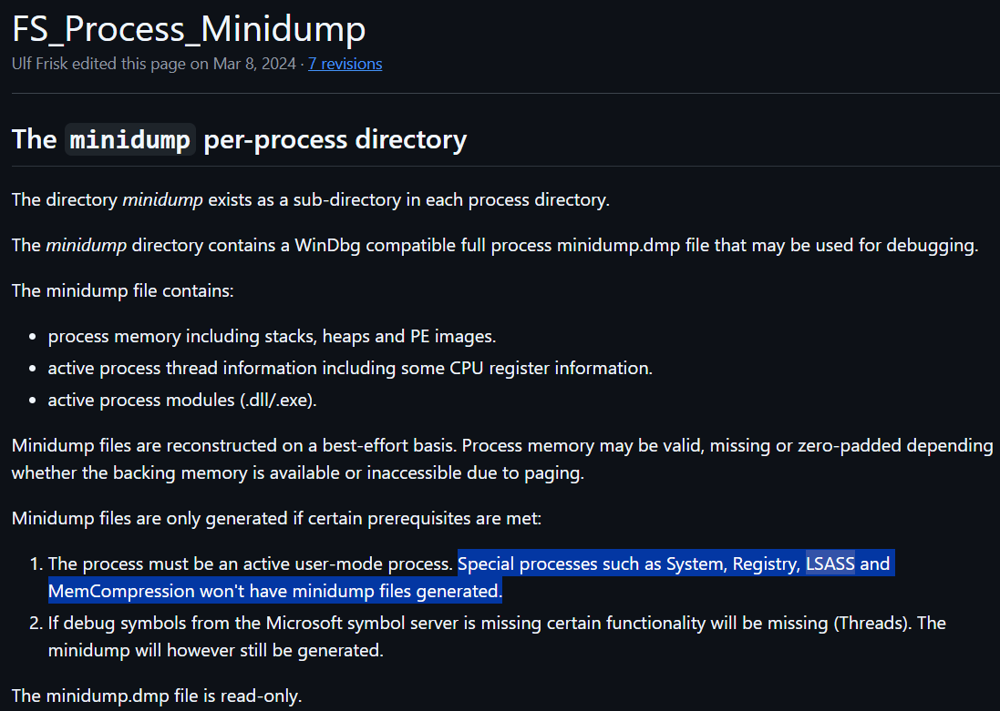

💀💀💀
We could probably try some older version, but then I had a very good idea


I remembered about LSADUMP!!! AND FOR THAT I UPGRADED VOLATILITY BACK TO 2.28.1.
AND DRUMROLL....
```bash
$ python3 volatility3/vol.py -f memdump.raw windows.registry.lsadump
Volatility 3 Framework 2.28.1
Progress:  100.00               PDB scanning finished
Key     Secret  Hex

DefaultPassword
00 00 00 00 00 00 00 00 00 00 00 00 00 00 00 00 ................
0c 42 1f 94 9d ae bc 4d b2 35 b1 ca ac 59 46 9e .B.....M.5...YF.        00 00 00 00 00 00 00 00 00 00 00 00 00 00 00 00 0c 42 1f 94 9d ae bc 4d b2 35 b1 ca ac 59 46 9e
DPAPI_SYSTEM
2c 00 00 00 00 00 00 00 00 00 00 00 00 00 00 00 ,...............
01 00 00 00 43 26 9d a4 70 69 76 8b f2 fc 6a 32 ....C&..piv...j2
b0 46 b8 60 ee 3e 85 a5 06 b1 85 7b a9 29 0e 09 .F.`.>.....{.)..
2d 70 a8 8e c0 94 94 bc 0f f0 ba b4 00 00 00 00 -p..............        2c 00 00 00 00 00 00 00 00 00 00 00 00 00 00 00 01 00 00 00 43 26 9d a4 70 69 76 8b f2 fc 6a 32 b0 46 b8 60 ee 3e 85 a5 06 b1 85 7b a9 29 0e 09 2d 70 a8 8e c0 94 94 bc 0f f0 ba b4 00 00 00 00
NL$KM
40 00 00 00 00 00 00 00 00 00 00 00 00 00 00 00 @...............
ce 65 83 11 92 8b 81 d5 12 90 e7 08 da c6 45 10 .e............E.
d3 22 de db d8 76 07 08 ae be b2 e0 03 23 27 d3 ."...v.......#'.
03 43 3d 65 4d 1f 5c a3 82 85 c9 65 3a 62 e8 4c .C=eM.\....e:b.L
40 06 d1 12 72 8e b7 b1 e6 ad ed d0 28 9e 56 2c @...r.......(.V,
30 3b f8 01 c9 03 79 ee a3 53 ae 16 11 0f 4a 8c 0;....y..S....J.        40 00 00 00 00 00 00 00 00 00 00 00 00 00 00 00 ce 65 83 11 92 8b 81 d5 12 90 e7 08 da c6 45 10 d3 22 de db d8 76 07 08 ae be b2 e0 03 23 27 d3 03 43 3d 65 4d 1f 5c a3 82 85 c9 65 3a 62 e8 4c 40 06 d1 12 72 8e b7 b1 e6 ad ed d0 28 9e 56 2c 30 3b f8 01 c9 03 79 ee a3 53 ae 16 11 0f 4a 8c
```

THERE'S A DPAPI KEY, I found online that it's split as:
`DPAPI_SYSTEM which contains the DPAPI machine and user key for local DPAPI`
So here we have:
```
dpapi_machinekey = 43269da47069768bf2fc6a32b046b860ee3e85a5
dpapi_userkey    = 06b1857ba9290e092d70a88ec09494bc0ff0bab4
```

However, unfortunately, this is  NOT FOR RDCMan
DPAPI_SYSTEM SECRET IN LSA IS FOR THE SYSTEM DPAPI >:((((
This is for the other key we found, at:
```bash
1981:0xe00076eb14e0     \Windows\System32\Microsoft\Protect\S-1-5-18\User\a3370750-4963-4e33-950d-55dd86db6f72
2410:0xe0007715ba70     \Windows\System32\Microsoft\Protect\S-1-5-18\225b4dd9-f174-4ff5-912c-59b90942d389
2462:0xe0007719d630     \Windows\System32\Microsoft\Protect\S-1-5-18\User\e3c157ce-c744-43c1-8c4a-d34cff2702a1
```

But now that we are on a newer version, we could try mftscan, maybe our master key was in residentdata / ads.

```
$ python3 volatility3/vol.py -f memdump.raw windows.mftscan.MFTScan > mftscan.txt
$ python3 volatility3/vol.py -f memdump.raw windows.mftscan.ResidentData > mftresident.txt
$ python3 volatility3/vol.py -f memdump.raw windows.mftscan.ADS > mftads.txt
```

Let's look for our key file from before in these.

```bash
$ rg e156f1f5 mft*
mftresident.txt
9010:0x71109c8  FILE    86858   DATA    e156f1f5-3b83-4716-b14c-c0d956849246
40823:0x1277adc8        FILE    90895   DATA    e156f1f5-3b83-4716-b14c-c0d956849246

mftscan.txt
9861:* 0x7110920        FILE    86858   2       File    ArchiveHiddenSystem     FILE_NAME       2023-07-28 06:24:20.000000 UTC  2023-07-28 06:24:20.000000 UTC  2023-07-28 06:24:20.000000 UTC     2023-07-28 06:24:20.000000 UTC  e156f1f5-3b83-4716-b14c-c0d956849246
32638:* 0x1277ad20      FILE    90895   2       File    ArchiveHiddenSystem     FILE_NAME       2023-07-28 06:36:31.000000 UTC  2023-07-28 06:36:31.000000 UTC  2023-07-28 06:36:31.000000 UTC     2023-07-28 06:36:31.000000 UTC  e156f1f5-3b83-4716-b14c-c0d956849246
```

YOOOOOOOOOOOOOOOOOOOOOOOOOOOOOOOOOOOOOOOOOOOOOOOOOOOOOOOOOOOOOOOO
THAT'S WHY DUMPFILES FAILED BECAUSE IT WAS IN NTFS MFT. THAT'S WHY THERE'S A RESIDENT `$DATA` ATTRIBUTE FOR `e156f1f5-3b83-4716-b14c-c0d956849246`

LET'S EXTRACT THIS DIRECTLY FROM THE MFT RECORD.

```text
0x71109c8       FILE    86858   DATA    e156f1f5-3b83-4716-b14c-c0d956849246
02 00 00 00 00 00 00 00 00 00 00 00 65 00 31 00 ............e.1.
35 00 36 00 66 00 31 00 66 00 35 00 2d 00 33 00 5.6.f.1.f.5.-.3.
62 00 38 00 33 00 2d 00 34 00 37 00 31 00 36 00 b.8.3.-.4.7.1.6.
2d 00 62 00 31 00 34 00 63 00 2d 00 63 00 30 00 -.b.1.4.c.-.c.0.
64 00 39 00 35 00 36 00 38 00 34 00 39 00 32 00 d.9.5.6.8.4.9.2.
34 00 36 00 00 00 00 00 00 00 00 00 05 00 00 00 4.6.............
b0 00 00 00 00 00 00 00 90 00 00 00 00 00 00 00 ................
14 00 00 00 00 00 00 00 00 00 00 00 00 00 00 00 ................
02 00 00 00 90 9c 07 29 ac fb c3 83 9f d8 8d ab .......)........
45 9e f5 fd 40 1f 00 00 0e 80 00 00 10 66 00 00 E...@........f..
bd 9c 3e c8 f8 f8 6f c8 db fc 54 f2 b8 bb f0 2a ..>...o...T....*
b9 94 af cd d3 91 46 e5 56 04 d7 74 ec 5c 0b 73 ......F.V..t.\.s
15 09 94 ac 94 49 4f 88 b4 60 56 ec 38 e5 41 fd .....IO..`V.8.A.
f5 db 3f e1 6a 80 cb 90 83 8f a3 c0 1c bd 8c e8 ..?.j...........
17 6c da 6a 68 9c 3a 47 1b 0b 9f 57 63 3d a3 87 .l.jh.:G...Wc=..
a5 8f bb 6c d2 72 70 59 51 98 fb b3 b0 ea 03 cd ...l.rpYQ.......
f5 1c ad 3e 27 08 96 38 4b 32 73 29 11 61 b7 b8 ...>'..8K2s).a..
96 08 9e b3 1b 4e 01 0c 5e 15 d2 d6 96 6f 9f f9 .....N..^....o..
fd 01 4c eb bc e5 5c dd c8 48 89 ad a7 23 54 23 ..L...\..H...#T#
02 00 00 00 23 a1 33 e4 6e de 37 19 e3 7b 5c 84 ....#.3.n.7..{\.
19 3e 7d 11 40 1f 00 00 0e 80 00 00 10 66 00 00 .>}.@........f..
e6 87 9c 47 c5 3a e9 ab 2f 99 75 d9 1e e6 6a f3 ...G.:../.u...j.
2e 57 8c cf 60 d3 dc 0a 49 63 fb 42 4c 4a b4 47 .W..`...Ic.BLJ.G
ef 44 e6 40 69 dc 91 9e 85 3a a7 31 9b 0e 4c 17 .D.@i....:.1..L.
0a 5e 82 c8 7f 02 04 56 19 57 2d ea c7 98 30 11 .^.....V.W-...0.
17 28 42 6c 89 a2 c3 fd 67 6d 66 e5 6f a8 98 0e .(Bl....gmf.o...
5c 21 a6 dc 6d 9c a9 fd 47 79 2c e2 a8 3a ab 28 \!..m...Gy,..:.(
3f 72 6b 53 e7 1b d4 67 73 55 c3 a6 39 9e 74 73 ?rkS...gsU..9.ts
03 00 00 00 f1 6c 4f 22 63 2c cd 46 85 8c af 93 .....lO"c,.F....
40 3d 4b 93                                     @=K.

0x1277adc8      FILE    90895   DATA    e156f1f5-3b83-4716-b14c-c0d956849246
02 00 00 00 00 00 00 00 00 00 00 00 65 00 31 00 ............e.1.
35 00 36 00 66 00 31 00 66 00 35 00 2d 00 33 00 5.6.f.1.f.5.-.3.
62 00 38 00 33 00 2d 00 34 00 37 00 31 00 36 00 b.8.3.-.4.7.1.6.
2d 00 62 00 31 00 34 00 63 00 2d 00 63 00 30 00 -.b.1.4.c.-.c.0.
64 00 39 00 35 00 36 00 38 00 34 00 39 00 32 00 d.9.5.6.8.4.9.2.
34 00 36 00 00 00 00 00 00 00 00 00 05 00 00 00 4.6.............
b0 00 00 00 00 00 00 00 90 00 00 00 00 00 00 00 ................
14 00 00 00 00 00 00 00 00 00 00 00 00 00 00 00 ................
02 00 00 00 90 9c 07 29 ac fb c3 83 9f d8 8d ab .......)........
45 9e f5 fd 40 1f 00 00 0e 80 00 00 10 66 00 00 E...@........f..
bd 9c 3e c8 f8 f8 6f c8 db fc 54 f2 b8 bb f0 2a ..>...o...T....*
b9 94 af cd d3 91 46 e5 56 04 d7 74 ec 5c 0b 73 ......F.V..t.\.s
15 09 94 ac 94 49 4f 88 b4 60 56 ec 38 e5 41 fd .....IO..`V.8.A.
f5 db 3f e1 6a 80 cb 90 83 8f a3 c0 1c bd 8c e8 ..?.j...........
17 6c da 6a 68 9c 3a 47 1b 0b 9f 57 63 3d a3 87 .l.jh.:G...Wc=..
a5 8f bb 6c d2 72 70 59 51 98 fb b3 b0 ea 03 cd ...l.rpYQ.......
f5 1c ad 3e 27 08 96 38 4b 32 73 29 11 61 b7 b8 ...>'..8K2s).a..
96 08 9e b3 1b 4e 01 0c 5e 15 d2 d6 96 6f 9f f9 .....N..^....o..
fd 01 4c eb bc e5 5c dd c8 48 89 ad a7 23 54 23 ..L...\..H...#T#
02 00 00 00 23 a1 33 e4 6e de 37 19 e3 7b 5c 84 ....#.3.n.7..{\.
19 3e 7d 11 40 1f 00 00 0e 80 00 00 10 66 00 00 .>}.@........f..
e6 87 9c 47 c5 3a e9 ab 2f 99 75 d9 1e e6 6a f3 ...G.:../.u...j.
2e 57 8c cf 60 d3 dc 0a 49 63 fb 42 4c 4a b4 47 .W..`...Ic.BLJ.G
ef 44 e6 40 69 dc 91 9e 85 3a a7 31 9b 0e 4c 17 .D.@i....:.1..L.
0a 5e 82 c8 7f 02 04 56 19 57 2d ea c7 98 30 11 .^.....V.W-...0.
17 28 42 6c 89 a2 c3 fd 67 6d 66 e5 6f a8 98 0e .(Bl....gmf.o...
5c 21 a6 dc 6d 9c a9 fd 47 79 2c e2 a8 3a ab 28 \!..m...Gy,..:.(
3f 72 6b 53 e7 1b d4 67 73 55 c3 a6 39 9e 74 73 ?rkS...gsU..9.ts
03 00 00 00 f1 6c 4f 22 63 2c cd 46 85 8c af 93 .....lO"c,.F....
40 3d 4b 93                                     @=K.
```

This is our one master key file, repeated.  Saving this to intermediate_master.txt:
```bash
$ cat intermediate_master.txt
02 00 00 00 00 00 00 00 00 00 00 00 65 00 31 00 ............e.1.
35 00 36 00 66 00 31 00 66 00 35 00 2d 00 33 00 5.6.f.1.f.5.-.3.
62 00 38 00 33 00 2d 00 34 00 37 00 31 00 36 00 b.8.3.-.4.7.1.6.
2d 00 62 00 31 00 34 00 63 00 2d 00 63 00 30 00 -.b.1.4.c.-.c.0.
64 00 39 00 35 00 36 00 38 00 34 00 39 00 32 00 d.9.5.6.8.4.9.2.
34 00 36 00 00 00 00 00 00 00 00 00 05 00 00 00 4.6.............
b0 00 00 00 00 00 00 00 90 00 00 00 00 00 00 00 ................
14 00 00 00 00 00 00 00 00 00 00 00 00 00 00 00 ................
02 00 00 00 90 9c 07 29 ac fb c3 83 9f d8 8d ab .......)........
45 9e f5 fd 40 1f 00 00 0e 80 00 00 10 66 00 00 E...@........f..
bd 9c 3e c8 f8 f8 6f c8 db fc 54 f2 b8 bb f0 2a ..>...o...T....*
b9 94 af cd d3 91 46 e5 56 04 d7 74 ec 5c 0b 73 ......F.V..t.\.s
15 09 94 ac 94 49 4f 88 b4 60 56 ec 38 e5 41 fd .....IO..`V.8.A.
f5 db 3f e1 6a 80 cb 90 83 8f a3 c0 1c bd 8c e8 ..?.j...........
17 6c da 6a 68 9c 3a 47 1b 0b 9f 57 63 3d a3 87 .l.jh.:G...Wc=..
a5 8f bb 6c d2 72 70 59 51 98 fb b3 b0 ea 03 cd ...l.rpYQ.......
f5 1c ad 3e 27 08 96 38 4b 32 73 29 11 61 b7 b8 ...>'..8K2s).a..
96 08 9e b3 1b 4e 01 0c 5e 15 d2 d6 96 6f 9f f9 .....N..^....o..
fd 01 4c eb bc e5 5c dd c8 48 89 ad a7 23 54 23 ..L...\..H...#T#
02 00 00 00 23 a1 33 e4 6e de 37 19 e3 7b 5c 84 ....#.3.n.7..{\.
19 3e 7d 11 40 1f 00 00 0e 80 00 00 10 66 00 00 .>}.@........f..
e6 87 9c 47 c5 3a e9 ab 2f 99 75 d9 1e e6 6a f3 ...G.:../.u...j.
2e 57 8c cf 60 d3 dc 0a 49 63 fb 42 4c 4a b4 47 .W..`...Ic.BLJ.G
ef 44 e6 40 69 dc 91 9e 85 3a a7 31 9b 0e 4c 17 .D.@i....:.1..L.
0a 5e 82 c8 7f 02 04 56 19 57 2d ea c7 98 30 11 .^.....V.W-...0.
17 28 42 6c 89 a2 c3 fd 67 6d 66 e5 6f a8 98 0e .(Bl....gmf.o...
5c 21 a6 dc 6d 9c a9 fd 47 79 2c e2 a8 3a ab 28 \!..m...Gy,..:.(
3f 72 6b 53 e7 1b d4 67 73 55 c3 a6 39 9e 74 73 ?rkS...gsU..9.ts
03 00 00 00 f1 6c 4f 22 63 2c cd 46 85 8c af 93 .....lO"c,.F....
40 3d 4b 93                                     @=K.
```

Now let's get the actual file.

```bash
$ cut -c1-47 intermediate_master.txt | tr -d ' \n' | xxd -r -p > masterkey.bin && wc -c masterkey.bin
468 masterkey.bin
```

LET'S GET OUR DECRYPTED MASTER KEY USING DPAPI FROM IMPACKET

```bash
$ python3 -m pip install --user impacket
$ dpapi.py masterkey -file masterkey.bin -sid S-1-5-21-2145360380-4246029103-3466432845-1001 -password forensic1
Impacket v0.13.1 - Copyright Fortra, LLC and its affiliated companies

[MASTERKEYFILE]
Version     :        2 (2)
Guid        : e156f1f5-3b83-4716-b14c-c0d956849246
Flags       :        5 (5)
Policy      :        0 (0)
MasterKeyLen: 000000b0 (176)
BackupKeyLen: 00000090 (144)
CredHistLen : 00000014 (20)
DomainKeyLen: 00000000 (0)

Decrypted key with User Key (SHA1)
Decrypted key: 0x32312944b127a6094b8ead0141dc258947d3e2a0dd941f63fed6f80aa2c93c089a470f592a59245988489edd8c7a9648947f93a2f53f34fde92d1674b578249e
```

FINALLY! IT WORKED! Our decrypted key is:

`0x32312944b127a6094b8ead0141dc258947d3e2a0dd941f63fed6f80aa2c93c089a470f592a59245988489edd8c7a9648947f93a2f53f34fde92d1674b578249e`

https://www.synacktiv.com/publications/windows-secrets-extraction-a-summary

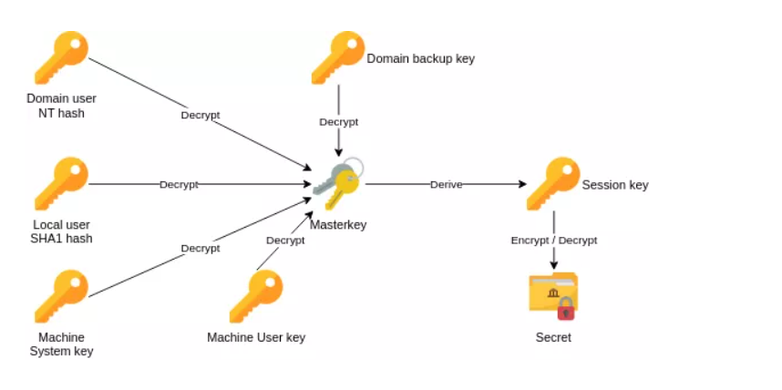

Now we can derive our session key (this can be done by dpapi.py unprotect) and decrypt the rdp secret.

Our rdcman password from forever ago was:
`AQAAANCMnd8BFdERjHoAwE/Cl+sBAAAA9fFW4YM7FkexTMDZVoSSRgAAAAACAAAAAAAQZgAAAAEAACAAAACGikb/Wn5Fs9X6Ia6sW9SbJtkAhl1QRXi/vKnrnQ90bAAAAAAOgAAAAAIAACAAAACMjvY1CihQ7oiw4Lbf0RjBlEdBD/ulPrlAGiEUGycjD0AAAAA70WN+m2kMOcdoZ2/aPHLS9D4VvbDC8U56BE2CtZWGnbbRc0VnYElm1zKQxJ4FYCRshGarVdOgLX3TDKKE1eV2QAAAAO02VD2Nx7El4EE1qKBklgFuLCESc9bhp6I6r7BVfvX8AwcOoMvy3Gzf6rdgpCSE1dcJmNSvFNGhiA3WoAmpcEI=`

Let's decode b64 and save this, then dpapi unprotect it!

```bash
$ echo "AQAAANCMnd8BFdERjHoAwE/Cl+sBAAAA9fFW4YM7FkexTMDZVoSSRgAAAAACAAAAAAAQZgAAAAEAACAAAACGikb/Wn5Fs9X6Ia6sW9SbJtkAhl1QRXi/vKnrnQ90bAAAAAAOgAAAAAIAACAAAACMjvY1CihQ7oiw4Lbf0RjBlEdBD/ulPrlAGiEUGycjD0AAAAA70WN+m2kMOcdoZ2/aPHLS9D4VvbDC8U56BE2CtZWGnbbRc0VnYElm1zKQxJ4FYCRshGarVdOgLX3TDKKE1eV2QAAAAO02VD2Nx7El4EE1qK
BklgFuLCESc9bhp6I6r7BVfvX8AwcOoMvy3Gzf6rdgpCSE1dcJmNSvFNGhiA3WoAmpcEI=" | base64 -di > rdcman.enc

$ dpapi.py unprotect -file rdcman.enc -key 32312944b127a6094b8ead0141dc258947d3e2a0dd941f63fed6f80aa2c93c089a470f592a59245988489edd8c7a9648947f93a2f53f34fde92d1674b578249e
Impacket v0.13.1 - Copyright Fortra, LLC and its affiliated companies

ERROR: Padding is incorrect.
```

Bro. What. Let's try with the `0x`, if that's causing the error, hopefully.

```bash
$ dpapi.py unprotect -file rdcman.enc -key 0x32312944b127a6094b8ead0141dc258947d3e2a0dd941f63fed6f80aa2c93c089a470f592a59245988489edd8c7a9648947f93a2f53f34fde92d1674b578249e
Impacket v0.13.1 - Copyright Fortra, LLC and its affiliated companies

Successfully decrypted data
 0000   50 00 61 00 72 00 74 00  35 00 20 00 3A 00 20 00   P.a.r.t.5. .:. .
 0010   4E 00 33 00 76 00 33 00  72 00 5F 00 47 00 30 00   N.3.v.3.r._.G.0.
 0020   6E 00 6E 00 40 00 2D 00  47 00 31 00 76 00 33 00   n.n.@.-.G.1.v.3.
 0030   2E 00 59 00 6F 00 75 00  2E 00 55 00 70 00         ..Y.o.u...U.p.
```

WOW. I REALLY DON'T THINK THIS WAS THE INTENDED WAY, BUT PART 5!!!!!!!!!!!!!!!!!!!!!!!!!!!

`Part5: N3v3r_G0nn@-G1v3.You.Up`

I'd be satisfied if this was the challenge end, I don't think they can top this. Wow.
 

Let's do other parts of the challenge, we still had keepass and teamviewer to go through. Let's move to teamviewer.
```bash
$ rg teamviewer -i files.txt
1722:0xe00076c6de80     \Program Files (x86)\TeamViewer\Version7\tv_x64.exe
1759:0xe00076c88dd0     \Program Files (x86)\TeamViewer\Version7\tv_w32.dll
```

They are running teamviewer version7. Let's look for password related cves.

I found something very interesting: https://nvd.nist.gov/vuln/detail/cve-2019-18988

CVE-2019-18988

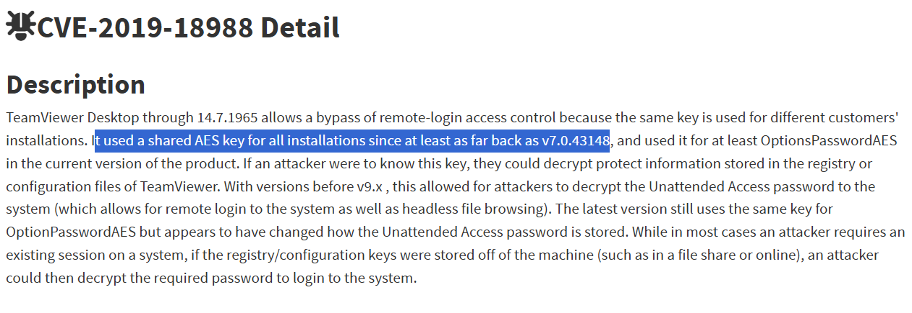

That's all we needed isn't it. A common aes key and iv. Looking online a bit, i found the common aes key and iv: https://whynotsecurity.com/blog/teamviewer/

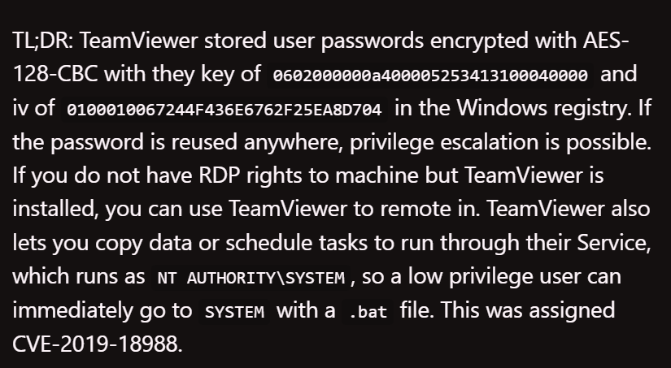

```text
key: 0602000000a400005253413100040000
iv:  0100010067244F436E6762F25EA8D704
```


Let's find our encrypted password from the HKLM registry they so graciously gave us by opening it in eric zimmerman's registry explorer... and it fails to load?

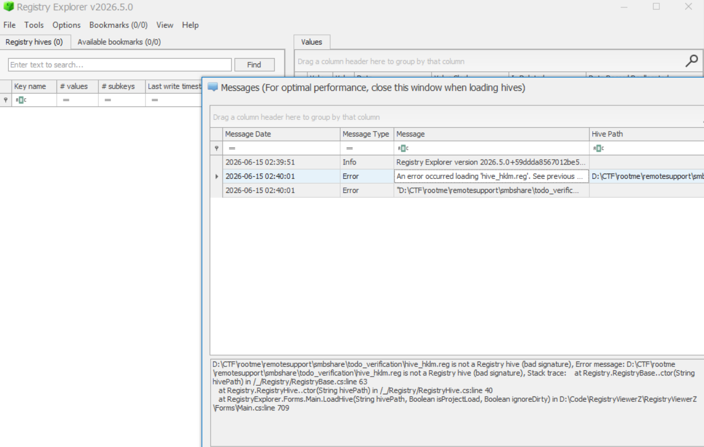

Bad signature?? Have they corrupted the .reg manually? Running file on it:

```bash
$ file smbshare/todo_verification/hive_hklm.reg
smbshare/todo_verification/hive_hklm.reg: Windows Registry little-endian text (Win2K or above)
```

Little endian *text*???

```bash
$ head smbshare/todo_verification/hive_hklm.reg -n 10
��Windows Registry Editor Version 5.00

[HKEY_LOCAL_MACHINE\SOFTWARE\WOW6432Node]

[HKEY_LOCAL_MACHINE\SOFTWARE\WOW6432Node\Intel]

[HKEY_LOCAL_MACHINE\SOFTWARE\WOW6432Node\Intel\PSIS]

[HKEY_LOCAL_MACHINE\SOFTWARE\WOW6432Node\Intel\PSIS\PSIS_DECODER]
"AdapterID"=hex:46,71,00,00
```

..it's the entire hklm hive in plaintext. Woah. Let's look for the TeamViewer password:

```bash
$ rg teamviewer -i smbshare/todo_verification/hive_hklm.reg  -B 10 -A 10
47971-"VersionMajor"=dword:00000002
47972-"VersionMinor"=dword:00000035
47973-"EstimatedSize"=dword:000042cd
47974-
...

252768:"InstallationDirectory"="C:\\Program Files (x86)\\TeamViewer\\Version7"
252769-"Always_Online"=dword:00000001
252770-"SecurityPasswordAES"=hex:2f,6e,a5,a2,cd,b6,c5,22,2d,1b,fe,1f,1f,ac,75,22,37,\
252771-  e0,52,be,77,de,95,42,d1,9c,dc,90,09,e2,8f,3d,44,c4,d6,cc,79,a3,11,2d,af,58,\
252772-  d4,2a,16,d0,9a,df,6f,0e,94,a4,89,ad,8d,61,6c,ff,42,ae,c5,31,22,1a,b2,1c,cc,\
252773-  68,66,b4,84,1a,7d,08,44,85,71,c3,63,06,ef,b5,b3,bd,0e,09,ff,6f,a4,99,fb,23,\
252774-  a3,09,e2,d5
252775-"Version"="7.0.43148 H"
252776-"ClientIC"=dword:1495e3dd
252777-"PK"=hex:dc,56,41,dc,d0,4e,9c,d4,04,98,2e,91,77,00,27,43,a5,c2,7b,8b,39,63,6d,\
252778-  56,e6,54,4f,76,06,17,60,da,16,c0,2b,37,ff,e3,3a,15,b3,f0,45,86,0d,ac,bf,a1,\
--
252827-  47,f0,27,49,c7,9d,c4,f6,70,59,7c,c9,88,95,55,4b,90,01,fa,43,43,9e,6d,2e,6d,\
252828-  63,42,61,ad,74,e7,4a,bf,16,1f,37,75,b8,12,c8,84,ec
252829-"LastMACUsed"=hex(7):00,00,30,00,38,00,30,00,30,00,32,00,37,00,39,00,35,00,41,\
252830-  00,34,00,33,00,34,00,00,00,00,00
252831-"Security_PasswordStrength"=dword:00000003
252832-"LastUpdateCheck"=dword:64c36130
252833-"MIDInitiativeGUID"="{925df185-67fe-4212-85bc-a938f209964a}"
252834-"ClientID"=dword:ffffffff
252835-"UsageEnvironmentBackup"=dword:00000002
252836-
252837:[HKEY_LOCAL_MACHINE\SOFTWARE\WOW6432Node\TeamViewer\Version7\AccessControl]
252838-"AC_Server_AccessControlType"=dword:00000000
252839-
252840:[HKEY_LOCAL_MACHINE\SOFTWARE\WOW6432Node\TeamViewer\Version7\DefaultSettings]
252841-"Autostart_GUI"=dword:00000001
252842-
252843-[HKEY_LOCAL_MACHINE\SOFTWARE\WOW6432Node\Classes]
252844-
252845-[HKEY_LOCAL_MACHINE\SOFTWARE\WOW6432Node\Classes\CLSID]
252846-
252847-[HKEY_LOCAL_MACHINE\SOFTWARE\WOW6432Node\Classes\CLSID\CLSID]
252848-@="{0000031A-0000-0000-C000-000000000046}"
252849-
252850-[HKEY_LOCAL_MACHINE\SOFTWARE\WOW6432Node\Classes\CLSID\{0000002F-0000-0000-C000-000000000046}]
```

And there's our encrypted password in SecurityPasswordAES, I really don't get why they gave us the hive separately, this was just as easily retrievable using volatility `windows.registry.printkey`:

Looking for SOFTWARE hive offset:

```bash
$ vol -f memdump.raw windows.registry.hivelist.HiveList | rg -i "SOFTWARE"
0xc000b9dd7000.0\SystemRoot\System32\Config\SOFTWAREd   Disabled
```

Looking for our AESPassword in the same key:

```bash
$ vol -f memdump.raw windows.registry.printkey  --offset 0xc000b9dd7000 --key "WOW6432Node\TeamViewer\Version7"
Volatility 3 Framework 2.28.0
Progress:  100.00               PDB scanning finished
Last Write Time Hive Offset     Type    Key     Name    Data    Volatile

2023-07-28 06:33:19.000000 UTC  0xc000b9dd7000  Key     \SystemRoot\System32\Config\SOFTWARE\WOW6432Node\TeamViewer\Version7    AccessControl   N/A     False
2023-07-28 06:33:19.000000 UTC  0xc000b9dd7000  Key     \SystemRoot\System32\Config\SOFTWARE\WOW6432Node\TeamViewer\Version7    DefaultSettings N/A     False
2023-07-28 06:38:26.000000 UTC  0xc000b9dd7000  REG_SZ  \SystemRoot\System32\Config\SOFTWARE\WOW6432Node\TeamViewer\Version7    StartMenuGroup  TeamViewer 7 Host   False
2023-07-28 06:38:26.000000 UTC  0xc000b9dd7000  REG_SZ  \SystemRoot\System32\Config\SOFTWARE\WOW6432Node\TeamViewer\Version7    InstallationDate        2023-07-28  False
2023-07-28 06:38:26.000000 UTC  0xc000b9dd7000  REG_SZ  \SystemRoot\System32\Config\SOFTWARE\WOW6432Node\TeamViewer\Version7    InstallationDirectory   C:\Program Files (x86)\TeamViewer\Version7  False
2023-07-28 06:38:26.000000 UTC  0xc000b9dd7000  REG_DWORD       \SystemRoot\System32\Config\SOFTWARE\WOW6432Node\TeamViewer\Version7    Always_Online   1  False
2023-07-28 06:38:26.000000 UTC  0xc000b9dd7000  REG_BINARY      \SystemRoot\System32\Config\SOFTWARE\WOW6432Node\TeamViewer\Version7    SecurityPasswordAES
2f 6e a5 a2 cd b6 c5 22 2d 1b fe 1f 1f ac 75 22 /n....."-.....u"
37 e0 52 be 77 de 95 42 d1 9c dc 90 09 e2 8f 3d 7.R.w..B.......=
44 c4 d6 cc 79 a3 11 2d af 58 d4 2a 16 d0 9a df D...y..-.X.*....
6f 0e 94 a4 89 ad 8d 61 6c ff 42 ae c5 31 22 1a o......al.B..1".
b2 1c cc 68 66 b4 84 1a 7d 08 44 85 71 c3 63 06 ...hf...}.D.q.c.
ef b5 b3 bd 0e 09 ff 6f a4 99 fb 23 a3 09 e2 d5 .......o...#....        False
2023-07-28 06:38:26.000000 UTC  0xc000b9dd7000  REG_SZ  \SystemRoot\System32\Config\SOFTWARE\WOW6432Node\TeamViewer\Version7    Version 7.0.43148 H     False
2023-07-28 06:38:26.000000 UTC  0xc000b9dd7000  REG_DWORD       \SystemRoot\System32\Config\SOFTWARE\WOW6432Node\TeamViewer\Version7    ClientIC        345367517   False
2023-07-28 06:38:26.000000 UTC  0xc000b9dd7000  REG_BINARY      \SystemRoot\System32\Config\SOFTWARE\WOW6432Node\TeamViewer\Version7    PK
dc 56 41 dc d0 4e 9c d4 04 98 2e 91 77 00 27 43 .VA..N......w.'C
a5 c2 7b 8b 39 63 6d 56 e6 54 4f 76 06 17 60 da ..{.9cmV.TOv..`.
16 c0 2b 37 ff e3 3a 15 b3 f0 45 86 0d ac bf a1 ..+7..:...E.....
d4 74 44 2e 12 35 b2 fd 54 97 04 e2 c7 a5 df 0d .tD..5..T.......
4d c0 a9 92 15 ec f9 d4 c9 9f 29 2c fe 58 58 72 M.........),.XXr
79 c6 07 e1 90 ba 20 66 86 cd 88 97 4b 1e 25 08 y..... f....K.%.
f4 b1 25 7f 21 23 f5 94 0a 75 93 bf c8 6b 9a 64 ..%.!#...u...k.d
03 d4 4e 96 09 2c 38 be 98 40 65 9b 16 59 0f 74 ..N..,8..@e..Y.t
5f d9 34 f3 2e 06 0d c8 31 d6 0b 7d c3 93 c3 06 _.4.....1..}....
74 91 50 59 96 5b 25 60 4e 13 26 f9 90 e4 0d 7e t.PY.[%`N.&....~
d4 61 76 9d 10 89 ea 3d 8f 1d 07 d0 88 19 03 04 .av....=........
c4 db e0 39 d1 95 5f c4 de 1d 86 4b 61 b1 fd fb ...9.._....Ka...
d3 31 f8 81 9d 7e cd 3d 3e 58 10 0b f7 ea e0 cf .1...~.=>X......
51 ab cc b4 0c 15 c1 6d 86 96 1c 0c 5a 9b 36 3f Q......m....Z.6?
9b c4 4e 8c cf 55 fb c7 73 88 62 15 26 43 e6 a2 ..N..U..s.b.&C..
8b 96 60 97 f5 78 94 77 33 fa a4 73 14 a3 25 aa ..`..x.w3..s..%.
a0 bd 17 f2 58 fe b3 b0 ca de 17 c6 9d a7 c4 17 ....X...........
4b f3 35 f6 07 20 bb 89 11 32 19 5d 1d 5d e5 2f K.5.. ...2.].]./
d9 9d 0c 1c 25 41 db b7 79 91 b0 67 29 0f fd e2 ....%A..y..g)...
07 2e f8 9c 51 54 78 b6 09 6c e9 18 7d 13 ec 18 ....QTx..l..}...
be fc 7f b9 09 0e ea 43 a5 a6 0d 53 fa 94 b1 76 .......C...S...v
f6 0e 43 ff 25 8d df 7e ea 3e fc 64 80 c2 02 94 ..C.%..~.>.d....
4e 22 0c be 27 98 eb e7 cd d9 fb 8e 1c 67 8a d4 N"..'........g..
d5 fb e1 31 58 4d fd b6 84 f4 69 73 ec 9f 78 94 ...1XM....is..x.
8e dd 12 59 cb ad a1 56 14 22 97 ef ac 44 70 81 ...Y...V."...Dp.
5d d5 66 df 73 53 5c 11 1c 00 0e e7 f4 b9 c6 2c ].f.sS\........,
7b 70 79 08 df bc 9e 53 31 10 10 b4 fc 8a fe 7b {py....S1......{
dd 13 dc 50 9f d4 91 27 e4 81 e1 98 d9 69 2b bf ...P...'.....i+.
29 38 24 30 4f 72 82 c3 83 f5 41 ad 2a 49 14 86 )8$0Or....A.*I..
b5 7c f5 bc e7 f6 ba 0d 1b 0a ec 23 3c fa ff 02 .|.........#<...
db e0 2c b3 9f a4 5d 89 fa 39 4e f0 31 24 40 e9 ..,...]..9N.1$@.
72 e2 55 4e 8d 10 ee f9 aa ae f0 05 6b 15 6b 6e r.UN........k.kn
48 11 ae 99 b6 43 8a 57 6f 89 46 ed 4e c1 df c1 H....C.Wo.F.N...
fc c5 09 4f 1c 7c 1e 40 61 ed a0 f7 22 b6 bf ea ...O.|.@a..."...
55 03 60 d1 d7 bd cf e5 6b fa 9c bf 38 10 55 b6 U.`.....k...8.U.
4c 99 6d 12 5c 95 9a 14 d0 e0 d6 e6 9e 68 ea f4 L.m.\........h..
a3 08 c0 31 ea e9 ee a2 8c a4 89 f8 fe 33 ee ee ...1.........3..
3a cc 2b 0d be 8f 90 58 8a c8 34 05 3c 78 3a ea :.+....X..4.<x:.
c3 bc 54 be d4 47 b1 af d8 1e 09 d8 13 19 41 cb ..T..G........A.
2a 8f ee c4 5a 59 30 b8 67 c3 e9 10 46 98 4e 59 *...ZY0.g...F.NY        False
2023-07-28 06:38:26.000000 UTC  0xc000b9dd7000  REG_BINARY      \SystemRoot\System32\Config\SOFTWARE\WOW6432Node\TeamViewer\Version7    SK
dc 56 41 dc d0 4e 9c d4 04 98 2e 91 77 00 27 43 .VA..N......w.'C
a5 c2 7b 8b 39 63 6d 56 e6 54 4f 76 06 17 60 da ..{.9cmV.TOv..`.
57 70 2a d5 97 28 93 66 22 ff c4 de fd 97 2c db Wp*..(.f".....,.
dd f3 d9 ec 6c 7e bb a1 2a 65 1b 73 e8 4e 2a 71 ....l~..*e.s.N*q
eb 38 30 24 74 72 20 16 7c a0 21 6b b3 8b c2 a0 .80$tr .|.!k....
09 4d 19 d6 40 81 4f b1 8b 76 2a 7e 37 14 07 1f .M..@.O..v*~7...
d5 3c ce b8 fa 81 85 6c 4f 63 64 62 56 4a 11 53 .<.....lOcdbVJ.S
2c 75 f7 5f e2 e8 ee 0a 1c 51 da dc 97 a2 31 ea ,u._.....Q....1.
81 e5 10 09 57 2d 06 5d 99 18 1d 5f fe 81 49 c4 ....W-.]..._..I.
8c 7d da 40 f1 79 c1 f5 bf f4 74 00 ac 49 07 1c .}.@.y....t..I..
c6 d2 11 01 46 9b e0 cf 68 f4 78 72 e1 4f bf 15 ....F...h.xr.O..
a3 b8 cc ac 2a d2 cf af 36 10 a4 d3 8f 40 45 a7 ....*...6....@E.
fb 8d 59 6b 2d da 5d e8 8a ff 28 8c 9a c4 39 8a ..Yk-.]...(...9.
26 58 16 4e e7 a5 d7 6e 17 89 33 91 a8 ff a6 f8 &X.N...n..3.....
39 10 ed a8 d9 fc 96 01 fc be 9b 63 8b fd 08 c1 9..........c....
a8 f2 a4 3e 23 be fd 9a f4 e1 9e e4 7d b1 91 94 ...>#.......}...
96 9a 33 5e 9b 19 6b 39 9d 6d 3d be 3c c9 02 19 ..3^..k9.m=.<...
59 17 39 a4 87 05 8d fe b4 51 78 ce d2 65 4e 31 Y.9......Qx..eN1
1d 05 fe ab a9 f9 97 dc d1 d1 44 8d 5a 5c 46 21 ..........D.Z\F!
14 25 8f 97 51 d9 94 55 40 b6 9a 14 bf 47 a2 58 .%..Q..U@....G.X
9f 8a 05 b8 e2 37 b9 92 df af 78 96 47 a3 0c 4d .....7....x.G..M
33 7d 8a 9f 02 48 87 aa 3d ef 3f 7e 3d 9b 07 84 3}...H..=.?~=...
34 30 3c 65 56 83 e9 d5 65 bc 1f b6 40 93 a1 1c 40<eV...e...@...
87 00 96 a6 f6 0b 9c c9 9a f0 79 a9 45 44 5b 73 ..........y.ED[s
b6 1d 8c 93 9b bd d5 0d 33 dc d9 13 7f 76 67 af ........3....vg.
2e a9 6b ab a8 8b c1 91 c9 77 34 bf e0 a3 76 ea ..k......w4...v.
c1 92 4f f8 d2 64 26 c1 86 bb 63 36 ac 5e d7 e3 ..O..d&...c6.^..
d1 bb 8e b3 21 ee ef 8b 0b 49 9e bc 29 3e 0c 77 ....!....I..)>.w
de 11 9a 7f 66 b0 7d 7c 19 f9 2f 48 40 06 6e ad ....f.}|../H@.n.
86 08 59 f8 d7 97 39 c8 0a 72 51 b2 98 51 19 27 ..Y...9..rQ..Q.'
46 13 0b 5e 1e 30 c2 0b c8 41 91 f6 1e 1d ce 59 F..^.0...A.....Y
5d 82 1b 46 86 34 44 d9 ac 68 fa f7 bb aa 0a b8 ]..F.4D..h......
f2 35 6a f2 0a fa 46 11 fa 8c 2f 16 79 bc 80 65 .5j...F.../.y..e
ea 1c 35 bd 2b a0 e2 30 5e 5c 21 2c fb 83 91 8e ..5.+..0^\!,....
6f 83 d9 f2 03 1f 74 d2 bf 21 36 0b 2d 60 09 c9 o.....t..!6.-`..
c2 8a da c1 a6 a9 c4 15 5c f7 83 e6 e3 18 6a 9e ........\.....j.
e6 12 55 ec cd 38 e7 0f 15 44 c5 a3 99 26 90 ec ..U..8...D...&..
29 f8 fb ef db 04 47 f0 27 49 c7 9d c4 f6 70 59 ).....G.'I....pY
7c c9 88 95 55 4b 90 01 fa 43 43 9e 6d 2e 6d 63 |...UK...CC.m.mc
42 61 ad 74 e7 4a bf 16 1f 37 75 b8 12 c8 84 ec Ba.t.J...7u.....        False
2023-07-28 06:38:26.000000 UTC  0xc000b9dd7000  REG_MULTI_SZ    \SystemRoot\System32\Config\SOFTWARE\WOW6432Node\TeamViewer\Version7    LastMACUsed
08002795958E

        False
2023-07-28 06:38:26.000000 UTC  0xc000b9dd7000  REG_DWORD       \SystemRoot\System32\Config\SOFTWARE\WOW6432Node\TeamViewer\Version7    Security_PasswordStrength   3       False
2023-07-28 06:38:26.000000 UTC  0xc000b9dd7000  REG_DWORD       \SystemRoot\System32\Config\SOFTWARE\WOW6432Node\TeamViewer\Version7    LastUpdateCheck 1690526000  False
2023-07-28 06:38:26.000000 UTC  0xc000b9dd7000  REG_SZ  \SystemRoot\System32\Config\SOFTWARE\WOW6432Node\TeamViewer\Version7    MIDInitiativeGUID       {925df185-67fe-4212-85bc-a938f209964a}      False
2023-07-28 06:38:26.000000 UTC  0xc000b9dd7000  REG_DWORD       \SystemRoot\System32\Config\SOFTWARE\WOW6432Node\TeamViewer\Version7    ClientID        4294967295  False
2023-07-28 06:38:26.000000 UTC  0xc000b9dd7000  REG_DWORD       \SystemRoot\System32\Config\SOFTWARE\WOW6432Node\TeamViewer\Version7    UsageEnvironmentBackup      2       False
```


And there it is again! Literally no need for authors to give a text dump of the registry.

```bash
2023-07-28 06:38:26.000000 UTC  0xc000b9dd7000  REG_BINARY      \SystemRoot\System32\Config\SOFTWARE\WOW6432Node\TeamViewer\Version7    SecurityPasswordAES
2f 6e a5 a2 cd b6 c5 22 2d 1b fe 1f 1f ac 75 22 /n....."-.....u"
37 e0 52 be 77 de 95 42 d1 9c dc 90 09 e2 8f 3d 7.R.w..B.......=
44 c4 d6 cc 79 a3 11 2d af 58 d4 2a 16 d0 9a df D...y..-.X.*....
6f 0e 94 a4 89 ad 8d 61 6c ff 42 ae c5 31 22 1a o......al.B..1".
b2 1c cc 68 66 b4 84 1a 7d 08 44 85 71 c3 63 06 ...hf...}.D.q.c.
ef b5 b3 bd 0e 09 ff 6f a4 99 fb 23 a3 09 e2 d5 .......o...#....        False
```

Saving it and cutting just like we did for the masterkey:

```bash
$ cat aesteamviewerpassword.enc
2f 6e a5 a2 cd b6 c5 22 2d 1b fe 1f 1f ac 75 22 /n....."-.....u"
37 e0 52 be 77 de 95 42 d1 9c dc 90 09 e2 8f 3d 7.R.w..B.......=
44 c4 d6 cc 79 a3 11 2d af 58 d4 2a 16 d0 9a df D...y..-.X.*....
6f 0e 94 a4 89 ad 8d 61 6c ff 42 ae c5 31 22 1a o......al.B..1".
b2 1c cc 68 66 b4 84 1a 7d 08 44 85 71 c3 63 06 ...hf...}.D.q.c.
ef b5 b3 bd 0e 09 ff 6f a4 99 fb 23 a3 09 e2 d5 .......o...#....

$ cut -c1-47 aesteamviewerpassword.enc | tr -d ' \n' | xxd -r -p > aesteamviewerpassword.bin
```

Let's get the teamviewer password now!

```bash
$ openssl enc -d -aes-128-cbc -nopad  -K 0602000000a400005253413100040000 -iv 0100010067244F436E6762F25EA8D704 -in aesteamviewerpassword.bin
Part2 : V3ry-D1fficULt.b3c@us3.in.R3gistrY
```

Yay! There's out part 2! tbf it wasnt "very difficult", they definitely didn't have to give the registry text dump for all hives in hklm. But hey.

`Part2: V3ry-D1fficULt.b3c@us3.in.R3gistrY`

Now we are only left with keepass, and look for kdbx files in the filescan.

```bash
$ rg kdbx files.txt
163:0xe0007495c800      \Users\forensic\AppData\Roaming\Microsoft\Windows\Recent\my_password.kdbx.lnk
314:0xe00074a41c40      \Users\forensic\Documents\my_password.kdbx
```

Great, let's dump `my_password.kdbx` from offset `0xe00074a41c40`

```bash
$ vol -f memdump.raw windows.dumpfiles --virtaddr 0xe00074a41c40
Volatility 3 Framework 2.28.0
Progress:  100.00               PDB scanning finished
Cache   FileObject      FileName        Result

DataSectionObject       0xe00074a41c40  my_password.kdbx        file.0xe00074a41c40.0xe00074a3b450.DataSectionObject.my_password.kdbx.dat

$ mv file.0xe00074a41c40.0xe00074a3b450.DataSectionObject.my_password.kdbx.dat my_password.kdbx
```

Let's run keepass2john on this and try to crack it using hashcat with mode 13400.

```bash
$ keepass2john my_password.kdbx > hash.txt
$ hashcat hash.txt -m 13400 -a 0 ~/wordlists/rockyou.txt -w 4
```

Unsurprisingly, hashcat didn't find the password in rockyou
```bash
$ hashcat hash.txt -m 13400 -a 0 ~/wordlists/rockyou.txt -w 4

```

Let's find the exact keepass version and look for cves, that's what our initial todo.txt was referencing about `updating software`
```bash
$ rg keepass -i files.txt
424:0xe00074b2a220      \Program Files\KeePass Password Safe 2\KeePass.XmlSerializers.dll
516:0xe00074baeb60      \Program Files\KeePass Password Safe 2\KeePass.exe
627:0xe00074c47320      \ProgramData\Microsoft\Windows\Start Menu\Programs\KeePass 2.lnk
754:0xe0007518ef20      \Program Files\KeePass Password Safe 2
1016:0xe000756a99d0     \Program Files\KeePass Password Safe 2\KeePassLibC64.dll
1290:0xe00075867f20     \Users\forensic\AppData\Roaming\KeePass\KeePass.config.xml
2123:0xe00076f897f0     \Users\forensic\AppData\Roaming\Microsoft\Internet Explorer\Quick Launch\User Pinned\TaskBar\KeePass 2.lnk
2393:0xe00077149f20     \Program Files\KeePass Password Safe 2\KeePass.XmlSerializers.dll
3303:0xe00077837090     \Program Files\KeePass Password Safe 2\KeePass.exe
3957:0xe00077cfcdd0     \Users\forensic\Desktop\KeePass 2.lnk
3974:0xe00077d07460     \Program Files\KeePass Password Safe 2\KeePass.exe
3987:0xe00077d0c950     \Program Files\KeePass Password Safe 2\KeePass.exe.config
4580:0xe000780df850     \Windows\assembly\NativeImages_v4.0.30319_64\KeePass\435bf0f29fcdc3836da32a1a75a540d2\KeePass.ni.exe.aux
4630:0xe0007810a3c0     \Program Files\KeePass Password Safe 2\KeePass.config.xml
4741:0xe0007815fa00     \Program Files\KeePass Password Safe 2\unins000.exe
4909:0xe000781ebdb0     \Windows\assembly\NativeImages_v4.0.30319_64\KeePass\435bf0f29fcdc3836da32a1a75a540d2\KeePass.ni.exe
```

`3987:0xe00077d0c950     \Program Files\KeePass Password Safe 2\KeePass.exe.config` should do it, let's dump the config.

```bash
$ vol -f memdump.raw windows.dumpfiles --virtaddr 0xe00077d0c950
Volatility 3 Framework 2.28.0
Progress:  100.00               PDB scanning finished
Cache   FileObject      FileName        Result

DataSectionObject       0xe00077d0c950  KeePass.exe.config      Error dumping file
```

Well that's a volatility moment. It still extracted something:

```bash
$ cat file.0xe00077d0c950.0xe00077d0a4e0.DataSectionObject.KeePass.exe.config.dat
<?xml version="1.0" encoding="utf-8" ?>
<configuration>
        <startup useLegacyV2RuntimeActivationPolicy="true">
                <supportedRuntime version="v4.0" />
                <supportedRuntime version="v2.0.50727" />
        </startup>
        <runtime>
                <assemblyBinding xmlns="urn:schemas-microsoft-com:asm.v1">
                        <dependentAssembly>
                                <assemblyIdentity name="KeePass"
                                        publicKeyToken="fed2ed7716aecf5c"
                                        culture="neutral" />
                                <bindingRedirect oldVersion="2.0.9.0-2.53.0.0"
                                        newVersion="2.53.0.18479" />
                        </dependentAssembly>
                </assemblyBinding>
                <enforceFIPSPolicy enabled="false" />
                <loadFromRemoteSources enabled="true" />
        </runtime>
        <appSettings>
                <add key="EnableWindowsFormsHighDpiAutoResizing" value="true" />
        </appSettings>
</configuration>
```

That's good enough! We are running `2.53.0.18479` looking online, I found this cve:

https://nvd.nist.gov/vuln/detail/cve-2023-24055

CVE-2023-24055

Hmm, this is for live installs it seems, "write access to config"

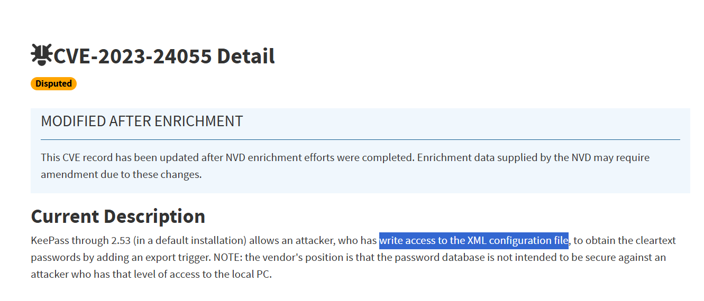

Not much use to us, let's look for specifically memory artifact related cves.

I found:

https://nvd.nist.gov/vuln/detail/cve-2023-32784

CVE-2023-32784

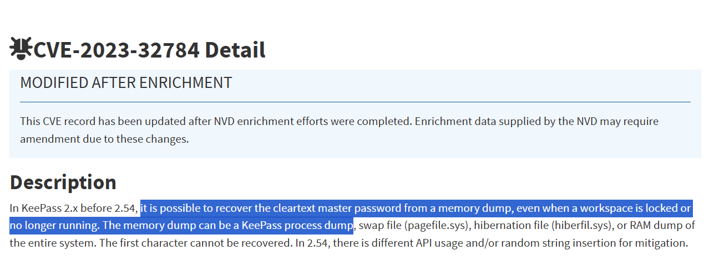

This seems like exactly what we need! NVD references https://github.com/vdohney/keepass-password-dumper so let's use that only for extracting the password.

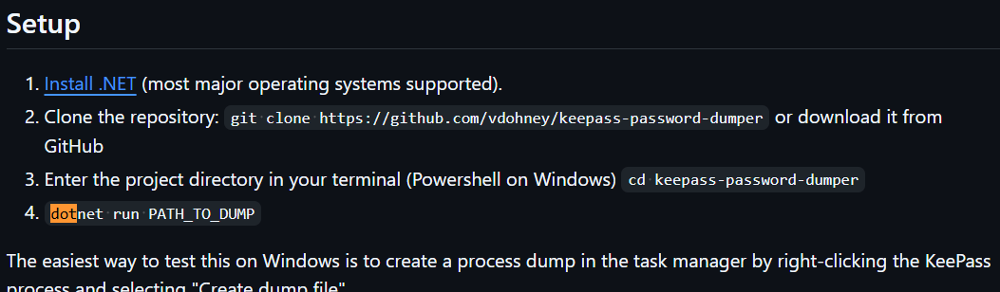

This is a dotnet poc, though it references a python implementation: https://github.com/CMEPW/keepass-dump-masterkey

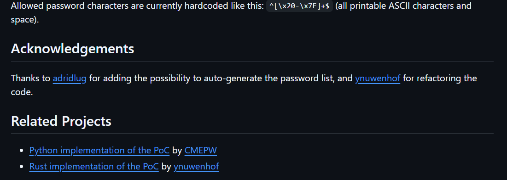

Let's clone that

```bash
git clone https://github.com/CMEPW/keepass-dump-masterkey
```

Finding keepass process pid:

```bash
$ rg keepass -i pslist.txt
48:2460 2548    KeePass.exe     0xe00074a5f080  8       -       1       False   2023-07-28 07:20:16.000000 UTC  N/A    Disabled
```

Dumping the keepass process with pid 2460:

```bash
$ vol -f memdump.raw windows.memmap --pid 2460 --dump 
pid.2460.dmp
```

Let's run `keepass-dump-masterkey` on it!

```bash
$ python3 keepass-dump-masterkey/poc.py pid.2460.dmp
2026-06-15 03:35:21,948 [.] [main] Opened pid.2460.dmp

Possible password: ●VE-2023-32784_C00l.or.N0t??
Possible password: ●1E-2023-32784_C00l.or.N0t??
Possible password: ●{E-2023-32784_C00l.or.N0t??
Possible password: ●#E-2023-32784_C00l.or.N0t??
Possible password: ●)E-2023-32784_C00l.or.N0t??
Possible password: ●$E-2023-32784_C00l.or.N0t??
```

Yay it found it! The CVE report mentioned it cannot get the first character, but judging by what it's saying, it's probably a `C` as in `CVE`.

`Part3: CVE-2023-32784_C00l.or.N0t??` (or so i think)

Let's unlock the kdbx and see if the passwords have something for us:

```bash
$ keepassxc-cli ls my_password.kdbx
Enter password to unlock my_password.kdbx:
Sample Entry
Sample Entry #2
General/
Windows/
Network/
Internet/
eMail/
Homebanking/
```

It opens! Let's dump everything.


```bash
$ keepassxc-cli export my_password.kdbx
Enter password to unlock my_password.kdbx:
<?xml version="1.0" encoding="UTF-8" standalone="yes"?>
<KeePassFile>
        <Meta>
                <Generator>KeePass</Generator>
                <DatabaseName>password</DatabaseName>
                <DatabaseNameChanged>2023-07-28T06:58:48Z</DatabaseNameChanged>
                <DatabaseDescription/>
                <DatabaseDescriptionChanged>2023-07-28T06:58:44Z</DatabaseDescriptionChanged>
                <DefaultUserName/>
                <DefaultUserNameChanged>2023-07-
...


                                <IsExpanded>True</IsExpanded>
                                <DefaultAutoTypeSequence/>
                                <EnableAutoType>null</EnableAutoType>
                                <EnableSearching>null</EnableSearching>
                                <LastTopVisibleEntry>AAAAAAAAAAAAAAAAAAAAAA==</LastTopVisibleEntry>
                        </Group>
                </Group>
                <DeletedObjects/>
        </Root>
</KeePassFile>
```

Let's just filter for the passwords:

```bash
$ rg Password keypass.xml  -A 1
19:                        <ProtectPassword>True</ProtectPassword>
20-                        <ProtectURL>False</ProtectURL>
--
76:                                        <Key>Password</Key>
77:                                        <Value ProtectInMemory="True">Password</Value>
78-                                </String>
--
123:                                        <Key>Password</Key>
124-                                        <Value ProtectInMemory="True">12345</Value>
--
249:                                                <Key>Password</Key>
250-                                                <Value ProtectInMemory="True">Part4 : I'm_a_F0rensic_L0ver.And.You?</Value>
```

AND THAT'S PART 4!!!

`Part4: I'm_a_F0rensic_L0ver.And.You?`

Finally, I have them all. According to the statement, the flag is of the form sha256(part1+part2+part3+part4+part5)

```text
Part1: 4lw4ys_G1ve_a_Fr33_G1ft
Part2: V3ry-D1fficULt.b3c@us3.in.R3gistrY
Part3: CVE-2023-32784_C00l.or.N0t??
Part4: I'm_a_F0rensic_L0ver.And.You?
Part5: N3v3r_G0nn@-G1v3.You.Up
```

So our flag will be `sha256(4lw4ys_G1ve_a_Fr33_G1ftV3ry-D1fficULt.b3c@us3.in.R3gistrYCVE-2023-32784_C00l.or.N0t??I'm_a_F0rensic_L0ver.And.You?N3v3r_G0nn@-G1v3.You.Up)`

```bash
$ echo -n  "4lw4ys_G1ve_a_Fr33_G1ftV3ry-D1fficULt.b3c@us3.in.R3gistrYCVE-2023-32784_C00l.or.N0t??I'm_a_F0rensic_L0ver.And.You?N3v3r_G0nn@-G1v3.You.Up" | sha256sum
33a4fd4640ccaf9e07299d97594d74235700e87e774ef5cf63c347f1bb260e7f
```

And that's.... wrong?!


I tried concating with `+`, `-`, `.`, `_`, ` `, but none of them seemed to work either. Did we somehow do something wrong?
The only flaw i can think in our solve is that i inferred the kdbx file password was part 3... maybe it wasn't?  Now I am truly lost, it could be the smb share password from way back.. but seems unlikely. I found `Default.rdp` in the filescan, could we have just gotten the password from here and not gone through all that trouble?
`0xe00076aff2d0 \Users\forensic\Documents\Default.rdp`

I dumped it and thankfully, the author didn't click `Remember me` or whatever, so it didn't save a password, or this challenge would've been a LOT simpler.

```bash
$ cat file.0xe00076aff2d0.0xe00074ab79e0.DataSectionObject.Default.rdp.dat
��screen mode id:i:2
use multimon:i:0
desktopwidth:i:1920
desktopheight:i:983
session bpp:i:32
winposstr:s:0,3,0,0,800,600
compression:i:1
keyboardhook:i:2
audiocapturemode:i:0
videoplaybackmode:i:1
connection type:i:7
networkautodetect:i:1
bandwidthautodetect:i:1
displayconnectionbar:i:1
enableworkspacereconnect:i:0
disable wallpaper:i:0
allow font smoothing:i:0
allow desktop composition:i:0
disable full window drag:i:1
disable menu anims:i:1
disable themes:i:0
disable cursor setting:i:0
bitmapcachepersistenable:i:1
full address:s:10.13.13.103
audiomode:i:0
redirectprinters:i:1
redirectcomports:i:0
redirectsmartcards:i:1
redirectclipboard:i:1
redirectposdevices:i:0
autoreconnection enabled:i:1
authentication level:i:2
prompt for credentials:i:0
negotiate security layer:i:1
remoteapplicationmode:i:0
alternate shell:s:
shell working directory:s:
gatewayhostname:s:
gatewayusagemethod:i:4
gatewaycredentialssource:i:4
gatewayprofileusagemethod:i:0
promptcredentialonce:i:0
gatewaybrokeringtype:i:0
use redirection server name:i:0
rdgiskdcproxy:i:0
kdcproxyname:s:
```

But I see something else interesting, `bitmapcachepersistenable:i:1` bmc rdp caching is enabled! Could we have to reconstruct an rdp session image? Let's look for bmc files.

```bash
$ cat files.txt | rg bmc
0xe00077b8d1e0  \Users\forensic\AppData\Local\Microsoft\Terminal Server Client\Cache\bcache24.bmc
```

Let's dump `bcache24.bmc` at offset `0xe00077b8d1e0`:
```bash
$ vol -f memdump.raw windows.dumpfiles --virtaddr 0xe00077b8d1e0
Volatility 3 Framework 2.26.0
Progress:  100.00               PDB scanning finished
Cache   FileObject      FileName        Result
```
And volatility failed. amazing. Let's see if bcache24.bmc was in the mft resident data:

```bash
$ rg bcache24  mftresident.txt
106831:0x32519928       FILE    90978   DATA    bcache24.bmc    -
121598:0x3a3d3368       FILE    90978   DATA    bcache24.bmc    -
```

It isn't! The `-` means the residentdata has no file content for it. That sucks.

Same for Cache.bin

```bash
$ rg Cache00 mftresident.txt
85731:0x281e0bf0        FILE    90983   DATA    Cache0000.bin   -
300539:0x7dfaf760       FILE    90548   DATA    Cache0001.bin   -
```

As a last resort we could try carving the Cache0000.bin manually since we know it's file header (is that what todo.txt was referencing?)
I saw a `0xe0007780b090 \Users\forensic\AppData\Roaming\Microsoft\Windows\Themes\CachedFiles\CachedImage_1920_983_POS4.jpg` in the filescan, a cached wallpaper, I dumped that as well but it's just the default.

```bash
$ vol -f memdump.raw windows.dumpfiles --virtaddr 0xe0007780b090
Volatility 3 Framework 2.26.0
Progress:  100.00               PDB scanning finished
Cache   FileObject      FileName        Result

DataSectionObject       0xe0007780b090  CachedImage_1920_983_POS4.jpg   Error dumping file
```

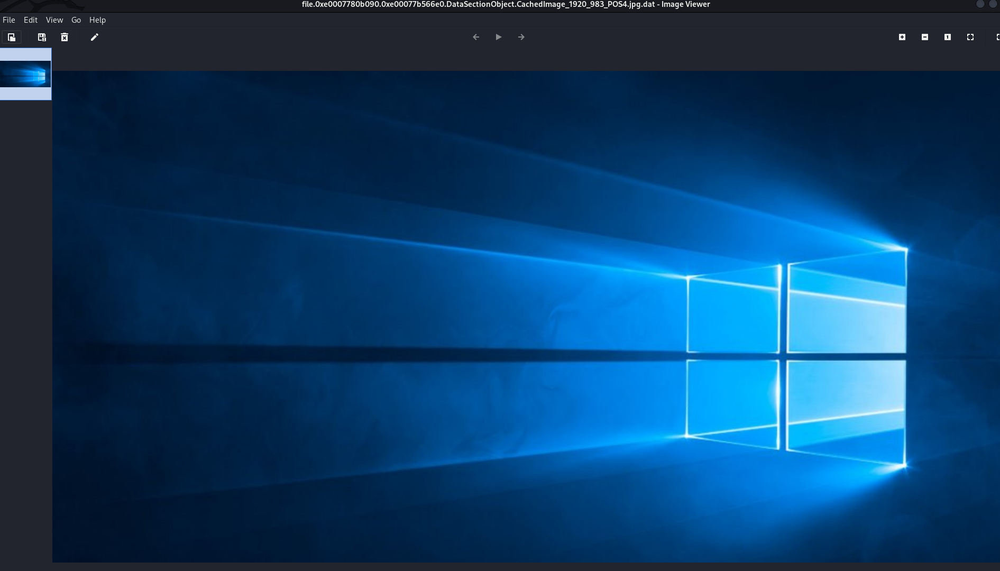

Same for the lockscreen at `0xe000759024e0  \ProgramData\Microsoft\Windows\SystemData\S-1-5-18\ReadOnly\LockScreen_Z\LockScreen___1920_0983_notdimmed.jpg`:

```bash
$ vol -f memdump.raw windows.dumpfiles --virtaddr 0xe000759024e0
Volatility 3 Framework 2.26.0
Progress:  100.00               PDB scanning finished
Cache   FileObject      FileName        Result

DataSectionObject       0xe000759024e0  LockScreen___1920_0983_notdimmed.jpg    file.0xe000759024e0.0xe00077037830.DataSectionObject.LockScreen___1920_0983_notdimmed.jpg.dat
```

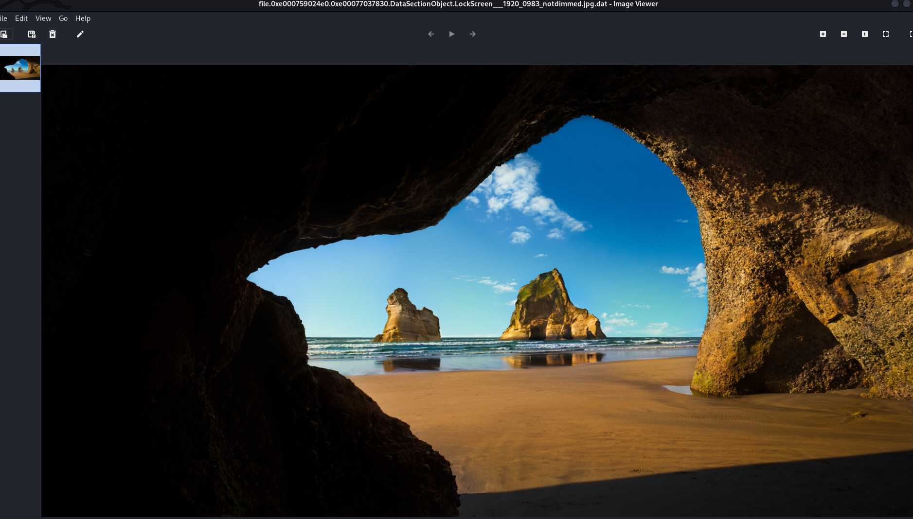


# FLAG

