# Trusted

## Challenge Details

- Category: Forensics
- Points: 30
- Validation: 132
- Author: BoBNewz
- Status: Done
# Handout
`Trusted: Memory forgets nothing`
`You are called to investigate an employee’s machine. For some time now, strange things have been happening on his computer, and the employee has lost access to his passwords. An initial investigation has confirmed the presence of a malicious individual on the machine. We ask you to find :`

- The CVE used by the attacker to gain initial access.  
- The password of the employee’s e-mail account.  
- The attacker’s IP address.  
- The C2 used by the attacker (e.g. Havoc).  
- The ID of the persistence sub-technique according to MITRE ATT&CK.
`The flag is as folllows: RM{CVE-XXXX-XXXXX_password_attacker-IP_attacker-C2_MITRE-ATT&CK-ID}`

https://static.root-me.org/forensic/ch46/ch46.zip

## Walkthrough
Such direct instructions, let's unzip the memory dump:
```bash
$ unzip ch46.zip
Archive:  ch46.zip
   creating: Trusted/
   creating: Trusted/Programmes/
   creating: Trusted/Programmes/KeePass-2.53/
  inflating: Trusted/Programmes/KeePass-2.53/KeePass.chm
  inflating: Trusted/Programmes/KeePass-2.53/KeePass.config.xml
  inflating: Trusted/Programmes/KeePass-2.53/KeePass.exe
  inflating: Trusted/Programmes/KeePass-2.53/KeePass.exe.config
  inflating: Trusted/Programmes/KeePass-2.53/KeePass.XmlSerializers.dll
  inflating: Trusted/Programmes/KeePass-2.53/KeePassLibC32.dll
  inflating: Trusted/Programmes/KeePass-2.53/KeePassLibC64.dll
   creating: Trusted/Programmes/KeePass-2.53/Languages/
  inflating: Trusted/Programmes/KeePass-2.53/License.txt
   creating: Trusted/Programmes/KeePass-2.53/Plugins/
  inflating: Trusted/Programmes/KeePass-2.53/ShInstUtil.exe
   creating: Trusted/Programmes/KeePass-2.53/XSL/
  inflating: Trusted/Programmes/KeePass-2.53/XSL/KDBX_Common.xsl
  inflating: Trusted/Programmes/KeePass-2.53/XSL/KDBX_DetailsFull_HTML.xsl
  inflating: Trusted/Programmes/KeePass-2.53/XSL/KDBX_DetailsLight_HTML.xsl
  inflating: Trusted/Programmes/KeePass-2.53/XSL/KDBX_PasswordsOnly_TXT.xsl
  inflating: Trusted/Programmes/KeePass-2.53/XSL/KDBX_Tabular_HTML.xsl
   creating: Trusted/Programmes/Npcap/
  inflating: Trusted/Programmes/Npcap/CheckStatus.bat
  inflating: Trusted/Programmes/Npcap/DiagReport.bat
  inflating: Trusted/Programmes/Npcap/DiagReport.ps1
  inflating: Trusted/Programmes/Npcap/FixInstall.bat
  inflating: Trusted/Programmes/Npcap/install.log
  inflating: Trusted/Programmes/Npcap/LICENSE
  inflating: Trusted/Programmes/Npcap/npcap.cat
  inflating: Trusted/Programmes/Npcap/npcap.inf
  inflating: Trusted/Programmes/Npcap/npcap.sys
  inflating: Trusted/Programmes/Npcap/npcap_wfp.inf
  inflating: Trusted/Programmes/Npcap/NPFInstall.exe
  inflating: Trusted/Programmes/Npcap/NPFInstall.log
  inflating: Trusted/Programmes/Npcap/Uninstall.exe
   creating: Trusted/Programmes/Wireshark/
  inflating: Trusted/Programmes/Wireshark/brotlicommon.dll
  inflating: Trusted/Programmes/Wireshark/brotlidec.dll
  inflating: Trusted/Programmes/Wireshark/bz2.dll
  inflating: Trusted/Programmes/Wireshark/capinfos.exe
  inflating: Trusted/Programmes/Wireshark/capinfos.html
  inflating: Trusted/Programmes/Wireshark/captype.exe
  
  ...
```
I guess they were feeling generous they just gave us the full mountable filesystem as is without a memory dump, with installations for npcap, wireshark, keepass and god knows what else, talk about self sufficient. Let's first get our password, they have keepass installed, so let's look for a kdbx file, if that fails we can look for saved passwords in microsoft edge.

I guess this is one time where windows defender actually comes in handy:

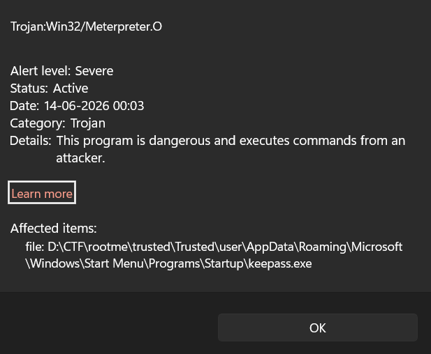

So the keepass.exe in startup is infected?

Let's get the password first:

```bash
$ tree > tree.txt && rg kbdx tree.txt -A 10 -B 10
        │       │           ├── CachedFiles
        │       │           │   └── CachedImage_1024_768_POS4.jpg
        │       │           └── TranscodedWallpaper
        │       └── Wireshark
        │           └── profiles
        ├── Contacts
        │   └── desktop.ini
        ├── Desktop
        │   └── desktop.ini
        ├── Documents
        │   ├── Database.kdbx
        │   └── desktop.ini
        ├── Downloads
        │   └── desktop.ini
        ├── Favorites
        │   ├── Bing.url
        │   ├── desktop.ini
        │   └── Links
        │       └── desktop.ini
        ├── Links
        │   ├── desktop.ini
```

That's our keepass database, in Documents let's use keepass to john.
```bash
$ cp Trusted/user/Documents/Database.kdbx .
$ keepass2john Database.kdbx > hash.txt && cat hash.txt
Database:$keepass$*2*60000*0*057c01bb9b477075c5403eafbbe302b8399bce0f3d16021c9893d182e217f9ef*684b68642f5f9c1642fe38fa2564a2c1a705a90d63d4e6d0a5b23655ae7dce08*e93d69213a6aaaa0a10f7a02ab5a6ee9*633796f15e6f0b1ddb0e6683179c7fe8a17936b5f89a5955d41b891be41c6c12*64186d2677a7abe47a21b495d6f0c681fdaa6fb7a1de3748ac6434773a13047e
```

jtr will be way too slow to crack this, so let's remove the name of the file and crack using hashcat w mode 13400
```bash
$ hashcat hash.txt -m 13400 -a 0 ~/wordlists/rockyou.txt  -w 4
```
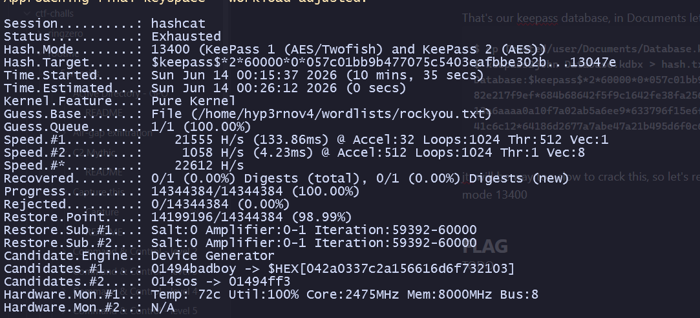

I was gonna try with OneRuleToRuleThemAll, but 🤡🤡

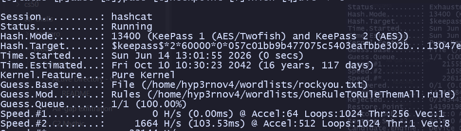

That's clearly not it, looking around a bit i found something in the temp dir:

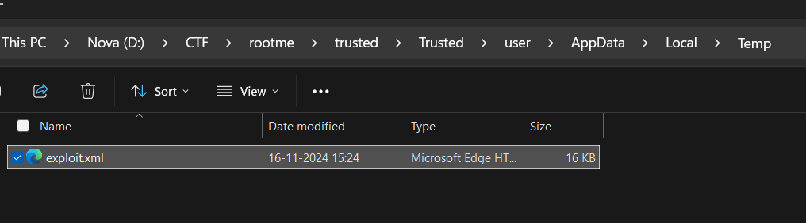

This was actually a decrypted kbdx xml dump! This is probably what the cve is related to. It contained our mail password in plaintext:

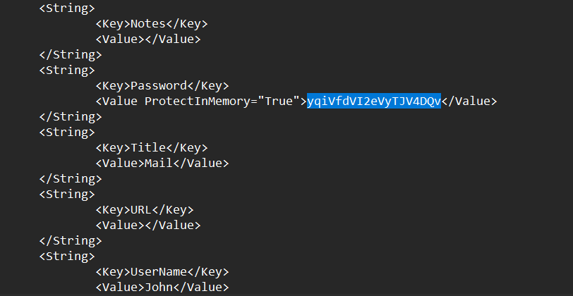

mail password: `yqiVfdVI2eVyTJV4DQv`

Now we need to figure out what generated this xml document.
Let's cycle back to the exe defender flagged, an keepass.exe startup is not abnormal but defender flagged it so let's analyse it, judging by the windows defender block, it identified it as meterpreter, so probably metasploit shellcode injected into a windows binary, let's try static analysis but i dont think we will be able to get much from ida.
Opening it:

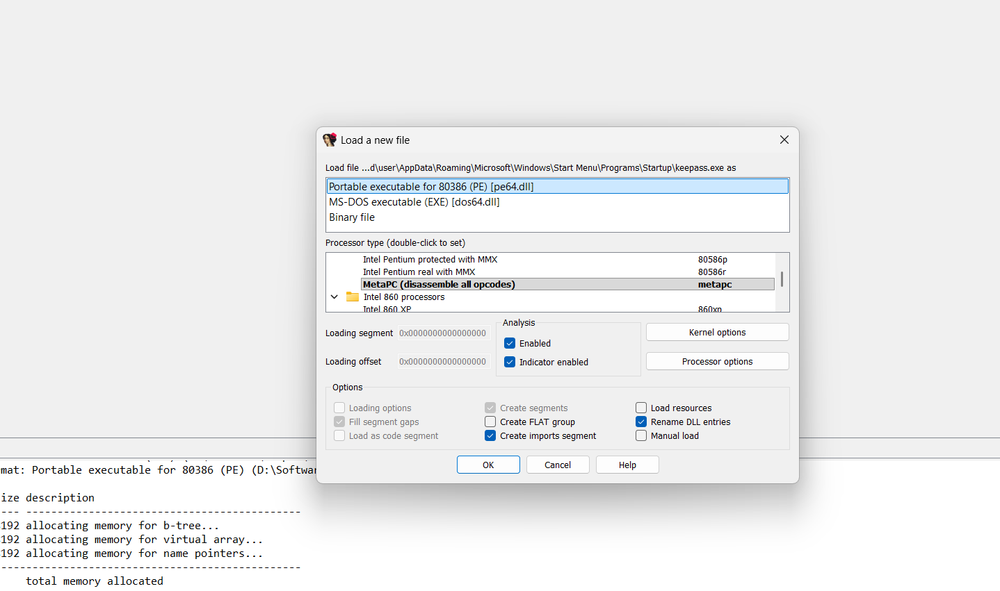

IDA says the symbols were linked from `C:\local0\asf\release\build-2.2.14\support\Release\ab.pdb`

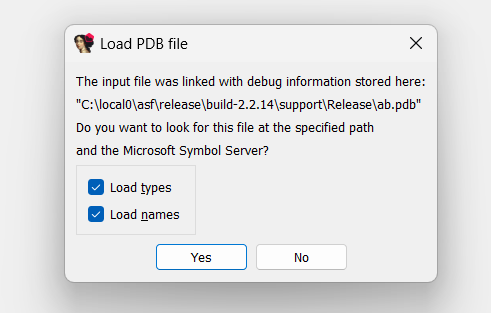

Obviously we don't have the symbols file, but this is most definitely the one built with Apache Bench, metasploit commonly uses windows templates like apache bench to inject shellcode into an otherwise legitimate file, bummer they didn't inject into keepass.exe itself, let's get the symbols so ida can give us more information, compared to this garbage without it:

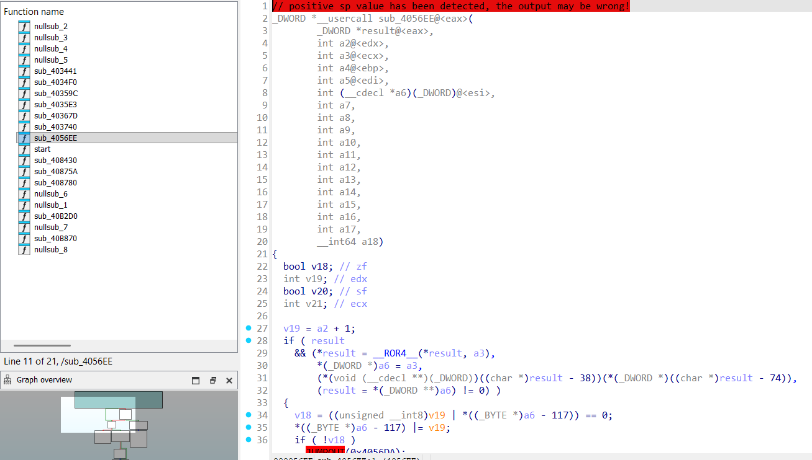

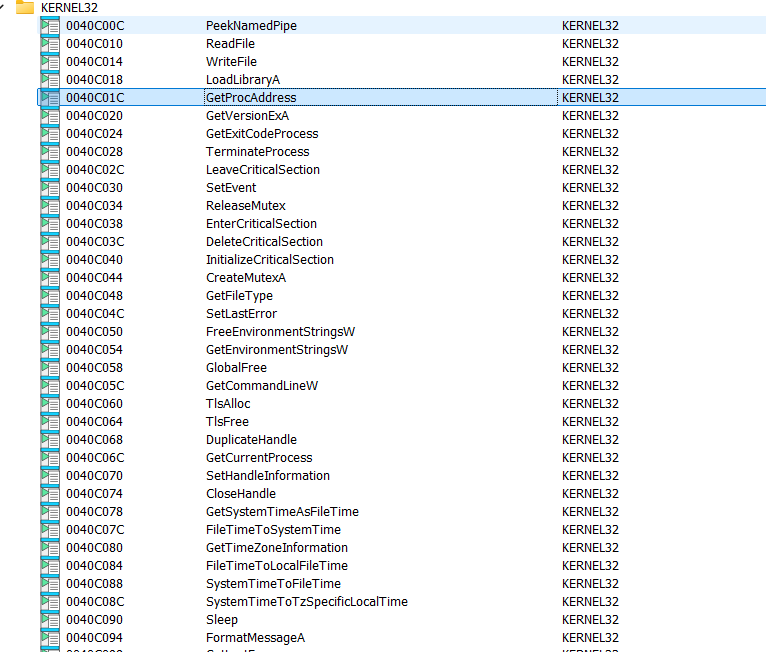

Current imports, definitely more than what ApacheBench needs. Getting the pdb:

```bash
$ wget https://archive.apache.org/dist/httpd/binaries/win32/symbols/apache_2.2.14-win32-x86-no_ssl-symbols.zip
$ unzip apache_2.2.14-win32-x86-no_ssl-symbols.zip
$ exa bin/ | rg ab.pdb
ab.pdb
```

Let's load this into ida

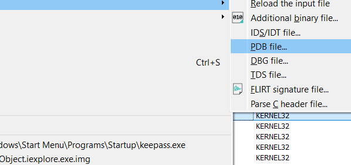

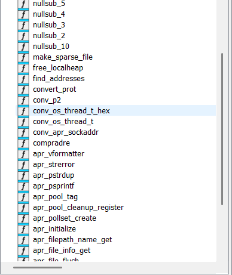

Now we see a bit more reasonable functions, which we would expect to see in apachebench.

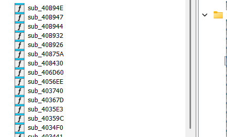

The ones that are still sub_40XXXX are probably what metasploit did and is shellcode, itll be easier to check for network calls as we are looking for the attacker's ip, or use speakeasy. Let's use floss for any domains / ips, but theyre probably obfuscated anyway.

```bash
$ floss keepass.exe > flossstrings.txt
INFO: floss: extracting static strings
finding decoding function features: 100%|███████████████████| 79/79 [00:00<00:00, 2854.45 functions/s, skipped 0 library functions]
INFO: floss.stackstrings: extracting stackstrings from 79 functions
INFO: floss.results: unMa
extracting stackstrings: 100%|█████████████████████████████████████████████████████████████| 79/79 [00:01<00:00, 58.65 functions/s]
INFO: floss.tightstrings: extracting tightstrings from 0 functions...
extracting tightstrings: 0 functions [00:00, ? functions/s]
INFO: floss.string_decoder: decoding strings
emulating function 0x40a49b (call 1/1): 100%|██████████████████████████████████████████████| 20/20 [00:00<00:00, 49.17 functions/s]
INFO: floss: finished execution after 6.62 seconds
INFO: floss: rendering results
```
A few interesting things here:
```text
Copyright 2009 The Apache Software Foundation.
OriginalFilename
ab.exe
ProductName
Apache HTTP Server
ProductVersion
2.2.14
VarFileInfo
```

Let's analyse it in virustotal, but we couldve also breakpointed network calls for the ip.

https://www.virustotal.com/gui/file/6e4f8de7277b78686fe389e6d1df2b24f5bc3564208b76c8af5d1319073d1b2e

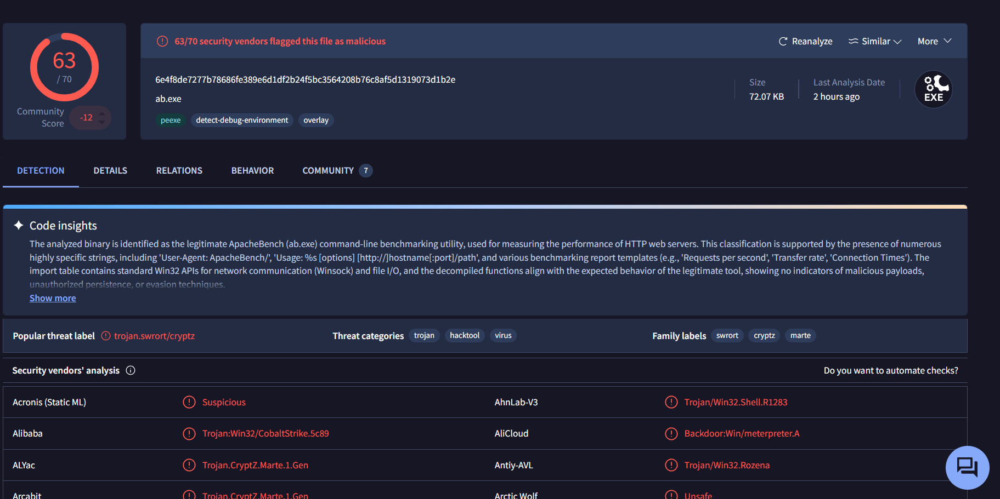

The virustotal insight is heavily flawed, and is EXACTLY why metasploit uses apachebench or similar windows binary templates, injecting shellcode into binaries which have legitimate use for the networking windows apis.

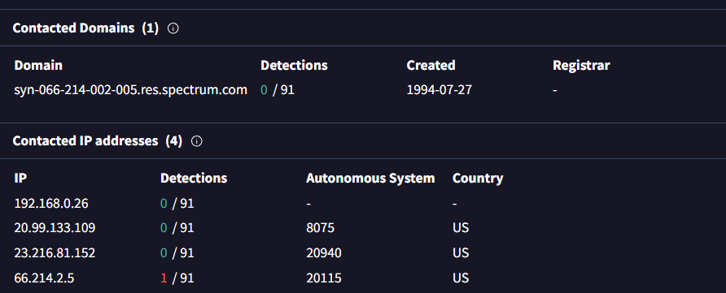 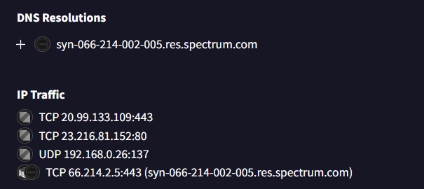

These are interesting. `66.214.2.5` AND `syn-066-214-002-005.res.spectrum.com` are heavy red flags, this is probably our attacker ip, but let's whois lookup them all

```bash
$ whois 20.99.133.109 | rg OrgName
OrgName:        Microsoft Corporation

$ whois 23.216.81.152 | rg OrgName
OrgName:        Akamai Technologies, Inc.

$ whois 66.214.2.5  | rg OrgName
OrgName:        Charter Communications LLC

```

`20.99.133.109` and `23.216.81.152` are most definitely clean, belonging to microsoft and akamai (windows uses their cdn)

`66.214.2.5` on the other hand, charter communications and spectrum is an ISP, so it can definitely be our attacker ip.

Let's look for the MITRE ATT&CK vector for persistence

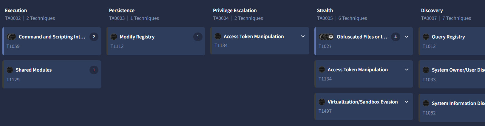

VT says modify registry, let's see what it modified on tria.ge

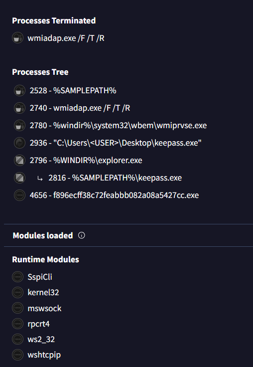

tria.ge also flags it as metasploit, so thats out c2

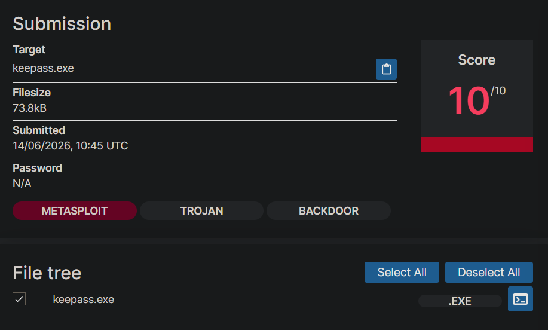

Interestingly, tria.ge doesn't find any registry keys modified, but confirms what we already know:

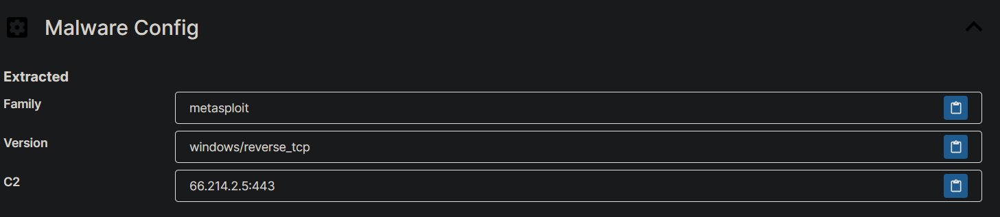

So the vt att&ck was probably a false positive..
Since we found this keepass.exe in Startup programs.. let's look for persistence by startup in the mitre matrix:

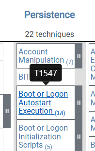

And the sub technique being 001: https://attack.mitre.org/techniques/T1547/001/

So they are probably looking for T1547.001 as the MITRE-ATT&CK-ID

So, now we have:
The c2 (`metasploit/spectrum`)
Attacker ip (`66.214.2.5`)
MITRE-ATT&CK-ID persistence (`T1547.001`)
Email password (`yqiVfdVI2eVyTJV4DQv`)

So our current flag becomes: 
`RM{CVE-XXXX-XXXXX_yqiVfdVI2eVyTJV4DQv_66.214.2.5_Metasploit/Spectrum_T1547.001}`
`RM{CVE-XXXX-XXXXX_password_attacker-IP_attacker-C2_MITRE-ATT&CK-ID}`

All that's left to do now is find the CVE. Let's find the keepass version: in `Trusted/Programmes/KeePass-2.53/KeePass.exe.config`:
``
```xml
<?xml version="1.0" encoding="utf-8" ?>
<configuration>
	<startup useLegacyV2RuntimeActivationPolicy="true">
		<supportedRuntime version="v4.0" />
		<supportedRuntime version="v2.0.50727" />
	</startup>
	<runtime>
		<assemblyBinding xmlns="urn:schemas-microsoft-com:asm.v1">
			<dependentAssembly>
				<assemblyIdentity name="KeePass"
					publicKeyToken="fed2ed7716aecf5c"
					culture="neutral" />
				<bindingRedirect oldVersion="2.0.9.0-2.53.0.0"
					newVersion="2.53.0.18479" />
			</dependentAssembly>
		</assemblyBinding>
		<enforceFIPSPolicy enabled="false" />
		<loadFromRemoteSources enabled="true" />
	</runtime>
	<appSettings>
		<add key="EnableWindowsFormsHighDpiAutoResizing" value="true" />
	</appSettings>
</configuration>

```

So we are running `2.53.0.18479`. From what we have here; a decrypted kbdx xml dump, let's look for similar vulnerabilities to dump a keepass database, I found https://nvd.nist.gov/vuln/detail/cve-2023-24055 which matched our situation:

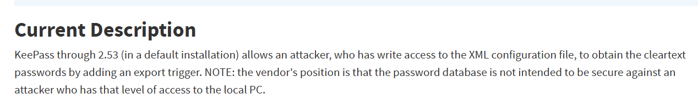

So the cve must be CVE-2023-24055, and the flag worked!
# FLAG
`RM{CVE-2023-24055_yqiVfdVI2eVyTJV4DQv_66.214.2.5_Metasploit_T1547.001}`
